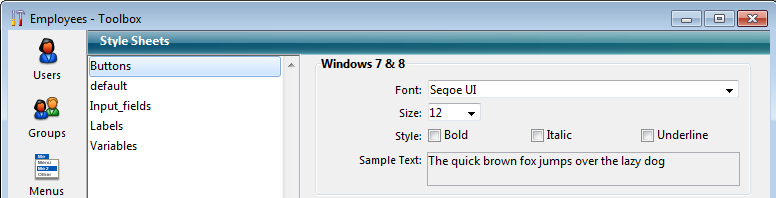

<!--REF #_command_.LIST OF STYLE SHEETS.Syntax-->**LIST OF STYLE SHEETS** ( *arrFolhasEstilo* )<!-- END REF-->
<!--REF #_command_.LIST OF STYLE SHEETS.Params-->
| Parâmetro | Tipo |  | Descrição |
| --- | --- | --- | --- |
| arrFolhasEstilo | Text array | &#8592; | Nomes das folhas de estilo definidas na aplicação |

<!-- END REF-->

#### Descrição 

<!--REF #_command_.LIST OF STYLE SHEETS.Summary-->O comando **LIST OF STYLE SHEETS** devolve a lista de folhas de estilo da aplicação no array *arrFolhasEstilo*.<!-- END REF-->  
  
Se não tivesse sido previamente definido, o array *arrFolhasEstilo* é criado pelo comando. Se dimensiona automaticamente de acordo com o número de folhas de estilo definidas.  
  
Depois de executar o comando, cada elemento do array contém o nome de uma folha de estilos. Estes nomes se ordenam alfabeticamente, como no editor de folhas de estilo. O primeiro elemento do array contém sempre "\_\_automatic\_\_", que representa a folha de estilo "Automática".

Nota: por razões de compatibilidade, a folha de estilo automático "\_\_automatic\_main\_text\_\_" and "\_\_automatic\_additional\_text\_\_" não são retornadas por esse comando. Entretanto, eles estão disponíveis nos formulários.

##### Nota de compatibilidade 

Esse comando pode ser usado somente em **bancos de dados binários**. Em **arquitetura de projetos**, o array não é preenchido. 

#### Exemplo 

Em sua aplicação, se definem as seguintes folhas de estilo:



Se executa o seguinte código:

```4d
 LIST OF STYLE SHEETS($arrStyles)
  // $arrStyles{1} contém "__automatic__"
  // $arrStyles{2} contém "Buttons"
  // $arrStyles{3} contém "default"
  // $arrStyles{4} contém "Input_fields"
  // $arrStyles{5} contém "Labels"
  // $arrStyles{6} contém "Variables"
```

#### Ver também 

[GET STYLE SHEET INFO](get-style-sheet-info.md)  
[OBJECT SET STYLE SHEET](object-set-style-sheet.md)  

#### Propriedades
|  |  |
| --- | --- |
| Número do comando | 1255 |
| Thread-seguro | &check; |
| Proibido no servidor ||


