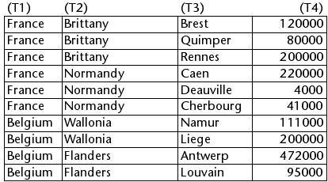

<!--REF #_command_.LISTBOX SELECT BREAK.Syntax-->**LISTBOX SELECT BREAK** ( {* ;} *objeto* ; *fila* ; *coluna* {; *açao*} )<!-- END REF-->
<!--REF #_command_.LISTBOX SELECT BREAK.Params-->
| Parâmetro | Tipo |  | Descrição |
| --- | --- | --- | --- |
| * | Operador | &#8594;  | Se especificado, objeto é um nome de objeto (string), se omitido, objeto é uma variável |
| objeto | any | &#8594;  | Nome de objeto (se* for especificado) ou variável (se * é omitido) |
| fila | Integer | &#8594;  | Número de quebra de fila |
| coluna | Integer | &#8594;  | Número de quebra de coluna |
| açao | Integer | &#8594;  | Ação de seleção |

<!-- END REF-->

*Esse comando não é seguro para thread e não pode ser usado em código adequado.*


#### Descrição 

<!--REF #_command_.LISTBOX SELECT BREAK.Summary-->O comando LISTBOX SELECT BREAK  se utiliza para selecionar linhas de quebra no objeto list box designado pelos parâmetros *objeto* e *\**.<!-- END REF--> O list box deve ser mostrado em modo hierárquico.   
  
Se passa o parâmetro opcional *\**, indica que o parâmetro *objeto* é um nome de objeto (string). Se não passa este parâmetro, indica que o parâmetro *objeto* é uma variável. Neste caso, se passa uma referência de variável ao invés de uma string.   
  
As linhas de ruptura são adicionadas para representar a hierarquia, pero no correspondem as línhas existentes no array. Para designar uma linha de ruptura a selecionar, deve passarnos parâmetros línha e coluna o número de linha e de coluna correspondente a primeira ocorrência no array correspondente. Estes valores são devolvidos pelo comando [LISTBOX GET CELL POSITION](listbox-get-cell-position.md) quando o usuário for selecionado uma linha de quebra. Este princípio é descrito no parágrafo "Gestão das linhas de quebra" da seção *List box hierárquicas*.  
  
O parâmetro *ação*, se for passada, pode definir a ação de seleção que devem ser realizadas quando uma seleção de linhas de quebra existe no list box. Pode passar um valor ou uma das constantes a seguir, que seja encontrado no tema "*List box*" o tema:

| Constante                | Tipo          | Valor | Comentário                                                                                                                                                                                                                                              |
| ------------------------ | ------------- | ----- | ------------------------------------------------------------------------------------------------------------------------------------------------------------------------------------------------------------------------------------------------------- |
| lk add to selection      | Inteiro longo | 1     | A linha selecionada é adicionada à seleção existente. Se a linha selecionada já pertence à seleção existente, o comando não faz nada.                                                                                                                   |
| lk remove from selection | Inteiro longo | 2     | A linha selecionada é removida da seleção existente. Se a linha especificada não pertence à seleção existente, o comando não faz nada.                                                                                                                  |
| lk replace selection     | Inteiro longo | 0     | A linha selecionada torna-se a nova seleção e substitui a seleção existente. O comando tem o mesmo efeito que um clique do usuário em uma linha (no entanto, o evento On Clicked não é gerado). Esta é a ação padrão (se o parâmetro *ação* é omitido). |

**Nota:** se tiver selecionado a opção **Ocultar o ressaltado de seleção** para um:

* tem que fazer seleções de list box visíveis utilizando opções de interface disponíveis. Para mas informação sobre como fazer isso, ver *Personalizar a aparência*.
* não pode ressaltar as linhas de ruptura para os list boxes hierárquicos neste caso (ver *Limitações de list boxes hierárquicas*).

#### Exemplo 

Dados os arrays a seguir representados num list box:



Queremos selecionar a linha de quebra "Normandy" na representação hierárquica destes arrays:

```4d
 $row:=Find in array(T2;"Normandy")
 $column:=2
 LISTBOX COLLAPSE(*;"MyListbox") //contração de todos os níveis
 LISTBOX SELECT BREAK(*;"MyListbox";$row;$column)
```

Este é o resultado:


#### Ver também 

[ LISTBOX SELECT ROW ](listbox-select-row.md)  
[LISTBOX GET CELL POSITION](listbox-get-cell-position.md)  