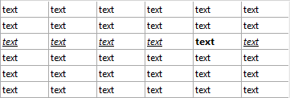

<!--REF #_command_.LISTBOX SET ROW FONT STYLE.Syntax-->**LISTBOX SET ROW FONT STYLE** ( {* ;} *objeto* ; *fila* ; *estilo* )<!-- END REF-->
<!--REF #_command_.LISTBOX SET ROW FONT STYLE.Params-->
| Parâmetro | Tipo |  | Descrição |
| --- | --- | --- | --- |
| * | Operador | &#8594;  | Se especificado, objeto é um nome de objeto (cadeia) Se omitido, objeto é uma variável |
| objeto | any | &#8594;  | Nome de objeto (se * for especificado) ou<br/>Variável (se * for omitido) |
| fila | Integer | &#8594;  | Número de fila |
| estilo | Integer | &#8594;  | Estilo de fonte |

<!-- END REF-->

*Esse comando não é seguro para thread e não pode ser usado em código adequado.*


#### Descrição 

<!--REF #_command_.LISTBOX SET ROW FONT STYLE.Summary-->**Nota:** Este comando só funciona com os list boxes de tipo array.<!-- END REF-->  
  
O comando **LISTBOX SET ROW FONT STYLE** estabelece um estilo de fonte para uma fila ou uma célula no list box tipo array designado pelos parâmetros *objeto* e *\** .  
  
Ao passar o parâmetro opcional *\** indica que o parâmetro *objeto* é um nome de objeto (cadeia). Se não passar este parâmetro, indica que o parâmetro objeto é uma variável. Neste caso, se passar uma referência de variável em lugar de uma cadeia.  
  
Pode designar um list box ou uma coluna de list box no parâmetro de *objeto*:

* Quando o *objeto* designa um list box, o comando se aplica a fila.
* Quando o *objeto* designa uma coluna de list box, o comando se aplica a célula localizada na interseção da coluna/fila.

Em *fila*, passe o número da fila na que deseja aplicar o novo estilo.  
  
**Nota:** O comando não leva em conta nenhum estado oculto/visível das filas do list box.  
  
Em *estilo*, se passar um valor de estilo. Deve utilizar um (ou uma combinação) das constantes que se encontram no tema *Estilos de fonte*:  
  
| Constante | Tipo          | Valor |
| --------- | ------------- | ----- |
| Bold      | Inteiro longo | 1     |
| Italic    | Inteiro longo | 2     |
| Plain     | Inteiro longo | 0     |
| Underline | Inteiro longo | 4     |
  
  
Se um array de estilos de fonte foi associado com o list box ou coluna, só o elemento correspondente a fila se modifica. Em outras palavras, a execução do comando tem o mesmo efeito, neste caso, como modificação de um elemento do array estilo de fonte.  
Se não há um array estilo de fonte associado com o list box ou coluna, será criada de forma dinâmica quando se chama a este comando. Se pode acessar a eles usando o comando [LISTBOX Get array](listbox-get-array.md).  
  
Se as propriedades de estilo em conflito se estabelecem para a coluna ou o list box, se aplica uma ordem de prioridade. Para obter mais informação, consulte o manual de *Desenho*.  
  
**Nota:** Dado que os estilos de array para as colunas tem prioridade sobre os dos list boxes, ao aplicar este comando a um list box, só terá efeito se não há estilo de array atribuído as colunas.

#### Exemplo 

Dado um array de tipo list box com as seguintes características:

* Um array de estilo de fonte associado com o list box (ArrGlobalStyle)
* Um array de estilo de fonte associado com a coluna 5 (ArrCol5Style)
* As outras colunas não tem arrays de estilo.

```4d
 LISTBOX SET ROW FONT STYLE(*;"Col5";3;Bold)
  // equivalente a ArrCol5Style{3}:=Bold
```


```4d
 LISTBOX SET ROW FONT STYLE(*;"List Box";3;Italic+Underline)
  // equivalente a ArrGlobalStyle{3}:=Italic+Underline
```



Depois da segunda declaração, todas as células da terceira fila mudam de fila a sublinhadas em cursiva, a exceção da célula da quinta coluna que fica só em negrito (os arrays de estilo de coluna tem prioridade sobre os arrays de list box).

#### Ver também 

[LISTBOX Get row font style](listbox-get-row-font-style.md)  
[LISTBOX SET ROW COLOR](listbox-set-row-color.md)  