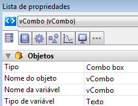

<!--REF #_command_.OBJECT Get data source.Syntax-->**OBJECT Get data source** ( {* ;} *objeto* ) : Pointer<!-- END REF-->
<!--REF #_command_.OBJECT Get data source.Params-->
| Parâmetro | Tipo |  | Descrição |
| --- | --- | --- | --- |
| * | Operador | &#8594;  | Se especificado, objeto é um nome de objeto (cadeia) Se omitido, objeto é um campo ou uma variável |
| objeto | any | &#8594;  | Nome de objeto (se * for especificado) ou<br/>Campo ou variável (se * for omitido) |
| Resultado | Pointer | &#8592; | Ponteiro a fonte de dados atual do objeto |

<!-- END REF-->

*Esse comando não é seguro para thread e não pode ser usado em código adequado.*


#### Descrição 

<!--REF #_command_.OBJECT Get data source.Summary-->O comando **OBJECT Get data source** devolve a fonte de dados atual dos objetos designados pelos parâmetros *objeto* e *\** .<!-- END REF-->  
  
Pode definir a fonte de dados para um objeto em modo Desenho utilizando a Lista de propriedades, ou utilizando o comando [OBJECT SET DATA SOURCE](object-set-data-source.md).  
  
Passando o parâmetro opcional *\** indica que o parâmetro *objeto* é um nome de objeto (cadeia). Se não passar este parâmetro, indica que o parâmetro *objeto* é um campo ou uma variável. Neste caso, se passar uma referência de campo ou variável em lugar de uma cadeia (campo ou variável objeto unicamente).

#### Exemplo 

Dado um objeto combo box definido em um formulário:



Executa o seguinte código:

```4d
 $vPtr :=OBJECT Get data source(*;"vCombo")
  // $vPtr contém -> vCombo
```

  

#### Ver também 

[OBJECT SET DATA SOURCE](object-set-data-source.md)  