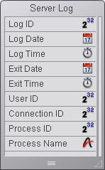

<!--REF #_command_.On Server Open Connection database method.Syntax-->$1, $2, $3 -> On Server Open Connection database method -> $0<!-- END REF-->
<!--REF #_command_.On Server Open Connection database method.Params-->
| Parâmetro | Tipo |  | Descrição |
| --- | --- | --- | --- |
| $1 | Integer | &#8592; | Número de usuário utilizado internamente por 4D Server para identificar os usuários |
| $2 | Integer | &#8592; | Número de conexão utilizado internamente por 4D Server para identificar uma conexão |
| $3 | Integer | &#8592; | Obsoleto: devolve sempre 0 (mas deve ser declarado) |
| $0 | Integer | &#8592; | 0 se omitido = conexão aceita; outro valor = conexão rejeitada |

<!-- END REF-->

*Esse comando não é seguro para thread e não pode ser usado em código adequado.*


#### Quando é chamado o método base On Server Open Connection? 

<!--REF #_command_.On Server Open Connection database method.Summary-->O **On Server Open Connection database method** é chamado uma vez no equipo servidor cada vez que um equipo remoto 4D inicia um processo de conexão.<!-- END REF--> O **On Server Open Connection database method** NÃO é invocado por outro entorno 4D diferente de 4D Server.

O **On Server Open Connection database method** é chamado cada vez que:

* um 4D remoto se conecta (inicio do processo principal)
* um 4D remoto abre o entorno Desenho (inicio do processo de Desenho)
* um 4D remoto inicia um processo global, (cujo nome começa por "$") o qual necessita da criação de um processo cooperativo no servidor **(\*)**. Este processo pode ser criado utilizando o comando [New process](new-process.md), um comando de menu ou caixa de diálogo "Executar um método".

Em cada caso com um 4D remoto, três processos são iniciados. Um na máquina cliente e outros dois no equipo servidor. Na máquina cliente, o processo executa o código e envia as petições a 4D Server. No equipo servidor, o **processo 4D Client** mantém o entorno da base de dados do processo cliente (as seleções atuais e o bloqueio de registros para o processo usuário) e responde aos pedidos enviadas pelo processo executado na máquina cliente. O **processo base 4D Client** está a cargo de controlar o processo 4D Client correspondente.

**(\*)** A partir de 4D v13, por razões de otimização os processos servidores (processo apropriado para os acessos ao motor da base e processo cooperativo para o acesso à linguagem) só são criadas durante a execução do código do lado do cliente. Por exemplo, estes são os detalhes de uma sequencia de código 4D que se executa em um novo processo cliente:  

```4d
  // o processo global começa sem um novo processo no servidor, como um processo local.
 CREATE RECORD([Table_1])
 [Table_1])field1_1:="Hello world"
 SAVE RECORD([Table_1]) // criação aqui do processo apropriado no servidor
```

#### Como se chama ao método base On Server Open Connection? 

O On Server Open Connection database method é executado no equipo servidor no processo 4D Client que provocou a chamada do método. 

Por exemplo, se um 4D remoto se conecta a uma base 4D Server interpretada, é iniciado o processo usuário, o processo de desenho e o processo de registro do cliente (por defeito). O On Server Open Connection database method se executa três vezes seguidas. A primeira vez dentro do processo principal, a segunda vez no processo de inscrição do cliente e a terceira vez no processo de desenhoo. Se os três processos são respectivamente o sexto, sétimo e oitavo processo a iniciar-se no equipo servidor, e é chamado [Current process](current-process.md) desde o On Server Open Connection database method, a primeira vez [Current process](current-process.md) devolve 6, a segunda vez 7 e a terceira 8.

Observe que o On Server Open Connection database method se executa no equipo servidor, ao interior do processo 4D Client no servidor, independente do processo executado no cliente. Além disso, no momento em que se invoca o método, o processo 4D Client ainda não foi nomeado ([Process info](../commands/process-info.md) não devolverá neste momento o nome do processo 4D Client).

O On Server Open Connection database method não têm acesso à tabela das variáveis processo do processo executado no client. Esta tabela reside no equipo client, não no equipo servidor. 

Quando o On Server Open Connection database method acede a uma variável processo, trabalha com uma tabela de variáveis processo particular, criada dinamicamente pelo processo 4D Client. 

4D Server passa três parâmetros de tipo Inteiro longo ao On Server Open Connection database method e espera um resultado Inteiro longo. O método deve portanto ser declarado explicitamente com três parâmetros Inteiro longo assim também como com um resultado de função Inteiro longo:

```4d
 var $0;$1;$2;$3 : Integer
```

Se não devolve um valor em *$0*, por conseguinte deixa a variável indefinida ou inicializada em zero, 4D Server considera que o método base aceita a conexão. Se não é aceitada a conexão, devolve um valor não nulo em *$0*.

Esta tabela detalha a informação oferecida pelos três parâmetros passados no método base:

| **Parâmetro** | **Descrição**                                                              |
| ------------- | -------------------------------------------------------------------------- |
| $1            | Número de usuário utilizado internamente por 4D Server para identificá-los |
| $2            | Número de conexão utilizado internamente por 4D Server para identificá-la  |
| $3            | Obsoleto: sempre devolve 0 mas deve ser declarado                          |

Estes números de referencia não são utilizados diretamente como fontes de informação a passar, por exemplo, como parâmetros a um comando 4D. No entanto, oferecem uma maneira particular de identificar um processo 4D Client entre o On Server Open Connection database method e o [On Server Close Connection database method](on-server-close-connection-database-method.md). A combinação destes valores é único no momento de uma seção 4D Server. Ao guardar esta informação em uma tabela ou em um array entre processos, os dois métodos base podem trocar informações. No exemplo ao final desta sessão, os dois métodos base utilizam esta informação para armazenar a data e hora de inicio e fim de uma conexão no mesmo registro de uma tabela.

#### Exemplo 1 

O seguinte exemplo mostra como manter um histórico das conexões a base de dados utilizando o On Server Open Connection database method e utilizando o [On Server Close Connection database method](on-server-close-connection-database-method.md). A tabela *\[Server Log\]* (mostrada a continuação) se utiliza para fazer seguimento aos processos de conexão: 



A informação armazenada nesta tabela é administrada pelo On Server Open Connection database method e o [On Server Close Connection database method](on-server-close-connection-database-method.md) listado a continuação:

```4d
  // Método base On Server Open Connection
 
 var $0;$1;$2;$3 : Integer
  // Criar um registro [Server Log]
 CREATE RECORD([Server Log])
 [Server Log]Log ID:=Sequence number([Server Log])
  // Guardar o histórico Data e Hora
 [Server Log]Log Date:=Current date
 [Server Log]Log Time:=Current time
  // Guarda a informação de conexão
 [Server Log]User ID:=$1
 [Server Log]Connection ID:=$2
 SAVE RECORD([Server Log])
  // Não devolve erro de maneira que a conexão pode continuar
 $0:=0
 
  // Método base On Server Close Connection
 var $1;$2;$3 : Integer
  // Recuperar o registro [Server Log]
 QUERY([Server Log];[Server Log]User ID=$1;*)
 QUERY([Server Log];&;[Server Log]Connection ID=$2;*)
 QUERY([Server Log];&;[Server Log]Process ID=0)
  // Guardar data e hora de desconexão
 [Server Log]Exit Date:=Current date
 [Server Log]Exit Time:=Current time
  // Guardar informação processo
 [Server Log]Process ID:=Current process
 PROCESS PROPERTIES([Server Log]Process ID;$vsProcName;$vlProcState;$vlProcTime)
 [Server Log]Process Name:=$vsProcName
 SAVE RECORD([Server Log])
```

Estas são algumas entradas em \[Server Log\] mostrando várias conexões remotas:


#### Exemplo 2 

O seguinte exemplo evita uma nova conexão entre as 2 e 4 A.M. 

```4d
  // Método base On Server Open Connection
 var $0;$1;$2;$3 : Integer
 
 If((?02:00:00?<=Current time)&(Current time
```
