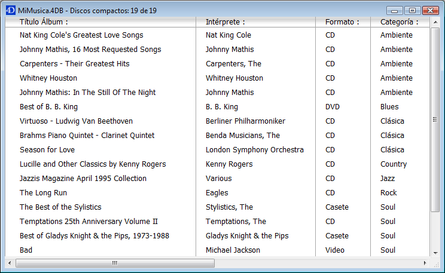

<!--REF #_command_.ORDER BY.Syntax-->**ORDER BY** ( {*tabela* ;}{ *campo* }{; > ou < }{; *campo2* ; > ou <2 ; ... ; *campoN* ; > ou <N}{; *} )<!-- END REF-->
<!--REF #_command_.ORDER BY.Params-->
| Parâmetro | Tipo |  | Descrição |
| --- | --- | --- | --- |
| tabela | Table | &#8594;  | Tabela na qual vai ordenar os registros selecionados, ou tabela Padrão, se omitido |
| campo | Field | &#8594;  | Campo no qual estabelecer a ordem para cada nível |
| > ou < | Operador | &#8594;  | Direção da ordem para cada nível: > para ordenar em ordem ascendente, ou < para ordenar em ordem descendente |
| * | Operador | &#8594;  | Continuar a bandeira de ordem |

<!-- END REF-->

#### Descrição 

<!--REF #_command_.ORDER BY.Summary-->**ORDER BY** ordena (reordena) os registros da seleção atual de *tabela* para o processo atual.<!-- END REF--> Quando tiver realizada a ordenação, o primeiro registro da nova seleção atual se converte no registro atual.  
  
Se omitir o parâmetro *tabela*, o comando se aplica à tabela por padrão, se tiver definido uma tabela por padrão. Se não, 4D utiliza a tabela do primeiro campo passado como parâmetro. Se não passa um parâmetro e se não foi definido uma tabela por padrão, é devolvido um erro.  
  
Se não especifica o parâmetro *campo*, nem os parâmetros *\>* ou *<* ou *\**, **ORDER BY** mostra a caixa de diálogo Ordenar de 4D para *tabela*. Esta é a caixa de diálogo do editor:  
  
   
  
Para maior informação sobre a utilização do editor de ordenação, consulte o Manual de desenho de 4D.

Se especificar os parâmetros *Campo* e *\> ou <*,a caixa de diálogo padrão de Ordenar não é mostrada e a ordenação se define por programação. Pode ordenar a seleção em um nível ou em vários níveis. Para cada nível de clasificação, um campo é especificado em *Campo* e a ordem de clasificação em *\> ou <*. Se passar o símbolo "maior que" (>), a ordem é ascendente. Se passar o símbolo "menor que" (<), a ordem é descendente.  
  
Se omitir o parâmetro de ordenação *\> ou <*, a ordem é ascendente por padrão.

Se só for especificado um campo (ordenação de um nível) e for indexado, é utilizado o índice para a ordem. Se o campo não estiver indexado ou se houver mais de um campo, a ordem é executada sequêncialmente (exceto no caso de índices compostos). O campo pode pertencer a tabela da seleção que estiver sendo reordenada ou a uma tabela 1 relacionada com *tabela* por uma relação automática ou manual. Neste caso, a ordem é sempre sequêncial.

Se os campos ordenados estiverem incluídos em um índice composto, **ORDER BY** utiliza o índice para a ordem.

Para ordenações múltiplas (ordenar em vários campos), pode chamar**ORDER BY** tantas vezes quantas seja necessárias e especificar o parâmetro opcional *\**, exceto para a última chamada **ORDER BY**, que inicia a operação de ordenação real. Esta funcionalidade é útil para a gestão de ordenações multi-critérios em interfaces de usuário personalizadas.  
**Atenção** com esta sintaxe, só pode passar um nível de ordenação (campo) por linha de instrução.

Não importa como tenha definido uma ordenação, se a operação de ordenação real for tomar algum tempo para ser realizada, 4D mostra automaticamente uma mensagem que contém um termômetro de progresso. Estas mensagens podem ser ativadas e desativadas utilizando os comandos [MESSAGES ON](messages-on.md) e [MESSAGES OFF](messages-off.md). Se for mostrado o termômetro de progresso, o usuário pode clicar no botão Deter para interromper a ordenação.

Se a ordenação for realizada corretamente, a variável OK assume o valor *1*. Se o usuário clicar em Cancelar, ORDER BY termina sem efetuar a ordenação, e a variável OK assume o valor *0* (zero).

##### 

**Nota:** Este comando não é compatível com campos tipo Objeto

#### Exemplo 1 

O exemplo a seguir mostra a caixa de diálogo Ordenar para a tabela \[Produtos\]: 

```4d
 ORDER BY([Produtos])
```

#### Exemplo 2 

O exemplo a seguir mostra a caixa de diálogo Ordenar para a tabela padrão (se tiver sido definida):  

```4d
 ORDER BY
```

#### Exemplo 3 

O exemplo a seguir ordena a seleção atual de \[Produtos\] por nome em ordem ascendente: 

```4d
 ORDER BY([Produtos];[Produtos]Nome;>)
```

#### Exemplo 4 

O exemplo ordena a seleção atual de \[Produtos\] por nome em ordem descendente: 

```4d
 ORDER BY([Produtos];[Produtos]Nome;<)
```

#### Exemplo 5 

A linha seguinte ordena a seleção de \[Produtos\] por tipo e preço em ordem ascendente para ambos os níveis: 

```4d
 ORDER BY([Produtos];[Produtos]Tipo;>;[Produtos]Preço;>)
```

#### Exemplo 6 

O exemplo ordena a seleção atual de \[Produtos\] por tipo e preço em ordem descendente para ambos níveis: 

```4d
 ORDER BY([Produtos];[Produtos]Tipo;<;[Produtos]Preço;<)
```

#### Exemplo 7 

O exemplo a seguir ordena a seleção atual de \[Produtos\] por tipo em ordem ascendente e por preço em ordem descendente: 

```4d
 ORDER BY([Produtos];[Produtos]Tipo;>;[Produtos]Preço;<)
```

#### Exemplo 8 

O exemplo a seguir ordena a seleção atual de \[Produtos\] por tipo em ordem descendente e por preço em ordem ascendente:   
  
```4d
 ORDER BY([Produtos];[Produtos]Tipo;<;[Produtos]Preço;>)
```

#### Exemplo 9 

O exemplo a seguir realiza uma ordenação indexada se o campo \[Produtos\]Nome está indexado: 

```4d
 ORDER BY([Produtos];[Produtos]Nome;>)
```

#### Exemplo 10 

O exemplo a seguir ordena a seleção atual de \[Produtos\] por nome em ordem ascendente: 

```4d
 ORDER BY([Produtos];[Produtos]Nome)
```

#### Exemplo 11 

O exemplo a seguir realiza uma ordenação sequêncial, sem importar se os campos estão indexados: 

```4d
 ORDER BY([Produtos];[Produtos]Tipo;>;[Produtos]Preço;>)
```

#### Exemplo 12 

O exemplo a seguir realiza uma ordenação sequêncial utilizando um campo relacionado:   
  
```4d
 SET FIELD RELATION([Employee]Company_ID;Automatic;Do not modify)
 ORDER BY([Employee];[Company]LastName)
 SET FIELD RELATION([Employee]Company_ID;Structure configuration;Do not modify)
```

  
#### Exemplo 13 

O exemplo a seguir realiza uma ordenação indexada em dois níveis se um índice composto for especificado no banco \[Contatos\]Sobrenomes + \[Contatos\]Nome:   

```4d
 ORDER BY([Contatos];[Contatos]Sobrenome;>;[Contatos]Nome;>)
```
  
  
#### Exemplo 14 

Em um formulário de saída mostrado em modo Aplicação, você lhe permite aos usuários ordenar uma coluna em ordem crescente simplesmente clicando no cabeçalho da coluna. Se o usuário mantém pressionada a tecla **Shift** enquanto clica em outros cabeçalhos de colunas, a ordenação é realizada em vários níveis:  
  
  
  
Cada cabeçalho de coluna contém um botão ressaltado associado com o seguinte método de objeto:

```4d
 MULTINIVEL(->[CDs]Titulo) //Botão do cabeçalho da coluna título
```

Cada botão chama ao método de projeto MULTINIVEL passando um ponteiro ao campo da coluna correspondente. O método de projeto MULTINIVEL é o seguinte:

```4d
  // Método de projeto MULTINIVEL
  // MULTINIVEL(Ponteiro)
  // MULTINIVEL(->[Tabela]Campo)
 
 var $1)   //Nível de ordenação (campo : Pointer
 var $lNivelNb : Integer
 
  //Construção de critérios
 If(Not(Shift down))&NBSP;&NBSP; //Ordenação simples (um nível)
    ARRAY POINTER(aPtrCampoOrdem;1)
    aPtrCampoOrdem{1}:=$1
 Else
    $lNivelNb:=Find in array(aPtrCampoOrdem;$1)&NBSP;&NBSP; //Já está ordenado este campo?
    If($lNivelNb<0)&NBSP;&NBSP; //Sim não
       INSERT IN ARRAY(aPtrCampoOrdem;Size of array(aPtrCampoOrdem)+1;1)
       aPtrCampoOrdem{Size of array(aPtrCampoOrdem)}:=$1
    End if
 End if
  //Execução da ordenação
 $lNivelNb:=Size of array(aPtrCampoOrdem)
 If($lNivelNb>0)&NBSP;&NBSP; //Há pelo menos um nível de ordenação
    For($i;1;$lNivelNb)
       ORDER BY([CDs];(aPtrCampoOrdem{$i})->;>;*)&NBSP;&NBSP; //Construir a ordenação
    End for
    ORDER BY([CDs])&NBSP;&NBSP; //SE não houver * termina a definição da ordenação e começa a operação de ordenação atual.
 End if
```

  
Sem importar como se defina a ordenação, se a operação de ordenação vai a tomar algum tempo, 4D mostra automaticamente uma mensagem que contenha um termômetro de progressão. Estas mensagens podem ser ativadas e desativadas utilizando os comandos [MESSAGES ON](messages-on.md "MESSAGES ON") e [MESSAGES OFF](messages-off.md "MESSAGES OFF"). Se for mostrado o termômetro de progresso, o usuário pode clicar no botão Deter para interromper a ordenação. Se a ordenação é terminada corretamente, OK toma o valor 1\. Do contrário, se a ordenação for interrompida, OK toma o valor 0 (zero).

#### Ver também 

[ORDER BY FORMULA](order-by-formula.md)  

#### Propriedades
|  |  |
| --- | --- |
| Número do comando | 49 |
| Thread-seguro | &check; |
| Modificar variáveis | OK |
| Modificar o registro atual ||
| Proibido no servidor ||


