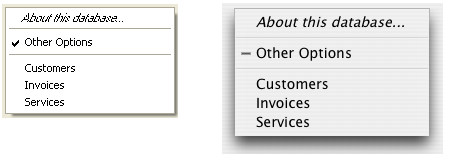

<!--REF #_command_.Pop up menu.Syntax-->**Pop up menu** ( *conteudo* {; *padrao* {; *coordX* ; *coordY*}} )  : Integer<!-- END REF-->
<!--REF #_command_.Pop up menu.Params-->
| Parâmetro | Tipo |  | Descrição |
| --- | --- | --- | --- |
| conteudo | Text | &#8594;  | Definição texto do menu |
| padrao | Integer | &#8594;  | Número do item de menu selecionado como padrão |
| coordX | Integer | &#8594;  | Coordenadas X da esquina esquerda superior |
| coordY | Integer | &#8594;  | Coordenadas Y de esquina superior esquerda |
| Resultado | Integer | &#8592; | Número de item de menu selecionado |

<!-- END REF-->

#### Descrição 

<!--REF #_command_.Pop up menu.Summary-->O comando Pop up menu mostra um menu pop up na localização atual do mouse ou na localização definida pelos parâmetros opcionais *coordX* e *coordY*.<!-- END REF-->  
  
Para seguir as regras de interface de usuário, em geral este comando deve chamado em resposta a um clique e se o botão do mouse ainda estiver pressionado.  
  
Os elementos do menu pop up se definem com o parâmetro *conteudo*, da maneira abaixo:  
  
* Cada elemento se separa dos outros por um ponto e vírgula (;). Por exemplo, "Element1;Element2;Element3".
* Para desativar um elemento, coloque um parênteses aberto (*(*) no texto do elemento.
* Para definir uma linha de separação, passe "-" ou "(-" como texto do elemento.
* Para definir o estilo de fonte para uma linha, coloque no texto do elemento um sinal menor que (<) seguido por um desses caracteres:

  
| <B | Negrito                     |
| -- | --------------------------- |
| <I | Itálica                     |
| <U | Sublinhado                  |
| <O | Contorno (Macintosh apenas) |
| <S | Sombra (Macintosh apenas)   |
  
  
* Para adicionar uma marca de seleção a um elemento, coloque no texto do elemento um sinal de exclamação (!) seguido pelo caractere que deseja utilizar como marca de seleção.
* * Em Macintosh, o caractere é mostrado diretamente. Para mostrar a marca padrão sem importar a versão ou a linguagem do sistema, utilize a instrução: Char(18).  
   * Em Windows, é mostrada uma marca padrão, sem importar o caractere que passe.
* Para adicionar um ícone a um elemento, coloque no texto do elemento um acento circunflexo (^) seguido por um caractere cujo código mais 208 é o recurso do ícone Mac OS.
* Para adicionar um atalho a um elemento, coloque no texto do elemento uma barra oblíqua (/) seguida pelo caractere do atalho. Note que esta última opção é informativa apenas; nenhum atalho de teclado ativa o menu pop up. Entretanto, pode incluir um atalho se o elemento de menu pop up tiver4 um equivalente na barra de menus principal de sua aplicação.

**Dica**: se for possível desativar o mecanismo de interpretação dos caracteres especiais (!, /, etc.) no menu pop up para, por exemplo, ter esses caracteres incluídos nos textos. Para fazer isso, simplesmente inicie o parâmetro conteúdo com a instrução Char(1) depois utilize esta instrução como separador:  
conteúdo:=Char(1)+"1/4"+Char(1)+"1/2"+Char(1)+"3/4")  
  
Note que uma vez executada esta instrução, não é possível atribuir estilos ou atalhos ao menu pop up.  
  
**Conselho**: é possível desativar o mecanismo de interpretação dos caracteres especiais (!, /, etc.) no menu pop up para, por exemplo, ter esses caracteres incluídos nos textos. Para fazer isso, simplesmente inicie o parâmetro *conteudo* com a instrução Char(1) depois utilize esta instrução como separador:

```4d
 conteúdo:=Char(1)+"1/4"+Char(1)+"1/2"+Char(1)+"3/4")
```

Note que quando tiver executada esta instrução, não é possível atribuir estilos ou atalhos ao menu pop up.  
  
O parâmetro opcional *padrao* lhe permite especificar o elemento de menu selecionado por padrão quando se mostra o menu. Passe um valor entre 1 e o número de elementos do menu. Se omitir este parâmetro, o comando seleciona por padrão o primeiro elemento do menu.

Os parâmetros opcionais *coordX* e *coordY* são utilizadas para designar a localização do menu pop-up a mostrar. Em *coordX* e *coordY*, passe respectivamente as coordenadas horizontal e vertical da esquina superior esquerda do menu. Estas coordenadas devem ser expressas em pixels no sistema de coordenadas local do formulário atual. Estes dois parâmetros devem ser passados juntos; se só for passado um, será ignorado.  
  
Se utilizar os parâmetros *coordX* e *coordY*, o parâmetro por padrão é ignorado. Neste caso, o mouse não é encontrado necessariamente no nível do menu pop up.  
  
Estes parâmetros são úteis especialmente para administrar os botões 3D com um menu pop up associado.  
  
Se seleciona um elemento de menu, o comando retorna seu número; do contrário, retorna zero (0).

**Nota:** utilize os menus pop up com um número razoável de elementos. Se deseja mostrar mais de 50 elementos, pode utilizar melhor uma área de rolagem em um formulário.

#### Exemplo 

O método de projeto MEU MENU RAPIDO faz aparecer um menu de navegação pop up:

```4d
  // Método de projeto MEU MENU RAPIDO
 MOUSE POSITION($vlMouseX;$vlMouseY;$vlBotao)
 If(Macintosh control down&NBSP;|&NBSP;($vlBotao=2))
    $vtElementos:="Sobre este banco...<i;(-;!-outras opções;(-"=""     for($vltabela;1;get="" last="" table="" number)=""        if(is="" number="" valid($vltabela))=""           $vtelementos:="$vtElementos+";"+Table" name($vltabela)=""        end="" if=""     end="" for=""     $vlescolhausuario:="Pop" up="" menu($vtelementos)=""     case="" of=""        :($vlescolhausuario="1)"   //="" mostrar="" informação="" as="" opções=""        else=""           if($vlescolhausuario="">0)
  // Ir a tabela cujo número for $vlEscolhaUsuario-4
          End if
    End case
 End if</i;(-;!-outras>
```

Este método de projeto pode ser chamado desde:

* o método de um objeto de formulário que reage a um clique sem esperar que o botão do mouse seja liberado (por exemplo um botão invisível)
* um processo que “espi a” os eventos e se comunica com os outros processos
* um método de gestão de eventos instalado pelo comando [ON ERR CALL](on-err-call.md).

Nos dois últimos casos, não é necessário que o clique seja produzido em um objeto de formulário. Esta é uma das janelas do comando Pop up menu. Geralmente, os menus pop up são mostrados através de objetos de formulário. Com Pop up menu, pode mostrar um menu pop up em qualquer lugar.  
  
O menu pop up é mostrado em Windows ao pressionar o botão direito do mouse, e em Macintosh ao pressionar Control-Clique. Note, entretanto, que o método não verifica se na verdade houve um clique; o método chamante faz esse teste.  
  
O próximo é o menu pop-up tal como aparece em Windows (esquerda) e Macintosh (direita). Note a marca de seleção padrão para a versão Windows.



#### Ver também 

[Dynamic pop up menu](dynamic-pop-up-menu.md)  
[MOUSE POSITION](mouse-position.md)  

#### Propriedades

|  |  |
| --- | --- |
| Número do comando | 542 |
| Thread-seguro | &cross; |


