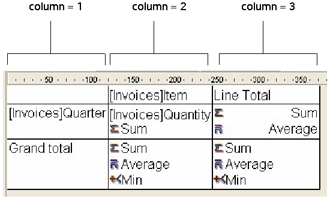

<!--REF #_command_.QR GET INFO COLUMN.Syntax-->**QR GET INFO COLUMN** ( *area* ; *numColuna* ; *titulo* ; *objeto* ; *ocultar* ; *tamanho* ; *valoresRepetidos* ; *formato* {; *resultVar*} )<!-- END REF-->
<!--REF #_command_.QR GET INFO COLUMN.Params-->
| Parâmetro | Tipo |  | Descrição |
| --- | --- | --- | --- |
| area | Inteiro longo | &#x1F852; | Referência da área |
| numColuna | Inteiro longo | &#x1F852; | Nº da coluna |
| titulo | Texto | &#x1F858; | Título da coluna |
| objeto | Texto | &#x1F858; | Objeto atribuído a coluna |
| ocultar | Inteiro longo | &#x1F858; | 0=exibir, 1=ocultar |
| tamanho | Inteiro longo | &#x1F858; | Tamanho da coluna |
| valoresRepetidos | Inteiro longo | &#x1F858; | 0=não repetido, 1=repetido |
| formato | Texto | &#x1F858; | Formato de exibição dos dados |
| resultVar | Texto | &#x1F858; | Nome da variável da fórmula |

<!-- END REF-->

#### Descrição 

<!--REF #_command_.QR GET INFO COLUMN.Summary-->##### Relatórios em lista 

O comando QR GET INFO COLUMN permite recuperar os parâmetros de uma coluna existente.<!-- END REF-->  
  
*area* é a referência da área do relatório rápido.  
  
*numCol* é o número da coluna a modificar.  
  
*titulo* devolve o título que será mostrado no cabeçalho da coluna.  
  
*objeto* devolve o nome do objeto da coluna (variável, campo ou fórmula).  
  
**Nota:** o comando não leva em conta nenhuma estrutura virtual definida por meio dos comandos [SET TABLE TITLES](set-table-titles.md) e [SET FIELD TITLES](set-field-titles.md). O nome real do campo se devolve no parâmetro *objeto*.   
  
*ocultar* indica se a coluna é visível ou está oculta:  

* se oculta for igual a 1, a coluna está oculta;
* se oculta for igual a 0, a coluna é mostrada.
*tamanho* devolve o tamanho da coluna em píxels. Se o valor devolvido for negativo, o tamanho da coluna é automático.  
  
*valoresRepetidos* devolve o estado da propriedade de repetição de dados. Por exemplo, se o valor de um campo ou variável não muda de um registro a outro, é possível repetí-lo ou não em cada linha da coluna.  
  
 • Se *valoresRepetidos* for igual a 0, os valores não se repetem.  
 • Se *valoresRepetidos* for igual a 1, os valores se repetem.  
  
*formato* devolve o formato de saída. Os formatos de saída são os formatos 4D compatíveis com os dados mostrados na coluna.  
  
Quando passar o parâmetro opcional *varResultado*, ele devolve o nome da variável atribuida automaticamente pelo editor de relatórios rápidos à coluna da fórmula (se houver): "C1" para a primeira coluna da fórmula, "C2" para a segunda e assim sucessivamente. 4D utiliza esta variável para armazenar os resultados da última execução da fórmula da coluna quando for gerado o relatório.

##### Relatório tabelas cruzadas 

Com este tipo de relatório, o comando QR GET INFO COLUMN permite recuperar globalmente os mesmos parâmetros mas a referência das áreas às quais aplica é diferente e varia dependendo do parâmetro que queira definir.  
  
 Além disso, os parâmetros *titulo, ocultar*, e *valoresRepetidos* não se utilizam quando este comando se utiliza em relatórios tabelas cruzadas.  
  
 O valor a passar no parâmetro *numCol* depende da operação que queira realizar e se deseja definir o tamanho da coluna ou a fonte de dados e o formato de visualização.  

* Tamanho da coluna
  
 Este é um atributo “visual”, portanto as colunas são numeradas de esquerda a direita, como se mostra na seguinte imagem:  
  
  
  
 A seguinte instrução define o tamanho automático para todas as colunas em um relatório tabela cruzada e deixa os outros elemento intactos:  

```4d
 For($i;1;3)
    &NBSP;QR GET INFO COLUMN(qr_area;$i;$titulo;$obj;$oculta;$tamanho;$rep;$format)
    QR SET INFO COLUMN(qr_area;$i;$titulo;$obj;$oculta;0;$rep;$format)
    &NBSP;End for
```
  
  
Notará que como queira alterar unicamente o tamanho da coluna, tem que utilizar QR GET INFO COLUMN para recuperar as propriedades da coluna e passa-las a [QR SET INFO COLUMN](qr-set-info-column.md "QR SET INFO COLUMN") para deixa-la intacta, exceto o tamanho da coluna.  
* Fonte de dados (objeto) e formato de saída
Nesse caso, a numeração das colunas opera como se mostra a continuação:  
  
  

Se passa um número de *area* inválido, se gera o erro -9850.  
Se o parâmetro *numCol* é incorreto se gera o erro -9852.

#### Exemplo 

Após criar o relatório abaixo:


Pode escrever:

```4d
 var $vTitle;$vObject;$vDisplayFormat;$vResultVar : Text
 var $area;$vHide;$vSize;$vRepeatedValue : Integer
 QR GET INFO COLUMN($area;3;$vTitle;$vObject;$vHide;$vSize;$vRepeatedValue;$vDisplayFormat;$vResultVar)
  //$vTitle = "Age"
  //$vObject = "[People]Birthdate-Current date"
  //$vHide = 0
  //$vSize = 57
  //$vRepeatedValue = 1
  //$vDisplayFormat = ""
  //$vResultVar = "C1"
```

#### Ver também 

[QR Get info row](qr-get-info-row.md)  
[QR SET INFO COLUMN](qr-set-info-column.md)  
[QR SET INFO ROW](qr-set-info-row.md)  