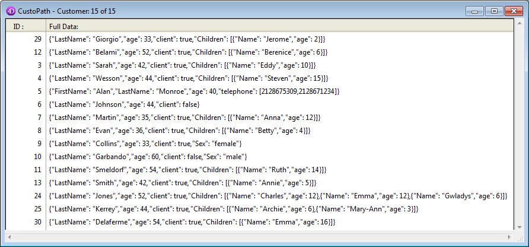

<!--REF #_command_.QUERY BY ATTRIBUTE.Syntax-->**QUERY BY ATTRIBUTE** ( {*umaTabela*}{;}{*opConj* ;} *campoObjeto* ; *caminhoAtributo* ; *opPesq* ; *valor* {; *} )<!-- END REF-->
<!--REF #_command_.QUERY BY ATTRIBUTE.Params-->
| Parâmetro | Tipo |  | Descrição |
| --- | --- | --- | --- |
| umaTable | Table | &#8594;  | Tabela para a qual retornar uma seleção de registros, ou tabela padrão se for omitido |
| opConj | * | &#8594;  | Operador de Conjunção para juntar múltiplas pesquisas |
| campoObjeto | Field | &#8594;  | Campo Objeto para atributos de pesquisa |
| caminhoAtributo | Text | &#8594;  | Nome ou caminho do atributo |
| opPesq | Text, * | &#8594;  | Operador pesquisa (comparador) |
| valor | Text, Number, Date, Time | &#8594;  | Valor a comparar |
| * | Operador | &#8594;  | Continua a flag de pesquisa |

<!-- END REF-->

#### Descrição 

<!--REF #_command_.QUERY BY ATTRIBUTE.Summary-->**QUERY BY ATTRIBUTE** localiza os registros que correspondam com a string de consulta definida utilizando os parâmetros *campoObjeto*, *caminhoAtributo*, *opPesq* e *valor* e retorna uma seleção de registros para a *tabela*.<!-- END REF-->altera a seleção atual de *tabela* para o processo atual e faz o primeiro registro da nova seleção do registro atual. Se o parâmetro *tabela* for omitido, o comando aplica-se a tabela como padrão. Se você não tiver definido qualquer tabela padrão, ocorre um erro.

O parâmetro opcional *opConj* é usado para combinar várias chamadas a **QUERY BY ATTRIBUTE** no caso de várias pesquisas. Os operadores de conjunção disponíveis são o mesmo que o comando [QUERY](query.md):  
  
  
| **Conjunção** | **Símbolo a utilizar com QUERY BY ATTRIBUTE** |
| ------------- | --------------------------------------------- |
| AND           | &                                             |
| OR            | \|                                            |
| Except        | #                                             |

O parâmetro *opConj* não é usado para a primeira chamada para **QUERY BY ATTRIBUTE** de uma consulta múltipla, ou se a pesquisa for uma busca simples. Se você omitir esse parâmetro dentro de uma pesquisa múltipla, o operador AND (&) é usado como padrão.

Em *campoObjeto*, passe o campo objeto cujos atributos que você deseja pesquisar. Se pertence a uma tabela Um relacionada à *tabela* com uma relação automática ou manual, o *campoObjeto* pode pertencer a uma outra tabela.

Em *caminhoAtributo*, passe o nome ou o caminho do atributo cujos valores deseja comparar. Pode passar um único atributo, por exemplo, "age": nesse caso todos os atributos com o nome serão comparados no registro. Você pode também passar um caminho, por exemplo "children.girls.age", neste caso todos os atributos com este nome serão comparados no registro. Pode também passar um caminho, por exemplo "children.girls.age", em cujo caso só os atributos coincidentes serão comparados no registro.

Se um atributo "x" for um array, **QUERY BY ATTRIBUTE** buscará registros que contenham um atributo "x" no qual ao menos um elemento coincida com os critérios. Para buscar em atributos array, é necessário indicar ao comando **QUERY BY ATTRIBUTE** que o atributo "x" é um array adicionando ".\[\]" a seu nome em *caminhoAtributo* (ver exemplo 3). É possível adicionar uma letra entre colchetes (por exemplo "\[b\]") para linkar argumentos (veja o parágrafo abaixo \[#cmd id="1331" anchor="3181657"/\]).

**Notas:** 

* Lembre que os nomes de atributos diferenciam entre maiusculas e minúsculas: pode ter diferentes nomes de atributos "MyAtt" e "myAtt" no mesmo registro.
* Os nomes de atributos são cortados para eliminar espaços adicionais. Por exemplo, "meu primeiro atributo .meu segundo atributo" se interpreta como "meu primeiro atributo.meu segundo atributo".
* Não é possível pesquisar atributos cujos nomes contenham caracteres especiais tais como "." ou "\[ \]", já que serão avaliados incorretamente como tokens na pesquisa de string. Para saber mais, veja o parágrafo *identificador notação objeto*.

O parâmetro *opBusq* é o operador de comparação que se aplica entre *campoObjeto* e *valor*. Pode passar um dos símbolos que se mostran aqui:  
  
| **Comparação**   | **Símbolo a utilizar com** **QUERY BY ATTRIBUTE** |
| ---------------- | ------------------------------------------------- |
| Igual a          | \=                                                |
| Diferente de     | #                                                 |
| Menor que        | <                                                 |
| Maior que        | \>                                                |
| Menor ou igual a | <=                                                |
| Maior ou igual a | \>=                                               |
  
  
(\*) Quando usado com elementos array, o operador # significa "não contém qualquer um". **Nota**: Você pode especificar o operador de comparação como uma expressão de texto em vez de um símbolo. Consulte a descrição do comando [QUERY](query.md) para mais informações.  

  
*valor* é o dado contra o qual irá comparar *caminhoAtributo*. O valor pode ser qualquer expressão do mesmo tipo que *caminhoAtributo*. O valor é avaliado uma vez, no início da busca. O valor não é avaliado para cada registro. Para procurar uma string dentro de uma string (uma procura "contém"), use o sinal de arroba (@) em *valor* para isolar a string a pesquisar, como mostrado neste exemplo: "@ Smith @". Note-se que, neste caso, a busca apenas parcialmente se benefícia do índice (compacidade de armazenamento de dados).  

Esta é a estrutura de uma consulta por atributos:

```4d
 QUERY BY ATTRIBUTE([Table] ;[Table]ObjectField ;"attribute1.attribute2";=;value)
```

**NOta:** um critério implícito para todos os operadores (exceto #) é que o campo Objeto contenha um atributo. Entretanto, para o operador #, ele pode ser indefinido (ver abaixo). 

##### Usar o operator # 

Ao consultar por atributo utilizando o operador **#**, deve se lembrar dos casos em que um atributo pode não estar presente em um registro. Por exemplo, considere a afirmação abaixo:

```4d
 QUERY BY ATTRIBUTE([People];[People]Animals;"dog.name";#;"Rex")
```

Esta pesquisa devolverá os registros de pessoas que tenham um cachorro cujo nome não é "Rex", assim como também os registros de pessoas que não tenham cachorro, ou que tenham cachorro sem nome, ou seja, registros para os quais o valor da propriedade "dog.name" seja **null**. O conceito subjacente é: se o motor de consulta não conhce os dados para compará-los com os critérios de pesquisa, não pode decidir se coincidem ou não. Portanto, o registro se exclui da consulta.

Para usar um exemplo mais genérico:

```4d
 QUERY BY ATTRIBUTE([Table];[Table]ObjectField;"attribute1.attribute2";#;value)
```

Esta pesquisa devolverá todos os registros para os que *\[Table\]ObjectField* contém um objeto que contenha um atributo attribute1, que é em si um objeto que contém um atributo attribute2 cujo valor não seja o valor. NAO vá devolver os registros onde:

* o campo objeto não contém *attribute1*
* o campo objeto não contém **attribute1.attribute*2
* o campo objeto contém **attribute1.attribute*2=null

Este principio também aplica aos atributos array. Por exemplo, a pesquisa devolverá os registros das pessoas que tenham um ou vários endereços, mas nenhum em Paris.

```4d
 QUERY BY ATTRIBUTE([People];[People]OB_Field;"locations[].city";#;"paris")
```

**Nota:** Para obter específicamente os registros onde o atributo não está definido, pode utilizar um objeto vazio (ver exemplo 2). Note entretanto que a pesquisa de valores NULL em elementos array não é compatível.

##### Construir múltiplas pesquisas 

Aqui estão as regras a serem seguidas para a construção de várias pesquisas por atributo:  

* A primeira linha não deve conter uma conjunção.
* Cada argumento de consulta sucessivo pode começar com uma conjunção. Se você omiti-lo, o operador AND (&) é usado por padrão.
* Todas as linhas, exceto a última, deve usar o parâmetro *\**.
* **QUERY BY ATTRIBUTE** pode ser combinado com os comandos [QUERY](query.md) (ver exemplo).
* Para realizar a pesquisar, não especifique o parâmetro \* no último comando **QUERY BY ATTRIBUTE**. Alternativamente, você pode executar o comando [QUERY](query.md) sem parâmetros diferentes à da tabela.

**Nota:** Cada tabela mantém sua própria construção de pesquisa atual. Isto significa que você pode criar várias consultas simultaneamente, um para cada tabela.

Não importa a forma em que a pesquisa foi definida:  

* Se a operação de busca vai levar algum tempo para ser executada, 4D mostra automaticamente uma mensagem contendo um termômetro de progresso. Estas mensagens podem ser ligados e desligadas usando os comandos [MESSAGES ON](messages-on.md) y [MESSAGES OFF](messages-off.md). Se um termômetro de progresso for exibido, o usuário pode clicar no botão Parar para parar a pesquisa. Se a consulta for concluída, OK é definido como 1\. Caso contrário, se a consulta for interrompida, OK é definido como 0 (zero).
* Se nenhum campo objeto indexado não for indicado, a pesquisa é otimizada sempre que for possível (campos indexados são procurados primeiro), resultando em uma busca que leva o mínimo de tempo possível.

##### Valores de Datas nos objetos 

As datas são armazenadas nos objectos com base nos parâmetros do banco de dados e; por padrão, se considera o fuso horário (veja selector JSON use local time no comando [SET DATABASE PARAMETER](set-database-parameter.md)). 

!1973-05-22!"></span></span><span id="result\_box" lang="pt"><span title="\[#codeJS\]!1973-05-22!">\[#codeJS\]!1973-05-22! -> "1973-05-21T23:00:00.000Z"  
  
Essa configuração também é considerada durante a busca, assim você não precisa se preocupar com isso, se você usar sempre a sua base no mesmo lugar e se os parâmetros são os mesmos em todos os computadores que acessam os dados. Neste caso, a seguinte busca retorna corretamente os registros cujo atributo é Birthday igual a !1973-05-22! (Salvo como"1973-05-21T23:00:00.00Z"):

```4d
 QUERY BY ATTRIBUTE([Persons];[Persons]OB_Info;"Birthday";=;!1973-05-22!)
```

Se você não quiser usar o parâmetro GMT, você pode modificar esses parâmetros com a seguinte declaração:

  
```4d
 SET DATABASE PARAMETER(JSON use local time;0)
```

Lembnre que o escopo deste parâmetro é limitado ao process.. Se você executar este comando, 01 de outubro de 1965 se armazenará como "1965-10-01T00: 00: 00.000Z", mas você deve definir o mesmo parâmetro antes de iniciar suas pesquisas:

```4d
 SET DATABASE PARAMETER(JSON use local time;0)
 QUERY BY ATTRIBUTE([Persons];[Persons]OB_Info;"Birthday";=;!1976-11-27!)
```

##### Usar a propriedade de comprimento virtual 

Pode usar a propriedade virtual "comprimento" com este comando. Esta propriedade está disponível automaticamente para qualquer atributo do tipo array e retorna o tamanho do array, ou seja, o número de elementos que o array contém. Pode ser usado no contexto de execução do comando **QUERY BY ATTRIBUTE** (veja exemplo 4).

##### Atributo Linking array com múltiplos argumentos pesquisa 

(Novo em 4D v16 R2) Quando procurar um atributo de array com múltiplos argumentos de pesquisa unidos pelo operador AND, pode querer ter certeza que apenas registros contendo elementos que correspondam a todos os argumentos sejam retornados, e não registros onde argumentos podem ser encontrados em diferentes elementos. Para fazer isso, precisa linkar argumentos de pesquisa a elementos array, de maneira que apenas elementos únicos contendo argumentos linkados são encontrados. 

Por exemplo, com os dois registros abaixo:

```json
{
    "name":"martin",
    "locations" : [ {
                "kind":"home",
                "city":"paris" 
            } ]
} , {
    "name":"smith",
    "locations" : [ {
                "kind":"home",
                "city":"lyon" 
            } , {
                "kind":"office",
                "city":"paris" 
            } ]
}
```

Se quiser encontrar pessoas com um local "home" na cidade "paris". Se escrever: 

```4d
 QUERY BY ATTRIBUTE([People];[People]OB_Field;"locations[].city";=;"paris";*)
 QUERY BY ATTRIBUTE([People];[People]OB_Field;"locations[].kind";=;"home")
```

... a pesquisa retorna "martin" e "smith" porque "smith" tem um elemento "local" cujo "tipo" é "home" e um elemento "local" cuja "cidade" é "paris", mesmo sendo elementos diferentes.

Se quiser obter registros onde argumentos correspondentes estão no mesmo elemento, é necessário **argumentos linkados**. Para linkar argumentos de pesquisa

* Adicionar uma letra entre \[\] no primeiro caminho para linkar e repetir a mesma letra em todos os argumentos linkados. Por exemplo: **locations\[a\].city** e **locations\[a\].kind**. Pode usar qualquer letra no aflabeto latino (não diferencia maiúsculas e minúsculas).
* Para adicionar diferentes critérios linkados, use outra letra (ver exemplo abaixo). Pode criar até 26 combinações de critérios em uma única pesquisa.

Com os registros acima, se escrever:

```4d
 QUERY BY ATTRIBUTE([People];[People]OB_Field;"locations[a].city";=;"paris";*)
 QUERY BY ATTRIBUTE([People];[People]OB_Field;"locations[a].kind";=;"home")
```

... a pesquisa vai retornar apenas "martin" porque tem um elemento "location" cujo "kind" é "home" e cuja "city" é "paris". A pesquisa não vai retornar "smith" porque os valores "home" e "paris" não estão no mesmo elemento array. Ver os exemplos abaixo para mais exemplos dessa propriedade. 

**Nota:** Usar uma sintaxe linkada em uma única linha de pesquisa dá os mesmos resultados como uma pesquisa padrão, exceto quando usando o operador "#" : neste caso, resultados inválidos podem ser retornados. Esta sintaxe inválida portanto não é compatível. 

#### Exemplo 1 

Neste exemplo, o atributo de "age" (idade) é uma string ou um inteiro e queremos encontrar pessoas cujas idades estão entre 20 e 29. As primeiras duas linhas procuram o atributo como um número inteiro (> = 20 e <30) e as última consultam o campo como uma string (começando com "2", mas é diferente de "2".)

```4d
 QUERY BY ATTRIBUTE([Persons];[Persons]OB_Info;"age";>=;20;*)
 QUERY BY ATTRIBUTE([Persons];&;[Persons]OB_Info;"age";<;30;*)
 QUERY BY ATTRIBUTE([Persons];|;[Persons]OB_Info;"age";=;"2@";*)
 QUERY BY ATTRIBUTE([Persons];&;[Persons]OB_Info;"age";#;"2") //sem * para lançar a execução
```

#### Exemplo 2 

O comando **QUERY BY ATTRIBUTE** pode ser usado para encontrar registros nos quais alguns atributos são definidos (ou não). Para isso, deve usar um objeto vazio.

```4d
  //Pesquisar os registros onde o correio eletrônico é definida no campo objeto
 var $undefined : Object
 QUERY BY ATTRIBUTE([Persons];[Persons]Info;"email";#;$undefined)
```

```4d
  //Pesquisar os registros onde o CEP- código postal não está definido no campo objeto
 var $undefined : Object
 QUERY BY ATTRIBUTE([Persons];[Persons]Info;"zip code";=;$undefined)
```

**Nota:** Essa sintaxe específica não é ocmpatível com atributos do tipo array. Pesquisar por valores NULL em elementos array dá resultados inválidos.

#### Exemplo 3 

Você quer encontrar um campo que contém os atributos do array. Com os dois registros a seguir:

```json
{
    "name":"martin",
    "locations" : [ {
                "kind":"office",
                "city":"paris" 
            } ]
} , {
    "name":"smith",
    "locations" : [ {
                "kind":"home",
                "city":"lyon" 
            } , {
                "kind":"office",
                "city":"paris" 
            } ]
}
```

 ... **QUERY BY ATTRIBUTE** encontra pessoas com uma localização "paris" usando este comando:

```4d
  //indica o atributo array com a sintaxe ".[]"
 QUERY BY ATTRIBUTE([People];[People]OB_Field;"locations.[].city";=;"paris")
  //Seleciona "martin"e  "smith"
```

**Nota**: Se você tiver definido diversos critérios no mesmo atributo array, os critérios coincidentes não se aplicam necessariamente ao mesmo elemento do array. No exemplo a seguir, a pesquisa retornará "smith", porque tem um elemento "locations" cujo "kind" (tipo) é "home" e um elemento "locations", cujas "city" é "paris" Mesmo se esse não for o mesmo elemento:

```4d
 QUERY BY ATTRIBUTE([People];[People]OB_Field;"locations.[].kind";=;"home";*)
 QUERY BY ATTRIBUTE([People];&;[People]OB_Field;"locations.[].city";=;"paris")
  //Selecciona "smith"
```

#### Exemplo 4 

 Este exemplo ilustra o uso da propriedade virtual "comprimento". Seu banco de dados tem um campo de objeto \[Customer\]full\_Data com os dados abaixo:



Se quiser obter os registros para qualquer cliente que tenha duas ou mais crianças, pode escrever:

```4d
 QUERY BY ATTRIBUTE([Customer];[Customer]full_Data;"Children.length";>=;2)
```

#### Exemplo 5 

Estes exemplos ilustram as várias combinações disponíveis de argumentos de pesquisa linkados em arrays. Assuma que você tem os registros abaixo:

```json
[ {
    "Name": "Sam",
    "Children": [ {
        "Name": "Harry",
        "Age": "15",
        "Toy": [ {
            "Name": "Car",
            "Color": "Blue" 
         }, {
            "Name": "Teddy Bear",
            "Color": "Brown" 
        } ]
      }, {
        "Name": "Betty",
        "Age": "9",
        "Toy": [ {
            "Name": "Car",
            "Color": "Green" 
       }, {
            "Name": "Puzzle",
            "Color": "Blue" 
        } ]
      } ]
  }, {
    "Name": "Louis",
    "Children": [ {
        "Name": "Harry",
        "Age": "15",
        "Toy": [ {
            "Name": "Water gun",
            "Color": "Blue" 
        } ]
      }, {
        "Name": "Betty",
        "Age": "3",
        "Toy": [ {
            "Name": "Car",
            "Color": "Blue" 
        }, {
            "Name": "Puzzle",
            "Color": "Green" 
        } ]
      } ]
  }, {
    "Name": "Victor",
    "Children": [ {
        "Name": "Harry",
        "Age": "9",
        "Toy": [ {
            "Name": "Doll",
            "Color": "Pink" 
        }, {
            "Name": "Puzzle",
            "Color": "Blue" 
        } ]
      }, {
        "Name": "Betty",
        "Age": "15",
        "Toy": [ {
            "Name": "Water gun",
            "Color": "Blue" 
        } ]
      } ]
 } ]
```

Para encontrar pessoas que tenham uma criança chamada "Betty" com 15 anos:

```4d
 QUERY BY ATTRIBUTE([Person];[Person]ObjectField;"Children[a].Name";=;"Betty";*)
 QUERY BY ATTRIBUTE([Person];&;[Person]ObjectField;"Children[a].Age";=;"15")
  //retorna "Victor"
 
 QUERY BY ATTRIBUTE([Person];[Person]ObjectField;"Children[].Name";=;"Betty";*)
 QUERY BY ATTRIBUTE([Person];&;[Person]ObjectField;"Children[].Age";=;"15")
  //retorna "Sam", "Louis" e "Victor"
```

Para encontrar pessoas que tenham uma filha chamada "Betty", de 15 anos, e um filho chamado "Harry" de 9 anos:

```4d
 QUERY BY ATTRIBUTE([Person];[Person]ObjectField;"Children[a].Name";=;"Betty";*)
 QUERY BY ATTRIBUTE([Person];&;[Person]ObjectField;"Children[a].Age";=;"15";*)
 QUERY BY ATTRIBUTE([Person];[Person]ObjectField;"Children[b].Name";=;"Harry";*)
 QUERY BY ATTRIBUTE([Person];&;[Person]ObjectField;"Children[b].Age";=;"9")
  //retorna "Victor"
 
 QUERY BY ATTRIBUTE([Person];[Person]ObjectField;"Children[].Name";=;"Betty";*)
 QUERY BY ATTRIBUTE([Person];&;[Person]ObjectField;"Children[].Age";=;"15";*)
 QUERY BY ATTRIBUTE([Person];[Person]ObjectField;"Children[].Name";=;"Harry";*)
 QUERY BY ATTRIBUTE([Person];&;[Person]ObjectField;"Children[].Age";=;"9")
  //retorna "Sam" e "Victor"
```

Para achar pessoas que tenham um filho de 15 anos chamado "Harry" que tenha um brinquedo "blue car" (pesquisar em um array de arrays):

```4d
 QUERY BY ATTRIBUTE([Person];[Person]ObjectField;"Children[a].Name";=;"Harry";*)
 QUERY BY ATTRIBUTE([Person];&;[Person]ObjectField;"Children[a].Age";=;"15";*)
 QUERY BY ATTRIBUTE([Person];&;[Person]ObjectField;"Children[a].Toy[b].Name";=;"Car";*)
 QUERY BY ATTRIBUTE([Person];&;[Person]ObjectField;"Children[a].Toy[b].Color";=;"Blue")
  //retorna "Sam"
 
 QUERY BY ATTRIBUTE([Person];[Person]ObjectField;"Children[].Name";=;"Harry";*)
 QUERY BY ATTRIBUTE([Person];&;[Person]ObjectField;"Children[].Age";=;"15";*)
 QUERY BY ATTRIBUTE([Person];&;[Person]ObjectField;"Children[].Toy[].Name";=;"Car";*)
 QUERY BY ATTRIBUTE([Person];&;[Person]ObjectField;"Children[].Toy[].Color";=;"Blue")
  //retorna "Sam" e "Louis"
```

#### Variáveis e conjuntos do sistema 

Se a pesquisa é realizada corretamente, a variável sistema OK toma o valor 1.  
A variável Ok toma o valor 0 se:

* o usuário clicar em **Cancelar** na caixa de diálogo de pesquisa,
* em modo "pesquisa e bloqueio"! (ver o comando [SET QUERY AND LOCK](set-query-and-lock.md)), a pesquisa encontra, no mínimo, um registro bloqueado. Nese caso, igualmente, o conjunto sistema LockedSet é atualizado.

#### Ver também 

  
*Estrutura dos objetos de linguagem 4D*  
[QUERY SELECTION BY ATTRIBUTE](query-selection-by-attribute.md)  

#### Propriedades

|  |  |
| --- | --- |
| Número do comando | 1331 |
| Thread-seguro | &check; |
| Modificar variáveis | OK |
| Modificar o registro atual ||
| Modificar a seleção atual ||


