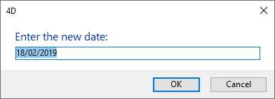

<!--REF #_command_.Request.Syntax-->**Request** ( *mensagem* {; *respostaPadrao* {; *okBotaoTitulo* {; *cancelarBotaoTitulo*}}} )  : Text<!-- END REF-->
<!--REF #_command_.Request.Params-->
| Parâmetro | Tipo |  | Descrição |
| --- | --- | --- | --- |
| mensagem | Text | &#8594;  | Mensagem a exibir na caixa de diálogo de alerta |
| respostaPadrao | Text | &#8594;  | Dados automáticos para a área de entrada de texto |
| okBotaoTitulo | Text | &#8594;  | Título do botão OK |
| cancelarBotaoTitulo | Text | &#8594;  | Título do botão Cancelar |
| Resultado | Text | &#8592; | Valor introduzido pelo usuário |

<!-- END REF-->

#### Descrição 

<!--REF #_command_.Request.Summary-->O comando **Request** mostra uma caixa de diálogo composta de uma mensagem, uma área de entrada de texto, um botão **OK** e um botão **Cancelar**.<!-- END REF-->

A mensagem a mostrar é passada no parâmetro *mensagem*. Esta mensagem pode ser de até 255 caracteres. Se a mensagem não se ajusta à área de mensagem, pode aparecer truncado, dependendo de sua longitude e da largura dos caracteres.

Automaticamente, o título do botão **OK** é “Aceitar” e o do botão   **Cancelar** é “Cancelar.” Para modificar os títulos destes botões, passe os novos títulos nos parâmetros opcionais *okBotaoTitulo* e *cancelarBotaoTitulo*. Se for necessário, a largura dos botões é redimensionada até a esquerda, de acordo com a largura dos títulos personalizados que você passar.

O botão **OK** é o botão automático. Se o usuário clicar no botão **OK** ou pressiona **Enter** para aceitar a caixa de diálogo, a variável sistema OK toma o valor 1\. Se o usuário clicar no botão Cancelar para cancelar a caixa de diálogo, a variável sistema OK toma o valor 0\. 

O usuário pode introduzir texto na área de entrada de texto. Para especificar um valor automático, passe o texto no parâmetro *respostaPadrao*. Se o usuário clicar no botão **OK**, **Request**devolve o texto. Se o usuário clique em **Cancel**, **Request** devolve uma cadeia vazia (""). Se a resposta deve ser um valor numérico ou uma data, converta a cadeia devolvida por **Request** ao tipo desejado com a ajuda das funções [Num](num.md) ou [Date](date.md).

**Nota:** não chame o comando **Request** desde um método de formulário ou de objeto que maneje os eventos de formulário On Activate ou On Deactivate; isto provocará um loop infinito.

**Dica:** se necessita obter várias peças de informação do usuário, crie um formulário e apresente-o com [DIALOG](../commands/dialog.md), ao invés de apresentar uma sucessão de caixas de diálogo de tipo **Request**.

#### Exemplo 1 

A linha:

```4d
 $vsPrompt:=Request("Please enter your name:")
```

Mostrará a seguinte caixa de diálogo (em Windows):


#### Exemplo 2 

A linha:

```4d
 vsPrompt:=Request("Name of the Employee:";"";"Create Record";"Cancel")
 If(OK=1)
    ADD RECORD([Employees])
  //Nota: vsPrompt é depois copiado no campo [Employees]Last name
  //durante o evento On Load no método de formulario
 End if
```

Mostrará a seguinte caixa de diálogo (em Windows):


#### Exemplo 3 

A linha:  
  
```4d
 $vdPrompt:=Date(Request("Introduzir a nova data:";String(Current date)))
```

Mostrará a seguinte caixa de diálogo (em Windows):



#### Ver também 

[ALERT](alert.md)  
[CONFIRM](confirm.md)  