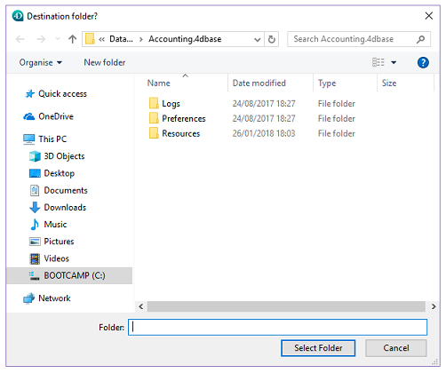

<!--REF #_command_.Select folder.Syntax-->**Select folder** ( {*mensagem* }{;}{ *rotaPadrao* {; *opções*}} ) : Text<!-- END REF-->
<!--REF #_command_.Select folder.Params-->
| Parâmetro | Tipo |  | Descrição |
| --- | --- | --- | --- |
| mensagem | Text | &#8594;  | Título da janela |
| rotaPadrao | Text, Integer | &#8594;  | • Rota padrão ou • String vazia para mostrar a pasta de usuário padrão (“Meus documentos” em Windows, “Documentos” em Mac OS), ou • Número de rota memorizada |
| opções | Integer | &#8594;  | Opções de seleção em Mac OS |
| Resultado | Text | &#8592; | Rota de acesso à pasta selecionada |

<!-- END REF-->

#### Descrição 

<!--REF #_command_.Select folder.Summary-->O comando Select folder mostra uma caixa de diálogo que lhe permite selecionar manualmente uma pasta e depois recuperar a rota de acesso completa a essa pasta.<!-- END REF--> O parâmetro opcional *rotaPadrao* pode ser utilizado para designar a localização de uma pasta que inicialmente será mostrada na caixa de diálogo de seleção da pasta.  

**Nota**: este comando não modifica a pasta atual da aplicação 4D.

O comando Select folder mostra uma caixa de diálogo padrão de navegação através dos volumes e as pastas.  
O parâmetro opcional *mensagem* lhe permite mostrar uma mensagem na caixa de diálogo. Nos seguintes exemplos, a mensagem é "Selecione uma pasta de destino":

**Windows**  
  


**Mac OS** 
****

Pode utilizar o parâmetro *rotaPadrao* para oferecer uma localização de pasta por padrão na caixa de diálogo de seleção de pasta. Pode passar neste parâmetro três tipos de valores:  
* Uma rota de acesso de uma pasta válida utilizando a sintaxe da plataforma atual.
* Uma string vazia (“”) para mostrar a pasta do usuário por padrão do sistema (“Meus documentos” em Windows, “Documentos” em Mac OS).
* O número de rota de acesso memorizada (de 1 a 32.000) para mostrar a pasta associada. Isto significa que pode armazenar em memória a rota de acesso da pasta aberta quando o usuário clicar no botão de seleção; em outras palavras, a pasta escolhida pelo usuário. Quando for chamado um número arbitrário (por exemplo, 5) o comando mostra a pasta do usuário por padrão do sistema (equivalente a passar uma string vazia). O usuário pode então navegar entre as pastas em seu disco rígido. Quando o usuário clicar no botão de seleção, a rota de acesso é memorizada e se associa com o número 5\. Quando posteriormente se chama o número 5, se utilizará por padrão a rota de acesso memorizada. Em caso de seleção de uma nova localização, a rota número 5 será atualizado, e assim sucessivamente.  
Este mecanismo pode ser utilizado para memorizar até 32.000 rotas de acesso. Em Windows, cada rota é conservada durante a sessão. Em Mac OS, as rotas ficam memorizadas de uma sessão a outra. Se a rota for incorreta, o parâmetro *rotaPadrao* será ignorado.

**Note:** Este mecanismo é idêntico ao usado pelo comando [Select document](select-document.md). O número de rotas memorizadas é passado entre os dois comandos.

O parâmetro opções permite que você se beneficie de funções adicionais no Mac OS. Nesse parâmetro, você pode passar uma das seguintes constantes, encontradas no tema *Documentos Sistema*: 

| Constante        | Tipo          | Valor |
| ---------------- | ------------- | ----- |
| Package open     | Inteiro longo | 2     |
| Use sheet window | Inteiro longo | 16    |

Pode passar uma constante ou a combinação de duas. Estas opções apenas consideradas no Mac OS. Em Windows, o parâmetro *opçoes* é ignorado se for passado.  
  
O usuário seleciona uma pasta e logo faz clique no botão **Select Folder** (em Windows) ou **Open** (em Mac OS). A rota de acesso a pasta é então retornada pela função.

* Em Windows, a rota de acesso retornada no seguinte formato:  
“C:\\Pasta1\\Pasta2\\PastaSelecionada\\”
* Em Mac OS, a rota de acesso retornada no seguinte formato:  
“Disco:Pasta1:Pasta2:PastaSelecionada:”
  
**Nota**: em Mac OS, dependendo de se o nome da pasta for selecionado ou não na caixa de diálogo, a rota de acesso retornada poderia ser diferente.  
  
  
  
**4D Server**: esta função permite visualizar os volumes conectados às estações de trabalho dos clientes. Não é possível chamar esta função desde um procedimento armazenado.  
  
Se o usuário validar a caixa de diálogo, a variável sistema OK toma o valor 1\. Se o usuário clicar no botão **Cancelar**, a variável sistema **OK** toma o valor 0 e a função retorna uma string vazia.  
  
**Nota**: em Windows, se o usuário selecionar alguns elementos incorretos, tais como “Estação de trabalho", “Lixeira”, etc., a variável sistema OK toma o valor 0, mesmo se o usuário validar a caixa de diálogo.  

#### Exemplo 

O exemplo abaixo lhe permite selecionar a pasta na qual serão armazenadas as imagens da biblioteca de imagens:  
  
```4d
 $PictFolder:=Select folder("Select a folder for your pictures.")
 PICTURE LIBRARY LIST(pictRefs;pictNames)
 For($n;1;Size of array(pictNames))
    GET PICTURE FROM LIBRARY(pictRefs{$n};$vStoredPict)
    WRITE PICTURE FILE($PictFolder+pictNames{$n};$vStoredPict)
 End for
```

  
```4d

```

#### Ver também 

[CREATE FOLDER](create-folder.md)  
[FOLDER LIST](folder-list.md)  
[Select document](select-document.md)  