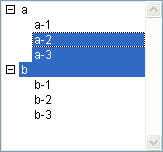

<!--REF #_command_.Selected list items.Syntax-->**Selected list items** ( {* ;} *lista* {; *arrayElem* {; *}} )  : Integer<!-- END REF-->
<!--REF #_command_.Selected list items.Params-->
| Parâmetro | Tipo |  | Descrição |
| --- | --- | --- | --- |
| * | Operador | &#8594;  | Se especificada, lista é um nome de objeto (cadeia) Se omitida, lista é um número de referência de lista |
| lista | Integer, Text | &#8594;  | Número de referência de lista (se omitida *) ou Nome do objeto de tipo lista (se passada *) |
| arrayElem | Integer array | &#8592; | Se omitido o segundo *: Array contém as posições dos elementos selecionados na(s) lista(s) Se passado o segundo *: Array contém as referências dos elementos selecionados |
| * | Operador | &#8594;  | Se omitido: posição(es) do(s) elemento(s) Se passado: referencia(s) do(s) elemento(s) |
| Resultado | Integer | &#8592; | Se omitido o segundo *: posição do elemento selecionado na(s) lista(s) expandida(s) Se passado o segundo *: Referência do elemento selecionado |

<!-- END REF-->

#### Descrição 

<!--REF #_command_.Selected list items.Summary-->O comando Selected list items retorna a posição ou referência do elemento selecionado na lista cujo número de referência ou nome de objeto é passada em *lista*.<!-- END REF-->

Se passa o primeiro parâmetro opcional \*, indica que o parâmetro *lista* é um nome de objeto (cadeia) correspondente a uma representação da lista no formulário. Se não passar este parâmetro, indica que o parâmetro *lista* é uma referência de lista hierárquica (*RefLista*). Se utiliza uma só representação de lista ou trabalha com elementos estruturais (o segundo \* é omitido), pode utilizar indiferentemente uma ou outra sintaxe. Pelo contrário, se utiliza várias representações de uma mesma lista e trabalha com o elemento atual (se passa o segundo \*), a sintaxe baseada no nome do objeto se necessita já que cada representação pode ter sua própria configuração de elementos expandidos/contraídos.

**Nota**: se utiliza o caractere @ no nome de objeto da lista e o formulário contém várias listas que correspondem a este nome, o Selected list items se aplicará ao primeiro objeto cujo nome corresponda.

No caso de seleção múltipla, o comando pode retornar também no array *arrayElem*, a posição ou referência de cada elemento selecionado. Esta função deve ser aplicada a uma lista mostrada em um formulário com o objetivo de detectar os elementos selecionados pelo usuário.

O segundo parâmetro \* lhe permite indicar se desejar trabalhar com as posições atuais dos elementos (neste caso, se deve omitir o parâmetro \*) ou com referências fixas dos elementos (neste caso, deve ser utilizado o parâmetro \*). 

Pode passar um array inteiro longo no parâmetro *arrayElem.* Se for necessário, o array será criado e redimensionado pelo comando. Uma vez executado o comando, *arrayElem* conterá:

* a posição de cada elemento selecionado relativa a estado contraído/Expandido das listas expandidas se for omitida o parâmetro \*.
* a referência fixa de cada elemento selecionado se for passada o parâmetro \*.  
Se não forem selecionados elementos, o array é retornado vazio.

**Nota:** em caso de seleção múltipla, o comando retorna a posição ou referência do elemento atual de *lista*. O elemento atual é o último item no que o usuário clica (seleção manual) ou o elemento designado pelos comandos #cmd id="381"/\] ou [SELECT LIST ITEMS BY REFERENCE](select-list-items-by-reference.md) (seleção por programação). 

Se a lista têm sub-listas, aplique o comando à lista principal (a que está definida no formulário), e não a uma de suas sub-listas. As posições são expressas com relação ao elemento superior da lista principal, utilizando o estado atual contraído/expandido da lista e suas sub-listas.

Em todos os casos, se nenhum elemento estiver selecionado, a função retorna 0.

#### Exemplo 

Esta é uma lista chamada *hList,* mostrada no ambiente Aplicação:

  


```4d
 $vlItemPos:=Selected list items(hList) // neste ponto $vlItemPos vale 2
```


```4d
 $vlItemPos:=Selected list items(hList) // neste ponto $vlItemPos vale 4
 $vlItemRef:=Selected list items(hList;*) // $vlItemRef vale 200 (por exemplo)
```


```4d
 $vlItemPos:=Selected list items(hList) // neste ponto $vlItemPos vale 8
 $vlItemRef:=Selected list items(hList;*) // $vlItemRef vale 203 (por exemplo)
```



```4d
 $vlItemPos:=Selected list items(hList;$arrPos) // neste ponto, $vlItemPos vale 3
  // $arrPos{1} vale 3, $arrPos{2} vale 4 e $arrPos{3} vale 5
```


```4d
 $vlItemRef:=Selected list items(hList;$arrRefs;*) // $vlItemRef vale 101(por exemplo)
  // $arrRefs{1} vale 101, $arrRefs{2} vale 203 (por exemplo)
```

#### Ver também 

[SELECT LIST ITEMS BY POSITION](select-list-items-by-position.md)  
[SELECT LIST ITEMS BY REFERENCE](select-list-items-by-reference.md)  

#### Propriedades
|  |  |
| --- | --- |
| Número do comando | 379 |
| Thread-seguro | &check; |
| Proibido no servidor ||


