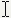

<!--REF #_command_.SET CURSOR.Syntax-->**SET CURSOR** {( *cursor* )}<!-- END REF-->
<!--REF #_command_.SET CURSOR.Params-->
| Parâmetro | Tipo |  | Descrição |
| --- | --- | --- | --- |
| cursor | Integer | &#8594;  | Número de resource de cursor |

<!-- END REF-->

*Esse comando não é seguro para thread e não pode ser usado em código adequado.*


#### Descrição 

<!--REF #_command_.SET CURSOR.Summary-->O comando SET CURSOR muda o cursor do mouse para o cursos do sistema cujo número de ID você passar em *cursor*.<!-- END REF-->

O comando deve ser chamado no contexto de On Mouse Move [Form event code](../commands/form-event-code.md). 

Para restaurar o cursor padrão do mouse, chame o comando sem parâmetros.

Aqui estão os cursores que podem ser passados no parameter 1 *cursor*   
2  
3  
4

#### Exemplo 

Se quiser que o cursor seja exibido  quando o mouse mover sobre uma área de variável no formulário. Pode escrever no método de objeto da variável:

```4d
 If(Form event code=On Mouse Move)
    SET CURSOR(9019)
 End if
```
