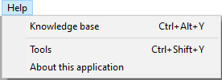

<!--REF #_command_.SET HELP MENU.Syntax-->**SET HELP MENU** ( *menuCol* )<!-- END REF-->
<!--REF #_command_.SET HELP MENU.Params-->
| Parâmetro | Tipo |  | Descrição |
| --- | --- | --- | --- |
| menuCol | Collection | &#8594;  | Coleção de objetos menu |

<!-- END REF-->

#### Descrição 

<!--REF #_command_.SET HELP MENU.Summary-->O comando **SET HELP MENU** lhe permite substituir o menu **Ajuda** por padrão de 4D pela coleção de elementos do menu *menuCol* de modo aplicação.<!-- END REF-->

Este comando substitui o menu **Ajuda** por padrão do modo aplicação em todos os ambientes 4D: interpretado, compilado, fusionado, monousuario e cliente/servidor.

**Notas:** 

* A propria etiqueta "Ajuda" é gestionada pelo sistema e não pode ser personalizada com este comando.
* Os menus de ajuda personalizados não são compatíveis com submenus, marcas de verificação, estilos ou icones.

Em *menuCol*, passe uma coleção de objetos de menu que definam todos os elementos do menu de Ajuda personalizado. Cada objeto de menu pode conte as seguintes propriedades:

| **Propriedade<br/>** | **Tipo <br/>**                                                                          | **Descrição**                                                                                                                                                                                                                                                                                                                                                                                                                                                                                                                                                                                                                                                                                                                                                                                                              |
| ---------------------------- | ----------------------------------------------------------------------------------------------- | -------------------------------------------------------------------------------------------------------------------------------------------------------------------------------------------------------------------------------------------------------------------------------------------------------------------------------------------------------------------------------------------------------------------------------------------------------------------------------------------------------------------------------------------------------------------------------------------------------------------------------------------------------------------------------------------------------------------------------------------------------------------------------------------------------------------------- |
| title                        | Text                                                                                            | Nome do elemento de menu                                                                                                                                                                                                                                                                                                                                                                                                                                                                                                                                                                                                                                                                                                                                                                                                   |
| method                       | Text \| [4D.Function](https://developer.4d.com/docs/API/FunctionClass#about-4dfunction-objects) | Nome do método projeto ou objeto fórmula a executar quando selec ionar o elemento do menu. Quando usar esta propriedade, não deve passar a propriedade "action" (do contrário se ignora "method").                                                                                                                                                                                                                                                                                                                                                                                                                                                                                                                                                                                                                         |
| worker                       | Text \| Number                                                                                  | Nome do worker ou Número do processo que se encarregará da execução do código do "método". Várias configurações são compatíveis, dependendo do valor da propriedade "worker":<br/> se o nome de worker (Text), 4D utilizar ou criar este worker para executar o "método" (equivalente a [CALL WORKER](call-worker.md)) se for um número de processo, 4D utiliza este processo se existir, em caso contrário, não faz nada (equivalente a [CALL WORKER](call-worker.md)) se não estiver definido e a aplicação mostrar um diálogo atual (frontmost dialog), 4D utiliza o processo deste diálogo (equivalente a [CALL FORM](../commands/call-form.md)) se não estiver definido e a aplicação não mostrar um diálogo atual, 4D chama e utiliza o worker1 (4D remoto/mono usuario) ou o worker *4D\_server\_interface* (4D Server) |
| action                       | Text                                                                                            | *Ação estandarte* a executar quando o elemento de menu for selecionado. Quando se utilizar esta propriedade, a propriedade "method" se ignora se for passada.                                                                                                                                                                                                                                                                                                                                                                                                                                                                                                                                                                                                                                                              |
| shortcutKey                  | Text                                                                                            | Tecla de acesso direto do elemento (para chamar com a tecla Ctrl/Comando)                                                                                                                                                                                                                                                                                                                                                                                                                                                                                                                                                                                                                                                                                                                                                  |
| shortcutShift                | Boolean                                                                                         | True para adicionar a tecla **Maiús** ao acesso direto do elemento                                                                                                                                                                                                                                                                                                                                                                                                                                                                                                                                                                                                                                                                                                                                                         |
| shortcutAlt                  | Boolean                                                                                         | True para adicionar a tecla **Alt/Opção** ao acesso direto do elemento                                                                                                                                                                                                                                                                                                                                                                                                                                                                                                                                                                                                                                                                                                                                                     |

O menu **Ajuda** personalizado mostrará os elementos na mesma ordem que a coleção.

Para inserir uma linha separadora, passe **null** ou um objeto vazio na coleção.

#### Exemplo 

Se quiser personalizar o menu **Ajuda** de sua aplicação:

```4d
 var $col : Collection
 $col:=New collection
 $col.push(New object("title";"Knowledge base";"worker";"workerHlp";"method";"methodHlp";"shortcutAlt";True;"shortcutKey";"Y"))
 $col.push(Null) //para adicionar uma linha de separação
 $col.push(New object("title";"Tools";"action";ak msc;"shortcutShift";True;"shortcutKey";"Y"))
 SET HELP MENU($col)
 SET ABOUT("About this application";"m_about") //para substituir 'About 4D' en Windows
```



#### Ver também 

[SET ABOUT](set-about.md)  

#### Propriedades

|  |  |
| --- | --- |
| Número do comando | 1801 |
| Thread-seguro | &cross; |


