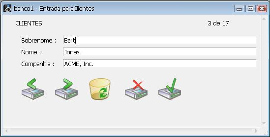
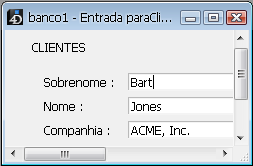

<!--REF #_command_.SET WINDOW RECT.Syntax-->**SET WINDOW RECT** ( *esquerda* ; *superior* ; *direita* ; *inferior* {; *janela*}{; *} )<!-- END REF-->
<!--REF #_command_.SET WINDOW RECT.Params-->
| Parâmetro | Tipo |  | Descrição |
| --- | --- | --- | --- |
| esquerda | Integer | &#8594;  | Coordenada global esquerda da área de conteúdo da janela |
| superior | Integer | &#8594;  | Coordenada global superior da área de conteúdo da janela |
| direita | Integer | &#8594;  | Coordenada global direita da área de conteúdo da janela |
| inferior | Integer | &#8594;  | Coordenada global inferior da área de conteúdo da janela |
| janela | Integer | &#8594;  | Número de referência da Janela, ou a janela ativa do processo atual, se omitido |
| * | Operador | &#8594;  | Se omitido (padrão) = muda janela para o fundo<br/>Se passado = não muda o nível da janela |

<!-- END REF-->

#### Descrição 

<!--REF #_command_.SET WINDOW RECT.Summary-->O comando SET WINDOW RECT modifica as coordenadas globais da janela cujo número de referência for passado em janela.<!-- END REF--> Se a janela não existir, o comando não faz nada.  

Seomitir o parâmetro *janela*, SET WINDOW RECT se aplica a janela do primeiro plano do processo atual. 

Este comando pode redimensionar e mover a janela, dependendo das novas coordenadas que forem passadas.  
  
As coordenadas devem ser expressas com relação ao canto superior esquerdo da área de conteúdo da janela da aplicação (em modo MDI Windows) ou da tela principal (em MacOS e modo SDI Windows). As coordenadas indicam o retângulo correspondente à área de conteúdo da janela (excluindo as barras de títulos e as margens).

**Aviso**: utilize este comando com precaução, poderia mover uma janela mais além dos limites da janela principal (em Windows) ou da tela (em Macintosh). Para evitar isto, utilize comandos como [Screen width](screen-width.md) e [Screen height](screen-height.md) para verificar as novas coordenadas da janela.  
  
Por padrão, executar este comando, automaticamente move a janela designada pelo parâmetro *janela* ao primeiro plano (se o parâmetro for usado). Você pode desativar isso passando o parâmtero *\** como o último parâmetro. neste caso, o comando não vai mais mudar o nível original (coordenada "z") da janela.  
  
Este comando não afeta os objetos de formulário. Se a janela contiver um formulário, os objetos do formulário não são movidos ou redimensionados pelo comando (sem importar suas propriedades). Apenas se modifica a janela. Para modificar uma janela de formulário considerando suas propriedades de redimensionamento e os objetos que contém, deve utilizar o comando [RESIZE FORM WINDOW](resize-form-window.md).

#### Exemplo 1 

Ver o exemplo do comando [WINDOW LIST](window-list.md).

#### Exemplo 2 

Dada a janela abaixo: 



Depois da execução da seguinte linha:

```4d
 SET WINDOW RECT(100;100;300;300)
```

A janela aparece desta forma:



#### Ver também 

[CONVERT COORDINATES](convert-coordinates.md)  
[DRAG WINDOW](drag-window.md)  
[GET WINDOW RECT](get-window-rect.md)  
[RESIZE FORM WINDOW](resize-form-window.md)  

#### Propriedades
|  |  |
| --- | --- |
| Número do comando | 444 |
| Thread-seguro | &check; |
| Proibido no servidor ||


