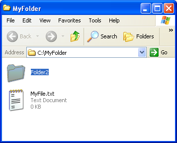

<!--REF #_command_.SHOW ON DISK.Syntax-->**SHOW ON DISK** ( *nomeRota* {; *} )<!-- END REF-->
<!--REF #_command_.SHOW ON DISK.Params-->
| Parâmetro | Tipo |  | Descrição |
| --- | --- | --- | --- |
| nomeRota | Text | &#8594;  | Rota de acesso ao item a exibir |
| * | Operador | &#8594;  | Se o item é uma pasta, mostras os conteúdos |

<!-- END REF-->

#### Descrição 

<!--REF #_command_.SHOW ON DISK.Summary-->O comando SHOW ON DISK mostra em uma janela padrão do sistema operativo o arquivo ou a pasta na qual a rota de acesso for passada no parâmetro *nomeRota*.<!-- END REF-->  

Em uma interface de usuário, este comando permite designar a localização de um arquivo ou pasta especifico.  
  
Por padrão, se *nomeRota* designa uma pasta, o comando mostra o nível da pasta mesma. Se passa o parâmetro opcional *\**, o comando abre a pasta e mostra su conteúdo na janela. Se *nomeRota* designa um arquivo, se ignora o parâmetro *\**.  
  
#### Exemplo 

Os exemplos abaixo ilustram o funcionamento do comando: 

```4d
 SHOW ON DISK("c:\\MinhaPasta\\MeuArquivo.txt") // Mostra o arquivo designado
```


```4d
 SHOW ON DISK("c:\\MinhaPasta\\Pasta2") // Mostra a pasta designada
```



```4d
 SHOW ON DISK("c:\\MinhaPasta\\Pasta2";*) // Mostra os conteúdos da pasta designada
```


#### Variáveis e conjuntos do sistema 

A variável sistema OK assume o valor 1 se o comando for executado corretamente, do contrário assume o valor 0\. 
