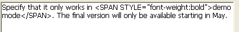

<!--REF #_command_.ST SET TEXT.Syntax-->**ST SET TEXT** ( {* ;} *objeto* ; *novoTexto* {; *inicioSel* {; *fimSel*}} )<!-- END REF-->
<!--REF #_command_.ST SET TEXT.Params-->
| Parâmetro | Tipo |  | Descrição |
| --- | --- | --- | --- |
| * | Operador | &#8594;  | Se especificado, objeto é um nome de objeto (string), se omitido, objeto é uma variável ou campo |
| objeto | any | &#8594;  | Nome de objeto (se * for especificado) ou campo ou variável Texto (se * for omitido) |
| novoText | Text | &#8594;  | Texto a inserir |
| inicioSel | Integer | &#8594;  | Início da seleção |
| fimSel | Integer | &#8594;  | Final da seleção |

<!-- END REF-->

#### Descrição 

<!--REF #_command_.ST SET TEXT.Summary-->O comando OBJECT SET STYLED TEXT insere o texto passado no parâmetro *novoTexto* no campo ou variável de texto com estilo designado pelo parâmetro *objeto*.<!-- END REF--> Este comando só é aplicado ao texto sem formato do parâmetro de *objeto*, sem modificar as etiquetas de estilo que contenha. Se pode utilizar para modificar por programação, texto com estilo na tela. 

##### 

Se passa o parâmetro opcional *\**, indica que o parâmetro *objeto* é um nome de objeto (cadeia). Durante a execução, se o objeto tem o foco, o comando só se aplica ao objeto que está sendo editado e não a sua fonte de dados (campo ou variável). As mudanças só se transferem a fonte (e a qualquer outro objeto com esta mesma fonte) quando o objeto que se está editando se valida, seja por perder o foco ou com a tecla **Intro**. Quando o objeto não tem o foco, o comando se aplica diretamente a fonte de dados e as mudanças são imediatamente transferidos a outros objetos com a mesma fonte.  
Se omitido o parâmetro *\**, indica que o parâmetro *objeto* é um campo ou uma variável e se passa uma referencia de campo ou variável em vez de uma cadeia. O comando se aplica diretamente ao campo ou a variável e as mudanças são transferidas imediatamente a todos os objetos que utilizam esta fonte, incluindo o objeto com o foco.

##### 

Em *novoTexto*, passe o texto a inserir. O comando ST SET TEXT está desenhado para trabalhar com texto enriquecido (multi estilo) com etiquetas de tipo <span>. Em todos os demais casos (particularmente, quando trabalha com texto plano que contenha os caracteres <, > ou &), deve utilizar o comando [ST SET PLAIN TEXT](st-set-plain-text.md). Se passa texto plano com os caracteres <, > ou & ao comando ST SET TEXT, o comando no faz nada. Este princípio de funcionamento é necessário porque se inserir diretamente uma cadeia como "a<b" dentro de um texto enriquecido, não vai distorcionar a análise interna das etiquetas <span>. Neste caso, o caractere "<" deve ser previamente codificado como "&lt;", o qual pode ser feito utilizando o comando [ST SET PLAIN TEXT](st-set-plain-text.md) (ver também o exemplo deste comando).

Os parâmetros opcionais *inicioSel* e *fimSel* permitem designar uma seleção de texto no objeto. Os valores de *inicioSel* e *fimSel* oferecem uma seleção de texto sem formato, sem levar em consideração nenhum tipo de etiquetas de estilo no texto. A ação do comando varía segundo os parâmetros opcionais *inicioSel* e *fimSel*:

* Se omite *inicioSel* e *fimSel*, ST SET TEXT substitui todo o texto do objeto por *novoTexto*,
* Se passa unicamente *inicioSel* ou se os valores de *inicioSel* e *fimSel* são iguais, ST SET TEXT insere o texto *novoTexto* em *objeto* a partir de *inicioSel*,
* Se passa ambos *inicioSel* e *fimSel*, ST SET TEXT substitui o texto sem formato definido para estes limites com o texto *novoTexto*.
* Pode passar 0 em *fimSel* para designar automaticamente o último caractere do texto (passe 1 em *inicioSel* para designar o primeiro caractere do texto).

4D oferece constantes pré definidas de maneira que possa designar automaticamente os limites de seleção nos parâmetros *inicioSel* e *fimSel*. Estas constantes se encontram no tema "*Texto multi estilo*":

| Constante          | Tipo          | Valor  | Comentário                                                            |
| ------------------ | ------------- | ------ | --------------------------------------------------------------------- |
| ST End highlight   | Inteiro longo | \-1001 | Designa o último caractere da seleção atual de texto no objeto (\*)   |
| ST End text        | Inteiro longo | 0      | Designa o último caractere do texto contido no objeto                 |
| ST Start highlight | Inteiro longo | \-1000 | Designa o primeiro caractere da seleção atual de texto no objeto (\*) |
| ST Start text      | Inteiro longo | 1      | Designa o primeiro caractere do texto contido no objeto               |

(\*) Deve passar um nome de objeto em *objeto* para poder utilizar esta constante. Se passar uma referência a um campo ou variável, o comando se aplica a todo o texto do objeto.

Se *inicioSel* é superior a *fimSel*, o texto não se modifica e a variável OK toma o valor 0\. 

#### Variáveis e conjuntos do sistema 

Depois de executar este comando, a variável OK toma o valor 1 se não é apresento nenhum erro; do contrário, toma o valor 0\. Este é o caso particularmente quando as etiquetas de estilo não são avaliados corretamente (etiquetas incorretas ou faltantes).   

No caso de erro, não modifica a variável. Quando ocorre um erro em uma variável quando se está avaliando o texto, 4D transforma o texto em texto plano; como resultado, os caracteres <, > e & são convertidas em entidades HTML.

#### Exemplo 1 

Se quer substituir o texto com estilo selecionado pelo usuário com o conteúdo de uma variável.

Este é o texto selecionado:


O conteúdo armazenado no campo é o seguinte:



Depois da execução de este código:

```4d
 vtempo:="Demonstração"
 GET HIGHLIGHT([Productos]Notas;vInicio;vFim)
 ST SET TEXT([Produtos]Notas;vtemp;vInicio;vFim)
```

O campo e seu conteúdo são os seguintes:

 

#### Exemplo 2 

Consulte o exemplo do comando [ST SET PLAIN TEXT](st-set-plain-text.md). 

#### Ver também 

[ST Get plain text](st-get-plain-text.md)  
[ST Get text](st-get-text.md)  
[ST SET PLAIN TEXT](st-set-plain-text.md)  

#### Propriedades

|  |  |
| --- | --- |
| Número do comando | 1115 |
| Thread-seguro | &cross; |
| Modificar variáveis | OK |


