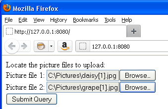

<!--REF #_command_.WEB GET BODY PART.Syntax-->**WEB GET BODY PART** ( *parte* ; *conteudo* ; *nome* ; *tipoMime* ; *nomArquivo* )<!-- END REF-->
<!--REF #_command_.WEB GET BODY PART.Params-->
| Parâmetro | Tipo |  | Descrição |
| --- | --- | --- | --- |
| parte | Integer | &#8594;  | Número de parte |
| conteudo | Blob, Text | &#8592; | Conteúdo de parte |
| nome | Text | &#8592; | Nome da variável "input" |
| tipoMime | Text | &#8592; | Tipo mime do arquivo |
| nomArquivo | Text | &#8592; | Nome do arquivo enviado |

<!-- END REF-->

#### Descrição 

<!--REF #_command_.WEB GET BODY PART.Summary-->O comando **WEB GET BODY PART** chamado no contexto de um processo web, permite analisar a parte "body" de uma petição multi-part.<!-- END REF-->  
  
No parâmetro *parte*, passe o número da parte a analisar. Podes obter o número total de partes com comando [WEB Get body part count](web-get-body-part-count.md).  
  
No parâmetro *conteudo* recebe o conteúdo da parte. Quando as partes a recuperar são arquivos, deve passar um parâmetro de tipo BLOB. No caso de variáveis TEXTO enviadas em um formulário web, pode passar um parâmetro de tipo texto.   
  
O parâmetro *nome* recupera o nome da variável do campo input HTTP.  
  
Os parâmetros *tipoMime* e *nomArquivo* recebem o tipo Mime e o nome do arquivo original, se houver. *nomArquivo* só é recebido quando o arquivo se enviou como **<input type="file">**.  
*tipoMime* e *nomArquivo* são opcionais mas devem ser passados juntos.  
  
**Nota**: No contexto de uma petição multi-part, o primeiro de array do comando [WEB GET VARIABLES](web-get-variables.md) devolve todas as partes do formulário, na mesma ordem que o comando **WEB GET BODY PART**. Pode utilizar-lo para obter diretamente a posição de uma parte de um formulário. 

#### Exemplo 

Neste exemplo, um formulário web permite descarregar no servidor HTTP varias imagens desde um navegador e mostrar-las na página. Este é o formulário web:



Este é o código para a parte <body> da página:

```HTML
<body>
        <form enctype="multipart/form-data" action="/4DACTION/GetFile/" method="post">
            Localize as imagens a carregar: <br>
            Imagem 1: <input name="file1" type="file"><br>
            Imagem 2: <input name="file2" type="file"><br>
            <input type="submit">                   
        </form>    
        <hr/>
    <!--4DSCRIPT/galleryInit-->
    <!--4Dloop aFileNames-->
        "/>
    <!--4Dendloop-->
</body>
```

Dois métodos 4D são chamados pela página:

* galleryInit ao carregar (etiqueta 4DSCRIPT), mostra as imagens presentes na pasta de destino.
* GetFile ao enviar os dados (4DACTION URL do formulário multi-part), processa o envio.

Este é o código do método galleryInit:

```4d
 var $vDestinationFolder : Text
 ARRAY TEXT(aFileNames;0)
 var $i : Integer
 $vDestinationFolder:=Get 4D folder(HTML Root folder)+"photos"+Folder separator //Carpeta "WebFolder/photos"
 DOCUMENT LIST($vDestinationFolder;aFileNames)
```

Este é o código do método GetFile:

```4d
 var $vPartName;$vPartMimeType;$vPartFileName;$vDestinationFolder : Text
 var $vPartContentBlob : Blob
 var $i : Integer
 $vDestinationFolder:=Get 4D folder(HTML Root folder)+"photos"+Folder separator
 For($i;1;WEB Get body part count) //para cada parte
    WEB GET BODY PART($i;$vPartContentBlob;$vPartName;$vPartMimeType;$vPartFileName)
    If($vPartFileName#"")
       BLOB TO DOCUMENT($vDestinationFolder+$vPartFileName;$vPartContentBlob)
    End if
 End for
 WEB SEND HTTP REDIRECT("/") // voltar a página
```

#### Ver também 

[WEB Get body part count](web-get-body-part-count.md)  
[WEB GET HTTP BODY](web-get-http-body.md)  
[WEB GET VARIABLES](web-get-variables.md)  

#### Propriedades
|  |  |
| --- | --- |
| Número do comando | 1212 |
| Thread-seguro | &check; |
| Proibido no servidor ||


