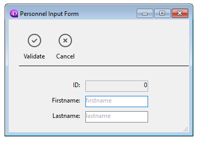

---
id: form-set-input
title: FORM SET INPUT
slug: /commands/form-set-input
displayed_sidebar: docs
---

<!--REF #_command_.FORM SET INPUT.Syntax-->**FORM SET INPUT** ( {*tabela* : Table ;} *formulario* : Text, Object {; *formUsuario* : Text {; *}} )<!-- END REF-->
<!--REF #_command_.FORM SET INPUT.Params-->
<div class="no-index">

| Parâmetro | Tipo |  | Descrição |
| --- | --- | --- | --- |
| tabela | Table | &#8594; | Tabela para a qual vai estabecer o formulário input, ou tabela Padrão, se omitido |
| formulario | Text, Object | &#8594; | Nome do formulário para estabelecer um formulário input |
| formUsuario | Text | &#8594; | Nome do formulário usuário para utilizar |
| * | Operator | &#8594; | Tamanho da janela automático |
</div>
<!-- END REF-->

<div class="no-index">
<details><summary>Histórico</summary>

|Versão|Alterações|
|---|---|
|16 R6|Modificado|
|12|Renomear|
|11 SQL|Modificado|
|<6|Criado|

</details>
</div>

## Descrição 

<!--REF #_command_.FORM SET INPUT.Summary-->O comando FORM SET INPUT define o formulario de entrada atual de *tabela* para *form* ou *userForm*.<!-- END REF--> O formulario deve pertencer a *tabela*.

O parâmetro formulário é o formulário que será exibido. Passe:  
  
 o nome de um formulário;  
 a rota (em sintaxe POSIX) para um arquivo json válido contendo uma descrição doe formulário a usar. Veja *Form file path*;  
 um objeto que contenha a descrição do formulário.

O alcance de este comando é o processo atual. Cada tabela tem seu próprio formulario de entrada em cada processo. 

**Nota:** por razões estruturais, este comando não é compatível com formulários de projetos. Se passar um formulário de projeto em *form,* o comando não faz nada.   
  
FORM SET INPUT não mostra o formulario; só atribui qual formulário é utilizado para a entrada de dados, importação, ou operação por outro comando. Para maior informação sobre a criação de formulários, consulte o .

O formulário de entrada por padrão para cada tabela é definido na janela do Explorador. Este formulário de entrada padrão é utilizado se o comando FORM SET INPUT não é utilizado para especificar um formulario de entrada, ou se especifica um formulário que não existe.

O parâmetro opcional *formUsuario* lhe permite especificar um formulário usuário (proveniente de *form*) como formulário de entrada padrão. Se passa um nome de formulário usuário correto, este formulário será utilizado automaticamente em lugar do formulário de entrada no processo atual. Isto lhe permite ter simultâneamente diferentes formulários usuários personalizados (gerados utilizando o comando *CREATE USER FORM*) e utilizar aquele que seja conveniente em função do contexto.

Para maior informação sobre formulários de usuário, consulte a seção . 

Os formulários de entrada são mostrados por numerosos comandos, os quais geralmente são utilizados para permitir ao usuário introduzir novos dados ou modificar dados antigos. Os sguintes comandos mostram um formulário de entrada para entrada de dados ou pesquisas:

* [ADD RECORD](add-record.md "ADD RECORD")
* [DISPLAY RECORD](display-record.md "DISPLAY RECORD")
* [MODIFY RECORD](modify-record.md "MODIFY RECORD")
* [QUERY BY EXAMPLE](query-by-example.md "QUERY BY EXAMPLE")

Os comandos [DISPLAY SELECTION](display-selection.md "DISPLAY SELECTION") e [MODIFY SELECTION](modify-selection.md "MODIFY SELECTION") mostram uma lista de registros utilizando o formulário de saída. O usuário pode realizar duplo clique em um registro na lista e é mostrado o formulário de entrada.

Os comandos de importação [IMPORT TEXT](import-text.md "IMPORT TEXT"), [IMPORT SYLK](import-sylk.md "IMPORT SYLK") e [IMPORT DIF](import-dif.md "IMPORT DIF") utilizam o formulário de entrada atual para importar registros.

O parâmetro opcional *\** é utilizado em conjunto com as propriedades do formulário que definiu na janela de propriedades do formulário do ambiente Desenho e o comando [Open window](../commands/open-window.md "Open window"). Ao especificar o parâmetro \* lhe indica a 4D que utilize as propriedades do formulário para redimensionar automaticamente a janela para o uso do formulário a seguir (como um formulário de entrada ou como uma caixa de diálogo). Ver maior informação em [Open window](../commands/open-window.md "Open window").

**Nota:** passe ou não o parâmetro opcional *\** ou não, FORM SET INPUT muda o formulario de entrada para a tabela.

## Exemplo 1 

O exemplo a seguir mostra um uso típico de FORM SET INPUT: 

```4d
 FORM SET INPUT([Empresas];"Nova empresa") // Formulário para adicionar novas empresas
 ADD RECORD([Empresas]) // Adicionar uma nova empresa
```

## Exemplo 2 

Em um banco de faturação que administre várias empresas, a criação de uma fatura deve ser efetuada utilizando o formulário usuário correspondente: 

```4d
 Case of
    :(empresa="4D SAS")
       FORM SET INPUT([Faturas];"Entrada";"4D_SAS")
    :(empresa="4D Inc")
       FORM SET INPUT([Faturas];"Entrada";"4D_Inc")
    :(empresa="Acme")
       FORM SET INPUT([Faturas];"Entrada";"ACME")
 End case
 ADD RECORD([Faturas])
```

## Exemplo 3 

Os exemplos abaixo usam a rota a um formulário json para entrar os registros em uma lista de empregados: 

```4d
 FORM SET INPUT([Personnel];"/RESOURCES/PersonnelForm.json")
 ADD RECORD([Personnel])
```

o que retorna:



## Ver também 

[ADD RECORD](../commands/add-record)  
[DISPLAY RECORD](../commands/display-record)  
[DISPLAY SELECTION](../commands/display-selection)  
[FORM SET OUTPUT](../commands/form-set-output)  
[IMPORT DIF](../commands/import-dif)  
[IMPORT SYLK](../commands/import-sylk)  
[IMPORT TEXT](../commands/import-text)  
[MODIFY RECORD](../commands/modify-record)  
[MODIFY SELECTION](../commands/modify-selection)  
[Open window](../commands/open-window)  
[QUERY BY EXAMPLE](../commands/query-by-example)  

## Propriedades

|  |  |
| --- | --- |
| Número do comando | 55 |
| Thread-seguro | no |


