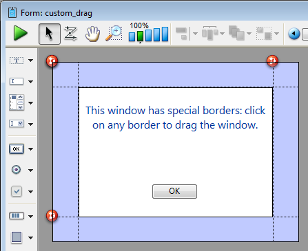
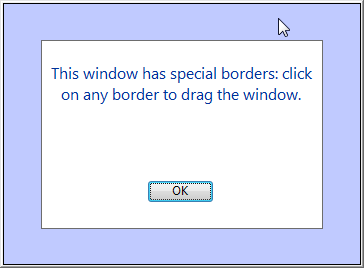

---
id: drag-window
title: DRAG WINDOW
slug: /commands/drag-window
displayed_sidebar: docs
---

<!--REF #_command_.DRAG WINDOW.Syntax-->**DRAG WINDOW**<!-- END REF-->
<!--REF #_command_.DRAG WINDOW.Params-->
<div class="no-index">

| Este comando não requer parâmetros |  |
| --- | --- |
</div>
<!-- END REF-->

<div class="no-index">
<details><summary>Histórico</summary>

|Versão|Alterações|
|---|---|
|6.8|Modificado|
|<6|Criado|

</details>
</div>

## Descrição 

<!--REF #_command_.DRAG WINDOW.Summary-->O comando DRAG WINDOW permite arrastar a janela na qual o usuário clica para seguindo os movimentos do mouse.<!-- END REF--> Geralmente este comando se chama desde um método de objeto de um objeto que possa responder instantaneamente aos cliques do mouse (por exemplo um botão invisível).

## Exemplo 

O seguinte formulário, mostrado no editor de formulários, contém um fundo colorido, sobre a qual há quatro botões invisíveis para cada lado:  
  


Cada botão está associado ao seguinte método:  
  
```4d
 DRAG WINDOW //Começa a arrastar a janela quando clicar
```

Depois de executar o método de projeto abaixo:  

  
```4d
 Open form window("custom_drag";Modal form dialog box)

DIALOG(["custom_drag")

CLOSE WINDOW


```

  
Pode obter uma janela parecida a esta:

  


Depois pode arrastar a janela clicando em qualquer das margens.

## Ver também 

[GET WINDOW RECT](../commands/get-window-rect)  
[SET WINDOW RECT](../commands/set-window-rect)  

## Propriedades

|  |  |
| --- | --- |
| Número do comando | 452 |
| Thread-seguro | no |


