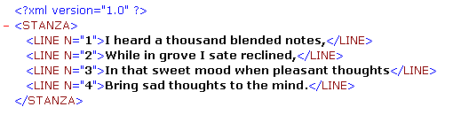

---
id: dom-remove-xml-attribute
title: DOM REMOVE XML ATTRIBUTE
slug: /commands/dom-remove-xml-attribute
displayed_sidebar: docs
---

<!--REF #_command_.DOM REMOVE XML ATTRIBUTE.Syntax-->**DOM REMOVE XML ATTRIBUTE** ( *elementoRef* : Text ; *nomeAtrib* : Text )<!-- END REF-->
<!--REF #_command_.DOM REMOVE XML ATTRIBUTE.Params-->
<div class="no-index">

| Parâmetro | Tipo |  | Descrição |
| --- | --- | --- | --- |
| elementoRef | Text | &#8594; | Elemento de referência XML |
| nomeAtrib | Text | &#8594; | Atributo a ser removido |
</div>
<!-- END REF-->

<div class="no-index">
<details><summary>Histórico</summary>

|Versão|Alterações|
|---|---|
|12|Criado por|

</details>
</div>

## Descrição 

<!--REF #_command_.DOM REMOVE XML ATTRIBUTE.Summary-->O comando DOM REMOVE XML ATTRIBUTE remove, se existir, o atributo designado por *nomAtrib* do elemento XML cuja referência é passada no parâmetro *refElement*.<!-- END REF-->   
  
Se o atributo for eliminado corretamente, a variável sistema OK assume o valor 1\. Se não existir nenhum atributo chamado *nomAtrib* em *refElement*, um erro é retornado e a variável sistema OK assume o valor 0.

## Exemplo 

Dada a seguinte estrutura:



O código abaixo permite remover o primeiro atributo "N=1": 

```4d
 var myBlobVar : Blob
 var $xml_Parent_Ref;$xml_Child_Ref : Text
 var $LineNum : Integer
 
 $xml_Parent_Ref:=DOM Parse XML variable(myBlobVar)
 $xml_Child_Ref:=DOM Get first child XML element($xml_Parent_Ref)
 DOM REMOVE XML ATTRIBUTE($xml_Child_Ref;"N")
```

## Ver também 

[DOM GET XML ATTRIBUTE BY INDEX](../commands/dom-get-xml-attribute-by-index)  
[DOM GET XML ATTRIBUTE BY NAME](../commands/dom-get-xml-attribute-by-name)  
[DOM REMOVE XML ELEMENT](../commands/dom-remove-xml-element)  
[DOM SET XML ATTRIBUTE](../commands/dom-set-xml-attribute)  

## Propriedades

|  |  |
| --- | --- |
| Número do comando | 1084 |
| Thread-seguro | yes |
| Modificar variáveis | OK |


