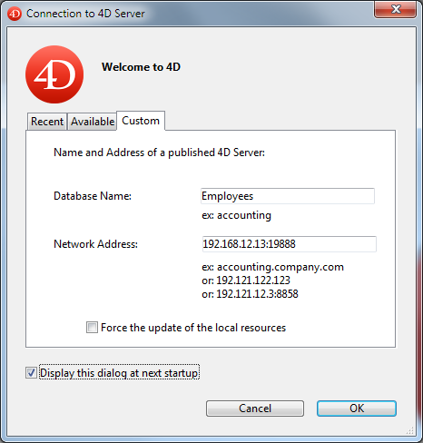

As páginas Cliente-servidor agrupam parâmetros relacionados ao uso do banco de dados no modo cliente-servidor. Naturalmente, essas configurações só são levadas em conta quando o banco de dados é usado no modo remoto.

## Página Opções rede

### Rede

#### Publicar a base de dados no arranque

Essa opção permite que você indique se o banco de dados do 4D Server aparecerá ou não na lista de bancos de dados publicados.

- When this option is checked (default), the database is made public and appears in the list of published databases (**Available** tab).
- Quando a opção não estiver marcada, o banco de dados não será tornado público e não aparecerá na lista de bancos de dados publicados. Para se conectar, os usuários devem inserir manualmente o endereço do banco de dados na guia **Personalizado** da caixa de diálogo de conexão.

:::note

Se você modificar esse parâmetro, deverá reiniciar o banco de dados do servidor para que ele seja levado em consideração.

:::

#### Nome da publicação

Essa opção permite alterar o nome de publicação de um banco de dados do 4D Server, *ou seja*, o nome exibido na guia dinâmica **Disponível** da caixa de diálogo de conexão (consulte o parágrafo [Abrindo um projeto remoto](../Desktop/clientServer.md#opening-a-remote-project)). Por padrão, 4D Server usa o nome do arquivo de projeto. Pode introduzir qualquer nome personalizado que pretenda.

:::note

Esse parâmetro não é levado em conta em aplicativos cliente-servidor personalizados. Em teoria, o aplicativo cliente se conecta diretamente ao aplicativo servidor, sem passar pela caixa de diálogo de conexão. No entanto, em caso de erro, essa caixa de diálogo pode ser exibida; nesse caso, o nome de publicação do aplicativo do servidor é o nome do projeto compilado.

:::

#### Número do porto

Essa opção permite mudar o número da porta TCP na qual o 4D Server publica o banco de dados. Essas informações são armazenadas no projeto e em cada computador cliente. Por padrão, o número da porta TCP usada pelo 4D Server e 4D no modo remoto é 19813.

A personalização desse valor é necessária quando se deseja usar vários aplicativos 4D na mesma máquina; nesse caso, é necessário especificar um número de porta diferente para cada aplicativo.
Quando você modifica esse valor no 4D Server ou no 4D, ele é automaticamente transmitido a todas as máquinas 4D conectadas ao banco de dados.

Para actualizar las otras máquinas clientes que no estén conectadas, basta con introducir el nuevo número de puerto (precedido de dos puntos) después de la dirección IP del equipo servidor en la pestaña **Personalizado** de la caja de diálogo de conexión  Por exemplo, se o novo número de porta é 19888: Por exemplo, se o novo número de porta é 19888:

> Somente os bancos de dados publicados na mesma porta que a definida no cliente 4D são visíveis na página de publicação dinâmica TCP/IP.

#### 4D Server e números de portas

O 4D Server usa três portas TCP para comunicações entre servidores internos e clientes:

- **SQL Server**: 19812 por defecto (puede modificarse a través de la página "SQL/Configuración" de las Preferencias).
- **Application Server**: 19813 by default (can be modified via the "Client-Server/Configuration" page of the Preferences, see above).
- **DB4D Server** (servidor de banco de dados): 19814 por padrão. This port number cannot be modified directly but it always consists of the application server port number + 1.\
  When a 4D client connects to 4D Server, it uses the TCP port of the application server (19813 or the port indicated after the colon ':' in the IP address shown in the connection dialog box). Connection to other servers via their respective ports is then automatic; it is no longer necessary to specify them.\
  Note that in the case of access via a router or a firewall, the three TCP ports must be opened explicitly.
- [**Depurador remoto**](../Debugging/debugging-remote.md): 19815 por padrão. This port number cannot be modified directly but it always consists of the application server port number + 2.

#### Autenticação do usuário com o servidor de domínio

Esta opción le permite implementar las funcionalidades SSO (*Single Sign On*) en su base de datos 4D Server en Windows. Quando você marca essa opção, 4D se conecta de forma transparente ao Active Directory do servidor de domínio do Windows e obtém os tokens de autenticação disponíveis. Quando você marca essa opção, 4D se conecta de forma transparente ao Active Directory do servidor de domínio do Windows e obtém os tokens de autenticação disponíveis.

#### Service Principal Name

Quando o Single Sign On (SSO) estiver ativado (veja acima), você deverá preencher esse campo se quiser usar o Kerberos como protocolo de autenticação. Quando você marca essa opção, 4D se conecta de forma transparente ao Active Directory do servidor de domínio do Windows e obtém os tokens de autenticação disponíveis.

#### Camada de rede

This drop-down box contains the available network layers, which are used to handle communications between 4D Server and remote 4D machines (clients).

- **QUIC** (projects only): Enables the QUIC network layer on the server.

  **Notes about QUIC**:

  - You can know if a 4D application is running with the QUIC network layer using the [`Application info`](../commands/application-info) command.
  - Como o QUIC usa o protocolo UDP, certifique-se de que o UDP seja permitido em suas configurações de segurança de rede.
  - QUIC automatically connects to the port 19813 for both [application server and DB4D server](#4d-server-and-port-numbers).
  - Quando a opção de camada QUIC é selecionada:
    - [As configurações de tempo limite das conexões cliente-servidor](#client-server-connections-timeout) estão ocultas
    - The [Encrypt Client-Server communication checkbox](#encrypt-client-server-communications) is hidden (QUIC communications are always in TLS, whatever your secured mode is).
  - **Compatibility**: You need to deploy your client/server applications with 4D 20 or higher before switching to the QUIC network layer.
- **ServerNet** (only option available for binary databases): Enables the ServerNet network layer on the server.

:::info

Using QUIC network layer is **recommended** for projects.

:::

:::note

No caso de uma modificação, você precisa reiniciar o aplicativo para que a alteração seja levada em conta. Todos os aplicativos clientes que foram conectados também devem ser reiniciados para poderem se conectar à nova camada de rede.

:::

:::tip Related blog posts

[QUIC Network Layer is Production Ready!](https://blog.4d.com/quic-network-layer-is-production-ready/)  
[QUIC network layer: Automatic update and sleep mode](https://blog.4d.com/quic-network-layer-automatic-update-and-sleep-mode/)  
[Work and Move with QUIC and Network Switching](https://blog.4d.com/work-and-move-with-quic-and-network-switching/)

:::

#### Tempo para desconectar cliente-servidor

:::note

This option is not available when the [QUIC](#network-layer) network layer is selected.

:::

Esse dispositivo é usado para definir o tempo limite (período de inatividade além do qual a conexão é fechada) entre o 4D Server e as máquinas clientes que se conectam a ele. A opção Ilimitado remove o tempo limite. Quando essa opção é selecionada, o controle de atividade do cliente é eliminado.

Quando um tempo limite for selecionado, o servidor fechará a conexão de um cliente se não receber nenhuma solicitação dele durante o tempo limite especificado.

### Comunicação cliente-servidor

#### Registrar clientes na inicialização para Execute On Client

Quando essa opção estiver marcada, todas as máquinas remotas 4D conectando à base de dados podem executar os métodos remotamente. Este mecanismo se detalla en la sección [Procedimientos almacenados en las máquinas cliente](https://doc.4d.com/4Dv20/4D/20/Stored-procedures-on-client-machines.300-6330550.en.html).

#### Encriptar as comunicações cliente-servidor

:::note

This option is not available when the [QUIC](#network-layer) network layer option is selected.

:::

Essa opção permite que você ative o modo seguro para comunicações entre a máquina do servidor e as máquinas remotas 4D. Esta opción se detalla en la sección [Cifrar las de conexiones cliente/servidor](https://doc.4d.com/4Dv20/4D/20/Encrypting-ClientServer-Connections.300-6330533.en.html).

#### Atualizar a pasta Resources durante uma sessão

Essa configuração pode ser usada para definir globalmente o modo de atualização da instância local da pasta **Resources** nas máquinas 4D conectadas quando a pasta **Resources** do banco de dados for modificada durante a sessão (a pasta **Resources** é sincronizada automaticamente na máquina remota sempre que uma sessão for aberta). Estão disponíveis três parâmetros:

- **Nunca**: a pasta local **Resources** não é atualizada durante a sessão. A notificação enviada pelo servidor é ignorada. A pasta local **Resources** pode ser atualizada manualmente com o comando do menu de ação **Update Local Resources** (consulte [Usando o explorador de recursos](https://doc.4d.com/4Dv20/4D/20.2/Using-the-Resources-explorer.300-6750254.en.html)).
- **Sempre**: a sincronização da pasta **Resources** local é realizada automaticamente durante a sessão sempre que a notificação é enviada pelo servidor.
- **Perguntar**: quando a notificação for enviada pelo servidor, uma caixa de diálogo é exibida nas máquinas de cliente, indicando a modificação. O usuário pode então aceitar ou recusar a sincronização da pasta local **Resources**.\
  A pasta **Resources** centraliza os arquivos personalizados necessários para a interface do banco de dados (arquivos de tradução, imagens, etc.). Mecanismos automáticos ou manuais podem ser usados para notificar cada cliente quando o conteúdo dessa pasta tiver sido modificado. Mecanismos automáticos ou manuais podem ser usados para notificar cada cliente quando o conteúdo dessa pasta tiver sido modificado.

## Página Configuração IP

### Tabela de configuração Autorização-Rejeição

Essa tabela permite definir regras de controle de acesso para o banco de dados, dependendo dos endereços IP da máquina remota 4D. Essa opção permite reforçar a segurança, por exemplo, para aplicativos estratégicos.

> Esta tabela de configuração não controla as ligações Web.

O comportamento da tabela de configuração é o seguinte:

- A coluna "Allow-Deny" permite selecionar o tipo de regra a ser aplicada (Allow ou Deny) usando um menu pop-up. Para adicionar uma regra, clique no botão Adicionar. Aparece uma nova linha na tabela. O botão **Excluir** permite que você remova a linha atual.
- A coluna "IP Address" (Endereço IP) permite definir o(s) endereço(s) IP afetado(s) pela regra. Para especificar um endereço, clique na coluna e digite o endereço da seguinte forma: 123.45.67.89 (formato IPv4) ou 2001:0DB8:0000:85A3:0000:0000:AC1F:8001 (formato IPv6). Você pode usar um caractere \* (asterisco) para especificar endereços do tipo "começa com". Por exemplo, 192.168.\* indica todos os endereços que começam com 192.168.
- A aplicação das regras é baseada na ordem de exibição da tabela. Se duas regras forem contraditórias, a prioridade será dada à regra localizada na parte mais alta da tabela. Você pode reordenar as linhas modificando a classificação atual (clique no cabeçalho da coluna para alternar a direção da classificação). Você também pode mover as linhas usando o recurso de arrastar e soltar.
- Por motivos de segurança, somente os endereços que realmente correspondem a uma regra terão permissão para se conectar. Em outras palavras, se a tabela contiver apenas uma ou mais regras Deny, todos os endereços serão recusados porque nenhum corresponderá a pelo menos uma regra. Se você quiser negar apenas determinados endereços (e permitir outros), adicione uma regra Allow \* no final da tabela. Por exemplo:
  - Negar 192.168.\* (negar todos os endereços que comecem por 192.168)
  - Autorizar \* (e autorizar outros)

Por padrão, nenhuma restrição de conexão é aplicada pelo 4D Server: a primeira linha da tabela contém o rótulo Allow e o caractere \* (todos os endereços).

