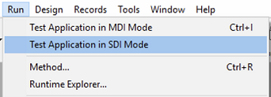

A página Interface é usada para definir várias opções relacionadas à interface do projeto.

## Geral

Esta área permite-lhe definir várias opções relativas ao ecrã.

### Fonte a ser usada com o comando MESSAGE

Haga clic en **Seleccionar...** para definir la fuente y el tamaño de los caracteres utilizados por el comando `MESSAGE`.

A fonte padrão e seu tamanho dependem da plataforma onde 4D está sendo executado.

> This property also affects the following parts of 4D: <li>certain preview areas of the Explorer</li><li>the ruler of the Form editor</li>

### Exibir janelas

Outras opções configuram a exibição de várias janelas no modo Aplicativo.

- **Pantalla de inicio**: cuando esta opción no está seleccionada, la [pantalla de inicio de la barra de menú actual](Menus/bars.md#splash-screen) no aparece en modo Aplicación. Cuando oculte esta ventana, le corresponderá gestionar la visualización de todas sus ventanas por programación, por ejemplo en el método base `On Startup`.

- **Escritura de caché**: cuando esta opción está marcada, 4D muestra una ventana en la parte inferior izquierda de la pantalla mientras se vacían los datos de la caché. Como esta operação bloqueia temporariamente ações do usuário, exibindo esta janela permite que ele saiba que o movimento está em andamento.

:::note

Puede definir la [frecuencia de escritura de la caché](database.md#memory-page) en **Propiedades** > **Base de datos** > **Memoria**.

:::

- **Progreso de la impresión**: permite, durante la impresión, activar o desactivar la visualización de la caja de diálogo de progreso de la impresión.

- **Use SDI mode on Windows**: When this option is checked, 4D enables automatically the [SDI mode (Single-Document Interface)](../Menus/sdi.md) in your application when executed in a [supported context](../Menus/sdi.md#sdi-mode-availability). Al seleccionar esta opción, en Windows el menú **Ejecutar** de la barra de menú de 4D le permite seleccionar el modo en el que desea probar la aplicación:

  

:::note

Esta opção pode ser selecionada no macOS, mas será ignorada quando o aplicativo for executado nesta plataforma.

:::

### Esquema de cores

Esse menu permite que você selecione o esquema de cores a ser usado no nível do aplicativo principal. Um esquema de cores define um conjunto global de cores de interface para textos, planos de fundo, janelas, etc., usados em seus formulários.

> This option is ignored on Windows with [Classic theme](#use-fluent-ui-on-windows). In this context, the "Light" scheme is always used.

Os seguintes esquemas estão disponíveis:

- **Light**: the application will use the Default Light Theme
  
- **Escuro**: o aplicativo irá usar o Tema Escuro Padrão
  
- **Heredado** (por defecto): la aplicación heredará el nivel de prioridad superior (es decir, las preferencias del usuario del sistema operativo)

> Os temas predefinidos podem ser tratados com CSS. Para más información, consulte la sección [Media Queries](../FormEditor/createStylesheet.md#media-queries).

O esquema de aplicação principal será aplicado aos formulários por defeito. No entanto, ele pode ser substituído:

- por el comando [SET APPLICATION COLOR SCHEME](../commands/set-application-color-scheme) a nivel de la sesión de trabajo;
- utilizando la propiedad de formulario [Color Scheme](../FormEditor/propertiesForm.html#color-scheme) en cada nivel de formulario (nivel de prioridad más alto). **Nota:** cuando se imprimen, los formularios utilizan siempre la paleta "Light".

### Use Fluent UI on Windows

When this option is checked, 4D will automatically use the [Fluent UI rendering theme](../FormEditor/forms.md#fluent-ui-rendering) for all your forms on Windows, [when available](../FormEditor/forms.md#requirements). When it is unchecked, the Windows Classic UI rendering theme will be used by default.

> This option is only used on Windows, it has no effect on macOS.

This project setting can be overriden at form level by using the [Widget appearance](../FormEditor/propertiesForm.html#widget-appearance) form property (highest priority level).

> Rendering themes can be handled using CSS. Para más información, consulte la sección [Media Queries](../FormEditor/createStylesheet.md#media-queries).

## Atalhos

Você usa a área de atalhos para visualizar e modificar atalhos padrão para três operações básicas de formulário 4D em seus aplicativos de desktop. Esses atalhos são idênticos em ambas as plataformas. Os ícones das teclas indicam as teclas correspondentes para Windows e macOS.

Os atalhos predefinidos são os seguintes:

- Aceptación de formulario de entrada: **Entrada**
- Anulación de entrada: **Esc**
- Añadir al subformulario: **Ctrl+Mayús+/** (Windows) o **Comando+Mayús+/** (macOS)

Para cambiar el acceso directo de una operación, haga clic en el botón **Editar** correspondiente. Aparece a seguinte caixa de diálogo:

Para cambiar el acceso directo, escriba la nueva combinación de teclas en su teclado y haga clic en **OK**. Si prefiere no tener un acceso directo para una operación, haga clic en **Borrar**.

