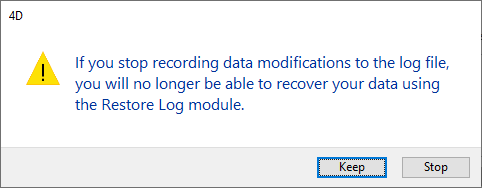

Um banco de dados de uso continuo sempre registra mudanças, adições ou apagamentos. Realizar backups ou cópias de segurança regularmente é importante mas lembre que não permite (em caso de problemas) restaurar os dados registrados depois do último backup. Para responder à essa necessidade, 4D oferece agora uma ferramenta específica: o arquivo de log. Este arquivo permite garantir a segurança permanente dos dados do banco de dados. Este arquivo permite garantir a segurança permanente dos dados do banco de dados.

Além disso, 4D trabalha constantemente com dados cache em memória. Todas as mudanças realizadas nos dados do banco de dados são armazenados temporariamente na cache antes de serem escritas no disco rígido. Isso acelera a operação das aplicações; na verdade, acessar a memória é mais rápido que acessar o disco rígido. Se acontecer algo no banco de dados antes que armazenagem dos dados na cache possa ser gravada no disco rígido, precisa incluir o arquivo de histórico atual para poder restaurar o banco de dados por completo.

Por último, 4D possui funções que analisam os conteúdos do arquivo de histórico, tornando possível reverter as operações realizadas sobre os dados do banco de dados. Essa funções estão disponíveis no MSC: veja a página de[Análise de atividade](MSC/analysis.md) e a página [Rollback](MSC/rollback.md).

## como o arquivo de histórico funciona

O arquivo de histórico gerado por 4D contém uma descrição de todas as operações realizadas nos dados das tbelas registradas no diário do banco de dados, as quais são registradas de forma sequencial. Como padrão, todas as tabelas são registradas, ou seja, incluidas no arquivo de histórico, mas pode desmarcar as tabelas individuais usando a propriedade de tabela **Incluir no arquivo de histórico**.

Dessa forma, cada operação realizada por um usuário causa duas ações simultâneas: a primeira no banco de dados (instrução é realizada normalmente) e a segunda ação no arquivo de histórico (a descrição da ação é registrada). O arquivo de historial se cria de forma independente, sem perturbar nem ralentar o trabalho do usuário. The log file is created independently without disturbing or slowing down the work of the user. O arquivo de historial registra os seguintes tipos de ações:

- Abertura e fechamento de arquivos de dados,
- Abertura e fechamento de processos (contextos),
- Adição de registros ou BLOBs,
- Modificação de registros,
- Eliminação de registros,
- Criar ou fechar as transações.

Para saber mais sobre essas ações, consulte a página [Análise de atividades](MSC/analysis.md) do CSM.

4D gerencia o arquivo de historial. Leva em consideração todas as operações que afetam o arquivo de dados por igual, independente das manipulações realizadas pelo usuário, métodos 4D, o motor SQL, os plug-ins, ou um navegador web ou uma aplicação móvel.

A instrução abaixo resume o funcionamento do arquivo de historial:

O arquivo de historial atual se guarda automaticamente com o arquivo de dados atual. Este mecanismo tem duas vantagens distintas:

- Evitar a saturação do volume de disco onde se armazena o arquivo de historial. Sem uma cópia de segurança, o arquivo de histórico ficaria cada vez maior com o  uso, e acabaria utilizando todo o espaço disponível no disco. Para cada cópia de segurnça do arquivo de dados, 4D ou 4D Server fecha o arquivo de histórico atual e  imediatamente inicia um novo arquivo vazio, evitando assim o riesco de saturação. A continuação, o arquivo de historial antigo se arquiva e, finalmente, se destrói em função do mecanismo de gestão dos conjuntos de cópias de seguriança.
- Conserva os arquivos de histórico correspondentes às cópias de segurança para poder analisar ou reparar um banco de dados em um momento posterior. A integração de um arquivo de histórico só pode ser realizada no banco de dados ao qual corresponde. Para poder integrar corretamente um arquivo de historial em uma cópia de segurança, é importante que as cópias de segurança e os arquivos de historial se arquivem simultaneamente.

## Criar o arquivo de histórico

Como padrão, todo banco de dados criado com 4D utiliza um arquivo de histórico (opção definida na página **Geral** das Preferências). O arquivo de histórico é chamado *data.journal* e está na pasta Data.

Pode averiguar se seu banco de dados utiliza um arquivo de histórico a qualquer momento: só precisa comprovar se a opção **Utilizar o arquivo de histórico** estiver selecionada na página **Backup/Configuración** das Propriedades do banco. Se desmarcar essa opção, ou se usar um banco de dados sem arquivo de histórico, e quiser estabelecer uma estratégia de backup com um arquivo de histórico, vai precisar criar um.

Para criar um arquivo de histórico:

1. Na página **Cópia de segurança/Configuração** das Propriedades do banco de dados, marque a opção **Utilizar o arquivo de histórico**. O programa exibe um caixa de diálogo abrir/novo arquivo. Como padrão, o nome arquivo é chamado *data.journal*.

2. Mantém o nome padrão ou renomeia, e daí seleciona o local do arquivo. Se tiver pelo menos dois discos rígidos, é recomendado que coloque o arquivo de histórico no disco que não tenha seu banco de dados. Se perder o disco rígido do banco de dados, poderá então recuperar o arquivo de histórico.

3. Clique **Salvar**. O disco e o nome do arquivo de histórico aberto agora estão exibidos na área **Use Log** da caixa de diálogo. Pode clicar nessa área para exibir um menu pop-up contendo a rota de histórico no disco.

4. Valide a caixa de diálogo das Propriedades do banco de dados.

Para poder criar um arquivo de histórico diretamente, o banco de dados deve estar em uma das situações abaixo:

- O arquivo de dados está em branco,
- Acaba de realizar uma cópia de segurança do banco de dados e ainda não foram realizadas mudanças nos dados.

Em todos os outros casos, quando validar a caixa de diálogo Propriedades de Banco de Dados, um diálogo de alerta informará que é necessário fazer um backup. Se clicar em **Aceitar**, a cópia de segurança começa imediatamente, e depois se ativa o arquivo de histórico. If you click **OK**, the backup begins immediately, then the log file is activated. If you click **Cancel**, the request is saved but the creation of the log file is postponed and it will actually be created only after the next backup of the database.

Sem ter que fazer nada a mais, todas as operações realizadas sobre os dados são registradas nesse arquivo, e são usadas no futuro quando abrir o banco de dados.

Precisa criar outro arquivo de histórico se criar um novo arquivo de dados. Precisa estabelecer ou criar outro arquivo de shitórico se abrir outro arquivo de dados que não estiver linnkado a um arquivo de histórico (ou se o arquivo de histórico estiver faltando).

## Parar um arquivo de histórico

Se quiser parar as operações de registro no arquivo de histórico atual, apenas desmarque a opção **Use Log|Usar o arquivo de histórico ** na página **Backup/Configuration** das Propriedades do banco de dados.

4D então exibe uma mensagem de alerta para avisar que a ação evita de aproveitar as vantagens de segurança de ter um arquivo de histórico:

Se clicar **Stop**, o arquivo de histórico é imediatamente fechado (a caixa de diálogo Propriedades do banco de dados não precisa ser validada depois).

Se quiser fechar o arquivo de histórico atual porque é muito grande, pode considerar realizar um backup de arquivo de dados, o que vai fazer com que também se crie uma cópia de segurança do arquivo de histórico

> **4D Server:** O comando `New log file` fecha automaticamente o arquivo de histórico atual e começa um novo. Se por alguma razão o arquivo de histórico ficar indisponível durante uma sessão de trabalho, o erro 1274 é gerado e o servidor 4D não permimte que o usuários escrevam mais dados. Quando o arquivo de histórico estiver disponível novamente, é preciso fazer um backup.
