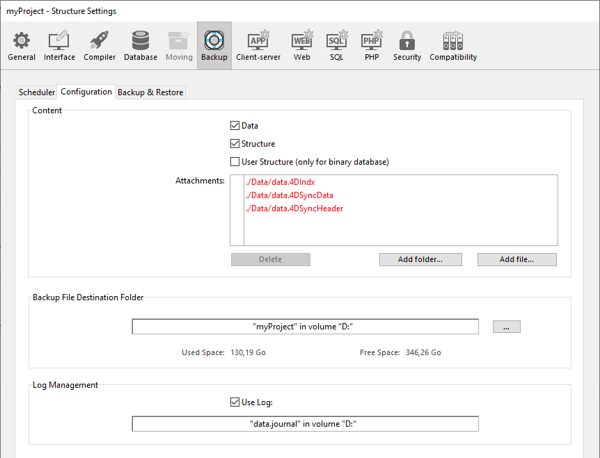

As configurações de backup são definidas através de três páginas na caixa de diálogo Configurações do Banco de Dados. Pode estabelecer:

- a periodicidade das cópias de segurança automáticas
- os arquivos a incluir em cada backup
- as funcionalidades avançadas que permitem executar tarefas automáticas

> As propriedades definidas nesta caixa de diálogo são escritas no arquivo *Backup.4DSettings*, guardado na pasta [Settings](Project/architecture.md#settings-folder).

## Backups periódicos

Pode automatizar a cópia de segurança dos bancos de dados abertos com 4D ou 4D Server (mesmo quando não houver máquinas cliente conectadas). Isso implica definir uma frequência de cópia de segurança (horas, dias, semanas ou meses): para cada sessão, 4D automaticamente inicia uma cópia de segurança usando as configurações atuais de backup.

Se essa aplicação não for lançada no momento teórico do backup, na próxima vez que 4D for lançado, considera o backup como tendo falhado e continua como estabelecido nas propriedades do banco de dados (ver [Manejo de problemas da cópia de segurança](backup.md#handling-backup-issues)).

Os parâmetros da cópia de segurança programador são definidos na página **Backup/Periodicidade** das Propriedades do banco de dados:

As opções encontradas nessa aba permitem estabelecer e configurar as cópias de segurança automáticas programadas do banco de dados. Pode escolher uma configuração rápida padrão ou pode personalizá-la completamente. Aparecem várias opções em função da escolha realizada no menu **Cópia de segurança automática**:

- **Nunca**: A função de cópia de segurança está inativa.
- **Cada hora**: programa uma cópia de segurança automática a cada hora, a partir da hora seguinte.
- **Cada dia**: programa uma cópia de segurança automática cada dia. Pode então digitar a hora quando o backup deve começar.
- **Todas as semanas**: programa uma cópia de segurança automática a cada semana. Duas áreas de entrada adicionais lhe permitem indicar o dia e a hora em que deve começar a cópia de segurança.
- **Todos os meses**: programa uma cópia de segurança todos os meses. Duas áreas de entrada adicionais lhe permitem indicar o dia do mês e a hora em que deve começar a cópia de segurança.
- **Personalizado**: serve para configurar as cópias de segurança automáticas "sob medida". Quando selecionar esta opção, várias áreas de entradas aparecem:
  - **Cada X hora(s)**: permite programar as cópias de segurança com frequência horária. Pode digitar um valor entre 1 e 24.
  - **Cada X dia(s) às x**: permite programar as copias de segurança com frequência diária. Por exemplo, introduza 1 se quiser realizar uma cópia de segurança diária. Quando esta opção estiver marcada, deve digitar a hora quando o backup deve começar.
  - **Cada X semana(s) às x**: permite programar as copias de segurança semanalmente. Digite 1 se quiser realizar o backup 1 vez por semana. Quando essa opção estiver marcada, deve digitar o dia da semana e a hora em que quer começar o backup. Pode selecionar vários dias da semana se quiser. Por exemplo. pode usar essa opção para estabelecer dois backups por semana: um nas quartas feiras e outro nas sextas.
  - **Cada X mes(es), X dia às x**: Permite programar cópias de segurança mensalmente. Digite 1 se quiser realizar uma cópia de segurança mensal. Quando essa opção estiver marcada, tem que indicar o dia do mês e a hora em que o backup deve começar.

> As mudanças de hora padrão para hora de verão podem afetar temporariamente ao programador automático e ativar a próxima cópia de segurança com uma diferença de uma hora. Isso acontece só uma vez e os próximos backups rodam na hora prevista.

## Configuração

A página Cópia de segurança| Configuração das propriedades do banco de dados permite determinar os arquivos de cópia de segurança e sua localização, assim como a do arquivo de histórico. Esses parâmetros são específicos para cada banco de dados aberto pela aplicação 4D.

> **4D Server:** estes parâmetros só podem ser configurados desde a máquina 4D Server.

### Conteúdo

Essa área lhe permite determinar quais os arquivos ou pastas que devem ser copiados durante o backup.

- **Dados**: Arquivo de dados do banco de dados. Quando esta opção é marcada, o arquivo de registro atual da base de dados, se existir, é salvo enquanto os dados.
- **Estrutura**: arquivos e pastas do banco de dados. No caso de bancos de dados compilados, essa opção permite fazer o backup do arquivo .4dz.
- **Arquivo de estrutura usuário (só para bancos binários)**: *funcionalidade obsoleta*
- **Arquivos anexos**: esta área permite especificar um conjunto de arquivos ou pastas que sofrerão o backup no mesmo momento que o banco de dados. Esses arquivos podem ser de qualquer tipo (documentos ou modelos de plug-ins, etiquetas, relatórios, imagens, etc). Pode estabelecer arquivos ou pastas individuais cujos conteúdos serão respaldados completamente. Cada elemento anexado é listado com sua rota de acesso completa na área "Anexos".
  - **Eliminar**: retira o arquivo selecionado da lista de arquivos anexos.
  - **Adicionar pasta...**: mostra uma caixa de diálogo que permite selecionar uma pasta para adicionar à cópia de segurança. No caso de uma restauração, a pasta vai recuperar sua estrutura interna. Pode selecionar toda pasta ou volume conectado à máquina, exceto a pasta que conter os arquivos do banco de dados.
  - **Adicionar pasta...**: mostra uma caixa de diálogo que permite selecionar um arquivo para adicionar à cópia de segurança.

### Pasta de destino de arquivo de cópia de segurança

Esta área lhe permite visualizar e mudar o local na que se armazenarão os arquivos de cópia de segurança, assim como os arquivos de cópia de segurança do arquivo historial (se aplicável).

Para ver o local dos arquivos, clique na área para que apareça sua rota de acesso no menu emergente.

Para modificar o local onde se armazenam esses arquivos, clique no botão **...**. Uma caixa de seleção aparece, que permite selecionar uma pasta ou disco onde os backups são colocados. As áreas "Espaço utilizado" e "Espaço livre" são atualizadas automaticamente e indicam o espaço restante no disco da pasta selecionada.

### Gestão do arquivo de histórico

A opção **Utilizar o arquivo de histórico**, quando estiver marcada, indica que o banco de dados utiliza um arquivo de histórico. Sua rota de acesso é especificada debaixo da opção. Quando essa opção for marcada, não é possível abrir o banco de dados sem um arquivo de histórico.

Por padrão, qualquer banco de dados criado com 4D usa um arquivo de log (opção marcada na **Página Geral** do **Preferências**). O arquivo de histórico é chamado *data.journal* e está na pasta Data.

> Ativar um novo arquivo de log requer que os dados do banco de dados sejam salvos previamente. Quando você marcar esta opção, uma mensagem de aviso informa que um backup é necessário. A criação dos arquivos de histórico é adiada e será feita somente depois do próximo backup do banco de dados.

## Cópia de segurança e restauração

Modificar as opções de cópia de segurança e restauração é opcional. Seus valores padrão correspondem ao uso padrão da função.

### Parâmetros gerais

- **Conservar unicamente os últimos X arquivos de cópia de segurança**: este parâmetro ativa e configura o mecanismo utilizado para eliminar os arquivos de cópia de segurança mais antigos, o que evita o risco de saturar a unidade de disco. Esta funcionalidade opera da seguinte maneira: uma vez finalizado o backup atual, 4D elimina o arquivo mais antigo se for encontrado no mesmo local que o arquivo do qual se está fazendo o backup e tiver o mesmo nome (pode solicitar que o arquivo mais antigo se elimine antes do backup para poupar espaço). Se, por exemplo, o número de conjuntos se definir como 3, as três primeiras cópias de segurança criam os arquivos MyBase-0001, MyBase-0002 e MyBase-0003 respectivamente. Durante o quarto backup, o arquivo MyBase-0004 é criado e MyBase-0001 é apagado. Como padrão, o mecanismo de eliminação de conjuntos está ativado e 4D salva 3 conjuntos de cópias de segurança. Para desativar o mecanismo, simplesmente desmarque a opção.
> Este parâmetro diz respeito às cópias de segurança do banco de dados e dos ficheiros de registo.

- **Fazer Cópia de segurança só se o arquivo de dados tiver sido modificado**: quando marcar esta opção, 4D inicia as cópias de segurança programadas só dados tiverem sido adicionados, modificados ou eliminados no banco de dados desde o último backup. Senão, o backup programado é cancelado e abandonado até o próximo backup programado. Nenhum erro é gerado, entretanto o diário de cópias de segurança assinala que a cópia de segurança foi adiada. Esta opção também permite poupar o tempo da máquina para o backup dos bancos de dados usados principalmente para fins de visualização. Lembre que ao ativar esta opção não se levam em consideração as modificações realizadas nos arquivos de estrutura ou nos arquivos anexos.

> Este parâmetro diz respeito às cópias de segurança do banco de dados e dos ficheiros de registo.

- **Eliminar o arquivo de cópia de segurança mais antigo antes/depois da cópia de segurança**: esta opção só se utiliza se a opção "Conservar só os últimos X arquivos de cópia de segurança" estiver marcada. Especifica se 4D deve começar apagando o último arquivo antes de começar o backup (opção**antes**) ou se deve apagar depois que o backup tiver sido concluído (opção**depois**). Para que os mecanismos funcionem, o arquivo mais velho não deve ser renomeado nem movido.

- **Se a cópia de segurança falhar**: Esta opção permite estabelecer o mecnaismo usado para manejar falhas no backup (cópia de segurança impossível. Quando uma cópia de segurança não puder ser realizada, 4D deixa que realize uma nova tentativa.
  - **Tentar novamente na próxima data e hora programada**: esta opção só tem sentido quando trabalhar com cópias de segurança automáticas programadas. Equivale a anular a cópia de segurança que falhou. Um erro é gerado.
  - **Tentar novamente depois de X segundo(s), minuto(s) ou hora(s)**: Quando essa opção for marcada, um nova tentativa de backup é executada depois do período de espera. Este mecanismo permite antecipar certas circunstancias que possam bloquear a cópia de segurança. Pode estabelecer um período de espera em segundos, minutos ou horas utilizando o menu correspondente. Se a nova tentativa também falhar, um erro é gerado e a falha é notada na área de status do último backup e no arquivo de histórico de backup.
  - **Cancelar a operação depois de X intentos**: este parâmetro se utiliza para definir o número máximo de tentativas de cópia de segurança que falharam. Se o backup não tiver sido realizado com sucesso depois do número máximo de tentativas estabelecido tiver sido alcançado, ele será cancelado e o erro 1401 é gerado ("Número máximo de tentativas de backup foi alcançado; backup automático foi desativado temporariamente"). Nesse caso, não se fará mais backups automáticos até que a aplicação seja reiniciada ou um backup manual se realize com sucesso. Este parâmetro é útil para evitar um caso em que um problema prolongado (que exija a intervenção humana) que impedisse a realização de uma cópia de segurança levasse a aplicação a tentar repetidamente a cópia de segurança, comprometendo seu rendimento geral. Como padrão, esse parâmetro não é marcado.

> 4D considera um backup como tendo falhado se o banco de dados não tiver sido lançado na hora programada o backup automático.

### Arquivo

Essas opções se aplicam aos arquivos de cópia de segurança principais e aos arquivos de cópia de segurança do histórico.

- **Segment Size (Mb)** 4D allows you to segment archives, i.e., to cut it up into smaller sizes. Esse funcionamento permite, por exemplo, armazenar uma cópia de segurança em vários discos diferentes (DVD, dispositivos usb pendrive, etc). Durante a restauração, 4D vai fusionar automaticamente os segmentos. Cada segmento é chamado MyDatabase[xxxx-yyyy].4BK, onde xxxx é o número do backup e yyyy é o número do segmento. Por exemplo, os três segmentos do backup do banco de dados do MyDatabase[0006-0001].4BK, MyDatabase[0006-0002].4BK e MyDatabase[0006-0003].4BK. O menu **Tamanho do segmento** é um combo box que permite estabelecer o tamanho em MB de cada segmento da cópia de segurança. Pode escolher um dos tamanhos pré-estabelecidos ou digitar um tamanho específico entre 0 e 2048. Se passar 0, não se produz nenhuma segmentação (isso equivale a passar **Nenhum**).

- **Compression Rate** By default, 4D compresses backups to help save disk space. Entretanto, a fase de compressão de arquivo pode retardar o processo de backup quando lidar com grandes volumes de dados. A opção **Compression Rate** permite ajustar a compressão de arquivo:
  - **Nenhum:** Não se aplica compressão de arquivos. O backup é mais rápido, mas os arquivos são bem maiores.
  - **Rápido** (padrão): Essa opção é um compromisso entre a velocidade de backup e tamanho de arquivo.
  - **Compactar** : a taxa máxima de compressão é aplicada aos arquivos. Os arquivos ocupam o mínimo espaço possível no disco, mas o backup é mais lento.

- **Interlacing Rate and Redundancy Rate** 4D generates archives using specific algorithms that are based on optimization (interlacing) and security (redundancy) mechanisms. Pode estabelecer esses mecanismos de acordo com suas necessidades. Os menus contém para essas opções as taxas **Baixo**, **Médio**, **Alto** e **Nenhum** (padrão).
  - **Taxa de Entrelaçamento**: O Interlacing consiste de armazenar dados em setores não adjacentes para limitar riscos no caso de danos de setor. Quanto maior a taxa, maior a segurança; entretanto, o processamento de dados usa mais memória.
  - **Taxa de redundância**: Redundância permite a segurança de dados  em arquivos repetindo a mesma informação várias vezes. Quanto maior a taxa de redundância, melhor a segurança, mas o armazenamento é mais lento e o tamanho dos arquivos aumenta.

### Restauração automática

- **Restaura a última cópia de segurança se o banco de dados for danificado**: Quando essa opção for marcada, o programa inicia automaticamente a restauração do arquivo de dados do último backup válido do banco, se uma anomalia for detectada (arquivo corrupto por exemplo) durante a o lançamento do banco de dados. Nenhuma intervenção do usuário é necessária, mas a operação é gravada no diário da cópia de segurança.

> No caso de uma restauração automática, somente o arquivo de dados é restaurado. Caso deseje obter os arquivos anexados ou os arquivos do projeto, você deve executar uma restauração manual.

- **Integrar o último arquivo de log se o banco de dados estiver incompleto**: quando esta opção estiver marcada, o programa integra automaticamente o arquivo de log ao abrir ou restaurar o banco de dados.
  - When opening a database, the current log file is automatically integrated if 4D detects that there are operations stored in the log file that are not present in the data. This situation arises, for example, if a power outage occurs when there are operations in the data cache that have not yet been written to the disk.
  - When restoring a database, if the current log file or a log backup file having the same number as the backup file is stored in the same folder, 4D examines its contents. If it contains operations not found in the data file, the program automatically integrates it.

O usuário não vê uma caixa de diálogo, a operação é automática. O objetivo é fazer com que seja tão fácil quanto possível. A operação é registrada no diário de cópias de backup.
