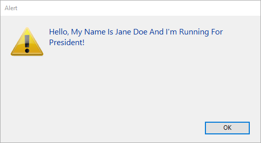

String é um termo genérico que significa:

- Campos ou variáveis texto: um campo, uma variável ou uma expressão texto pode conter de 0 a 2 GB de texto.
- Campos alfanuméricos: um campo alfanumérico pode conter de 0 a 255 caracteres (limite estabelecido aquando da definição do campo).

## Constantes literais String

Uma constante string é colocada entre aspas duplas e rectas ("..."). Eis alguns exemplos:

```4d
"Adicionar registos"
"Não foram encontrados registos."
"Fatura "
```

Uma cadeia vazia é especificada por duas aspas sem nada entre elas ("").

### Sequências de escape

As seguintes sequências de escape podem ser utilizadas em strings de caracteres:

| Escape sequence | Carácter substituído |
| --------------- | -------------------- |
| \n             | LF (Avanço de linha) |
| \t             | HT (Tab)             |
| \r             | CR (Carriage return) |
| \\\          | \ (Barra invertida) |
| \\"           | " (aspas)            |

**Nota:** O carácter \ (barra invertida) é utilizado como separador em nomes de caminhos no Windows. Portanto, deve usar uma barra invertida dupla \\\ em caminhos quando quiser ter uma barra invertida à frente de um carácter usado numa das sequências de escape reconhecidas pelo 4D (por exemplo, "C:\\\MyDocuments\\\New.txt").

## Operadores de string

| Operação             | Sintaxe          | Retorna    | Expression              | Valor    |
| -------------------- | ---------------- | ---------- | ----------------------- | -------- |
| Concatenação         | String + String  | Text       | "abc" + "def"           | "abcdef" |
| Repetição            | String * Number  | Text       | "ab" * 3                | "ababab" |
| Igual                | String = String  | Parâmetros | "abc" = "abc"           | True     |
|                      |                  |            | "abc" = "abd"           | False    |
| Desigualdade         | String # String  | Parâmetros | "abc" # "abd"           | True     |
|                      |                  |            | "abc" # "abc"           | False    |
| Maior que            | String > String  | Parâmetros | "abd" > "abc"           | True     |
|                      |                  |            | "abc" > "abc"           | False    |
| Menor que            | String < String  | Parâmetros | "abc" < "abd"           | True     |
|                      |                  |            | "abc" < "abc"           | False    |
| Maior ou igual a     | String >= String | Parâmetros | "abd" >= "abc"          | True     |
|                      |                  |            | "abc" >= "abd"          | False    |
| Menor que ou igual a | String <= String | Parâmetros | "abc" <= "abd"          | True     |
|                      |                  |            | "abd" <= "abc"          | False    |
| Contém palavra chave | String % String  | Parâmetros | "Alpha Bravo" % "Bravo" | True     |
|                      |                  |            | "Alpha Bravo" % "ravo"  | False    |
|                      | Picture % String | Parâmetros | Picture_expr % "Mer"    | True (*) |

(*) Se a palavra-chave "Mer" estiver associada à imagem armazenada na expressão de imagem (campo ou variável).

## Comparações de cadeias

- As cadeias de caracteres são comparadas carácter a carácter (exceto no caso da pesquisa por palavras-chave [](dt_string.md#keywords), ver abaixo).
- Quando as cadeias de caracteres são comparadas, o caso dos caracteres é ignorado; assim, "a"="A" devolve `TRUE`. Para testar se o caso de dois caracteres é diferente, compare os seus códigos de caracteres. Por exemplo, a seguinte expressão devolve `FALSE`:

```4d
Character code("A")=Character code("a") // porque 65 não é igual a 97
```

- When strings are compared, diacritical characters are compared using the system character comparison table of your computer. Por exemplo, as seguintes expressões retornam `TRUE`:

```4d
     "n"="ñ"
     "n"="Ñ"
     "A"="å"
      // etc.
```

**Nota:** A comparação das cadeias de caracteres tem em conta as especificidades da língua **definida para o ficheiro de dados 4D** (que nem sempre é a mesma que a língua definida para o sistema).

### Caractere coringa(@)

A linguagem 4D suporta **@** como um caractere curinga. Este carácter pode ser utilizado em qualquer comparação de cadeia para corresponder a qualquer número de caracteres. Por exemplo, a seguinte expressão é `TRUE`:

```4d
"abcdefghij"="abc@"
```

O carácter wildcard deve ser utilizado dentro do segundo operando (a cadeia do lado direito) para corresponder a qualquer número de caracteres. A seguinte expressão é `FALSE`, porque o @ é considerado apenas como um carácter no primeiro operando:

```4d
    "abc@"="abcdefghij"
```

O wildcard significa "um ou mais caracteres ou nada". As seguintes expressões são `TRUE`:

```4d
     "abcdefghij"="abcdefghij@"
     "abcdefghij"="@abcdefghij"
     "abcdefghij"="abcd@efghij"
     "abcdefghij"="@abcdefghij@"
     "abcdefghij"="@abcde@fghij@"
```

Por outro lado, seja qual for o caso, uma comparação de cadeias de caracteres com dois wildcards consecutivos devolverá sempre `FALSE`. A seguinte expressão é `FALSE`:

```4d
"abcdefghij"="abc@@fg"
```

Quando o operador de comparação é ou contém um símbolo < or >, só é suportada a comparação com um único carácter universal localizado no final do operando:

```4d
     "abcd"<="abc@" // Comparação válida
     "abcd"<="abc@ef" //Não é uma comparação válida
```

Se quiser executar comparações ou consultas utilizando @ como um carácter (e não como um coringa), tem de utilizar a instrução `Character code(At sign)` . Imagine, por exemplo, que quer saber se uma cadeia de caracteres termina com o carácter @. A expressão seguinte (se $vsValue não estiver vazia) é sempre `TRUE`:

```4d
($vsValue[[Length($vsValue)]]="@")
```

A seguinte expressão será avaliada correctamente:

```4d
(Character code($vsValue[[Length($vsValue)]])#64)  
```

**Nota:** A opção 4D no ambiente de Design permite-lhe definir a forma como o carácter @ é interpretado quando é incluído numa cadeia de caracteres.

### Palavras-chave

Ao contrário de outras comparações de cadeias, a pesquisa por palavras-chave procura "palavras" em "textos": as palavras são consideradas individualmente e como um todo. O operador **%** devolve sempre `Falso` se a consulta disser respeito a várias palavras ou apenas a parte de uma palavra (por exemplo, uma sílaba). As "palavras" são cadeias de caracteres rodeadas por "separadores", que são espaços e caracteres de pontuação e traços. Um apóstrofo, como em "Today's", é normalmente considerado como parte da palavra, mas será ignorado em certos casos (ver as regras abaixo). Os números podem ser pesquisados porque são avaliados como um todo (incluindo símbolos decimais). Outros símbolos (moeda, temperatura, etc.) serão ignorados.

```4d
     "Alpha Bravo Charlie"%"Bravo"// Retorna True
     "Alpha Bravo Charlie"%"vo" // Retorna False
     "Alpha Bravo Charlie"%"Alpha Bravo"// Retorna False
     "Alpha,Bravo,Charlie"%"Alpha" // Retorna True
     "Software e Computadores"%"comput@" // Retorna True
```

**Notas:**

- 4D usa a biblioteca ICU para comparar strings (usando `<>=#` operadores) e detetar palavras-chave. Para mais informações sobre as regras aplicadas, consultar o seguinte endereço: <http://www.unicode.org/reports/tr29/#Word_Boundaries>.

- Na versão japonesa, em vez de ICU, 4D usa Mecab por defeito para detectar palavras-chave.

## Símbolos de referência de caracteres

Os símbolos de referência dos caracteres: [[...]]

Estes símbolos são utilizados para se referir a um único carácter numa cadeia de caracteres. Esta sintaxe permite-lhe endereçar individualmente os caracteres de uma variável de texto, de uma variável de cadeia de caracteres ou de um campo.

Se os símbolos de referência de carácter aparecerem no lado esquerdo do operador de atribuição (:=), é atribuído um carácter à posição referenciada na cadeia. Por exemplo, se vsName não for uma cadeia de caracteres vazia, a linha seguinte define o primeiro carácter de vsName como maiúsculo:

```4d
If(vsName#"")
    vsName[[1]]:=Uppercase(vsName[[1]])
End if
```

Caso contrário, se os símbolos de referência de caracteres aparecerem numa expressão, devolvem o carácter (a que se referem) como uma cadeia de 1 carácter. Por exemplo:

```4d
//O exemplo a seguir testa se o último caractere de vtText é um sinal de At "@"
 If(vtText#"")
    If(Character code(Substring(vtText;Length(vtText);1))=At sign)
  //...
    End if
 End if

  //Using the character reference syntax, you would write in a simpler manner:
 If(vtText#"")
    If(Character code(vtText[[Length(vtText)]])=At sign)
  // ...
    End if
 End if
```

### Nota avançada sobre a referência de carácter inválido

Quando utiliza os símbolos de referência de caracteres, deve endereçar os caracteres existentes na cadeia da mesma forma que endereça os elementos existentes de uma matriz. Por exemplo, se endereçar o 20º carácter de uma variável de cadeia, esta variável DEVE conter pelo menos 20 caracteres.

- Se não o fizer, no modo interpretado, não causa um erro de sintaxe.
- Se não o fizer, em modo compilado (sem opções), pode levar à corrupção da memória, se, por exemplo, escrever um carácter para além do fim de uma cadeia ou de um texto.
- Se não o fizer, no modo compilado, causa um erro com a opção Range Checking On. Por exemplo, executando o seguinte código:

```
//Voisas muito más e desagradáveis a fazer, boo!
 vsAnyText:=""
 vsAnyText[[1]]:="A"
```

accionará o erro de tempo de execução mostrado aqui:


### Exemplo

O seguinte método de projeto capitaliza o primeiro carácter de cada palavra do texto recebido como parâmetro e devolve o texto capitalizado resultante:

```4d
  //Método projecto Capitalize_text
  //Capitalize_text ( Text ) -> Text
  //Capitalize_text ( Source text ) -> Capitalized text

 $0:=$1
 $vlLen:=Length($0)
 If($vlLen>0)
    $0[[1]]:=Uppercase($0[[1]])
    For($vlChar;1;$vlLen-1)
       If(Position($0[[$vlChar]];" !&()-{}:;<>?/,.=+*")>0)
          $0[[$vlChar+1]]:=Uppercase($0[[$vlChar+1]])
       End if
    End for
 End if
```

Por exemplo, a linha:

```4d
ALERT(Capitalize_text("hello, my name is jane doe and i'm running for president!"))
```

mostra o alerta aqui mostrado:


