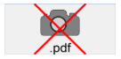

## Formatos Nativos Suportados

4D integra a gestão nativa dos formatos de imagem. Isso significa que imagens serão mostradas e armazenadas em seu formato original, sem qualquer interpretação em 4D. As funcionalidades específicas dos formatos diferentes (sombreado, áreas transparentes, etc) serão retidas quando forem copiadas e coladas, e serão exibidas sem alteração. Essa compatibilidade nativa é válida para todas as imagens armazenadas nos formulários de 4D: [imagens estáticas](FormObjects/staticPicture.md) coladas no modo Desenho, imagens coladas em [objetos de entrada](FormObjects/input_overview.md) em execução, etc.

The most common picture formats are supported of both platforms: .jpeg, .gif, .png, .tiff, .bmp, etc. On macOS, the .pdf format is also available for encoding and decoding. Em macOS, o formato pdf também está disponível para codificar e decodificar.

> A lista completa dos formatos suportados varia de acordo com o sistema operativo e os codecs personalizados que são instalados nas máquinas. Para descobrir quais os codecs disponíveis, deve utilizar o comando `PICTURE CODEC LIST` (ver também a descrição do [tipo de dados imagem](Concepts/dt_picture.md)).

### Formato de imagem não disponível

Um ícone específico é exibido para imagens salvas em um formato que não esteja disponível no mecanismo. A extensão do formato faltante é mostrado na parte inferior do ícone:

O ícone é usado automaticamente onde a imagem precisar ser exibida:

O ícone indica que a imagem não pode ser exibida ou manipulada localmente - mas pode ser salva sem alteração para que possa ser exibida em outros dispositivos. Por exemplo esse é o caso para imagens PDF em Windows ou para imagens no formato PICT.

## Mouse Coordinates in a Picture

4D permite recuperar as coordenadas locais do mouse em um [objeto de entrada](FormObjects/input_overview.md) associado a uma [expressão de imagem](FormObjects/properties_Object.md#expression-type), no caso de que clique ou passe o cursor por cima, mesmo se não tiver aplicado um deslocamento ou zoom na imagem. Esse mecanismo, similar ao de um mapa de imagens, pode ser utilizado, por exemplo, para manejar barras de botões deslocáveis ou a interface de um software de cartografia.

As coordenadas são devolvidas nas [Variáveis de Sistema](https://doc.4d.com/4Dv18/4D/18/System-Variables.300-4505547.en.html). *MouseX* e*MouseY*. The coordinates are expressed in pixels with respect to the top left corner of the picture (0,0). Se o mouse estiver fora do sistema de coordenadas da imagem, se devolverá -1 em *MouseX* e *MouseY*.

You can get the value of these variables as part of the `On Clicked`, `On Double Clicked`, `On Mouse up`, `On Mouse Enter`, or `On Mouse Move` form events.
