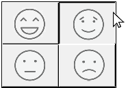

## Visão Geral

Uma grelha de botões é um objecto transparente colocado em cima de um gráfico. O gráfico deve representar um array linha por coluna. Quando um dos gráficos é clicado, terá uma aparência afundada ou prensada:

É possível utilizar um objeto de grelha de botões para determinar onde o usuário clica no gráfico. O método objeto utilizaria o evento `On Clicked` e tomaria as medidas adequadas em função da localização do clique.

## Criando grades de botões

To create the button grid, add a background graphic to the form and place a button grid on top of it. Specify the number of [rows](properties_Crop.md#rows) and [columns](properties_Crop.md#columns).

Em 4D, uma grelha de botões é utilizada como uma paleta de cores:

## Usar grades de botões

The buttons on the grid are numbered from top left to bottom right. In the above example, the grid is 16 columns across by 16 rows down. O botão na posição superior-esquerda retorna 1 quando clicado. If the red button at the far right of the second row is selected, the button grid returns 32. Se nenhum elemento for seleccionado, o valor é 0

### Ir para página

You can assign the `gotoPage` [standard action](https://doc.4d.com/4Dv17R5/4D/17-R5/Standard-actions.300-4163633.en.html) to a button grid. When this action is selected, 4D will automatically display the page of the form that corresponds to the number of the button that is selected in the button grid. For example, if the user selects the tenth button of the grid, 4D will display the tenth page of the current form (if it exists).

## Propriedades compatíveis

[Border Line Style](properties_BackgroundAndBorder.md#border-line-style) - [Bottom](properties_CoordinatesAndSizing.md#bottom) - [Class](properties_Object.md#css-class) - [Columns](properties_Crop.md#columns) - [Droppable](properties_Action.md#droppable) - [Height](properties_CoordinatesAndSizing.md#height) - [Help Tip](properties_Help.md#help-tip) - [Horizontal Sizing](properties_ResizingOptions.md#horizontal-sizing) - [Left](properties_CoordinatesAndSizing.md#left) - [Object Name](properties_Object.md#object-name) - [Right](properties_CoordinatesAndSizing.md#right) - [Rows](properties_Crop.md#rows) - [Standard action](properties_Action.md#standard-action) - [Top](properties_CoordinatesAndSizing.md#top) - [Type](properties_Object.md#type) - [Variable or Expression](properties_Object.md#variable-or-expression) - [Vertical Sizing](properties_ResizingOptions.md#vertical-sizing) - [Width](properties_CoordinatesAndSizing.md#width) - [Visibility](properties_Display.md#visibility)
