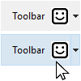
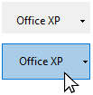

Um botão é um objeto ativo ao qual pode ser atribuída uma ação (*por exemplo*, uma tarefa de banco de dados ou uma função de interface) a executar quando um usuário clica nele.


Buttons can fulfill a variety of roles, depending on their style and the action assigned to it. For example, buttons could lead a user through a questionnaire or form to complete, or to make choices. Depending on its settings, a button may be designed to be clicked only once and execute a command, while others may require the user to click more than once to receive the desired result.

## Manipulação de botões

As ações atribuídas aos botões podem se originar de [ações padrão](properties_Action.md#standard-action) predefinidas ou de métodos objeto personalizados. Examples of typical actions include letting the user accept, cancel, or delete records, copy or paste data, move from page to page in a multi-page form, open, delete, or add records in a subform, handle font attributes in text areas, etc.

Buttons with standard actions are dimmed when appropriate during form execution. For example, if the first record of a table is displayed, a button with the `firstRecord` standard action would appear dimmed.

If you want a button to perform an action that's not available as a standard action, leave the standard action field empty and write an object method to specify the button’s action. Para obter mais informações sobre métodos de objeto e como criá-los e associá-los, consulte [Usando métodos objeto](https://doc.4d.com/4Dv17R5/4D/17-R5/Using-object-methods.300-4163733.en.html). Normally, you would activate the `On Clicked` event and the method would run only when the button is clicked. Pode associar um método a qualquer botão.

The [variable](properties_Object.md#variable-or-expression) associated with a button is automatically set to **0** when the form is executed for the first time in Design or Application mode. When the user clicks a button, its variable is set to **1**.

> A um botão pode ser atribuída uma ação padrão e um método. In this case, if the button is not disabled by the standard action, the method is executed before the standard action.

## Estilos de botões

Os estilos dos botões controlam a aparência geral de um botão, bem como as suas propriedades disponíveis. É possível aplicar diferentes estilos pré-definidos a botões ou associar-lhes menus pop-up. Um grande número de variações podem ser obtidas combinando essas propriedades/comportamentos.

Com excepção do [propriedades disponíveis](#supported-properties), muitos objectos de botão são *estruturalmente* idênticos. A diferença é no processamento das variáveis associadas.

4D fornece botões nos seguintes estilos pré-definidos:

### Clássico

The Regular button style is a standard system button (*i.e.*, a rectangle with a descriptive label) which executes code when a user clicks on it.


By default, the Regular style has a light gray background with a label in the center. When the cursor hovers over the Regular button style, the border and background color change to demonstrate that it has the focus. In addition to initiating code execution, the Regular button style mimics a mechanical button by quickly changing background color when being clicked.

#### JSON Exemplo

```4d
 "myButton": {
  "type": "button", //define the type of object
  "style":"regular", //define the style of the button
  "defaultButton":"true" //define button as the default choice
  "text": "OK", //text to appear on the button
  "action": "Cancel", //action to be be performed
  "left": 60,  //left position on the form  
  "top": 160, //top position on the form
    "width": 100,  //width of the button
  "height": 20 //height of the button
  }
```

Only the Regular and Flat styles offer the [Default Button](properties_Appearance.md#default-button) property.

### Plano

The Flat button style is a standard system button (*i.e.*, a rectangle with a descriptive label) which executes code when a user clicks on it.


By default, the Flat style has a white background with a label in the center, rounded corners, and a minimalist appearance. The Flat button style's graphic nature is particularly useful for forms that will be printed.

#### JSON Exemplo

```4d

 "myButton": {
                "type": "button",
                "style":"flat",
                "defaultButton":"true"
                "text": "OK",
                "action": "Cancel",
                "left": 60,   
                "top": 160,   
                "width": 100,
                "height": 20
                }
```

Only the Regular and Flat styles offer the [Default Button](properties_Appearance.md#default-button) property.

### Barra de ferramentas

The Toolbar button style is primarily intended for integration in a toolbar. It includes the option to add a pop-up menu (indicated by an inverted triangle) which is generally used to display additional choices for the user to select.

By default, the Toolbar style has a transparent background with a label in the center. A aparência do botão pode ser diferente quando o cursor passar por cima dele, dependendo do SO:

- *Windows* - the button is highlighted when it uses the “With Pop-up Menu” property, a triangle is displayed to the right and in the center of the button.



- *macOS* - o destaque do botão nunca aparece. When it uses the “With Pop-up Menu” property, a triangle is displayed to the right and at the bottom of the button.

#### JSON Exemplo

```4d
 "myButton": {
                "type": "button",
                "style":"toolbar",
                "text": "OK",  
                "popupPlacement":"separated"
                "action": "Cancel",  
                "left": 60,    
                "top": 160,    
                "width": 100,   
                "height": 20  
                }
```

### Bevel

The Bevel button style combines the appearance of the [Regular](#regular) (*i.e.*, a rectangle with a descriptive label) style with the [Toolbar](#toolbar) style's pop-up menu property option.

By default, the Bevel style has a light gray background with a label in the center. A aparência do botão pode ser diferente quando o cursor passar por cima dele, dependendo do SO:

- *Windows* - o botão é realçado. When it uses the “With Pop-up Menu” property, a triangle is displayed to the right and in the center of the button.


- *macOS* - o destaque do botão nunca aparece. When it uses the “With Pop-up Menu” property, a triangle is displayed to the right and at the bottom of the button.

#### JSON Exemplo

```4d
 "myButton": {
                "type": "button",
                "style":"bevel",
                "text": "OK",  
                "popupPlacement":"linked"
                "action": "Cancel",
                "left": 60,  
                "top": 160,  
                "width": 100,
                "height": 20
                }
```

### Bevel arredondado

O estilo de botão Bevel arredondado é quase idêntico ao estilo [Bevel](#bevel), exceto que, dependendo do sistema operativo, as esquinas do botão podem ser arredondadas. As with the Bevel style, the Rounded Bevel style combines the appearance of the [Regular](#regular) style with the [Toolbar](#toolbar) style's pop-up menu property option.

By default, the Rounded Bevel style has a light gray background with a label in the center. A aparência do botão pode ser diferente quando o cursor passar por cima dele, dependendo do SO:

- *Windows* - o botão é idêntico ao estilo Bevel. When it uses the “With Pop-up Menu” property, a triangle is displayed to the right and in the center of the button.

  

- *macOS* - os cantos do botão são arredondados. When it uses the “With Pop-up Menu” property, a triangle is displayed to the right and at the bottom of the button.

#### JSON Exemplo

```4d
 "myButton": {
                "type": "button",
                "style":"roundedBevel",
                "text": "OK",
                "popupPlacement":"none" /
                "action": "Cancel",
                "left": 60,   
                "top": 160,
                "width": 100,
                "height": 20
                }
```

### OS X Gradient

The OS X Gradient button style is nearly identical to the [Bevel](#bevel) style except, depending on the OS, it may have a two-toned appearance. As with the Bevel style, the OS X Gradient style combines the appearance of the [Regular](#regular) style with the [Toolbar](#toolbar) style's pop-up menu property option.

By default, the OS X Gradient style has a light gray background with a label in the center. A aparência do botão pode ser diferente quando o cursor passar por cima dele, dependendo do SO:

- *Windows* - o botão é idêntico ao estilo Bevel. When it uses the “With Pop-up Menu” property, a triangle is displayed to the right and in the center of the button.


- *macOS* - the button is displayed as a two-tone system button. When it uses the “With Pop-up Menu” property, a triangle is displayed to the right and at the bottom of the button.

#### JSON Exemplo

```4d
 "myButton": {
                "type": "button",
                "style":"gradientBevel",
                "text": "OK",
                "popupPlacement":"linked"
                "action": "Cancel",  
                "left": 60,  
                "top": 160,
                "width": 100,
                "height": 20
                }
```

### OS X Texturizado

The OS X Textured button style is nearly identical to the [Bevel](#bevel) style except, depending on the OS, it may have a different appearance. As with the Bevel style, the OS X Textured style combines the appearance of the [Regular](#regular) style with the [Toolbar](#toolbar) style's pop-up menu property option.

Como padrão, o estilo OS X Textured aparece como:

- *Windows* - a standard system button with a light gray background with a label in the center. Tem a particularidade de ser transparente no Vista.

 

- *macOS* - - um botão sistema padrão que mostra uma mudança de cor cinza claro a cinza escuro. Sua altura está predefinida: não é possível ampliar ou reduzir.

#### JSON Exemplo

```4d
 "myButton": {
                "type": "button",
                "style":"texturedBevel",
                "text": "OK",
                "popupPlacement":"separated"
                "action": "Cancel",
                "left": 60,   
                "top": 160,  
                "width": 100,
                "height": 20
                }
```

### Office XP

The Office XP button style combines the appearance of the [Regular](#regular) style with the [Toolbar](#toolbar) style's transparency and pop-up menu property option.

As cores (ressaltado e fundo) de um botão com o estilo Office XP são baseadas nos sistemas de cores. A aparência do botão pode ser diferente quando o cursor passar por cima dele, dependendo do SO:

- *Windows* - seu fundo só aparece quando o mouse passa por cima.



- *macOS* - seu fundo é sempre mostrado.

#### JSON Exemplo

```4d
 "myButton": {
                "type": "button",
                "style":"office",
                "text": "OK",
                "popupPlacement":"none"
                "action": "Cancel",
                "left": 60,  
                "top": 160,
                "width": 100,
                "height": 20
                }
```

### Ajuda

The Help button style can be used to display a standard system help button. By default, the Help style is displayed as a question mark within a circle.


#### JSON Exemplo

```4d
 "myButton": {
                "type": "button",
                "style":"help",  
                "text": "OK",
                "dropping": "custom",
                "left": 60,
                "top": 160,  
                "width": 100,
                "height": 20
                }
```

> O estilo de ajuda não suporta as propriedades básicas[Número de estados](properties_TextAndPicture.md#number-of-states), [Caminho do nome de imagem](properties_TextAndPicture.md#picture-pathname) e [Título/Posição da imagem](properties_TextAndPicture.md#titlepicture-position).

### Círculo

O estilo de botão Círculo aparece como um botão sistema redondo. Este estilo de botão foi concebido para macOS.


On Windows, it is identical to the “None” style (the circle in the background is not taken into account).

#### JSON Exemplo

```
 "myButton": {
                "type": "button",
                "style":"circular",
                "text": "OK",
                "dropping": "custom",
                "left": 60,
                "top": 160,  
                "width": 100,
                "height": 20
                }
```

### Personalizado

The Custom button style accepts a personalized background picture and allows managing additional parameters such as icon and margin offset.


#### JSON Exemplo

```code
 "myButton": {
                "type": "button",
                "style":"custom",
                "text": "",
                "customBackgroundPicture": "/RESOURCES/bkgnd.png",
                "icon": "/RESOURCES/custom.png",  
                "textPlacement": "center",
                "left": 60,
                "top": 160,  
                "width": 100,
                "height": 20
                }
```

## Propriedades compatíveis

Todos os botões partilham o mesmo conjunto de propriedades básicas:

[Negrito](properties_Text.md#bold) - [Estilo da linha de borda](properties_BackgroundAndBorder.md#border-line-style) - [Parte inferior](properties_CoordinatesAndSizing.md#bottom) - [Estilo do botão](properties_TextAndPicture.md#button-style) - [Classe](properties_Object.md#css-class) - [Descartável](properties_Action.md#droppable) - [Focalizável](properties_Entry.md#focusable) - [Fonte](properties_Text.md#font) - [Cor da fonte](properties_Text.md#font-color) - [Tamanho da fonte](properties_Text.md#font-size) - [Altura](properties_CoordinatesAndSizing.md#height) - [Dica de ajuda](properties_Help.md#help-tip) - [Dimensionamento horizontal](properties_ResizingOptions.md#horizontal-sizing) - [Itálico](properties_Text.md#italic) - [Esquerda](properties_CoordinatesAndSizing.md#left) - [Não renderizado](properties_Display.md#not-rendered) - [Número de estados](properties_TextAndPicture.md#number-of-states)(1) - [Nome do objeto](properties_Object.md#object-name) - [Nome do caminho da imagem](properties_TextAndPicture.md#picture-pathname)(1) - [Direita](properties_CoordinatesAndSizing.md#right) - [Atalho](properties_Entry.md#shortcut) - [Ação padrão](properties_Action.md#standard-action) - [Título](properties_Object.md#title) - [Posição do título/imagem](properties_TextAndPicture.md#titlepicture-position)(1) - [Parte superior](properties_CoordinatesAndSizing.md#top) - [Tipo](properties_Object.md#type) - [Sublinhado](properties_Text.md#underline) - [Variável ou expressão](properties_Object.md#variable-or-expression) - [Dimensionamento vertical](properties_ResizingOptions.md#vertical-sizing) - [Visibilidade](properties_Display.md#visibility) - [Largura](properties_CoordinatesAndSizing.md#width)

> (1) Não suportado pelo estilo [Ajuda](#help).

Propriedades específicas adicionais estão disponíveis, dependendo do [estilo botão](#button-styles):

- [Background pathname](properties_TextAndPicture.md#background-pathname) - [Horizontal Margin](properties_TextAndPicture.md#horizontal-margin) - [Icon Offset](properties_TextAndPicture.md#icon-offset) - [Vertical Margin](properties_TextAndPicture.md#vertical-margin) (Custom)
- [Botão padrão](properties_Appearance.md#default-button) (plano, regular)
- [Title/Picture Position](properties_TextAndPicture.md#titlepicture-position) - [With pop-up menu](properties_TextAndPicture.md#with-pop-up-menu) (Toolbar, Bevel, Rounded Bevel, OS X Gradient, OS X Textured, Office XP, Circle, Custom)
