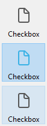
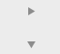

## Visão Geral

Uma caixa de seleção é um tipo de botão usado para introduzir ou exibir dados binários (verdadeiro-falso). Basicamente, está marcada ou desmarcada, mas pode ser definido um terceiro estado (ver abaixo).


As caixas de seleção são controladas por métodos. Como todos os botões, uma variável da caixa de seleção é estabelecida em 0 quando o formulário é aberto pela primeira vez. O método associado com ela é executado quando selecionar a caixa de seleção.

Uma caixa de seleção mostra o teto do lado de um pequeno quadrado. Este texto é estabelecido na propriedade [Title](properties_Object.md#title) da caixa de seleção. Pode entrar um título no formulário de uma referência XLIFF nessa área (ver [Anexo B: XLIFF arquitetura](https://doc.4d.com/4Dv17R5/4D/17-R5/Appendix-B-XLIFF-architecture.300-4163748.en.html)).

## Utilizar caixas de seleção

Uma caixa de seleção pode ser associada a uma [variável ou expressão](properties_Object.md#variable-or-expression) de tipo inteiro ou booleano.

- **inteiro:** se a caixa for selecionada, a variável tem o valor 1. Quando não for marcado, tem o valor 0. Se a caixa de seleção estiver no terceiro estado (ver abaixo), tem o valor 2.
- **booleano:** se a caixa for marcada, a variável tem o valor `True`. Quando não for marcado, tem o valor `False`.

Uma parte ou todas as caixas de seleção de um formulário podem estar marcadas ou desmarcadas. As caixas de seleção múltiplas permitem ao usuário selecionar várias opções.

### Caixas de seleção de três estados

Os objetos de caixa de verificação com o estilo [Clássico](checkbox_overview.md#regular) e [Plano](checkbox_overview.md#flat) aceitam um terceiro estado. Este terceiro estado é um estado intermediário, que geralmente se usa para fins de visualização. Por exemplo, permite indicar que uma propriedade é presentada em uma seleção de objetos,


Para ativar este terceiro estado, deve selecionar a propriedade [Três estados](properties_Display.md#three-states).

Essa propriedade só está disponível para caixas de seleção regulares e planas associadas a [variáveis ou expressões](properties_Object.md#variable-or-expression) — as caixas de seleção de expressões booleanas não podem usar a propriedade [Três Estados](properties_Display.md#three-states)  (uma expressão Booleana não pode estar em um estado intermediário).

A variável associada à caixa de seleção devolve o valor 2 quando a caixa estiver no terceiro estado.
> In entry mode, the Three-States check boxes display each state sequentially, in the following order: unchecked / checked / intermediary / unchecked, etc. No modo de entrada, as caixas de seleção dos três estados mostram cada estado de forma sequencial na ordem abaixo: sem marcar/marcado/intermediário/sem marcar, etc. O estado intermediário não é geralmente muito útil no modo entrada; no código, simplesmente force o valor da variável para 0 quando tomar o valor de 2 para passar diretamente de um estado marcado para o estado desmarcado.

## Usar uma ação padrão

Pode atribuir uma [ação padrão](properties_Action.md#standard-action) a uma caixa de seleção para manejar os atributos das áreas de texto. Por exemplo, se atribuir a ação padrão `fontBold`, em execução a caixa de seleção gerenciará o atributo "negrito" do texxto selecionado na área atual.

Só as ações que podem representar um estado verdadeiro/falso (ações "marcáveis") são compatíveis com esse objeto:

| Ações suportadas                    | Condições de uso (se houver) |
| ----------------------------------- | ---------------------------- |
| avoidPageBreakInsideEnabled         | Apenas áreas 4D Write Pro    |
| fontItalic                          |                              |
| fontBold                            |                              |
| fontLinethrough                     |                              |
| fontSubscript                       | Apenas áreas 4D Write Pro    |
| fontSuperscript                     | Apenas áreas 4D Write Pro    |
| fontUnderline                       |                              |
| font/showDialog                     | Só em Mac                    |
| htmlWYSIWIGEnabled                  | Apenas áreas 4D Write Pro    |
| section/differentFirstPage          | Apenas áreas 4D Write Pro    |
| section/differentLeftRightPages     | Apenas áreas 4D Write Pro    |
| spell/autoCorrectionEnabled         |                              |
| spell/autoDashSubstitutionsEnabled  | Só em Mac                    |
| spell/autoLanguageEnabled           | Só em Mac                    |
| spell/autoQuoteSubstitutionsEnabled | Só em Mac                    |
| spell/autoSubstitutionsEnabled      |                              |
| spell/enabled                       |                              |
| spell/grammarEnabled                | Só em Mac                    |
| spell/showDialog                    | Só em Mac                    |
| spell/visibleSubstitutions          |                              |
| visibleBackground                   | Apenas áreas 4D Write Pro    |
| visibleFooters                      | Apenas áreas 4D Write Pro    |
| visibleHeaders                      | Apenas áreas 4D Write Pro    |
| visibleHiddenChars                  | Apenas áreas 4D Write Pro    |
| visibleHorizontalRuler              | Apenas áreas 4D Write Pro    |
| visiblePageFrames                   | Apenas áreas 4D Write Pro    |
| visibleReferences                   |                              |
| widowAndOrphanControlEnabled        | Apenas áreas 4D Write Pro    |

Para informações detalhas dessas ações, veja a seção [Ações padrão](https://doc.4d.com/4Dv17R5/4D/17-R5/Standard-actions.300-4163633.en.html).

## Estilos de botão caixas de seleção

Os estilos de caixa de verificação controlam o aspeto geral de uma caixa de verificação, bem como as suas propriedades disponíveis. É possível aplicar diferentes estilos pré-definidos para caixas de seleção. Um grande número de variações podem ser obtidas combinando essas propriedades/comportamentos.

Com exceção das [propriedades disponíveis](#supported-properties), muitos objetos caixa de seleção são *estruturalmente* idênticos. A diferença é no processamento das variáveis associadas.

4D oferece caixas de seleção nos seguintes estilos predefinidos:

### Clássico

O estilo de caixa de verificação Regular é uma caixa de verificação padrão do sistema (*ou seja*, um retângulo com um título descritivo):


#### JSON Exemplo

```
 "myCheckBox": {
  "type": "checkbox",
  "style":"regular",
  "text": "Cancel",
  "action": "Cancel",  
  "left": 60,   
  "top": 160,  
  "width": 100,   
  "height": 20  
  "dataSourceTypeHint":"boolean"
  }
```

### Plano

O estilo de caixa de verificação Plano tem um aspeto minimalista. A natureza gráfica do estilo Flat é especialmente útil para os formulários que vão ser impressos.


#### JSON Exemplo

```
 "myCheckBox": {
   "type": "checkbox",
   "style":"flat",
   "text": "Cancel",
   "action": "cancel",
   "left": 60,  
    "top": 160,
    "width": 100,   
   "height": 20   
   }
```

### Botão barra de ferramentas {#toolbar-button}

O estilo da caixa de verificação do botão da barra de ferramentas destina-se principalmente à integração numa barra de ferramentas.

O estilo da barra de ferramentas tem um fundo transparente com um título. Está geralmente associado com uma [imagem de 4 estados](properties_TextAndPicture.md#number-of-states).

Exemplo com estados selecionado/ não selecionado/ ressaltado:



#### JSON Exemplo

```
 "myCheckBox": {
                "type": "checkbox",
                "style":"toolbar",
                "text": "Checkbox",
    "icon": "/RESOURCES/File.png",
    "iconFrames": 4
                "left": 60,
                "top": 160,
                "width": 100,     
                "height": 20     
                }
```

### Bevel

The Bevel check box style combines the appearance of the [Regular](#regular) (*i.e.*, a rectangle with a descriptive title) style with the [Toolbar](#toolbar-button) style's behavior.

O estilo Bevel tem um fundo cinza-claro com um título. Está geralmente associado com uma [imagem de 4 estados](properties_TextAndPicture.md#number-of-states).

Exemplo com estados selecionado/ não selecionado/ ressaltado:


#### JSON Exemplo

```
 "myCheckBox": {
                "type": "checkbox",
                "style":"bevel",
                "text": "Checkbox",  
     "icon": "/RESOURCES/File.png",
    "iconFrames": 4
               "left": 60,
                "top": 160,
                "width": 100,    
                "height": 20    
                }
```

### Bevel arredondado

The Rounded Bevel check box style is nearly identical to the [Bevel](#bevel) style except, depending on the OS, the corners of the button may be rounded. As with the Bevel style, the Rounded Bevel style combines the appearance of the [Regular](#regular) style with the [Toolbar](#toolbar-button) style's behavior.

O estilo Bevel arredondado tem um fundo cinza claro com um título. Está geralmente associado com uma [imagem de 4 estados](properties_TextAndPicture.md#number-of-states).

Exemplo em macOS:

  

> on Windows, the Rounded Bevel style is identical to the [Bevel](#bevel) style.

#### JSON Exemplo

```4d
 "myCheckBox": {
                "type": "checkbox",
                "style":"roundedBevel",  
                "text": "Checkbox",
     "icon": "/RESOURCES/File.png",
    "iconFrames": 4
                "left": 60,
                "top": 160,
                "width": 100,   
                "height": 20   
                }
```

### OS X Gradient

The OS X Gradient check box style is nearly identical to the [Bevel](#bevel) style except, depending on the OS, it may have a two-toned appearance. As with the Bevel style, the OS X Gradient style combines the appearance of the [Regular](#regular) style with the [Toolbar](#toolbar-button) style's behavior.

The OS X Gradient style has a light gray background with a title and is displayed as a two-tone system button on macOS. Está geralmente associado com uma [imagem de 4 estados](properties_TextAndPicture.md#number-of-states).

  

> No Windows, esse estilo é idêntico ao estilo [Bevel](#bevel).

#### JSON Exemplo

```
 "myCheckBox": {
   "type": "checkbox",
   "style":"gradientBevel",
   "text": "Checkbox",
   "icon": "/RESOURCES/File.png",
   "iconFrames": 4
   "left": 60,  
   "top": 160,  
   "width": 100,    
   "height": 20    
           }
```

### OS X Texturizado

The OS X Textured checkbox style is similar to the [Bevel](#bevel) style except, depending on the OS, it may have a different appearance. As with the Bevel style, the OS X Textured style combines the appearance of the [Regular](#regular) style with the [Toolbar](#toolbar-button) style's behavior.

Como padrão, o estilo OS X Textured aparece como:

- *Windows* - um botão padrão com um fundo azul claro com um título no centro.

  

- *macOS* - - um botão sistema padrão que mostra uma mudança de cor cinza claro a cinza escuro. Sua altura está predefinida: não é possível ampliar ou reduzir.

  

#### JSON Exemplo

```
 "myCheckBox": {
   "type": "checkbox",
   "style":"texturedBevel",
   "text": "Checkbox",
   "left": 60,
   "top": 160,
   "width": 100,     
   "height": 20     
   }
```

### Office XP

The Office XP check box style combines the appearance of the [Regular](#regular) style with the [Toolbar](#toolbar-button) style's behavior.

As cores (ressaltado e fundo) de um botão com o estilo Office XP são baseadas nos sistemas de cores. A aparência do botão pode ser diferente quando o cursor passar por cima dele, dependendo do SO:

- *Windows* - seu fundo só aparece quando o mouse passa por cima. Exemplo com estados selecionado/ não selecionado/ ressaltado:

  

- *macOS* - seu fundo é sempre mostrado. Exemplos com estados desmarcado/ marcado:

  

#### JSON Exemplo

```
 "myCheckBox": {
                "type": "checkbox",
                "style":"office",
                "text": "Checkbox",  
                "action": "fontBold",
     "icon": "/RESOURCES/File.png",
    "iconFrames": 4  
               "left": 60,
                "top": 160,  
                "width": 100,   
                "height": 20   
                }
```

### Contrair/expandir

Este estilo de caixa de seleção pode ser usado para adicionar um ícone padrão de contrair/expandir. Esses botões são usados nativamente em listas hierárquicas.

- *Windows* - o botão se parece com um [+] ou um [-]

  

- *macOS* - parece com um triângulo apontando para cima ou para baixo.

  

#### JSON Exemplo

```
 "myCheckBox": {
                "type": "checkbox",
                "style":"disclosure",
    "method": "m_collapse",
    "left": 60,
                "top": 160,
                "width": 100,   
                "height": 20   
                }
```

### Botão de divulgação

In macOS and Windows, a check box with the "Disclosure" style appears as a standard disclosure button, usually used to show/hide additional information. Quando usar um botão radio, o símbolo botão aponta para baixo com o valor 0 e para cima com o valor 1.

- *Windows*

 

- *macOS*

 

#### JSON Exemplo

```
 "myCheckBox": {
                "type": "checkbox",  
                "style":"roundedDisclosure",
    "method": "m_disclose",
                "left": 60,  
                "top": 160,
                "width": 100,   
                "height": 20   
                }
```

### Personalizado

The Custom check box style accepts a personalized background picture and allows managing specific properties:

- [Rota de acesso ao Fundo](properties_TextAndPicture.md#background-pathname)
- [Offset do ícone](properties_TextAndPicture.md#icon-offset)
- [Horizontal Margin](properties_TextAndPicture.md#horizontal-margin) and [Vertical Margin](properties_TextAndPicture.md#vertical-margin)

It is usually associated with a [4-state picture](properties_TextAndPicture.md#number-of-states), that can be used in conjunction with a [4-state](properties_TextAndPicture.md#number-of-states) [background picture](properties_TextAndPicture.md#background-pathname).

#### JSON Exemplo

```
 "myCheckbox": {
  "type": "checkbox",
  "style":"custom",
  "text": "OK",
  "icon": "/RESOURCES/smiley.jpg",
  "iconFrame": 4,
  "customBackgroundPicture": "/RESOURCES/paper.jpg",
  "iconOffset": 5, //custom icon offset when clicked
  "left": 60,
  "top": 160,
  "width": 100,  
  "height": 20,
  "customBorderX": 20,
  "customBorderY": 5
  }
```

## Propriedades compatíveis

Todas as caixas de seleção partilhar o mesmo conjunto de propriedades básicas:

[Negrito](properties_Text.md#bold) - [Parte inferior](properties_CoordinatesAndSizing.md#bottom) - [Estilo do botão](properties_TextAndPicture.md#button-style) - [Classe](properties_Object.md#css-class) - [Foco](properties_Entry.md#focusable) - [Fonte](properties_Text.md#font) - [Cor da fonte](properties_Text.md#font-color) - [Tamanho da fonte](properties_Text.md#font-size) - [Altura](properties_CoordinatesAndSizing.md#height) - [Dica de ajuda](properties_Help.md#help-tip) - [Dimensionamento horizontal](properties_ResizingOptions.md#horizontal-sizing) - [Itálico](properties_Text.md#italic) - [Esquerda](properties_CoordinatesAndSizing.md#left) - [Nome do objeto](properties_Object.md#object-name) - [Direita](properties_CoordinatesAndSizing.md#right) - [Atalho](properties_Entry.md#shortcut) - [Ação padrão](properties_Action.md#standard-action) - [Título](properties_Object.md#title) - [Parte superior](properties_CoordinatesAndSizing.md#top) - [Tipo](properties_Object.md#type) - [Sublinhado](properties_Text.md#underline) - [Variável ou expressão](properties_Object.md#variable-or-expression) - [Dimensionamento vertical](properties_ResizingOptions.md#vertical-sizing) - [Visibilidade](properties_Display.md#visibility) - [Largura](properties_CoordinatesAndSizing.md#width)

Propriedades específicas adicionais estão disponíveis, dependendo do [estilo botão](#check-box-button-styles):

- [Background pathname](properties_TextAndPicture.md#background-pathname) - [Horizontal Margin](properties_TextAndPicture.md#horizontal-margin) - [Icon Offset](properties_TextAndPicture.md#icon-offset) - [Vertical Margin](properties_TextAndPicture.md#vertical-margin) (Custom)
- [Três estados](properties_Display.md#three-states) (plano, clássico)
- [Número de estados](properties_TextAndPicture.md#number-of-states) - [Caminho da imagem](properties_TextAndPicture.md#picture-pathname) - [Título/posição da imagem](properties_TextAndPicture.md#titlepicture-position) (Botão da barra de ferramentas, Bevel, Rounded Bevel, Gradiente X, OS X Textured, Office XP, Personalizado)
