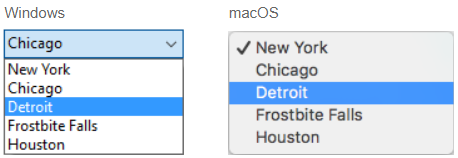

## Visão Geral

Drop-down lists are objects that allow the user to select from a list. You manage the items displayed in the drop-down list using an array, a choice list, or a standard action.

Em macOS, listas drop down são também chamadas de "menu pop up" Ambos os nomes referem aos mesmos objetos. Ambos os nomes referem aos mesmos objetos. Como no exemplo abaixo, a aparência desses objetos podem diferenciar levemente de acordo com a plataforma:



## Usar um array

Um [array](Concepts/arrays.md) é uma lista de valores na memória que são referenciados pelo nome do array. A drop-down list displays an array as a list of values when you click on it.

Drop-down list objects are initialized by loading a list of values into an array. You can do this in several ways:

* Enter a list of default values in the object properties by selecting `"\&#060;Static List&#062;"` in the [Data Source](properties_DataSource.md) theme of the Property List. Os valores padrão são carregados em um array automático. Pode fazer uma referência ao array usando o nome da variável associado com o objeto.

* Antes que o objeto seja exibido, execute um código que atribua valores aos elementos do array. Por exemplo:

```4d
  ARRAY TEXT($aCities;6)
  $aCities{1}:="Philadelphia"
  $aCities{2}:="Pittsburg"
  $aCities{3}:="Grand Blanc"
  $aCities{4}:="Bad Axe"
  $aCities{5}:="Frostbite Falls"
  $aCities{6}:="Green Bay"
```

Neste caso, o nome da variável associada ao objeto de formulário deve ser *$aCities*. Esse código pode ser colocado no método formulário e executado quando o evento de formulário `On Load` acontecer.

* Before the object is displayed, load the values of a list into the array using the [LIST TO ARRAY](https://doc.4d.com/4Dv17R5/4D/17-R5/LIST-TO-ARRAY.301-4127385.en.html) command. Por exemplo:

```4d
   LIST TO ARRAY("Cities";$aCities)
```

 Neste caso também o nome da variável asociada al objeto del formulario debe ser *$aCities*. Este código pode ser executado ao invés das sentenças de atribuição mostradas anteriormente.

Se precisar salvar as escolhas do usuário em um campo, precisa usar uma declaração de atribuição que rode depois que o registro seja aceito. O código poderia ser assim:

```4d
  Caso de
    :(Form event=On Load)
       LIST TO ARRAY("Cities";aCities)
       If(Record number([People])<0) `novo registo
          aCities:=3 `apresentar um valor predefinido
       Else `registo existente, apresentar valor armazenado
          aCities:=Find in array(aCities;City)
       End if
    :(Form event=On Clicked) `o utilizador modificou a selecção
       City:=aCities{aCities} `o campo recebe um novo valor
    :(Form event=On Validate)
       City:=aCities{aCities}
    :(Form event=On Unload)
       CLEAR VARIABLE(aCities)
 End case
```

You must select each [event] that you test for in your Case statement. Os arrays sempre contém um número finito de elementos. A lista de elementos é dinâmica e pode ser modificada por um método. Itens em um array podem ser modificados, ordenados e terem itens adicionados.

## Utilizar uma lista de seleção

If you want to use a drop-down list to manage the values of a listed field or variable, 4D lets you reference the field or variable directly as the object's data source. Isso facilita gerenciar variáveis/campos listados.
> Se usar uma lista hierárquica, só o primeiro nível é mostrado e pode ser selecionado.

For example, in the case of a "Color" field that can only contain the values "White", "Blue", "Green" or "Red", it is now possible to create a list containing these values and associate it with a pop-up menu object that references the 4D "Color" field. 4D então se encarrega automaticamente de gerenciar o input e exibir os valores atuais no formulário.

To associate a pop-up menu/drop-down list or a combo box with a field or variable, you can just enter the name of the field or variable directly in the [Variable or Expression](properties_Object.md#variable-or-expression) of the object in the Property List.

When the form is executed, 4D automatically manages the pop-up menu or combo box during input or display: when a user chooses a value, it is saved in the field; this field value is shown in the pop-up menu when the form is displayed:


> It is not possible to combine this principle with using an array to initialize the object. If you enter a field name in the Variable Name area, then you must use a choice list.

### Salvar como

When you have associated a pop-up menu/drop-down list with a choice list and with a field, you can use the [Save as Value/Reference property](properties_DataSource.md#save-as). Essa opção permite otimizar o tamanho dos dados salvos.

## Usar uma ação padrão

You can assign a standard action to a pop-up menu/drop-down list ([Action](properties_Action.md#standard-action) theme of the Property List). Only actions that display a sublist of items (except the goto page action) are supported by this object. For example, if you select the `backgroundColor` standard action, at runtime the object will display an automatic list of background colors. You can can override this automatic list by assigning in addition a choice list in which each item has been assigned a custom standard action.

For more information, please refer to the [Standard actions](https://doc.4d.com/4Dv17R5/4D/17-R5/Standard-actions.300-4163633.en.html) section.

## Propriedades compatíveis

[Alpha Format](properties_Display.md#alpha-format) - [Bold](properties_Text.md#bold) - [Bottom](properties_CoordinatesAndSizing.md#bottom) - [Button Style](properties_TextAndPicture.md#button-style) - [Choice List](properties_DataSource.md#choice-list) - [Class](properties_Object.md#css-class) - [Date Format](properties_Display.md#date-format) - [Expression Type](properties_Object.md#expression-type) - [Focusable](properties_Entry.md#focusable) - [Font](properties_Text.md#font) - [Font Color](properties_Text.md#font-color) - [Font Size](properties_Text.md#font-size) - [Height](properties_CoordinatesAndSizing.md#height) - [Help Tip](properties_Help.md#help-tip) - [Horizontal Sizing](properties_ResizingOptions.md#horizontal-sizing) - [Italic](properties_Text.md#italic) - [Left](properties_CoordinatesAndSizing.md#left) - [Not rendered](properties_Display.md#not-rendered) - [Object Name](properties_Object.md#object-name) - [Right](properties_CoordinatesAndSizing.md#right) - [Standard action](properties_Action.md#standard-action) - [Save as](properties_DataSource.md#save-as) - [Time Format](properties_Display.md#time-format) - [Top](properties_CoordinatesAndSizing.md#top) - [Type](properties_Object.md#type) - [Underline](properties_Text.md#underline) - [Variable or Expression](properties_Object.md#variable-or-expression) - [Vertical Sizing](properties_ResizingOptions.md#vertical-sizing) - [Visibility](properties_Display.md#visibility) - [Width](properties_CoordinatesAndSizing.md#width)  
