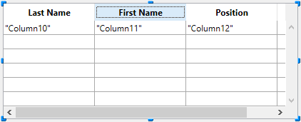
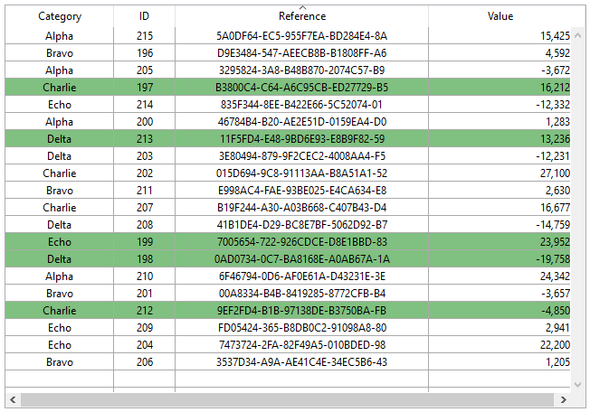
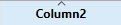
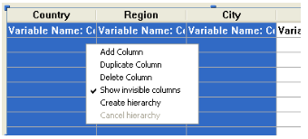
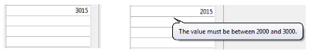
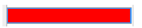

## Visão Geral

List boxes são objetos ativos complexos que permitem exibir e ingressar dados como colunas sincronizadas. Podem ser conectadas aos conteúdos de banco de dados como seleções de entidade e seleções de registro, ou para conteúdos de linguagem como coleções e arrays. They include advanced features regarding data entry, column sorting, event management, customized appearance, moving of columns, etc.


Uma list box contém uma ou mais colunas cujo conteúdos são automaticamente sincronizados. O número de colunas é teoricamente ilimitado (depende dos recursos da máquina).

### Funcionalidades de usuário básicas

Durante a execução, list boxes permitem exibir e ingressar dados como listas. Para tornar uma célula editável ([se a entrada for permitida para a coluna](#managing-entry)), simplesmente clique duas vezes no valor que contém:


Usuários podem ingressar e exibir o texto em várias linhas dentro de uma célula list box. Para adicionar uma quebra de linha pressione **Ctrl+Retorno de carro** em Windows ou **Opção+Retorno de Carro** em macOS.

Booleanos e imagens podem ser exibidos em células, assim como datas, horas ou números. É possível ordenar valores em colunas clicando em um cabeçalho ([ordenação padrão](#managing-sorts)). Todas as colunas são sincronizadas automaticamente.

Também é possível redimensionar cada coluna, e o usuário pode modificar a ordem das [colunas](properties_ListBox.md#locked-columns-and-static-columns) e [linhas](properties_Action.md#movable-rows) ao movê-las usando o mouse, se essa ação for autorizada. Note que a list boxes podem ser usadas em [modo hierarquico](#hierarchical-list-boxes).

O usuário pode selecionar um ou mais linhas usando os atalhos padrão: **Shift+clique** para uma seleção adjacente **Ctrl+clique** (Windows) ou **Comando+clique** (macOS) para uma seleção não adjacente.

### Partes de list box

Uma list box é composta de quatro partes diferentes:

* o objeto list box em sua globalidade
* colunas,
* cabeçalhos de coluna, e
* rodapés de colunas.


Cada parte tem seu próprio nome assim como propriedades específicas. Por exemplo, o número de colunas ou as cores alternativas de cada linha é estabelecida nas propriedades de objeto list box, a largura de cada coluna é estabelecida nas propriedades de colunas e a fonte do cabeçalho é estabelecida nas propriedades de cabeçalho.

É possível adicionar um método objeto para o objeto list box ou para cada coluna da list box. Métodos objetos são chamados na ordem abaixo:

1. Método objeto de cada coluna
2. Método objeto da list box

O método objeto coluna obtém eventos que ocorrem em seu  [cabeçalho](#list-box-headers) e [rodapé](#list-box-footers).

### Tipos de List box

Há vários tipos de list boxes com seus próprios comportamentos e propriedades específicos. O tipo list box depende das propriedades [Data Source property](properties_Object.md#data-source):

* **Arrays**: cada coluna é conectada a um array 4D. List boxes baseadas em array podem ser exibidas como [list boxes hierárquicas](listbox_overview.md#hierarchical-list-boxes).
* **Seleção** (**Seleção atual** ou **Seleções nomeadas**): cada coluna é conectada a uma expressão (por exemplo um campo) que é avaliado para cada registro da seleção.
* **Coleção ou seleção de entidade**: cada coluna é conectada a uma expressão que é avaliada para todo elemento da coleção ou toda entidade da seleção de entidade.
> > It is not possible to combine different list box types in the same list box object. A fonte de dados é estabelecida quando a list box é criada. Não é mais possível modificar por programação.

### Gerenciando list boxes

Pode configurar completamente um objeto list box através de suas propriedades e também pode gerenciar dinamicamente por programação.

A linguagem 4D inclui um tema dedicado "List Box" para comandos list box, mas comandos de vários outros temas, como comandos "Object properties" ou `EDIT ITEM`, `Displayed line number` podem ser usados. Veja a página [Sumário Comandos List Box](https://doc.4d.com/4Dv17R6/4D/17-R6/List-Box-Commands-Summary.300-4311159.en.html) em *Referência de Linguagem 4D* para mais informação.

## Objetos tipo list box

### List box de tipo array

Em um list box de tipo array, cada coluna deve estar associada a um array unidimensional 4D; podem ser utilizados todos os tipos de array, com exceção dos arrays de ponteiros. O número de linhas é baseado no número de elementos array.

Como padrão, 4D atribui o nome "ColumnX" para cada coluna. Pode mudar isso, assim como outras propriedades de coluna, nas [propriedades de coluna](listbox_overview.md#column-specific-properties). O formato de exibição para cada coluna também pode ser definido usando o comando `OBJECT SET FORMAT`
> List boxes tipo array podem ser exibidas em [modo hierárquico](listbox_overview.md#hierarchical-list-boxes), com mecanismos específicos.

Com list box de tipo array, o valor ingressado ou exibido são gerenciados usando a linguagem 4D. Também pode associar uma [lista de escolha](properties_DataSource.md#choice-list) com uma coluna para controlar entrada de dados.´ Os valores de coluna são gerenciados usando comandos de List box de alto nível (tais como `LISTBOX INSERT ROWS` ou `LISTBOX DELETE ROWS`) assim como comandos manipulação de array. Os valores de coluna são gerenciados usando comandos de List box de alto nível (tais como `LISTBOX INSERT ROWS` ou `LISTBOX DELETE ROWS`) assim como comandos manipulação de array. Por exemplo, para iniciar os conteúdos da coluna, pode usar a instrução abaixo:

```4d
ARRAY TEXT(varCol;size)
```

Também pode usar uma lista:

```4d
LIST TO ARRAY("ListName";varCol)
```
> **Aviso**: quando uma list box conter vários tamanhos diferentes de coluna, só o número de itens do menor array (coluna) será exibido. Tem que verificar que cada array tenha o mesmo número de elementos que os outros. Além disso, se uma coluna list box for vazia (isso ocorre quando o array associado não for corretamente declarado ou dimensionado usando a linguagem), a list box não exibe nada.

### List box de tipo seleção

Nesse tipo de list box, cada coluna pode ser associada com um campo (por exemplo `[Employees]LastName)` ou uma expressão. A expressão pode ser baseada em um ou mais campos (por exemplo), `[Employees]FirstName+" "[Employees]LastName`) ou simplesmente ser uma fórmula (por exemplo `String(Milisegundos)`). A expressão também pode ser um método de proejeto, uma variável ou um item array. Pode usar os comandos `LISTBOX SET COLUMN FORMULA` e `LISTBOX INSERT COLUMN FORMULA` para modificar colunas por programação.

Os conteúdos de cada linha são avaliados de acordo com a seleção de registros: **a seleção atual** de uma tablea ou uma **seleção nomeada**.

No caso de uma list box baseada na seleção atual de uma tablea, qualquer modificação feita do lado da database é refletida automaticamente na list box e vice versa. A seleção atual é portanto sempre a mesma em ambos os lugares.

### List boxes de coleção ou de seleção de entidade

Nesse tipo de list box, cada coluna deve ser associada a uma expressão. Os conteúdos de cada linha são então avaliados por elemento de coleção ou por entidade da seleção de entidade.

Cada elemento da coleção ou cada entidade está disponível como um objeto que pode ser acessada através do comando [This](https://doc.4d.com/4Dv17R6/4D/17-R6/This.301-4310806.en.html). Uma expressão coluna pode ser um método de projeto, uma variável ou qualquer fórmula, acessando cada entidade ou objeto elementod e coleção através de `This`, por exemplo `This.<propertyPath>` (ou `This.value` no caso de uma coleção de valores escalares). Pode usar os comandos `LISTBOX SET COLUMN FORMULA` e `LISTBOX INSERT COLUMN FORMULA` para modificar colunas por programação.

Quando a fonte de dados for uma seleção de entidades, qualquer modificação feita no lado da list box são salvas automaticamente na database. Do outro lado, modificações feitas na database são visíveis na list box depois que as entidades tocadas foram recarregadas.

Quando a fonte de dados for uma coleção, qualquer modificação feita nos valores da list box são refletidas na coleção. When the data source is a collection, any modifications made in the list box values are reflected in the collection. Por exemplo:

```4d
myCol:=myCol.push("new value") //exibir novo valor na list box
```

### Propriedades compatíveis

Propriedades compatíveis dependem do tipo de list box.

| Propriedade                                                                                 | List box array | List box seleção | List box coleção ou entity selection |
| ------------------------------------------------------------------------------------------- | -------------- | ---------------- | ------------------------------------ |
| [Cor de fundo alternado](properties_BackgroundAndBorder.md#alternate-background-color)      | X              | X                | X                                    |
| [Cor de fundo](properties_BackgroundAndBorder.md#background-color)                          | X              | X                | X                                    |
| [Negrito](properties_Text.md#bold)                                                          | X              | X                | X                                    |
| [Expressão cor de fundo](properties_BackgroundAndBorder.md#background-color-expression)     |                | X                | X                                    |
| [Estilo borda linha](properties_BackgroundAndBorder.md#border-line-style)                   | X              | X                | X                                    |
| [Fundo](properties_CoordinatesAndSizing.md#bottom)                                          | X              | X                | X                                    |
| [Class](properties_Object.md#css-class)                                                     | X              | X                | X                                    |
| [Seleção de entidade ou coleção](properties_Object.md#collection-or-entity-selection)       |                | X                | X                                    |
| [Autodimensionamento coluna](properties_ResizingOptions.md#column-auto-resizing)            | X              | X                | X                                    |
| [Item atual](properties_DataSource.md#current-item)                                         |                |                  | X                                    |
| [Posição item atual](properties_DataSource.md#current-item-position)                        |                |                  | X                                    |
| [Fonte de dados](properties_Object.md#data-source)                                          | X              | X                | X                                    |
| [Nome formulário detalhe](properties_ListBox.md#detail-form-name)                           |                | X                |                                      |
| [Exibir cabeçalhos](properties_Headers.md#display-headers)                                  | X              | X                | X                                    |
| [Exibir rodapés](properties_Footers.md#display-footers)                                     | X              | X                | X                                    |
| [Duplo clique em linha](properties_ListBox.md#double-click-on-row)                          |                | X                |                                      |
| [Arrastável](properties_Action.md#droppable)                                                | X              | X                | X                                    |
| [Soltável](properties_Action.md#droppable)                                                  | X              | X                | X                                    |
| [Focável](properties_Entry.md#focusable)                                                    | X              | X                | X                                    |
| [Fonte](properties_Text.md#font)                                                            | X              | X                | X                                    |
| [Cor fonte](properties_Text.md#font_color)                                                  | X              | X                | X                                    |
| [Expressão cor fonte](properties_Text.md#font-color-expression)                             |                | X                | X                                    |
| [Tamanho fonte](properties_Text.md#font-size)                                               | X              | X                | X                                    |
| [Altura (list box)](properties_CoordinatesAndSizing.md#height)                              | X              | X                | X                                    |
| [Altura (cabeçalhos)](properties_Headers.md#height)                                         | X              | X                | X                                    |
| [Altura (rodapés)](properties_Footers.md#height)                                            | X              | X                | X                                    |
| [Esconder linhas em branco extras](properties_BackgroundAndBorder.md#hide-extra-blank-rows) | X              | X                | X                                    |
| [Esconder retangulo foco](properties_Appearance.md#hide-focus-rectangle)                    | X              | X                | X                                    |
| [Esconder ressalte seleção](properties_Appearance.md#hide-selection-highlight)              | X              | X                | X                                    |
| [List box hierárquica](properties_Object.md#hierarchical-list-box)                          | X              |                  |                                      |
| [Ressaltar conjunto](properties_ListBox.md#highlight-set)                                   |                | X                |                                      |
| [Alihamento horizontal](properties_Text.md#horizontal-alignment)                            | X              | X                | X                                    |
| [Cor linha horizontal](properties_Gridlines.md#horizontal-line-color)                       | X              | X                | X                                    |
| [Barra rolagem horizontal](properties_Appearance.md#horizontal-scroll-bar)                  | X              | X                | X                                    |
| [Dimensionamento horizontal](properties_ResizingOptions.md#horizontal-sizing)               | X              | X                | X                                    |
| [Itálico](properties_Text.md#italic)                                                        | X              | X                | X                                    |
| [Esquerda](properties_CoordinatesAndSizing.md#left)                                         | X              | X                | X                                    |
| [Tabela mestre](properties_DataSource.md#table)                                             |                | X                |                                      |
| [Expressão info meta](properties_Text.md#meta-info-expression)                              |                |                  | X                                    |
| [Métodos](properties_Action.md#method)                                                      | X              | X                | X                                    |
| [Linhas móveis](properties_Action.md#movable-rows)                                          | X              |                  |                                      |
| [Seleção nomeada](properties_DataSource.md#selectionName)                                   |                | X                |                                      |
| [Número de colunas](properties_ListBox.md#number-of-columns)                                | X              | X                | X                                    |
| [Número de colunas trancadas](properties_ListBox.md#number-of-locked-columns)               | X              | X                | X                                    |
| [Número de colunas estáticas](properties_ListBox.md#number-of-static-columns)               | X              | X                | X                                    |
| [Nome de objeto](properties_Object.md#object-name)                                          | X              | X                | X                                    |
| [Direita](properties_CoordinatesAndSizing.md#right)                                         | X              | X                | X                                    |
| [Array cores de fundo](properties_BackgroundAndBorder.md#row-background-color-array)        | X              |                  |                                      |
| [Array controle linha](properties_ListBox.md#row-control-array)                             | X              |                  |                                      |
| [Array cores de Fonte](properties_Text.md#row-font-color-array)                             | X              |                  |                                      |
| [Altura linha](properties_CoordinatesAndSizing.md#row-height)                               | X              |                  |                                      |
| [Array altura linha](properties_CoordinatesAndSizing.md#row-height-array)                   | X              |                  |                                      |
| [Array estilo linha](properties_Text.md#row-style-array)                                    | X              |                  |                                      |
| [Itens selecionados](properties_DataSource.md#selected-items)                               |                |                  | X                                    |
| [Modo seleção](properties_ListBox.md#selection-mode)                                        | X              | X                | X                                    |
| [Editar com um clique](properties_Entry.md#single-click-edit)                               | X              | X                | X                                    |
| [Ordenável](properties_Action.md#sortable)                                                  | X              | X                | X                                    |
| [Ação padrão](properties_Action.md#standard-action)                                         | X              |                  |                                      |
| [Expressão estilo](properties_Text.md#style-expression)                                     |                | X                | X                                    |
| [Topo](properties_CoordinatesAndSizing.md#top)                                              | X              | X                | X                                    |
| [Transparente](properties_BackgroundAndBorder.md#transparent)                               | X              | X                | X                                    |
| [Tipo](properties_Object.md#type)                                                           | X              | X                | X                                    |
| [Sublinhado](properties_Text.md#underline)                                                  | X              | X                | X                                    |
| [Variável ou expressão](properties_Object.md#variable-or-expression)                        | X              | X                |                                      |
| [Alinhamento vertical](properties_Text.md#vertical-alignment)                               | X              | X                | X                                    |
| [Cor linha vertical](properties_Gridlines.md#vertical-line-color)                           | X              | X                | X                                    |
| [Barra rolagem vertical](properties_Appearance.md#vertical-scroll-bar)                      | X              | X                | X                                    |
| [Dimensionamento vertical](properties_ResizingOptions.md#vertical-sizing)                   | X              | X                | X                                    |
| [Visibilidade](properties_Display.md#visibility)                                            | X              | X                | X                                    |
| [Largura](properties_CoordinatesAndSizing.md#width)                                         | X              | X                | X                                    |

> Colunas list box, cabeçalhos e rodapés suportam propriedades específicas.

## Colunas list boxes

Uma list box é feita de um ou mais objetos coluna que têm propriedades específicas. Pode selecionar uma coluna list box no editor de Formulário clicando nela ou quando o objeto list box for selecionado:


Pode estabelecer propriedades padrão (texto, cor de fundo, etc) para cada coluna da list box: essas propriedades tem prioridade sobre as propriedades objeto da list box.
> Pode definir o [Tipo de expressão](properties_Object.md#expression-type) para colunas list box array  (String, Texto, Número, Data, Hora, Imagem, Booleano, ou Objeto). O uso de arrays de objetos exige uma licença de 4D View Pro (ver [Utilização de arrays de objetos em colunas (4D View Pro)](#using-object-arrays-in-columns-4d-view-pro)).

### Propriedades específicas de coluna

[Alpha Format](properties_Display.md#alpha-format) - [Alternate Background Color](properties_BackgroundAndBorder.md#alternate-background-color) - [Automatic Row Height](properties_CoordinatesAndSizing.md#automatic-row-height) - [Background Color](properties_Text.md#background-color) - [Background Color Expression](properties_BackgroundAndBorder.md#background-color-expression) - [Bold](properties_Text.md#bold) - [Choice List](properties_DataSource.md#choice-list) - [Class](properties_Object.md#css-class) - [Data Type (selection and collection list box column)](properties_DataSource.md#data-type) - [Date Format](properties_Display.md#date-format) - [Default Values](properties_DataSource.md#default-values) - [Display Type](properties_Display.md#display-type) - [Enterable](properties_Entry.md#enterable) - [Entry Filter](properties_Entry.md#entry-filter) - [Excluded List](properties_RangeOfValues.md#excluded-list) - [Expression](properties_DataSource.md#expression) - [Expression Type (array list box column)](properties_Object.md#expression-type) - [Font](properties_Text.md#font) - [Font Color](properties_Text.md#font-color) - [Horizontal Alignment](properties_Text.md#horizontal-alignment) - [Italic](properties_Text.md#italic) - [Invisible](properties_Display.md#visibility) - [Maximum Width](properties_CoordinatesAndSizing.md#maximum-width) - [Method](properties_Action.md#method) - [Minimum Width](properties_CoordinatesAndSizing.md#minimum-width) - [Multi-style](properties_Text.md#multi-style) - [Number Format](properties_Display.md#number-format) - [Object Name](properties_Object.md#object-name) - [Picture Format](properties_Display.md#picture-format) - [Resizable](properties_ResizingOptions.md#resizable) - [Required List](properties_RangeOfValues.md#required-list) - [Row Background Color Array](properties_BackgroundAndBorder.md#row-background-color-array) - [Row Font Color Array](properties_Text.md#row-font-color-array) - [Row Style Array](properties_Text.md#row-style-array) - [Save as](properties_DataSource.md#save-as) - [Style Expression](properties_Text.md#style-expression) - [Text when False/Text when True](properties_Display.md#text-when-false-text-when-true) - [Time Format](properties_Display.md#time-format) - [Truncate with ellipsis](properties_Display.md#truncate-with-ellipsis) - [Underline](properties_Text.md#underline) - [Variable or Expression](properties_Object.md#variable-or-expression) - [Vertical Alignment](properties_Text.md#vertical-alignment) - [Width](properties_CoordinatesAndSizing.md#width) - [Wordwrap](properties_Display.md#wordwrap)

## Cabeçalhos de list box

> Para poder acessar as propriedades de um cabeçalho deve ativar a opção[Exibir rodapés](properties_Footers.md#display-footers).

Quando mostrar os cabeçalhos, pode selecionar um cabeçalho no editor de formulários clicando nele quando o objeto List Box estiver selecioando:



Pode estabelecer propriedades de texto padrão para cada cabeçalho de coluna da list box, nesse caso, essas propriedades tem prioriedade sobre aquelas da coluna ou da própria list box.

Além disso, tem acesso às propriedades específicas para cabeçalhos. Especificamente, um ícone pode ser exibido no cabeçalho do lado ou ao invés do título da coluna, por exemplo quando realizar [ordenações personalizadas](#managing-sorts).


Na execução, eventos que ocorrem em um cabeçalho são gerados em [método de objeto coluna list box](#object-methods).

Quando o comando `OBJECT SET VISIBLE` for usado com um cabeçalho, é aplicado a todos os cabeçalhos, independente do elemento individual estabelecido pelo comando. Por exemplo, `OBJECT SET VISIBLE(*;"header3";False)` esconde todos os cabeçalhos no objeto list box ao qual *header3* pertence e não apenas esse cabeçalho.

### Propriedades específicas de cabeçalho

[Bold](properties_Text.md#bold) - [Class](properties_Object.md#css-class) - [Font](properties_Text.md#font) - [Font Color](properties_Text.md#font-color) - [Help Tip](properties_Help.md#help-tip) - [Horizontal Alignment](properties_Text.md#horizontal-alignment) - [Icon Location](properties_TextAndPicture.md#icon-location) - [Italic](properties_Text.md#italic) - [Object Name](properties_Object.md#object-name) - [Pathname](properties_TextAndPicture.md#picture-pathname) - [Title](properties_Object.md#title) - [Underline](properties_Text.md#underline) - [Variable or Expression](properties_Object.md#variable-or-expression) - [Vertical Alignment](properties_Text.md#vertical-alignment) - [Width](properties_CoordinatesAndSizing.md#width)

## Rodapés de list box
> Para poder acessar às propriedades dos cabeçalhos de um list box, deve ativar a opção [Mostrar cabeçalhos](properties_Headers.md#display-headers) da list box.

List boxes podem conter "cabeçalhos" não editáveis, exibindo informação adicional. No caso de dados mostrados em formato de tabela, os rodapés são geralmente usados para exibir cálculos como totais ou médias.

Quando cabeçalhos são exibidos, pode clicar para selecionar um quando o objeto list box for selecionado no editor de Formulário:


Para cada cabeçalho coluna List Box pode estabelecer propriedades texto padrão: nesse caso, essas propriedades têm prioridade sobre àquelas da coluna ou da list box. Pode também acessar propriedades específicas para cabeçalhos. Particularmente pode inserir um [cálculo personalizado ou automático](properties_Object.md#variable-calculation).

Na execução, eventos que ocorrem em um rodapé são gerados em [método de objeto coluna list box](#object-methods).

Quando o comando `OBJECT SET VISIBLE` for usado com um rodapé, é aplicado a todos os rodapés, independente do elemento individual estabelecido pelo comando. Por exemplo, `OBJECT SET VISIBLE(*;"footer3";False)` esconde todos os rodapés no objeto list box ao qual *footer3* pertence e não apenas esse rodapé.

### Propriedades específicas do rodapé

[Alpha Format](properties_Display.md#alpha-format) - [Background Color](properties_BackgroundAndBorder.md#background-color-fill-color) - [Bold](properties_Text.md#bold) - [Class](properties_Object.md#css-class) - [Date Format](properties_Display.md#date-format) - [Expression Type](properties_Object.md#expression-type) - [Font](properties_Text.md#font) - [Font Color](properties_Text.md#font-color) - [Help Tip](properties_Help.md#help-tip) - [Horizontal Alignment](properties_Text.md#horizontal-alignment) - [Italic](properties_Text.md#italic) - [Number Format](properties_Display.md#number-format) - [Object Name](properties_Object.md#object-name) - [Picture Format](properties_Display.md#picture-format) - [Time Format](properties_Display.md#time-format) - [Truncate with ellipsis](properties_Display.md#truncate-with-ellipsis) - [Underline](properties_Text.md#underline) - [Variable Calculation](properties_Object.md#variable-calculation) - [Variable or Expression](properties_Object.md#variable-or-expression) - [Vertical Alignment](properties_Text.md#vertical-alignment) - [Width](properties_CoordinatesAndSizing.md#width) - [Wordwrap](properties_Display.md#wordwrap)

## Gerenciar entrada

Para uma célula list box ser editável, as duas condições abaixo devem ser atendidas:

* A coluna da célula deve ser estabelecida como [Editável](properties_Entry.md#enterable) (senão, as células da coluna nunca poderão ser editáveis).
* No evento `On Before Data Entry`, $0 não retorna -1. Quando o cursor chegar na célula, o evento `On Before Data Entry` é gerado no método coluna. Se, no contexto desse evento, $0 for estabelecido a -1, a célula é considerada como não editável. Se o evento for gerado depois de  **Tab** ou **Shift+Tab** ter sido pressionado, o foco vai para a próxima célula ou para a célula anterior, respectivamente. Se $0 não for -1 (como padrão $0 é 0), a célula for editável e trocar para o modo edição.

Vamos considerar o exemplo de uma lsit box contendo dois arrays: uma data e um texto. O array data não é editável mas o array texto é editável se a data não tiver sido passada.


Aqui está o método da coluna *arrText*:

```4d
 Case of
    :(Form event=On Before Data Entry) // uma célua obtém o foco
       LISTBOX GET CELL POSITION(*;"lb";$col;$row)
  // identificação da célula       If(arrDate{$row}<Current date) // se data for anterior que hoje
          $0:=-1 // célula NAO é editável
       Else
  // senão, célula é editável
       End if
 End case
```

O evento `On Before Data Entry` é retornado antes `On Getting Focus`.

Para preservar consistência de dados para list boxes de tipo seleção e tipo seleção de entidade, qualquer registro/entidade modificada é automaticamente salva assim que a célula for validada, ou seja.:

* quando a célula for desativada (usuário pressiona tab, clica, etc)
* quando a listbox não estiver mais em foco,
* quando o formulário não tiver mais o foco.

A sequencia típica de eventos gerados durante a entrada de dados ou modificação é como a seguir:

| Ação                                                                                      | Tipos Listbox                        | Sequencia de eventos                                                                                                                                                                                                      |
| ----------------------------------------------------------------------------------------- | ------------------------------------ | ------------------------------------------------------------------------------------------------------------------------------------------------------------------------------------------------------------------------- |
| Uma célula troca para modo editar (ação de usuário ou uma chamada ao comando `EDIT ITEM`) | Todos                                | On Before Data Entry                                                                                                                                                                                                      |
|                                                                                           | Todos                                | On Getting Focus                                                                                                                                                                                                          |
| Quando o valor foi modificado                                                             | Todos                                | On Before Keystroke                                                                                                                                                                                                       |
|                                                                                           | Todos                                | On After Keystroke                                                                                                                                                                                                        |
|                                                                                           | Todos                                | On After Edit                                                                                                                                                                                                             |
| Um usuário valida e deixa a célula                                                        | List box de tipo seleção             | Salvar                                                                                                                                                                                                                    |
|                                                                                           | List box de tipo seleção de registro | Ativação de On saving an existing record (se estabelecido)                                                                                                                                                                |
|                                                                                           | List box de tipo seleção             | On Data Change(*)                                                                                                                                                                                                         |
|                                                                                           | List box de tipo seleção de entidade | Entidade é salva com opção autofusão, trancamento otimista (ver entitity.save()). No caso de salvamento com sucesso, a entidade é recarregada com a última atualização. Se a operação de salvar falhar, um erro é exibido |
|                                                                                           | Todos                                | On Losing Focus                                                                                                                                                                                                           |

(*) Com list boxes de seleção de entidade, no evento On Data Change:

* O objeto contém o valor antes da modificação [Current item](properties_DataSource.md#current-item).
* o objeto `This` contém o valor modificado.

> Entrada de dados em list boxes do tipo coleção/seleção de entidade tem uma limitação quando a expressão for analisada como null. Nesse caso, não é possível editar ou remover o valor null na célula.

## Gerenciar seleções

Seleções são gerenciadas diretamente, dependendo de se a list box é a baseada em um array, em uma seleção de registros ou em uma coleção/seleção de entidades:

* **Lista box de tipo seleção**: as seleções são gerenciadas mediante um conjunto chamado como padrão `$ListboxSetX` (onde X começa em 0 e se incrementa em função do número de list box no formulário), que pode ser modificado se for necessário. Este conjunto se [define nas propriedades](properties_ListBox.md#highlight-set) da list box. É mantido automaticamente por 4D: se o usuário selecionar uma ou mais linhas na list box, o conjunto se atualiza imediatamente. Por outro lado, é também possível usar comandos do tema "Conjuntos" para modificar a seleção na list box via programação.

* **List box de tipo coleção/seleção de entidades**: as seleções se gerenciam através das propriedades de list box dedicado:
  * [Elemento atual](properties_DataSource.md#current-item) é um objeto que receberá o elemento/a entidade selecionado
  * [Elementos selecionados](properties_DataSource.md#selected-items) é uma coleção de elementos selecionados
  * [Posição do elemento atual](properties_DataSource.md#current-item-position) devolve a posição do elemento ou da entidade selecionada.

* **List box de tipo array**: o comando `LISTBOX SELECT ROW` pode utilizar-se para selecionar uma ou mais linhas de list box por programação. A [variável associada ao objeto List box](propiedades_Objeto.md#variable-o-expresión) se utiliza para obter, definir ou armazenar as seleções de linhas no objeto. Esta variável corresponde a um array de booleanos que é criado e mantido automaticamente por 4D. O tamanho deste array vem determinado pelo tamanho do list box: contém o mesmo número de elementos que o menor array associado às colunas. Cada elemento deste array contém `True` se selecionar a línha correspondente e `False` em caso contrário. 4D atualiza o conteúdo deste array em função das ações de usuário. Do lado contrário, pode mduar o valor dos elementos array para mudar a seleção na list box. Mas não se pode inserir nem apagar linhas nesse array; nem se pode reescrever as linhas. O comando `Count in array` pode ser usado para encontrar o número de líneas selecionadas. Por exemplo, este método permite inverter a seleção da primeira línha de list box (tipo array):

```4d
 ARRAY BOOLEAN(tBListBox;10)
  //tBListBox é o nome da variável associada ao list box no formulário
 If(tBListBox{1}=True)
    tBListBox{1}:=False
 Else
    tBListBox{1}:=True
 End if
```

> Pode usar a constante `lk inherited` para imitar a aparência atual da list box (por exemplo, cor de fonte, cor de fundo, estilo da fonte,  etc.).

### Personalizar a aparência de linhas selecionadas

Quando a opção [Hide selection highlight](properties_Appearance.md#hide-selection-highlight) for selecionada, precisa fazer com que as seleções de list boxes sejam visíveis usando opções de interface disponíveis. Como seleções não são gerenciadas totalmente por 4D, isso significa:

* Para array de tipo list boxes, deve analisar a variável array booleana associada com a list box para determinar quais linhas foram ou não selecionadas.
* Para list boxes de tipo seleção, tem que checar se o registro atual (linha) pertence ao conjunto especificado na propriedade de list box [Highlight Set](properties_ListBox.md#highlight-set).

Pode então definir cores de fundo especificas, cores de fonte ou estilos de fonte por programação para personalizar a aparência de linhas selecionadas. Isso pode ser feito usando arrays ou expressões, dependendo do tipo de list box sendo exibido (ver as seções abaixo).

> Pode usar a constante `lk inherited` para imitar a aparência atual da list box (por exemplo, cor de fonte, cor de fundo, estilo da fonte,  etc.).

#### List box de tipo seleção

Para determinar que list boxes foram selecionadas, é preciso checar se estão incluídas no conjunto especificado na propriedade de list box [Highlight Set](properties_ListBox.md#highlight-set). Pode então definir a aparência das linhas selecionadas usando um ou mais das cores ou estilos propriedades de estilo relevantes [](#using-arrays-and-expressions).

Lembre que essas expressões são automaticamente reavaliadas a cada vez que:

* a seleção de list box mudar.
* a list box obter ou perder o foco.
* a janela de formulário contendo a list box virar a janela mais à frente, ou deixar de estar à frente.

#### List box de tipo array

É preciso decompor o array Booleano [Variable or Expression](properties_Object.md#variable-or-expression) associado com a lsit box para determinar quaiws linhas foram selecionadas ou não selecionadas.

Pode então definir a aparência das linhas selecionadas usando um ou mais das cores ou estilos propriedades de estilo de array relevantes [](#using-arrays-and-expressions).

Note que arrays de list box usados para definir a aparência de linhas selecionadas devem ser recalculadas durante o evento de formulário `On Selection Change`; entretanto, também pode modificar esses arrays baseado nos eventos de formulários abaixo:

* `On Getting Focus` (propriedade de list box)
* `On Losing Focus` (propriedade de list box)
* `On Activate` (propriedade formulário)
* `On Deactivate` (form property) ...depending on whether and how you want to visually represent changes of focus in selections.

##### Exemplo

Se escolher esconder os destaques do sistema e quiser exibir seleções de list box com uma cor de fundo verde, como mostrado aqui:



Para uma list box de tipo array, precisa atualizar [Row Background Color Array](properties_BackgroundAndBorder.md#row-background-color-array) por programação. No formulário JSON, se definiu o Array Row Background Color para a list box:

```
 "rowFillSource": "_ListboxBackground",
```

No método de objeto da list box, pode escrever:

```4d
 Case of
    :(Form event=On Selection Change)
       $n:=Size of array(LB_Arrays)
       ARRAY LONGINT(_ListboxBackground;$n) // cores de fundo linha
       For($i;1;$n)
          If(LB_Arrays{$i}=True) // selecionado
             _ListboxBackground{$i}:=0x0080C080 // fundo verde
          Else // não selecionado
             _ListboxBackground{$i}:=lk inherited
          End if
       End for
 End case
```

Para uma seleção de tipo list box, para produzi o mesmo efeito pode usar um método para atualizar [Background Color Expression](properties_BackgroundAndBorder.md#background-color-expression) baseado no conjunto especificado na propriedade [Highlight Set](properties_ListBox.md#highlight-set).

Por exemplo, no formulário JSON, se definiu  HIghlight Set e Background Color Expression para o list box:

```
 "highlightSet": "$SampleSet",
 "rowFillSource": "UI_SetColor",
```

Pode escrever no método *UI_SetColor*:

```4d
 If(Is in set("$SampleSet"))
    $color:=0x0080C080 //  fundo verde
 Else
    $color:=lk inherited
 End if

 $0:=$color
```

> Em list boxes hierárquicos , quebras de linha não podem ser ressaltadas quando a opção [Hide selection highlight](properties_Appearance.md#hide-selection-highlight) estiver marcada. Já que não é possível diferenciar cores de cabeçalho ao mesmo nível, não há uma maneira de ressaltar uma quebra de linha especifica por programação.

## Gestão de ordenações

como padrão, uma list box gerencia automaticamente ordenações de coluna padrão quando o cabeçalho for clicado. Uma ordenação normal é uma ordenação alfanumérica de valores de coluna, alternando entre ascendente e descendente com cada clique sucessivo. Todas as colunas são sincronizadas automaticamente.

Pode impedir que o usuário use ordenações padrão desativando a propriedade [Sortable](properties_Action.md#sortable) da list box.

O desenvolvedor pode estabelecer ordenações personalizadas com o comando `LISTBOX SORT COLUMNS` ou combinando com os eventos de formulário `On Header Click` e `On After Sort` (ver o comando `FORM Event` ) e outros comandos 4D relevantes.

> Apenas [list boxes de tipo array](#array-list-boxes) podem ser hierárquicos.

P valor da variável column header variable[](properties_Object.md#variable-or-expression) permite gerenciar informação adicional: a ordenação atual da coluna (read) e a exibição da flecha de ordenação.

* Se a variável for estabelecida como 0, a coluna não é ordenada e a flecha de ordenação não é exibida;  
  

* Se a variável for estabelecida como 1, a coluna é ordenada de forma ascendente e a flecha de ordenação é exibida;  
  

* Se a variável for estabelecida como 2, a coluna é ordenada de forma descendente e a flecha de ordenação é exibida.  
  

Pode estabelecer o valor da variável (por exemplo, Header2:=2) para  “forçar” a exibição da flecha de ordenação. A ordenação de coluna não é modificada nesse caso; depende do desenvolvedor como vai manejá-la.

> Apenas [list boxes de tipo array](#array-list-boxes) podem ser hierárquicos.

## Gerenciar cores linha, estilos e exibição

Aqui estão algumas maneiras de estabelecer cores de fundo, cores de fonte e estilos de fonte para list boxes:

* no nível das propriedades de  [objeto list box](#list-box-objects),
* no nível das propriedades de [colunas](#list-box-columns),
* usar [arrays ou propriedades de expressão](#using-arrays-and-expressions) para a list box ou para cada coluna,
* no nível de texto de cada célula (se [texti multiestilo](properties_Text.md#multi-style)).

### Prioridade & herança

Princípios de prioridade e herança são observados quando a mesma propriedade for estabelecida em mais de um nível.

| Nível de prioridade | Localização do parâmetro                                                        |
| ------------------- | ------------------------------------------------------------------------------- |
| alta prioridade     | Célula (se texto multiestilo)                                                   |
|                     | Arrays/métodos de coluna                                                        |
|                     | Arrays/métodos de Listbox                                                       |
|                     | Propriedades da coluna                                                          |
|                     | Propriedades de list box                                                        |
| baixa prioridade    | Expressão Meta Info (para list boxes de tipo collection ou seleção de entidade) |

Por exemplo se estabelecer um estilo de fonte nas propriedades de list box e outro usando um array estilo para a coluna, este último será levado em consideração.

Para cada atributo (estilo, cor e cor de fundo), uma **herança** é implementada quando o valor padrão for usado:

* Para atributos de célula: atributos valores de linhas
* para atributos linhas: valores de atributos de colunas
* para atributos coluna: valores atributos no list box

Dessa maneira se quiser que um objeto herde o valor de atributo de um nível superior, pode usar a constante `lk inherited` (valor parão) à definição de comando ou diretamente no elemento do array correspondente de estilo/cor. Por exemplo dado um list box array contendo um estilo de fonte padrão com cores alternantes: 

Pode realizar as modificações abaixo:

* mude o fundo da linha 2 para vermelho usando a propriedade [Row Background Color Array](properties_BackgroundAndBorder.md#row-background-color-array) do objeto list box,
* mude o estilo da linha 4 para itálico usando a propriedade [Row Style Array](properties_Text.md#row-style-array) do objeto de list box,
* dois elementos na coluna 5 são mudados para negrito usando as propriedades [Row Style Array](properties_Text.md#row-style-array) do objeto coluna 5,
* os 2 elementos para coluna 1 e 2 são mudados para azul escuro usando a propriedade [Row Background Color Array](properties_BackgroundAndBorder.md#row-background-color-array) para os objetos coluna 1 e 2:


Para restaurar a aparência original da list box, é possível:

* passar a constante `lk inherited` no elemento 2 dos arrays de cor de fundo para as colunas 1 e 2: elas então herdam a cor de fundo vermelha da linha.
* passe a constante `lk inherited` em elementos 3 e 4 do array de estilo para coluna 5: elas então herdam o estilo padrão, exceto para o elemento 4, que mudam para itálico como especificado no array de estilo da list box.
* passe a constante `lk inherited` no elemento 4 do array de estilo para a list box para poder remover o estilo de itálico.
* passe a constante `lk inherited` em elemento 3 do array de cor de fundo para o list box para poder restaurar a cor original da list box.

### Usar arrays e expressões

Dependendo do tipo de list box, pode usar diferentes propriedades para personalizar cores de linha, estilos e exibição:

| Propriedade  | List box array                                                                       | List box seleção                                                                        | List box coleção ou entity selection                                                                                                                            |
| ------------ | ------------------------------------------------------------------------------------ | --------------------------------------------------------------------------------------- | --------------------------------------------------------------------------------------------------------------------------------------------------------------- |
| Cor de fundo | [Array cores de fundo](properties_BackgroundAndBorder.md#row-background-color-array) | [Expressão cor de fundo](properties_BackgroundAndBorder.md#background-color-expression) | [Background Color Expression](properties_BackgroundAndBorder.md#background-color-expression) ou [Meta info expression](properties_Text.md#meta-info-expression) |
| Cor de fundo | [Array cores de Fonte](properties_Text.md#row-font-color-array)                      | [Expressão cor fonte](properties_Text.md#font-color-expression)                         | [Font Color Expression](properties_Text.md#font-color-expression) ou [Meta info expression](properties_Text.md#meta-info-expression)                            |


[Row Style Array](properties_Text.md#row-style-array)|[Style Expression](properties_Text.md#style-expression)|[Style Expression](properties_Text.md#style-expression) or [Meta info expression](properties_Text.md#meta-info-expression)| Display|[Row Control Array](properties_ListBox.md#row-control-array)|-|-|

## Imprimir list boxes

dois modos de impressão estão disponíveis: **preview mode** - que pode ser usado imprimir uma list box como um objeto formulário e  **advanced mode** - quer permite controlar a impressão de objeto list box dentro do formulário. Note que a aparência "Impressão" está disponível para objetos list box no editor de Formulário.

### Modo de vista previa

Imprimir uma list box em modo preview consiste de imprimir diretamente o list box e o formulário que o contém usando os comandos de impressão normais ou o comando de menu **Print** . A list box é impressa como no formulário. Esse modo não permite controle preciso da impressão do objeto, especialmente não permite imprimir todas as linhas da list box que contenham mais linhas que podem ser exibidas.

### Modo avançado

Nesse modo, a impressão de list box é realizada por programação via o comando `Print object` (formulários projeto e formulários tabela são compatíveis). O comando `LISTBOX GET PRINT INFORMATION` é usado para controlar a impressão do objeto.

Nesse modo:

* A altura do objeto list box é reduzida automaticamente quando o número de linhas a ser impresso for menor que a altura original do objeto (não há linhas "em branco" impressas). Por outro lado a altura não aumenta automaticamente de acordo com os conteúdos do objeto. O tamanho do objeto realmente impresso pode ser obtido via o comando `LISTBOX GET PRINT INFORMATION` .
* The list box object is printed "as is", in other words, taking its current display parameters into account: visibility of headers and gridlines, hidden and displayed rows, etc. These parameters also include the first row to be printed: if you call the `OBJECT SET SCROLL POSITION` command before launching the printing, the first row printed in the list box will be the one designated by the command. O objeto list box é impresso "como está" ou seja, levando em consideração seus parâmetros atuais de exibição: visibilidade de cabeçalhos e grades de impressão, linhas escondidas e exibidas, etc. Esses parâmetros também incluem a primeira linha a ser impressa: se chamar o comando `OBJECT SET SCROLL POSITION` antes de lançar a impressão, a primeira linha impressa será aquela determinada pelo comando.
* Um mecanismo automático facilita a impressão de list boxes que contenham mais linhas do que é possível exibir: chamadas repetidas a `Print object` podem ser usadas para imprimir um novo conjunto de linhas a cada vez. O comando `LISTBOX GET PRINT INFORMATION` pode ser usado para checar o estado da impressão enquanto estiver sendo realizada.

## List box hierárquicos.

Uma list box hierárquica é uma list box na qual o conteúdo da primeira coluna aparece em forma hierárquica. Esse tipo de representação se adapta à apresentação de informação que inclua valores repetidos ou que dependem de hierarquias (país/região/cidade e assim por diante).

> Apenas [list boxes de tipo array](#array-list-boxes) podem ser hierárquicos.

Hierarchical list boxes are a particular way of representing data but they do not modify the data structure (arrays). Hierarchical list boxes are managed exactly the same way as regular list boxes.

### Definir a hierarquia

Para definir uma list box hierárquica há várias possibilidades:

* Configurar manualmente os elementos hierárquicos usando a lista Propriedade no editor de formulário (ou editar o formulário JSON).
* Gerar visualmente a hierarquia usando o menu emergente de gestão de list box no editor de formulários.
* Usar os comandos[LISTBOX SET HIERARCHY](https://doc.4d.com/4Dv17R5/4D/17-R5/LISTBOX-SET-HIERARCHY.301-4127969.en.html) e [LISTBOX GET HIERARCHY](https://doc.4d.com/4Dv17R5/4D/17-R5/LISTBOX-GET-HIERARCHY.301-4127970.en.html), descritos no manual *4D Language Reference*.

#### Propriedades de List Box hierárquico

Essa propriedade especifica que o list box deve ser exibido em forma hierárquica. No formulário JSON essa funcionalidade é ativada [quando o *dataSource* valor de propriedade for um array](properties_Object.md#hierarchical-list-box), ou seja uma coleção.

Opções adicionais (**Variable 1...10**) estão disponíveis quando a opção *List box hierárquica* for selecionada, correspondendo a cada array *dataSource* para usar como quebra de coluna. A cada vez que um valor é digitado em um campo, uma nova linha é adicionada. Podem ser especificadas até 10 variáveis. Essas variáveis estabelecem os níveis hierárquicos a serem exibidos na primeira coluna.

A primeira variável sempre corresponde ao nome da variável para a primeira coluna da list box (os dois valores são automaticamente conectados) Essa primeira variável é sempre visível e editável. Essa primeira variável é sempre visível e editável. Por exemplo: country. A segunda variável é sempre visível e editável: especifica o segundo nível hierárquico. Por exemplo: regions. A partir do terceiro campo, cada variável depende da variável que a antecedeu. Por exemplo: countries, cities etc Por exemplo: countries, cities etc Por exemplo: countries, cities etc Pode especificar um máximo de 10 níveis hierárquicos. Se remover um valor, a hierarquia inteira move um nível para cima.

A última variável nunca é hierárquica mesmo se vários valores idênticos existirem nesse nível. Por exemplo, referindo-se à configuração ilustrada acima, imagine que arr1 contém os valores  A A A B B B, arr2 tenha os valores 1 1 1 2 2 2 e arr3 os valores X X Y Y Y Z. Neste caso, A, B, 1 e 2 poderiam aparecer na forma colapsada, mas não  X e Y:


Esse princípio não é aplicado quando apenas uma variável for especificada na hierarquia: nesse caso, valores idênticos podem ser agrupados.
> Se especificar uma hierarquia baseada nas primeiras colunas de uma list box existente, deve então remover ou esconder essas colunas (exceto a primeira) senão vão aparecer de forma duplicada na list box. Se especificar a hierarquia via o menu pop up do editor (ver abaixo), as colunas desnecessárias serão removidas automaticamente da list box.

#### Crie hierarquias usando o menu contextual

Esse princípio não é aplicado quando apenas uma variável for especificada na hierarquia: nesse caso, valores idênticos podem ser agrupados.



Este comando é um atalho para definir a hierarquia. Quando for selecionado, as ações a seguir são realizadas:

* A opção **Hierarchical list box** é marcada para o objeto na Lista propriedade.
* As variváveis das colunas são usadas para especificar a hierarquia. Elas substituem qualquer variável já especificada.
* As colunas selecionadas não aparecem mais na list box (exceto para o título da primeira).

Exemplo: dado uma list box cujas primeiras colunas contém País, região, cidade e população. Quando País, região e cidade forem selecionadas, se escolher **Create hierarchy** no menu contextual, uma hierarquia de três níveis é criada na primeira coluna, colunas número 2 e 3 são removidas e a coluna População vira a segunda:


##### Cancelar hierarquia

Quando a primeira coluna for selecionada e especificada como hierárquica pode usar o comando **Cancel hierarchy**. Quando selecionar este comando, as ações abaixo serão realizadas:

* A opção **Hierarchical list box** é desmarcada para o objeto,
* Os níveis hierárquicos 2 a X são removidos e transformados em colunas adicionadas à list box.

### Princípios de funcionamento

Quando um formulário que conter uma list box hierárquica for aberto pela primeira vez, como padrão todas as linhas são expandidas.

A break row and a hierarchical "node" are automatically added in the list box when values are repeated in the arrays. For example, imagine a list box containing four arrays specifying cities, each city being characterized by its country, its region, its name and its number of inhabitants:


If this list box is displayed in hierarchical form (the first three arrays being included in the hierarchy), you obtain:


The arrays are not sorted before the hierarchy is constructed. If, for example, an array contains the data AAABBAACC, the hierarchy obtained is:

    > &gt; A B A C

To expand or collapse a hierarchical "node," you can just click on it. If you **Alt+click** (Windows) or **Option+click** (macOS) on the node, all its sub-elements will be expanded or collapsed as well. These operations can also be carried out by programming using the `LISTBOX EXPAND` and `LISTBOX COLLAPSE` commands.

When values of the date or time type are included in a hierarchical list box, they are displayed in the short system format.

#### Sorts in hierarchical list boxes

In a list box in hierarchical mode, a standard sort (carried out by clicking on the header of a list box column) is always constructed as follows:

* In the first place, all the levels of the hierarchical column (first column) are automatically sorted by ascending order.
* The sort is then carried out by ascending or descending order (according to the user action) on the values of the column that was clicked.
* All the columns are synchronized.
* During subsequent sorts carried out on non-hierarchical columns of the list box, only the last level of the first column is sorted. It is possible to modify the sorting of this column by clicking on its header.

Given for example the following list box, in which no specific sort is specified:


If you click on the "Population" header to sort the populations by ascending (or alternately descending) order, the data appear as follows:


As for all list boxes, you can [disable the standard sort mechanism](properties_Action.md#sortable) and manage sorts using programming.

#### Selections and positions in hierarchical list boxes

A hierarchical list box displays a variable number of rows on screen according to the expanded/collapsed state of the hierarchical nodes. This does not however mean that the number of rows of the arrays vary. Only the display is modified, not the data. It is important to understand this principle because programmed management of hierarchical list boxes is always based on the data of the arrays, not on the displayed data. In particular, the break rows added automatically are not taken into account in the display options arrays (see below).

Let’s look at the following arrays for example:


If these arrays are represented hierarchically, the row "Quimper" will not be displayed on the second row, but on the fourth, because of the two break rows that are added:


Regardless of how the data are displayed in the list box (hierarchically or not), if you want to change the row containing "Quimper" to bold, you must use the statement Style{2} = bold. Only the position of the row in the arrays is taken into account.

This principle is implemented for internal arrays that can be used to manage:

* cores
* background colors
* estilos
* hidden rows
* seleções

For example, if you want to select the row containing Rennes, you must pass:

```4d
 ->MyListbox{3}:=True
```

Non-hierarchical representation:  Hierarchical representation: 

> If one or more rows are hidden because their parents are collapsed, they are no longer selected. Only the rows that are visible (either directly or by scrolling) can be selected. In other words, rows cannot be both hidden and selected.

As with selections, the `LISTBOX GET CELL POSITION` command will return the same values for a hierarchical list box and a non-hierarchical list box. This means that in both of the examples below, `LISTBOX GET CELL POSITION` will return the same position: (3;2).

*Non-hierarchical representation:* 

*Hierarchical representation:* 

When all the rows of a sub-hierarchy are hidden, the break line is automatically hidden. In the above example, if rows 1 to 3 are hidden, the "Brittany" break row will not appear.

#### Break rows

If the user selects a break row, `LISTBOX GET CELL POSITION` returns the first occurrence of the row in the corresponding array. In the following case:


... `LISTBOX GET CELL POSITION` returns (2;4). To select a break row by programming, you will need to use the `LISTBOX SELECT BREAK` command.

Break rows are not taken into account in the internal arrays used to manage the graphic appearance of list boxes (styles and colors). It is however possible to modify these characteristics for break rows via the graphic management commands for objects. You simply need to execute the appropriate commands on the arrays that constitute the hierarchy.

Given for example the following list box (the names of the associated arrays are specified in parentheses):

*Non-hierarchical representation:* 

*Hierarchical representation:* 

In hierarchical mode, break levels are not taken into account by the style modification arrays named `tStyle` and `tColors`. To modify the color or style of break levels, you must execute the following statements:

```4d
 OBJECT SET RGB COLORS(T1;0x0000FF;0xB0B0B0)
 OBJECT SET FONT STYLE(T2;Bold)
```
> In this context, only the syntax using the array variable can function with the object property commands because the arrays do not have any associated object.

Resultados:


#### Optimized management of expand/collapse

You can optimize hierarchical list boxes display and management using the `On Expand` and `On Collapse` form events.

A hierarchical list box is built from the contents of its arrays so it can only be displayed when all these arrays are loaded into memory. This makes it difficult to build large hierarchical list boxes based on arrays generated from data (through the `SELECTION TO ARRAY` command), not only because of the display speed but also the memory used.

Using the `On Expand` and `On Collapse` form events can overcome these constraints: for example, you can display only part of the hierarchy and load/unload the arrays on the fly, based on user actions. In the context of these events, the `LISTBOX GET CELL POSITION` command returns the cell where the user clicked in order to expand or collapse a row.

In this case, you must fill and empty arrays through the code. The principles to be implemented are:

* When the list box is displayed, only the first array must be filled. However, you must create a second array with empty values so that the list box displays the expand/collapse buttons: 

* When a user clicks on an expand button, you can process the `On Expand` event. The `LISTBOX GET CELL POSITION` command returns the cell concerned and lets you build the appropriate hierarchy: you fill the first array with the repeated values and the second with the values sent from the `SELECTION TO ARRAY` command and you insert as many rows as needed in the list box using the `LISTBOX INSERT ROWS` command. 

* When a user clicks on a collapse button, you can process the `On Collapse` event. The `LISTBOX GET CELL POSITION` command returns the cell concerned: you remove as many rows as needed from the list box using the `LISTBOX DELETE ROWS` command.

## Arrays objetos nas colunas (4D View Pro)

List box columns can handle object arrays. Since object arrays can contain different kinds of data, this powerful new feature allows you to mix different input types in the rows of a single column, and display various widgets as well. For example, you could insert a text input in the first row, a check box in the second, and a drop-down list in the third. Object arrays also provide access to new kinds of widgets, such as buttons or color pickers.

The following list box was designed using an object array:


> **Nota sobre as licenças**: a possibilidade de utilizar arrays de objetos nas list boxes é o primeiro passo para a próxima ferramenta "4D View Pro" que substituirá progressivamente ao plug-in 4D View. O uso desta funcionalidade exige ter uma licença válida de 4D View. Para saber mais, consulte o site Web de 4D.

### Configuring an object array column

To assign an object array to a list box column, you just need to set the object array name in either the Property list ("Variable Name" field), or using the [LISTBOX INSERT COLUMN](https://doc.4d.com/4Dv17R6/4D/17-R6/LISTBOX-INSERT-COLUMN.301-4311153.en.html) command, like with any array-based column. In the Property list, you can now select Object as a "Expression Type" for the column:


Standard properties related to coordinates, size, and style are available for object columns. You can define them using the Property list, or by programming the style, font color, background color and visibility for each row of an object-type list box column. These types of columns can also be hidden.

However, the Data Source theme is not available for object-type list box columns. In fact, the contents of each column cell are based on attributes found in the corresponding element of the object array. Each array element can define:

the value type (mandatory): text, color, event, etc. the value itself (optional): used for input/output. the cell content display (optional): button, list, etc. additional settings (optional): depend on the value type To define these properties, you need to set the appropriate attributes in the object (available attributes are listed below). For example, you can write "Hello World!" in an object column using this simple code:

```4d  
ARRAY OBJECT(obColumn;0) //column array
 C_OBJECT($ob1)
 $entry:="Hello world!" OB SET($ob1;"valueType";"text")
 OB SET($ob1;"value";$entry) // if the user enters a new value, $entry will contain the edited value
 C_OBJECT($ob2)
 OB SET($ob2;"valueType";"real")
 OB SET($ob2;"value";2/3)
 C_OBJECT($ob3)
 OB SET($ob3;"valueType";"boolean")
 OB SET($ob3;"value";True)

 APPEND TO ARRAY(obColumn;$ob1)
 APPEND TO ARRAY(obColumn;$ob2)
 APPEND TO ARRAY(obColumn;$ob3)  
```


> Display format and entry filters cannot be set for an object column. They automatically depend on the value type.

#### valueType and data display

When a list box column is associated with an object array, the way a cell is displayed, entered, or edited, is based on the valueType attribute of the array element. Supported valueType values are:

* "text": for a text value
* "real": for a numeric value that can include separators like a `\&#060;space&#062;`, `&#060;.&#062;`, or `&#060;,&#062;`
* "integer": for an integer value
* "boolean": for a True/False value
* "color": to define a background color
* "event": to display a button with a label.

4D uses default widgets with regards to the "valueType" value (i.e., a "text" is displayed as a text input widget, a "boolean" as a check box), but alternate displays are also available through options (*e.g.*, a real can also be represented as a drop-down menu). The following table shows the default display as well as alternatives for each type of value:

| valueType | Default widget                                 | Alternative widget(s)                                                                          |
| --------- | ---------------------------------------------- | ---------------------------------------------------------------------------------------------- |
| text      | text input                                     | drop-down menu (required list) or combo box (choice list)                                      |
| real      | controlled text input (numbers and separators) | drop-down menu (required list) or combo box (choice list)                                      |
| integer   | controlled text input (numbers only)           | drop-down menu (required list) or combo box (choice list) or three-states check box            |
| boolean   | caixa de verificação                           | drop-down menu (required list)                                                                 |
| color     | cor de fundo                                   | text                                                                                           |
| event     | button with label                              |                                                                                                |
|           |                                                | All widgets can have an additional unit toggle button or ellipsis button attached to the cell. |

You set the cell display and options using specific attributes in each object (see below).

#### Display formats and entry filters

You cannot set display formats or entry filters for columns of object-type list boxes. They are automatically defined according to the value type. These are listed in the following table:

| Tipo de valor | Default format                                             | Entry control           |
| ------------- | ---------------------------------------------------------- | ----------------------- |
| text          | same as defined in object                                  | any (no control)        |
| real          | same as defined in object (using system decimal separator) | "0-9" and "." and "-"   |
|               |                                                            | "0-9" and "." if min>=0 |
| integer       | same as defined in object                                  | "0-9" and "-"           |
|               |                                                            | "0-9" if min>=0         |
| Booleano      | caixa de verificação                                       | N/A                     |
| color         | N/A                                                        | N/A                     |
| event         | N/A                                                        | N/A                     |

### Attributes

Each element of the object array is an object that can contain one or more attributes that will define the cell contents and data display (see example above).

The only mandatory attribute is "valueType" and its supported values are "text", "real", "integer", "boolean", "color", and "event". The following table lists all the attributes supported in list box object arrays, depending on the "valueType" value (any other attributes are ignored). Display formats are detailed and examples are provided below.

|                       | valueType                               | text | real | integer | boolean | color | event |
| --------------------- | --------------------------------------- | ---- | ---- | ------- | ------- | ----- | ----- |
| *Attributes*          | *Descrção*                              |      |      |         |         |       |       |
| value                 | cell value (input or output)            | x    | x    | x       |         |       |       |
| min                   | minimum value                           |      | x    | x       |         |       |       |
| max                   | maximum value                           |      | x    | x       |         |       |       |
| behavior              | "threeStates" value                     |      |      | x       |         |       |       |
| requiredList          | drop-down list defined in object        | x    | x    | x       |         |       |       |
| choiceList            | combo box defined in object             | x    | x    | x       |         |       |       |
| requiredListReference | 4D list ref, depends on "saveAs" value  | x    | x    | x       |         |       |       |
| requiredListName      | 4D list name, depends on "saveAs" value | x    | x    | x       |         |       |       |
| saveAs                | "reference" or "value"                  | x    | x    | x       |         |       |       |
| choiceListReference   | 4D list ref, display combo box          | x    | x    | x       |         |       |       |
| choiceListName        | 4D list name, display combo box         | x    | x    | x       |         |       |       |
| unitList              | array of X elements                     | x    | x    | x       |         |       |       |
| unitReference         | index of selected element               | x    | x    | x       |         |       |       |
| unitsListReference    | 4D list ref for units                   | x    | x    | x       |         |       |       |
| unitsListName         | 4D list name for units                  | x    | x    | x       |         |       |       |
| alternateButton       | add an alternate button                 | x    | x    | x       | x       | x     |       |

#### value

Cell values are stored in the "value" attribute. This attribute is used for input as well as output. It can also be used to define default values when using lists (see below).

````4d
 C_OBJECT($ob1)
$entry:="Hello world!"
 OB SET($ob;"valueType";"text")
OB SET($ob;"alternateButton";True)
OB SET($ob;"value";$entry)
````


> Null values are supported and result in an empty cell.

#### min and max

When the "valueType" is "real" or "integer", the object also accepts min and max attributes with appropriate values (values must be of the same type as the valueType).

These attributes can be used to control the range of input values. When a cell is validated (when it loses the focus), if the input value is lower than the min value or greater than the max value, then it is rejected. In this case, the previous value is maintained and a tip displays an explanation.

````4d
 C_OBJECT($ob3)
 $entry3:=2015
 OB SET($ob3;"valueType";"integer")
 OB SET($ob3;"value";$entry3)
 OB SET($ob3;"min";2000)
 OB SET($ob3;"max";3000)
````



#### behavior

The behavior attribute provides variations to the regular representation of values. In 4D v15, a single variation is proposed:

| Atributo | Available value(s) | valueType(s) | Descrção                                                                                                                                                                                      |
| -------- | ------------------ | ------------ | --------------------------------------------------------------------------------------------------------------------------------------------------------------------------------------------- |
| behavior | threeStates        | integer      | Represents a numeric value as a three-states check box.<br/> 2=semi-checked, 1=checked, 0=unchecked, -1=invisible, -2=unchecked disabled, -3=checked disabled, -4=semi-checked disabled |

```4d
 C_OBJECT($ob3)
 OB SET($ob3;"valueType";"integer")
 OB SET($ob3;"value";-3)
 C_OBJECT($ob4)
 OB SET($ob4;"valueType";"integer")
 OB SET($ob4;"value";-3)
 OB SET($ob4;"behavior";"threeStates")
```


#### requiredList and choiceList

When a "choiceList" or a "requiredList" attribute is present inside the object, the text input is replaced by a drop-down list or a combo box, depending of the attribute:

* If the attribute is "choiceList", the cell is displayed as a combo box. This means that the user can select or type a value.
* If the attribute is "requiredList" then the cell is displayed as a drop-down list and the user can only select one of the values provided in the list.

In both cases, a "value" attribute can be used to preselect a value in the widget.
> The widget values are defined through an array. If you want to assign an existing 4D list to the widget, you need to use the "requiredListReference", "requiredListName", "choiceListReference", or "choiceListName" attributes.

Exemplos:

* You want to display a drop-down list with only two options: "Open" or "Closed". "Closed" must be preselected:

```4d
 ARRAY TEXT($RequiredList;0)
 APPEND TO ARRAY($RequiredList;"Open")
 APPEND TO ARRAY($RequiredList;"Closed")
 C_OBJECT($ob)
 OB SET($ob;"valueType";"text")
 OB SET($ob;"value";"Closed")
 OB SET ARRAY($ob;"requiredList";$RequiredList)
```


* You want to accept any integer value, but display a combo box to suggest the most common values:

```4d
 ARRAY LONGINT($ChoiceList;0)
 APPEND TO ARRAY($ChoiceList;5)
 APPEND TO ARRAY($ChoiceList;10)
 APPEND TO ARRAY($ChoiceList;20)
 APPEND TO ARRAY($ChoiceList;50)
 APPEND TO ARRAY($ChoiceList;100)
 C_OBJECT($ob)
 OB SET($ob;"valueType";"integer")
 OB SET($ob;"value";10) //10 as default value
 OB SET ARRAY($ob;"choiceList";$ChoiceList)
```


#### requiredListName and requiredListReference

The "requiredListName" and "requiredListReference" attributes allow you to use, in a list box cell, a list defined in 4D either in Design mode (in the Lists editor of the Tool box) or by programming (using the New list command). The cell will then be displayed as a drop-down list. This means that the user can only select one of the values provided in the list.

Use "requiredListName" or "requiredListReference" depending on the origin of the list: if the list comes from the Tool box, you pass a name; otherwise, if the list has been defined by programming, you pass a reference. In both cases, a "value" attribute can be used to preselect a value in the widget.
> * If you want to define these values through a simple array, you need to use the "requiredList" attribute.
> * If the list contains text items representing real values, the decimal separator must be a period ("."), regardless of the local settings, e.g.: "17.6" "1234.456".

Exemplos:

* You want to display a drop-down list based on a "colors" list defined in the Tool box (containing the values "blue", "yellow", and "green"), save it as a value and display "blue" by default:


```4d
 C_OBJECT($ob)
 OB SET($ob;"valueType";"text")
 OB SET($ob;"saveAs";"value")
 OB SET($ob;"value";"blue")
 OB SET($ob;"requiredListName";"colors")
```


* You want to display a drop-down list based on a list defined by programming and save it as a reference:

```4d
 <>List:=New list
 APPEND TO LIST(<>List;"Paris";1)
 APPEND TO LIST(<>List;"London";2)
 APPEND TO LIST(<>List;"Berlin";3)
 APPEND TO LIST(<>List;"Madrid";4)
 C_OBJECT($ob)
 OB SET($ob;"valueType";"integer")
 OB SET($ob;"saveAs";"reference")
 OB SET($ob;"value";2) //displays London by default
 OB SET($ob;"requiredListReference";<>List)
```

 

#### choiceListName and choiceListReference

The "choiceListName" and "choiceListReference" attributes allow you to use, in a list box cell, a list defined in 4D either in Design mode (in the Tool box) or by programming (using the New list command). The cell is then displayed as a combo box, which means that the user can select or type a value.

Use "choiceListName" or "choiceListReference" depending on the origin of the list: if the list comes from the Tool box, you pass a name; otherwise, if the list has been defined by programming, you pass a reference. In both cases, a "value" attribute can be used to preselect a value in the widget.
> * If you want to define these values through a simple array, you need to use the "choiceList" attribute.
> * If the list contains text items representing real values, the decimal separator must be a period ("."), regardless of the local settings, e.g.: "17.6" "1234.456".

Exemplo:

You want to display a combo box based on a "colors" list defined in the Tool box (containing the values "blue", "yellow", and "green") and display "green" by default:


````4d
 C_OBJECT($ob)
 OB SET($ob;"valueType";"text")
 OB SET($ob;"value";"blue")
 OB SET($ob;"choiceListName";"colors")
````


#### unitsList, unitsListName, unitsListReference and unitReference

You can use specific attributes to add units associated with cell values (*e.g.*: "10 cm", "20 pixels", etc.). To define the unit list, you can use one of the following attributes:

* "unitsList": an array containing the x elements used to define the available units (e.g.: "cm", "inches", "km", "miles", etc.). Use this attribute to define units within the object.
* "unitsListReference": a reference to a 4D list containing available units. Use this attribute to define units with a 4D list created with the [New list](https://doc.4d.com/4Dv15/4D/15.6/New-list.301-3818474.en.html) command.
* "unitsListName": a name of a design-based 4D list that contains available units. Use this attribute to define units with a 4D list created in the Tool box.

Regardless of the way the unit list is defined, it can be associated with the following attribute:

* "unitReference": a single value that contains the index (from 1 to x) of the selected item in the "unitList", "unitsListReference" or "unitsListName" values list.

The current unit is displayed as a button that cycles through the "unitList", "unitsListReference" or "unitsListName" values each time it is clicked (e.g., "pixels" -> "rows" -> "cm" -> "pixels" -> etc.)

Exemplo:

We want to set up a numeric input followed by two possible units: "rows" or "pixels". The current value is "2" + "lines". We use values defined directly in the object ("unitsList" attribute):

````4d
ARRAY OBJECT(obColumn;0) //column array
 C_OBJECT($ob) //first element
 OB SET($ob;"valueType";"text") //defines the value type (mandatory)
 OB SET($ob;"value";"Hello World!") //defines the value
 APPEND TO ARRAY(obColumn;$ob)
````


#### alternateButton

If you want to add an ellipsis button [...] to a cell, you just need to pass the "alternateButton" with the True value in the object. The button will be displayed in the cell automatically.

When this button is clicked by a user, an `On Alternate Click` event will be generated, and you will be able to handle it however you want (see the "Event management" paragraph for more information).

Exemplo:

```4d
C_OBJECT($ob1)
$entry:="Hello world!"
OB SET($ob;"unitReference";1) //"lines" OB SET ARRAY($ob;"unitsList";$_units)
```


#### color valueType

The "color" valueType allows you to display either a color or a text.

* If the value is a number, a colored rectangle is drawn inside the cell. Exemplo:

 ````4d
 C_OBJECT($ob4)
 OB SET($ob4;"valueType";"color")
 OB SET($ob4;"value";0x00FF0000)
 ````



* If the value is a text, then the text is displayed (*e.g.*: "value";"Automatic").

#### event valueType

The "event" valueType displays a simple button that generates an `On Clicked` event when clicked. No data or value can be passed or returned.

Optionally, you can pass a "label" attribute.

Exemplo:

````4d
C_OBJECT($ob)
OB SET($ob;"valueType";"event")
OB SET($ob;"label";"Edit...")
````


### Event management

Several events can be handled while using an object list box array:

* **On Data Change**: An `On Data Change` event is triggered when any value has been modified either:
  * in a text input zone
  * in a drop-down list
  * in a combo box area
  * in a unit button (switch from value x to value x+1)
  * in a check box (switch between checked/unchecked)
* **On Clicked**: When the user clicks on a button installed using the "event" *valueType* attribute, an `On Clicked` event will be generated. This event is managed by the programmer.
* **On Alternative Click**: When the user clicks on an ellipsis button ("alternateButton" attribute), an `On Alternative Click` event will be generated. This event is managed by the programmer.
