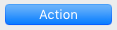

## Default Button

The default button property designates the button that gets the initial focus at runtime when no button of the form has the [Focusable](properties_Entry.md#focusable) property.

There can only be one default button per form page.

In addition, on macOS, the default button property modifies the button's appearance in order to indicate a "recommended choice" to the user. The default button can be different from the focused button. Default buttons have a specific blue appearance on macOS:

> Button must have a standard height to get the default button appearance.

On Windows, the concept of "recommended choice" is not supported: only the focused button has a different appearance at runtime. However, in the 4D form editor, the default button is represented with a blue outline:

#### JSON Grammar

| Nome | Tipo de dados | Possible Values |
| ---- | ------------- | --------------- |
|      |               |                 |
 defaultButton|boolean|true, false |

#### Objects Supported

[Regular Button](button_overview.md#regular) - [Flat Button](button_overview.md#regular)

---

## Esconder retangulo foco

During execution, a field or any enterable area is outlined by a selection rectangle when it has the focus (via the Tab key or a single click). You can hide this rectangle by enabling this property. Hiding the focus rectangle may be useful in the case of specific interfaces.

#### JSON Grammar

| Nome          | Tipo de dados | Possible Values |
| ------------- | ------------- | --------------- |
| hideFocusRing | boolean       | true, false     |

#### Objects Supported

[4D Write Pro area](writeProArea_overview.md) - [Hierarchical List](list_overview.md) - [Input](input_overview.md) - [List Box](listbox_overview.md) - [Subform](subform_overview.md)

---

## Esconder ressalte seleção

`Selection type list boxes`

This property is used to disable the selection highlight in list boxes.

When this option is enabled, the selection highlight is no longer visible for selections made in list boxes. Selections themselves are still valid and work in exactly the same way as previously; however, they are no longer represented graphically onscreen, and you will need to [define their appearance programmatically](listbox_overview.md#customizing-appearance-of-selected-rows).

By default, this option is not enabled.

#### JSON Grammar

| Nome                | Tipo de dados | Possible Values |
| ------------------- | ------------- | --------------- |
| hideSystemHighlight | boolean       | true, false     |

#### Objects Supported

[List Box](listbox_overview.md)

---

## Barra rolagem horizontal

An interface tool allowing the user to move the viewing area to the left or right.

Available values:

| Property List | Valor JSON  | Descrção                                                                                                                                                 |
| ------------- | ----------- | -------------------------------------------------------------------------------------------------------------------------------------------------------- |
| Sim           | "visible"   | The scrollbar is always visible, even when it is not necessary (in other words, when the size of the object contents is smaller than that of the frame). |
| No            | "hidden"    | The scrollbar is never visible                                                                                                                           |
| Automático    | "automatic" | The scrollbar appears automatically whenever necessary and the user can enter text larger than the object width                                          |

> Picture objects can have scrollbars when the display format of the picture is set to “Truncated (non-centered).”

#### JSON Grammar

| Nome                | Tipo de dados | Possible Values                  |
| ------------------- | ------------- | -------------------------------- |
| scrollbarHorizontal | text          | "visible", "hidden", "automatic" |

#### Objects Supported

[Hierarchical List](list_overview.md#overview) - [Subform](subform_overview.md#overview) - [List Box](listbox_overview.md#overview) - [Input](input_overview.md) - [4D Write Pro area](writeProArea_overview.md)

#### Veja também

[Vertical scroll bar](#vertical-scroll-bar)

---

## Resolução

Sets the screen resolution for the 4D Write Pro area contents. By default, it is set to 72 dpi (macOS), which is the standard resolution for 4D forms on all platforms. Setting this property to 96 dpi will set a windows/web rendering on both macOS and Windows platforms. Setting this property to **automatic** means that document rendering will differ between macOS and Windows platforms.

#### JSON Grammar

| Nome | Tipo de dados | Possible Values |
| ---- | ------------- | --------------- |
|      |               |                 |
 dpi|number|0=automatic, 72, 96 |

#### Objects Supported

[Área 4D Write Pro](writeProArea_overview.md)

---

## Show background

Displays/hides both background images and background color.

#### JSON Grammar

| Nome | Tipo de dados | Possible Values |
| ---- | ------------- | --------------- |
|      |               |                 |
 showBackground|boolean|true (default), false|

#### Objects Supported

[Área 4D Write Pro](writeProArea_overview.md)

---

## Show footers

Displays/hides the footers when [Page view mode](#view-mode) is set to "Page".

#### JSON Grammar

| Nome | Tipo de dados | Possible Values |
| ---- | ------------- | --------------- |
|      |               |                 |
 showFooters|boolean|true (default), false|

#### Objects Supported

[Área 4D Write Pro](writeProArea_overview.md)

---

## Show Formula Bar

When enabled, the formula bar is visible below the Toolbar interface in the 4D View Pro area. If not selected, the formula bar is hidden.

> This property is available only for the [Toolbar](#user-interface) interface.

#### JSON Grammar

| Nome | Tipo de dados | Possible Values |
| ---- | ------------- | --------------- |
|      |               |                 |
 withFormulaBar|boolean|true (default), false|

#### Objects Supported

[Área 4D View Pro](viewProArea_overview.md)

---

## Show headers

Displays/hides the headers when [Page view mode](#view-mode) is set to "Page".

#### JSON Grammar

| Nome | Tipo de dados | Possible Values |
| ---- | ------------- | --------------- |
|      |               |                 |
 showHeaders|boolean|true (default), false|

#### Objects Supported

[Área 4D Write Pro](writeProArea_overview.md)

---

## Show hidden characters

Displays/hides invisible characters

#### JSON Grammar

| Nome | Tipo de dados | Possible Values |
| ---- | ------------- | --------------- |
|      |               |                 |
 showHiddenChars|boolean|true (default), false|

#### Objects Supported

[Área 4D Write Pro](writeProArea_overview.md)

---

## Show horizontal ruler

Displays/hides the horizontal ruler when the document view is in [Page mode](#view-mode).

#### JSON Grammar

| Nome | Tipo de dados | Possible Values |
| ---- | ------------- | --------------- |
|      |               |                 |
 showHorizontalRuler|boolean|true (default), false|

#### Objects Supported

[Área 4D Write Pro](writeProArea_overview.md)

---

## Show HTML WYSYWIG

Enables/disables the HTML WYSIWYG view, in which any 4D Write Pro advanced attributes which are not compliant with all browsers are removed.

#### JSON Grammar

| Nome | Tipo de dados | Possible Values |
| ---- | ------------- | --------------- |
|      |               |                 |
 showHTMLWysiwyg|boolean|true, false (default)|

#### Objects Supported

[Área 4D Write Pro](writeProArea_overview.md)

---

## Show page frame

Displays/hides the page frame when [Page view mode](#view-mode) is set to "Page".

#### JSON Grammar

| Nome | Tipo de dados | Possible Values |
| ---- | ------------- | --------------- |
|      |               |                 |
 showPageFrames|boolean|true, false|

#### Objects Supported

[Área 4D Write Pro](writeProArea_overview.md)

---

## Show references

Displays all 4D expressions inserted in the 4D Write Pro document as *references*. When this option is disabled, 4D expressions are displayed as *values*. By default when you insert a 4D field or expression, 4D Write Pro computes and displays its current value. Select this property if you wish to know which field or expression is displayed. The field or expression references then appear in your document, with a gray background.

For example, you have inserted the current date along with a format, the date is displayed:

With the Show references property on, the reference is displayed:

> 4D expressions can be inserted using the `ST INSERT EXPRESSION` command.

#### JSON Grammar

| Nome | Tipo de dados | Possible Values |
| ---- | ------------- | --------------- |
|      |               |                 |
 showReferences|boolean|true, false (default)|

#### Objects Supported

[Área 4D Write Pro](writeProArea_overview.md)

---

## Show vertical ruler

Displays/hides the vertical ruler when the document view is in [Page mode](#view-mode).

#### JSON Grammar

| Nome | Tipo de dados | Possible Values |
| ---- | ------------- | --------------- |
|      |               |                 |
 showVerticalRuler|boolean|true (default), false|

#### Objects Supported

[Área 4D Write Pro](writeProArea_overview.md)

---

## Tab Control Direction

You can set the direction of tab controls in your forms. This property is available on all the platforms but can only be displayed in macOS. You can choose to place the tab controls on top (standard) or on the bottom.

When tab controls with a custom direction are displayed under Windows, they automatically return to the standard direction (top).

#### JSON Grammar

| Nome | Tipo de dados | Possible Values |
| ---- | ------------- | --------------- |
|      |               |                 |
 labelsPlacement|boolean|"top", "bottom" |

#### Objects Supported

[Tab Control](tabControl.md)

---

## User Interface

You can add an interface to 4D View Pro areas to allow end users to perform basic modifications and data manipulations. 4D View Pro offers two optional interfaces to choose from, **Ribbon** and **Toolbar**.

#### JSON Grammar

| Nome | Tipo de dados | Possible Values |
| ---- | ------------- | --------------- |
|      |               |                 |
 userInterface|text|"none" (default), "ribbon", "toolbar" |

#### Objects Supported

[Área 4D View Pro](viewProArea_overview.md)

#### Veja também

[4D View Pro reference guide](https://doc.4d.com/4Dv18/4D/18/4D-View-Pro-Reference.100-4522233.en.html)

---

## Barra rolagem vertical

An interface tool allowing the user to move the viewing area up and down.

Available values:

| Property List | Valor JSON  | Descrção                                                                                                                                                 |
| ------------- | ----------- | -------------------------------------------------------------------------------------------------------------------------------------------------------- |
| Sim           | "visible"   | The scrollbar is always visible, even when it is not necessary (in other words, when the size of the object contents is smaller than that of the frame). |
| No            | "hidden"    | The scrollbar is never visible                                                                                                                           |
| Automático    | "automatic" | The scrollbar appears automatically whenever necessary (in other words, when the size of the object contents is greater than that of the frame)          |

> Picture objects can have scrollbars when the display format of the picture is set to “Truncated (non-centered).”

> If a text input object does not have a scroll bar, the user can scroll the information using the arrow keys.

#### JSON Grammar

| Nome              | Tipo de dados | Possible Values                  |
| ----------------- | ------------- | -------------------------------- |
| scrollbarVertical | text          | "visible", "hidden", "automatic" |

#### Objects Supported

[Hierarchical List](list_overview.md#overview) - [Subform](subform_overview.md#overview) - [List Box](listbox_overview.md#overview) - [Input](input_overview.md) - [4D Write Pro area](writeProArea_overview.md)

#### Veja também

[Horizontal scroll bar](#horizontal-scroll-bar)

---

## Modo de visualização

Sets the mode for displaying the 4D Write Pro document in the form area. Three values are available:

- **Page**: the most complete view mode, which includes page outlines, orientation, margins, page breaks, headers and footers, etc.
- **Draft**: draft mode with basic document properties
- **Embedded**: view mode suitable for embedded areas; it does not display margins, footers, headers, page frames, etc. This mode can also be used to produce a web-like view output (if you also select the [96 dpi resolution](#resolution) and the [Show HTML WYSIWYG](#show-html-wysiwyg) properties). This mode can also be used to produce a web-like view output (if you also select the [96 dpi resolution](#resolution) and the [Show HTML WYSIWYG](#show-html-wysiwyg) properties).

> The View mode property is only used for onscreen rendering. Regarding printing settings, specific rendering rules are automatically used.

#### JSON Grammar

| Nome | Tipo de dados | Possible Values |
| ---- | ------------- | --------------- |
|      |               |                 |
 layoutMode|text|"page", "draft", "embedded"|

#### Objects Supported

[Área 4D Write Pro](writeProArea_overview.md)

---

## Zoom

Sets the zoom percentage for displaying 4D Write Pro area contents.

#### JSON Grammar

| Nome | Tipo de dados | Possible Values |
| ---- | ------------- | --------------- |
|      |               |                 |
 zoom|number|minimum = 0 |

#### Objects Supported

[Área 4D Write Pro](writeProArea_overview.md)
