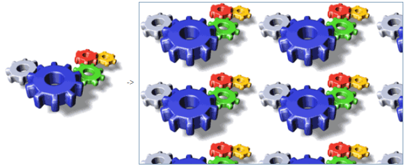

## Pathname

Nome do caminho de uma imagem de origem estática para um botão de imagem , um menu pop-up de imagem ou uma imagem estática . É necessário utilizar a sintaxe POSIX.

Podem ser utilizadas duas localizações principais para o percurso da imagem estática:

- in the **Resources** folder of the project database. Appropriate when you want to share static pictures between several forms in the database. Neste caso, o nome do caminho é "/RESOURCES/<picture path\>".
- numa pasta de imagens (por exemplo, **Images**) dentro da pasta do formulário. Adequado quando as imagens estáticas forem utilizadas apenas no formulário ou se pretende poder mover ou duplicar todo o formulário dentro do projeto ou em projetos diferentes. Neste caso, o nome do caminho é "<picture path\>" e é resolvido a partir da raiz da pasta do formulário.

#### Gramática JSON

|  Nome   | Tipo de dados | Valores possíveis                               |
|:-------:|:-------------:| ----------------------------------------------- |
| picture |     text      | Caminho relativo ou filesystem na sintaxe POSIX |

#### Objectos suportados

[Botão de imagem](pictureButton_overview.md) - [Menu pop-up de imagem](picturePopupMenu_overview.md) - [Imagem estática](staticPicture.md)

---

## Visualização

### Escalado para caber

`Gramática JSON: "scaled"`

O formato **Scaled to fit** faz com que o 4D redimensione a imagem para se ajustar às dimensões da área.

### Replicado

`Gramática JSON: "tiled"`

Quando a área que conter uma imagem com o formato **Replicated** for ampliada, a imagem não é deformada, mas é replicada tantas vezes quantas as necessárias para preencher totalmente a área.

Se o campo for reduzido para um tamanho inferior ao da imagem original, a imagem é truncada (não centrada).

### Centro / Truncado (não centrado)

`Gramática JSON: "truncatedCenter" / "truncatedTopLeft"`

O formato **Center** faz com que o 4D centralize a imagem na área e corte qualquer parte que não caiba na área. 4D corta igualmente de cada borda e da parte superior e inferior.

O formato **Truncado (não centrado)** faz com que 4D coloque o canto superior esquerdo da imagem no canto superior esquerdo da área e recorte qualquer parte que não caiba na área. 4D corta da direita e de baixo para cima.
> Quando o formato da imagem for **Truncado (não centrado)**, é possível adicionar barras de deslocamento à área de entrada.

#### Gramática JSON

| Nome          | Tipo de dados | Valores possíveis                                        |
| ------------- | ------------- | -------------------------------------------------------- |
| pictureFormat | string        | "scaled", "tiled", "truncatedCenter", "truncatedTopLeft" |

#### Objectos suportados

[Imagem estática](staticPicture.md)
