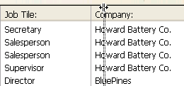

## Visão Geral

A splitter divides a form into two areas, allowing the user to enlarge and reduce the areas by moving the splitter one way or the other. A splitter can be either horizontal or vertical. O divisor leva em consideração as propriedades de redimensionamento de cada objeto, o que significa que pode personalizar completamente a interface de seu banco de dados. A splitter may or may not be a “pusher.”

Splitter are used for example in output forms so that columns can be resized:



Some of the splitter’s general characteristics:

* You can place as many splitters as you want in any type of form and use a mixture of horizontal and vertical splitters in the same form.
* A splitter can cross (overlap) an object. This object will be resized when the splitter is moved.
* Splitter stops are calculated so that the objects moved remain entirely visible in the form or do not pass under/next to another splitter. When the [Pusher](properties_ResizingOptions.md#pusher) property is associated with a splitter, its movement to the right or downward does not encounter any stops.
* If you resize a form using a splitter, the new dimensions of the form are saved only while the form is being displayed. Once a form is closed, the initial dimensions are restored.

Once it is inserted, the splitter appears as a line. You can modify its [border style](properties_BackgroundAndBorder.md#border-line-style-dotted-line-type) to obtain a thinner line or [change its color](properties_BackgroundAndBorder.md##font-color-line-color).

#### JSON Exemplo

```4d
"mySplitter": {
 "type": "splitter",
 "left": 60,  
 "top": 160,   
 "width": 100,  
 "height": 20,  
 "splitterMode": "move"  //pusher
 }
```

### Propriedades compatíveis

[Estilo del borde](properties_BackgroundAndBorder.md##border-line-style-dotted-line-type) - [Negrita](properties_Text.md#bold) - \[Abaixo\](properties_CoordinatesAndSizing. md#bottom) - [Classe](properties_Object.md#css-class) - [Fuente](properties_Text.md#font) - \[Cor da fonte\](properties_Text. md#font-color) - [Altura](properties_CoordinatesAndSizing.md#height) - [Conselho de ajuda](properties_Help.md#help-tip) - \[Tamaño horizontal\](properties_ResizingOptions. md#horizontal-sizing) - [Itálica](properties_Text.md#italic) - [Esquerda](properties_CoordinatesAndSizing.md#left) - \[Cor da linha\](properties_BackgroundAndBorder. md##font-color-line-color) - [Nome de objeto](properties_Object.md#object-name) - [Pusher](properties_ResizingOptions.md) - \[Direita\](properties_CoordinatesAndSizing. md#right) - [Título](properties_Object.md#title) -[Acima](properties_CoordinatesAndSizing.md#top) - \[Tipo\](properties_Object. md#type) - [Sublinhado](properties_Text.md#underline) - [Tamanho vertical](properties_ResizingOptions.md#vertical-sizing) - \[Variável ou expressão\](properties_Object. md#variable-or-expression) - [Visibilidade](properties_Display.md#visibility) - [Largura](properties_CoordinatesAndSizing.md#width)

## Interação com as propriedades dos objetos vizinhos

In a form, splitters interact with the objects that are around them according to these objects’ resizing options:

| Resizing options for the object(s) | Object(s) above an horizontal splitter or to the left of a vertical splitter (1)    | Object(s) below an horizontal *non-Pusher* splitter or to the right of a vertical *non-Pusher* splitter                                                                                              | Object(s) below an horizontal *Pusher* splitter or to the right of a vertical *Pusher* splitter                                           |
| ---------------------------------- | ----------------------------------------------------------------------------------- | ---------------------------------------------------------------------------------------------------------------------------------------------------------------------------------------------------- | ----------------------------------------------------------------------------------------------------------------------------------------- |
| Nenhum                             | Remain as is                                                                        | Are moved with the splitter (position relative to the splitter is not modified) until the next stop. The stop when moving to the bottom or right is either the window’s border, or another splitter. | Are moved with the splitter (position relative to the splitter is not modified) indefinitely. No stop is applied (see the next paragraph) |
| Redimensionar                      | Keep original position(s), but are resized according to the splitter’s new position |                                                                                                                                                                                                      |                                                                                                                                           |
| Mover                              | Are moved with the splitter                                                         |                                                                                                                                                                                                      |                                                                                                                                           |

*(1) You cannot drag the splitter past the right (horizontal) or bottom (vertical) side of an object located in this position.*
> An object completely contained in the rectangle that defines the splitter is moved at the same time as the splitter.

## Gestão programada dos separadores

You can associate an object method with a splitter and it will be called with the `On Clicked` event throughout the entire movement.

A [variable](properties_Object.md#variable-or-expression) of the *Longint* type is associated with each splitter. This variable can be used in your object and/or form methods. Its value indicates the splitter’s current position, in pixels, in relation to its initial position.

* If the value is negative: the splitter was moved toward the top or toward the left,
* If the value is positive: the splitter was moved toward the bottom or toward the right,
* If the value is 0: the splitter was moved to its original position.

You can also move the splitter programmatically: you just have to set the value of the associated variable. For example, if a vertical splitter is associated with a variable named `split1`, and if you execute the following statement: `split1:=-10`, the splitter will be moved 10 pixels to the left — as if the user did it manually. The move is actually performed at the end of the execution of the form or object method containing the statement.
