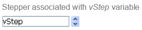

## Visão Geral

A stepper lets the user scroll through numeric values, durations (times) or dates by predefined steps by clicking on the arrow buttons.

## Usando os steppers

You can assign the variable associated with the object to an enterable area (field or variable) to store or modify the current value of the object.

Um stepper pode ser associado diretamente a uma variável número, hora ou data.

* For values of the time type, the Minimum, Maximum and Step properties represent seconds. Por exemplo, para definir um passo de 8:00 a 18:00 com passos de 10 minutos:
  * [minimum](properties_Scale.md#minimum) = 28 800 (8*60*60)
  * [maximum](properties_Scale.md#maximum) = 64 800 (18*60*60)
  * [paso](properties_Scale.md#step) = 600 (10*60)
* Para valores do tipo data, o valor introduzido na propriedade [passo](properties_Scale.md#step) representa dias. As propriedades Mínimo e Máximo são ignoradas.
> > > For the stepper to work with a time or date variable, it is imperative to set its type in the form AND to declare it explicitly via the [C_TIME](https://doc.4d.com/4Dv17R5/4D/17-R5/C-TIME.301-4128557.en.html) or [C_DATE](https://doc.4d.com/4Dv17R5/4D/17-R5/C-DATE.301-4128570.en.html) command.

For more information, please refer to [Using indicators](progressIndicator.md#using-indicators) in the "Progress Indicator" page.

## Propriedades compatíveis

[Negrito](properties_Text.md#bold) - [Estilo de linha de borda](properties_BackgroundAndBorder.md#border-line-style) - [Parte inferior](properties_CoordinatesAndSizing.md#bottom) - [Classe](properties_Object.md#css-class) - [Colunas](properties_Crop.md#columns) - [Executar método de objeto](properties_Action.md#execute-object-method) - [Tipo de expressão](properties_Object.md#expression-type) (somente "inteiro", "número", "data" ou "hora") - [Altura](properties_CoordinatesAndSizing.md#height) - [Dica de ajuda](properties_Help.md#help-tip) - [Dimensionamento horizontal](properties_ResizingOptions.md#horizontal-sizing) - [Esquerda](properties_CoordinatesAndSizing.md#left) - [Máximo](properties_Scale.md#maximum) - [Mínimo](properties_Scale.md#minimum) - [Nome do objeto](properties_Object.md#object-name) - [Nome do caminho](properties_Picture.md#pathname) - [Direita](properties_CoordinatesAndSizing.md#right) - [Linhas](properties_Crop.md#rows) - [Etapa](properties_Scale.md#step) - [Ação padrão](properties_Action.md#standard-action) - [Parte superior](properties_CoordinatesAndSizing.md#top) - [Tipo](properties_Object.md#type) - [Variável ou expressão](properties_Object.md#variable-or-expression) - [Dimensionamento vertical](properties_ResizingOptions.md#vertical-sizing) - [Visibilidade](properties_Display.md#visibility) - [Largura](properties_CoordinatesAndSizing.md#width)

## Veja também

- [indicadores de progresso](progressIndicator.md)
* [regras](ruler.md)
