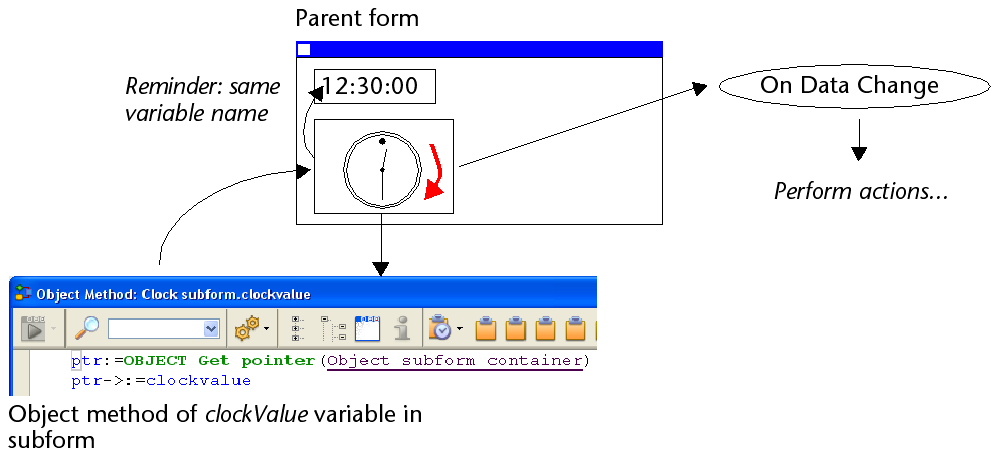

## Overview

A subform is a form included in another form.

### Terminology

In order to clearly define the concepts implemented with subforms, here are some definitions for certain terms used:

* **Subform**: a form intended for inclusion in another form, itself called the parent form.
* **Parent form**: a form containing one or more subform(s).
* **Subform container**: an object included in the parent form, displaying an instance of the subform.
* **Subform instance**: the representation of a subform in a parent form. This concept is important because it is possible to display several instances of the same subform in a parent form.
* **List form**: instance of subform displayed as a list.
* **Detail form**: page-type input form associated with a list-type subform that can be accessed by double-clicking in the list.

## List subforms

A list subform lets you enter, view, and modify data in other tables. You usually use list subforms in databases in which you have established One to Many relations. A list subform on a form in a related One table lets you view, enter, and modify data in a related Many table. You can have several subforms coming from different tables in the same form. However, it is not possible to place two subforms that belong to the same table on the same page of a form.

For example, a Contacts manager database might use a list subform to display all the telephone numbers for a particular contact. Although the telephone numbers appear on the Contacts screen, the information is actually stored in a related table. Using a One to Many relation, this database design makes it easy to store an unlimited number of telephone numbers per contact. With automatic relations, you can support data entry directly into the related Many table without programming.

Although list subforms are generally associated with Many tables, a subform instance can display the records of any other database table.

You can also allow the user to enter data in the List form. Depending on the configuration of the subform, the user may display the detail form by double-clicking on a subrecord or by using the commands for adding and editing subrecords.

> 4D offers three standard actions to meet the basic needs for managing subrecords: `Edit Subrecord`, `Delete Subrecord`, and `Add Subrecord`. When the form includes several subform instances, the action will apply to the subform that has the focus.

## Page subforms

Page subforms can display the data of the current subrecord or any type of pertinent value depending on the context (variables, pictures, and so on). One of the main advantages of using page subforms is that they can include advanced functionalities and can interact directly with the parent form (widgets). Page subforms also have their own specific properties and events; you can manage them entirely by programming.

The page subform uses the input form indicated by the [Detail Form](properties_Subform.md#detail-form) property. Unlike a list subform, the form used can come from the same table as the parent form. It is also possible to use a project form. When executed, a page subform has the same standard display characteristics as an input form.

> 4D Widgets are predefined compound objects based upon page subforms. They are described in detail in a separate manual, [4D Widgets](https://doc.4d.com/4Dv17R6/4D/17-R6/4D-Widgets.100-4465257.en.html).

### Managing the bound variable

The [variable](properties_Object.md#variable-or-expression) bound to a page subform lets you link the parent form and subform contexts to put the finishing touches on sophisticated interfaces. For example, imagine a subform representing a dynamic clock, inserted into a parent form containing an enterable variable of the Time type:


Both objects (time variable and subform container) *have the same variable name*. In this case, when you open the parent form, 4D synchronizes both values automatically. If the variable value is set at several locations, 4D uses the value that was loaded last. It applies the following loading order: 1-Object methods of subform 2-Form method of subform 3-Object methods of parent form 4-Form method of parent form

When the parent form is executed, the developer must take care to synchronize the variables using appropriate form events. Two types of interactions can occur: form to subform and vice versa.

#### Updating subform contents

Case 1: The value of the parent form variable is modified and this modification must be passed on to the subform. In our example, the time of ParisTime changes to 12:15:00, either because the user entered it, or because it was updated dynamically (via the `Current time` command for example).

In this case, you must use the On Bound Variable Change form event. This event must be selected in the subform properties; it is generated in the form method of the subform.


The `On Bound Variable Change` form event is generated:

* as soon as a value is assigned to the variable of the parent form, even if the same value is reassigned,
* if the subform belongs to the current form page or to page 0.

Note that, as in the above example, it is preferable to use the `OBJECT Get pointer` command which returns a pointer to the subform container rather than its variable because it is possible to insert several subforms in the same parent form (for example, a window displaying different time zones contains several clocks). In this case, only a pointer lets you know which subform container is at the origin of the event.

#### Updating parent form contents

Case 2: The contents of the subform are modified and this modification must be passed on to the parent form. In our example, imagine that the subform interface lets the user "manually" move the hands of the clock.

In this case, from the subform, you must assign the object value to the variable of the parent subform container. As in the previous example, we recommend that you use the `OBJECT Get pointer` command with the `Object subform container` selector which returns a pointer to the subform container.

Assigning the value to the variable generates the `On Data Change` form event in the object method of the parent subform container, which lets you perform any type of action. The event must be selected in the properties of the subform container.



> If you "manually" move the hands of the clock, this also generates the `On Data Change` form event in the object method of the *clockValue* variable in the subform.

### Using the subform bound object

4D automatically binds an object (`C_OBJECT`) to each subform. The contents of this object can be read and/or modified from within the context of the subform, allowing you to share values in a local context.

The object can be created automatically or be the parent container variable, if explicitely named and typed as Object (see below). In all cases, the object is returned by the `Form` command, which can be called directy the subform (using a pointer is useless). Since objects are always passed by reference, if the user modifies a property value in the subform, it will automatically be saved in the object itself.

For example, in your subform, field labels are stored in the bound object so that you can display different languages:


You can modify the labels from the subform by assigning values to the *InvoiceAddress* object:

```4d
 C_OBJECT($lang)
 $lang:=New object
 If(<>lang="fr")
    $lang.CompanyName:="Société :"
    $lang.LastName:="Nom :"
 Else
    $lang.CompanyName:="Company:"
    $lang.LastName:="Name:"
 End if
 InvoiceAddress.Label:=$lang
```


### Advanced inter-form programming

Communication between the parent form and the instances of the subform may require going beyond the exchange of a value through the bound variable. In fact, you may want to update variables in subforms according to the actions carried out in the parent form and vice versa. If we use the previous example of the "dynamic clock" type subform, we may want to set one or more alarm times for each clock.

4D has implemented the following mechanisms to meet these needs:

* Use of the "subform" parameter with the `OBJECT Get name` command to specify the subform object and the `OBJECT Get pointer` command.
* Calling of a container object from the subform using the `CALL SUBFORM CONTAINER` command,
* Execution of a method in the context of the subform via the `EXECUTE METHOD IN SUBFORM` command.

#### Object get pointer and Object get name commands

In addition to the `Object subform container` selector, the `OBJECT Get pointer` command accepts a parameter that indicates in which subform to search for the object whose name is specified in the second parameter. This syntax can only be used when the Object named selector is passed.

For example, the following statement:

```4d
 $ptr:=OBJECT Get pointer(Object named;"MyButton";"MySubForm")
```

... retrieves a pointer to the "MyButton" variable that is located in the "MySubForm" subform object. This syntax can be used to access from the parent form any object found in a subform. Also note the `OBJECT Get name` command which can be used to retrieve the name of the object that has the focus.

#### CALL SUBFORM CONTAINER command

The `CALL SUBFORM CONTAINER` command lets a subform instance send an event to the subform container object, which can then process it in the context of the parent form. The event is received in the container object method. It may be at the origin of any event detected by the subform (click, drag-and-drop, etc.).

The code of the event is unrestricted (for example, 20000 or -100). You can use a code that corresponds to an existing event (for example, 3 for `On Validate`), or use a custom code. In the first case, you can only use events that you have checked in the Property List for subform containers. In the second case, the code must not correspond to any existing form event. It is recommended to use a negative value to be sure that this code will not be used by 4D in future versions.

For more information, refer to the description of the `CALL SUBFORM CONTAINER` command.

#### EXECUTE METHOD IN SUBFORM command

The `EXECUTE METHOD IN SUBFORM` command lets a form or one of its objects request the execution of a method in the context of the subform instance, which gives it access to the subform variables, objects, etc. This method can also receive parameters.

This mechanism is illustrated in the following diagram:


For more information, refer to the description of the `EXECUTE METHOD IN SUBFORM` command.

#### GOTO OBJECT command

The `GOTO OBJECT` command looks for the destination object in the parent form even if it is executed from a subform.

## Supported Properties

[Border Line Style](properties_BackgroundAndBorder.md#border-line-style) - [Bottom](properties_CoordinatesAndSizing.md#bottom) - [Class](properties_Object.md#css-class) - [Detail Form](properties_Subform.md#detail-form) - [Double click on empty row](properties_Subform.md#double-click-on-empty-row) - [Double click on row](properties_Subform.md#double-click-on-row) - [Enterable in list](properties_Subform.md#enterable-in-list) - [Expression Type](properties_Object.md#expression-type) - [Focusable](properties_Entry.md#focusable) - [Height](properties_CoordinatesAndSizing.md#height) - [Hide focus rectangle](properties_Appearance.md#hide-focus-rectangle) - [Horizontal Scroll Bar](properties_Appearance.md#horizontal-scroll-bar) - [Horizontal Sizing](properties_ResizingOptions.md#horizontal-sizing) - [Left](properties_CoordinatesAndSizing.md#left) - [List Form](properties_Subform.md#list-form) - [Method](properties_Action.md#method) - [Object Name](properties_Object.md#object-name) - [Print Frame](properties_Print.md#print-frame) - [Right](properties_CoordinatesAndSizing.md#right) - [Selection mode](properties_Subform.md#selection-mode) - [Source](properties_Subform.md#source) - [Top](properties_CoordinatesAndSizing.md#top) - [Type](properties_Object.md#type) - [Variable or Expression](properties_Object.md#variable-or-expression) - [Vertical Scroll Bar](properties_Appearance.md#vertical-scroll-bar) - [Vertical Sizing](properties_ResizingOptions.md#vertical-sizing) - [Visibility](properties_Display.md#visibility) - [Width](properties_CoordinatesAndSizing.md#width)
