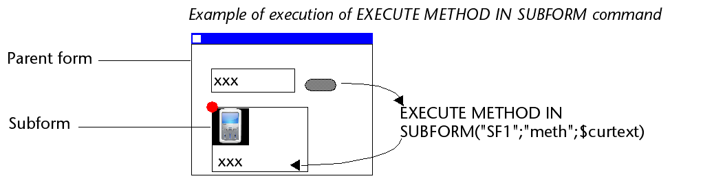

## Visão Geral

Um subformulário é um formulário incluído noutro formulário.

### Terminologia

Para definir claramente os conceitos implementados com subformulários, aqui estão algumas definições para certos termos utilizados:

* **Subformulário**: um formulário destinado a ser incluído em outro formulário, ele próprio chamado de formulário pai.
* **Formulário pai**: um formulário que contém um ou mais subformulários.
* **Contêiner de sub**formulário: um objeto incluído no formulário pai, que exibe uma instância do subformulário.
* **Instância de sub**formulário: a representação de um subformulário em um formulário pai. Esse conceito é importante porque é possível exibir várias instâncias do mesmo subformulário em um formulário pai.
* **Formulário lista**: instância do subformulário exibido como uma lista.
* **Formulário de detalhes**: formulário de entrada do tipo página associado a um subformulário do tipo lista que pode ser acessado com um clique duplo na lista.

## Sub formulários lista

Um subformulário lista permite que você insira, visualize e modifique dados em outras tabelas. Normalmente, os subformulários de lista são usados em bancos de dados nos quais você estabeleceu relações Um para Muitos. Um subformulário de lista em um formulário em uma tabela One relacionada permite visualizar, inserir e modificar dados em uma tabela Many relacionada. Você pode ter vários subformulários provenientes de tabelas diferentes no mesmo formulário. No entanto, não é possível colocar dois subformulários que pertençam à mesma tabela na mesma página de um formulário.

Por exemplo, um banco de dados do gerenciador de contatos pode usar um subformulário de lista para exibir todos os números de telefone de um determinado contato. Embora os números de telefone apareçam na tela Contatos, as informações são, na verdade, armazenadas em uma tabela relacionada. Usando uma relação de um para muitos, esse design de banco de dados facilita o armazenamento de um número ilimitado de números de telefone por contato. Com as relações automáticas, você pode apoiar a entrada de dados diretamente na tabela Many relacionada sem programação.

Embora os subformulários de lista geralmente estejam associados a muitas tabelas, uma instância de subformulário pode exibir os registros de qualquer outra tabela do banco de dados.

Também é possível permitir que o usuário introduza dados no formulário Lista. Dependendo da configuração do subformulário, o usuário pode exibir o formulário detalhado clicando duas vezes em um subregistro ou usando os comandos para adicionar e editar subregistros.

> 4D oferece três ações padrão para atender às necessidades básicas de gerenciamento de sub-registros: `Editar Subregistro`, `Excluir Subregistro` e `Adicionar Subregistro`. Quando o formulário incluir várias instâncias de subformulários, a ação será aplicada ao subformulário que tiver o foco.

## Subformulários em página

Os subformulários de página podem exibir os dados do subregistro atual ou qualquer tipo de valor pertinente, dependendo do contexto (variáveis, figuras etc.). Uma das principais vantagens do uso de subformulários de página é que eles podem incluir funcionalidades avançadas e interagir diretamente com o formulário pai (widgets). Os subformulários de página também têm suas próprias propriedades e eventos específicos; você pode gerenciá-los inteiramente por meio de programação.

O subformulário de página usa o formulário de entrada indicado pela propriedade [Detail Form](properties_Subform.md#detail-form). Ao contrário de um subformulário de lista, o formulário usado pode vir da mesma tabela que o formulário pai. Também é possível usar um formulário de projeto. Quando executado, um subformulário de página tem as mesmas características de exibição padrão de um formulário de entrada.

> Os widgets 4D são objetos compostos predefinidos com base em subformulários de página. São descritos em detalhes em um manual separado, [4D Widgets](https://doc.4d.com/4Dv17R6/4D/17-R6/4D-Widgets.100-4465257.en.html).

### Gestão da variável relacionada

The [variable](properties_Object.md#variable-or-expression) bound to a page subform lets you link the parent form and subform contexts to put the finishing touches on sophisticated interfaces. For example, imagine a subform representing a dynamic clock, inserted into a parent form containing an enterable variable of the Time type:


Both objects (time variable and subform container) *have the same variable name*. In this case, when you open the parent form, 4D synchronizes both values automatically. Se o valor da variável é definido em vários locais, 4D usa o valor que foi carregado por último. It applies the following loading order: 1-Object methods of subform 2-Form method of subform 3-Object methods of parent form 4-Form method of parent form

When the parent form is executed, the developer must take care to synchronize the variables using appropriate form events. Podem ocorrer dois tipos de interações: formulário para subformulário e vice-versa.

#### Atualização do conteúdo do subformulário

Case 1: The value of the parent form variable is modified and this modification must be passed on to the subform. In our example, the time of ParisTime changes to 12:15:00, either because the user entered it, or because it was updated dynamically (via the `Current time` command for example).

Nesse caso, você deve usar o evento formulário On Bound Variable Change. This event must be selected in the subform properties; it is generated in the form method of the subform.


O evento de formulário `On Bound Variable Change` é gerado:

* as soon as a value is assigned to the variable of the parent form, even if the same value is reassigned,
* se o subformulário pertence à página formulário atual ou à página 0.

Note that, as in the above example, it is preferable to use the `OBJECT Get pointer` command which returns a pointer to the subform container rather than its variable because it is possible to insert several subforms in the same parent form (for example, a window displaying different time zones contains several clocks). In this case, only a pointer lets you know which subform container is at the origin of the event.

#### Atualização do conteúdo do formulário parent

Caso 2: o conteúdo do subformulário é modificado e esta modificação deve ser transmitida ao formulário principal. In our example, imagine that the subform interface lets the user "manually" move the hands of the clock.

In this case, from the subform, you must assign the object value to the variable of the parent subform container. As in the previous example, we recommend that you use the `OBJECT Get pointer` command with the `Object subform container` selector which returns a pointer to the subform container.

Assigning the value to the variable generates the `On Data Change` form event in the object method of the parent subform container, which lets you perform any type of action. O evento deve ser selecionado nas propriedades do contêiner do subformulário.


> If you "manually" move the hands of the clock, this also generates the `On Data Change` form event in the object method of the *clockValue* variable in the subform.

### Utilizar o objeto vinculado ao subformulário

4D automatically binds an object (`C_OBJECT`) to each subform. The contents of this object can be read and/or modified from within the context of the subform, allowing you to share values in a local context.

The object can be created automatically or be the parent container variable, if explicitely named and typed as Object (see below). In all cases, the object is returned by the `Form` command, which can be called directy the subform (using a pointer is useless). Since objects are always passed by reference, if the user modifies a property value in the subform, it will automatically be saved in the object itself.

For example, in your subform, field labels are stored in the bound object so that you can display different languages:


You can modify the labels from the subform by assigning values to the *InvoiceAddress* object:

```4d
 C_OBJECT($lang)
 $lang:=New object
 If(<>lang="fr")
    $lang.CompanyName:="Société :"
    $lang.LastName:="Nom :"
 Else
    $lang.CompanyName:="Company:"
    $lang.LastName:="Name:"
 End if
 InvoiceAddress.Label:=$lang
```


### Programação entre formulários avançada

Communication between the parent form and the instances of the subform may require going beyond the exchange of a value through the bound variable. Na verdade, você pode querer atualizar as variáveis nos subformulários de acordo com as ações realizadas no formulário principal e vice-versa. Se usarmos o exemplo anterior do subformulário do tipo "relógio dinâmico", podemos querer definir um ou mais horários de alarme para cada relógio.

4D implementou os seguintes mecanismos para atender a essas necessidades:

* Use of the "subform" parameter with the `OBJECT Get name` command to specify the subform object and the `OBJECT Get pointer` command.
* Calling of a container object from the subform using the `CALL SUBFORM CONTAINER` command,
* Execution of a method in the context of the subform via the `EXECUTE METHOD IN SUBFORM` command.

#### Comandos "Object get pointer" e "Object get name

In addition to the `Object subform container` selector, the `OBJECT Get pointer` command accepts a parameter that indicates in which subform to search for the object whose name is specified in the second parameter. Essa sintaxe só pode ser usada quando o seletor Object named é passado.

Por exemplo, a seguinte instrução:

```4d
 $ptr:=OBJECT Get pointer(Object named;"MyButton";"MySubForm")
```

... retrieves a pointer to the "MyButton" variable that is located in the "MySubForm" subform object. This syntax can be used to access from the parent form any object found in a subform. Also note the `OBJECT Get name` command which can be used to retrieve the name of the object that has the focus.

#### Comando CALL SUBFORM CONTAINER

The `CALL SUBFORM CONTAINER` command lets a subform instance send an event to the subform container object, which can then process it in the context of the parent form. O evento é recebido no método do objeto contentor. Ele pode estar na origem de qualquer evento detectado pelo subformulário (clique, arrastar e soltar etc.).

O código do evento não tem restrições (por exemplo, 20000 ou -100). Você pode usar um código que corresponda a um evento existente (por exemplo, 3 para `On Validate`), ou usar um código personalizado. No primeiro caso, você só pode usar eventos que você verificou na Lista de Propriedades para sub-formulários. No segundo caso, o código não deve corresponder a nenhum evento de formulário existente. Recomenda-se usar um valor negativo para ter certeza de que esse código não será usado por 4D em versões futuras.

Para obter mais informações, consulte a descrição do comando `CALL SUBFORM CONTAINER`.

#### Comando EXECUTE METHOD IN SUBFORM

O comando `EXECUTE METHOD IN SUBFORM` permite que um formulário ou um de seus objetos solicite a execução de um método no contexto da instância do subformulário, o que lhe dá acesso às variáveis do subformulário, objetos, etc. Este método também pode receber parâmetros.

Este mecanismo é ilustrado no diagrama seguinte:



Para mais informações, consultar a descrição do comando `EXECUTE METHOD IN SUBFORM`.

#### Comando GOTO OBJECT

O comando `GOTO OBJECT` procura o objeto de destino no formulário pai, mesmo que seja executado em um subformulário.

## Propriedades compatíveis

[Border Line Style](properties_BackgroundAndBorder.md#border-line-style) - [Bottom](properties_CoordinatesAndSizing.md#bottom) - [Class](properties_Object.md#css-class) - [Detail Form](properties_Subform.md#detail-form) - [Double click on empty row](properties_Subform.md#double-click-on-empty-row) - [Double click on row](properties_Subform.md#double-click-on-row) - [Enterable in list](properties_Subform.md#enterable-in-list) - [Expression Type](properties_Object.md#expression-type) - [Focusable](properties_Entry.md#focusable) - [Height](properties_CoordinatesAndSizing.md#height) - [Hide focus rectangle](properties_Appearance.md#hide-focus-rectangle) - [Horizontal Scroll Bar](properties_Appearance.md#horizontal-scroll-bar) - [Horizontal Sizing](properties_ResizingOptions.md#horizontal-sizing) - [Left](properties_CoordinatesAndSizing.md#left) - [List Form](properties_Subform.md#list-form) - [Method](properties_Action.md#method) - [Object Name](properties_Object.md#object-name) - [Print Frame](properties_Print.md#print-frame) - [Right](properties_CoordinatesAndSizing.md#right) - [Selection mode](properties_Subform.md#selection-mode) - [Source](properties_Subform.md#source) - [Top](properties_CoordinatesAndSizing.md#top) - [Type](properties_Object.md#type) - [Variable or Expression](properties_Object.md#variable-or-expression) - [Vertical Scroll Bar](properties_Appearance.md#vertical-scroll-bar) - [Vertical Sizing](properties_ResizingOptions.md#vertical-sizing) - [Visibility](properties_Display.md#visibility) - [Width](properties_CoordinatesAndSizing.md#width)
