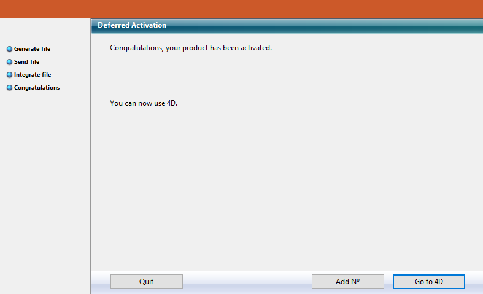

Welcome to 4D! Vai encontrar abaixo toda informação necessário para instalar e registrar sua aplicação 4D.

## Required configuration

Consulte a [página de descarga de produto](https://us.4d.com/product-download) no web site de 4D para conhecer a configuração mínima de Mac / Windows para sua serie 4D.

Todos os detalhes estão disponíveis na [página Recursos](https://us.4d.com/resources/feature-release) do website de 4D.

## Installation on disk

Os produtos 4D são instalados desde o website de 4D:

1. Utilizando seu navegador, conecte-se ao website de 4D e vá à página de [Descargas/downloads](https://us.4d.com/product-download/Feature-Release).
2. Clique no link de download do seu produto e siga as instruções exibidas na tela.

## Ativação de um produto

Uma vez instalados no seu disco, deve activar os seus produtos 4D para poder utilizá-los. Também é preciso ativar qualquer licença adicional que obter.

Não precisa ativar nada para os usos abaixo:

- 4D usado em modo remoto (conexão ao servidor 4D)
- 4D usado em modo local com um banco de dados interpretado, sem acesso ao modo Desenho.

**Importante:** deve ter uma conexão a Internet e uma conta de correio eletrônico para ativar seus produtos.

### Ativação de 4D

1. Lançar a aplicação 4D.
2. Selecione o comando **Gestão de licenças...** de menu **Ajuda**.

Se mostra a caixa de diálogo **Gestão de licenças** (a página de Ativação Instantânea está selecionada por padrão). Ver a próxima seção.

> Quando abrir/criar uma aplicação local interpretada com 4D Developer Edition, um mecanismo de autoativação é implementado. Nesse caso, uma caixa de diálogo informa que vai ser conectado a nosso banco de dados de cliente e que suas licenças serão ativadas (deverá introduzir a senha de sua conta 4D).

### Activação de 4D Server

1. Lançar a aplicação 4D Server. Aparece a caixa de diálogo para escolher o [modo de ativação](#activation-mode).

## Modo de ativação de 4D

4D oferece três modos de ativação. Recomendamos **Instant Activation**.

### Ativação instantânea

Digite seu ID (email ou conta 4D) e sua senha. Se ainda não tiver uma conta de usuário, vai ter que criá-la no endereço a seguir:

[https://account.4d.com/us/login.shtml](https://account.4d.com/us/login.shtml)

Depois entre o número de licença do produto que quiser ativar. Esse número é fornecido por email depois da compra do produto.

### Ativação postergada

Se não puder usar [instant activation](#instant-activation) porque seu computador não tem acesso à internet, veja a ativação postergada usando os passos abaixo.

1. Na janela de License Manager, selecione a aba **Deferred Activation**.
2. Digite o número de licença e seu email e clique  **Generate file** para criar o arquivo ID  (*reg.txt*).

3. Salve o arquivo *reg.txt* para um drive USB e leve ao computador que tenha acesso à internet.
4. No aparelho com acesso à internet, faça login a  [https://activation.4d.com](https://activation.4d.com).
5. Na página web, clique no botão **Choose File...** e selecione o arquivo *reg.txt* dos passos 3 e 4; depois clique no botão **Ativar**.
6. Baixe os arquivos seriais.

7. Salve os arquivos *license4d* em uma mídia partilhda e os transfira para a máquina 4D do passo 1.
8. Agora de volta para a máquina com 4D, ainda na página **Deferred Activation**, clique **Next**; e depois clique no botão **Load...** e selecione o arquivo *license4d* da mídia social do passo 7.

Com o arquivo licença carregado, clique em **Next**.

9. Clique no botão **Add N°** e adicione outra licença. Repita esses passos até que todas as licenças do passo 6 tenham sido integradas.

Sua aplicação 4D agora está ativada.

### Ativação emergencial

Esse modo pode ser usado para ativação temporária especial de 4D (por no máximo 5 dias) sem conexão a um site 4D Web. Essa ativação só pode ser usada uma vez.

## Adicionar licenças

Pode adicionar novas licenças, por exemplo par aumentar as capacidades de sua aplicação, a qualquer momento.

Choose the **License Manager...** command from the **Help** menu of the 4D or 4D Server application, then click on the **Refresh** button:

This button connects you to our customer database and automatically activates any new or updated licenses related to the current license (the current license is displayed in **bold** in the "Active Licenses" list). You will just be prompted for your user account and password.

- If you purchased additional expansions for a 4D Server, you do not need to enter any license number -- just click **Refresh**.
- At the first activation of a 4D Server, you just need to enter the server number and all the purchased expansions are automatically assigned.

You can use the **Refresh** button in the following contexts:

- When you have purchased an additional expansion and want to activate it,
- When you need to update an expired temporary number (Partners or evolutions).

## 4D Online Store

In 4D Store, you can order, upgrade, extend, and/or manage 4D products. You can reach the store at the following address: [https://store.4d.com/us/](https://store.4d.com/us/) (you will need to select your country).

Click **Login** to sign in using your existing account or **New Account** to create a new one, then follow the on-screen instructions.

### License Management

After you log in, you can click on **License list** at the top right of the page:

Here you can manage your licenses by assigning them to projects.

Select the appropriate license from the list then click **Link to a project... >**:

You can either select an existing project or create a new one:

You can use projects to organize your licenses according to your needs:

## Troubleshooting

If the installation or activation process fails, please check the following table, which gives the most common causes of malfunctioning:

| Sintomas                                                      | Possible causes                                            | Solution(s)                                                                                                                                     |
| ------------------------------------------------------------- | ---------------------------------------------------------- | ----------------------------------------------------------------------------------------------------------------------------------------------- |
| Impossible to download product from 4D Internet site          | Internet site unavailable, antivirus application, firewall | 1- Try again later OR 2- Temporarily disable your antivirus application or your firewall.                                                       |
| Impossible to install product on disk (installation refused). | Insufficient user access rights                            | Open a session with access rights allowing you to install applications (administrator access)                                                   |
| Failure of on-line activation                                 | Antivirus application, firewall, proxy                     | 1- Temporarily disable your antivirus application or your firewall OR 2- Use deferred activation (not available with licenses for "R" versions) |

If this information does not help you resolve your problem, please contact 4D or your local distributor.

## Contactos

For any questions about the installation or activation of your product, please contact 4D, Inc. or your local distributor.

Para os EUA:

- Web: [https://us.4d.com/4d-technical-support](https://us.4d.com/4d-technical-support)
- Telephone: 1-408-557-4600

For the UK:

- Web: [https://uk.4d.com/4d-technical-support](https://uk.4d.com/4d-technical-support)
- Telephone: 01625 536178

Encontre a comunidade de desenvolvedores de 4D online aqui: [https://discuss.4d.com](https://discuss.4d.com).
