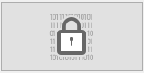

Pode utilizar esta página para encriptar ou *decriptar* (ou seja, remover a encriptação) o ficheiro de dados, conforme o estado do atributo **Cifrável** definido para cada tabela no banco de dados. For detailed information about data encryption in 4D, please refer to the "Encrypting data" section.

É criada uma pasta sempre que é efetuada uma operação de encriptação/desencriptação. Tem o nome "Replaced Files (Encrypting) *yyyy-mm-dd hh-mm-ss*> ou "Replaced Files (Decrypting) *yyyy-mm-dd hh-mm-ss*".
> A encriptação só está disponível no [modo de manutenção](overview.md#display-in-maintenance-mode). If you attempt to carry out this operation in standard mode, a warning dialog will inform you that the database will be closed and restarted in maintenance mode

**Aviso:**

- A encriptação de uma base de dados é uma operação morosa. Apresenta um indicador de progresso (que pode ser interrompido pelo usuário). Note also that a database encryption operation always includes a compacting step.
- Cada operação de encriptação produz uma cópia do ficheiro de dados, o que aumenta o tamanho da pasta da aplicação. É importante ter isto em conta (especialmente em macOS onde as aplicações 4D aparecem como pacotes) para que o tamanho da aplicação não aumente excessivamente. Mover ou remover manualmente as cópias do ficheiro original no pacote pode ser útil para minimizar o tamanho do pacote.

## Encriptar dados pela primeira vez

Para encriptar os seus dados pela primeira vez utilizando o CSM, são necessários os seguintes passos:

1. No editor de estruture, marque o atributo **Cifrável** para cada tabela cujos dados pretende encriptar. Ver a secção "Propriedades das tabelas".
2. Abra a página Encriptar do CSM. Se abrir a página sem definir quaisquer tabelas como **Encryptable**, é apresentada a seguinte mensagem na página:  Caso contrário, é apresentada a seguinte mensagem:  Isto significa que o estado **Encryptable** de pelo menos uma tabela foi modificado e o ficheiro de dados ainda não foi encriptado. **Note:**The same message is displayed when the **Encryptable** status has been modified in an already encrypted data file or after the data file has been decrypted (see below).
3. Clique no botão Encriptar imagem.  
     
   Ser-lhe-á pedido que introduza uma frase-chave para o seu ficheiro de dados:  A frase-chave é utilizada para gerar a chave de encriptação de dados. Uma frase-chave é uma versão mais segura de uma palavra-passe e pode conter um grande número de caracteres. Por exemplo, pode introduzir uma frase-chave como "Todos nós viemos para Montreux" ou "A minha primeira grande frase-chave!" O indicador do nível de segurança pode ajudá-lo a avaliar a força da sua frase-passe:  (verde intenso é o nível mais elevado)
4. Introduza para confirmar a sua frase-passe protegida.

O processo de encriptação é então iniciado. If the MSC was opened in standard mode, the database is reopened in maintenance mode.

4D oferece a possibilidade de guardar a chave de encriptação (veja [Guardar a chave de encriptação](#saving-the-encryption-key) abaixo). Pode fazê-lo agora ou mais tarde. Também é possível abrir o ficheiro de registo da encriptação.

Se o processo de encriptação for bem-sucedido, a página Encriptar apresenta botões de operações de manutenção de encriptação.

**Atenção:** durante a operação de encriptação, 4D cria um ficheiro de dados vazio e preenche-o com dados do ficheiro de dados original. Os registos pertencentes a tabelas "encriptáveis" são encriptados e depois copiados, os outros registos são apenas copiados (é também executada uma operação de compactação). Se a operação for bem sucedida, o ficheiro de dados original é movido para uma pasta "Replaced Files (Encrypting)". If you intend to deliver an encrypted data file, make sure to move/remove any unencrypted data file from the database folder beforehand.

## Operações de manutenção da cifragem

When a database is encrypted (see above), the Encrypt page provides several encryption maintenance operations, corresponding to standard scenarios. 

### Fornecimento da chave de encriptação de dados atual

Por razões de segurança, todas as operações de manutenção da cifragem exigem que seja fornecida a chave de cifragem de dado atual.

- Se a chave de encriptação de dados já está carregada no enxoval 4D(1), é automaticamente reutilizada por 4D.
- Se a chave de encriptação de dados não for encontrada, é necessário fornecê-la. O seguinte diálogo se mostra: 

Nesta fase, tem duas opções:

- introduza a frase-chave atual(2) e clique em **OK**. OU
- conecte um aparelho como uma chave USB e clicar o botão **Scan devices**.

(1) The 4D keychain stores all valid data encrpytion keys entered during the application session. (2) The current passphrase is the passphrase used to generate the current encryption key.

Em todos os casos, se uma informação válida for fornecida, 4D reinicia em modo de manutenção (se ainda não for o caso) e executa a operação.

### Volte a encriptar os dados com a chave de encriptação atual

Esta operação é útil quando o atributo **Encryptable** foi modificado para uma ou mais tabelas que contêm dados. Nesse caso, para prevenir inconsistências no arquivo de dados, 4D não permite nenhum acesso de escrita aos registros das tabelas na aplicação. É então necessário voltar a encriptar os dados para restaurar um estado de encriptação válido.

1. Clique em **Reencriptar dados com a chave de encriptação atual**.
2. Introduzir a chave de encriptação de dados atual.

The data file is properly re-encrypted with the current key and a confirmation message is displayed: 

### Alterar a sua frase-chave e voltar a encriptar os dados

Esta operação é útil quando é necessário alterar a chave de encriptação de data atual. Por exemplo, poderá ter de o fazer para cumprir regras de segurança (como a exigência de alterar a frase-chave a cada três meses).

1. Clique em **Altere a sua frase-passe e volte a encriptar os dados**.
2. Introduzir a chave de encriptação de dados atual.
3. Enter the new passphrase (for added security, you are prompted to enter it twice):  The data file is encrypted with the new key and the confirmation message is displayed. 

### Desencriptar todos os dados

Esta operação remove toda a encriptação do ficheiro de dados. Se já não pretender que os seus dados sejam encriptados:

1. Clique em **Decodificar todos os dados**.
2. Introduzir a chave de encriptação de dados atual (ver Fornecer a chave de encriptação de dados atual).

O arquivo de dados é totalmente desencriptado e é apresentada uma mensagem de confirmação: 
> Quando o arquivo de dados for desencriptado, o estado de encriptação das tabelas não corresponde aos seus atributos Encryptable. Para restaurar um estado correspondente, tem de desmarcar todos os atributos **Encryptable** ao nível da estrutura da base de dados.

## Guardar a chave de encriptação

4D permite salvar a chave de encriptação de dados em um arquivo dedicado. Storing this file on an external device such a USB key will facilitate the use of an encrypted database, since the user would only need to connect the device to provide the key before opening the database in order to access encrypted data.

É possível guardar a chave de encriptação sempre que for fornecida uma nova frase-chave:

- when the database is encrypted for the first time,
- when the database is re-encrypted with a new passphrase.

Podem ser armazenadas chaves de encriptação sucessivas no mesmo dispositivo.

## Arquivo histórico

After an encryption operation has been completed, 4D generates a file in the Logs folder of the database. It is created in XML format and named "*DatabaseName_Encrypt_Log_yyyy-mm-dd hh-mm-ss.xml*" or "*DatabaseName_Decrypt_Log_yyyy-mm-dd hh-mm-ss.xml*".

É apresentado um botão Open log file na página MSC sempre que é gerado um novo arquivo de registo.

O arquivo de registo lista todas as operações internas executadas relativas ao processo de encriptação/desencriptação, bem como os erros (se existirem).
