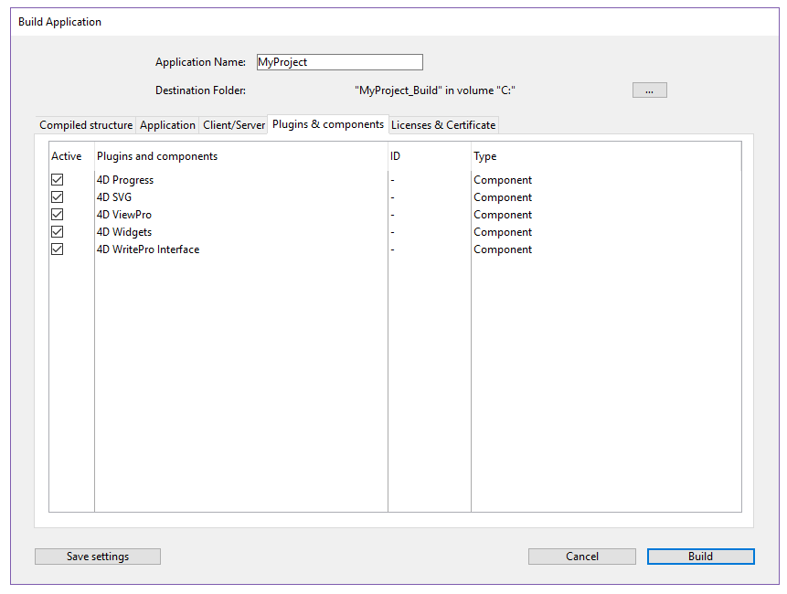
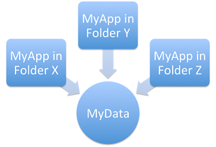
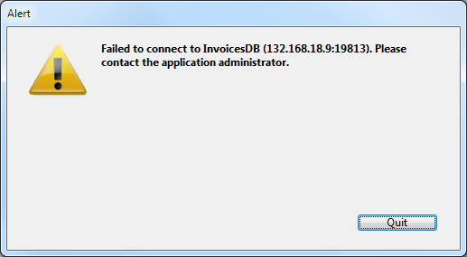

4D Developer inclui um gerador de aplicação final para criar um pacote de projeto (versão final). Esse gerador simplifica o processo de finalização e desenvolvimento de aplicativos compilados 4D. Trata automaticamente as funcionalidades específicas de diferentes sistemas operacionais e facilita a implementação de aplicações cliente-servidor.

O construtor de aplicações permite-lhe:

* Construir uma base de dados compilada, sem código interpretado,
* Construir uma aplicação autônoma, de duplo clique, *i.e.*, fundida com 4D Volume Desktop, o motor de banco de dados 4D,
* Gerar diferentes aplicações a partir do mesmo banco de dados compilado mediante um projeto XML,
* Criar aplicações cliente-servidor homogêneas,
* Construir aplicações cliente-servidor com atualização automática de partes do cliente e do servidor.
* Salve seus parâmetros de geração para uso futuro (botão *Salvar parâmetros*).

## Visão geral do aplicativo gerador de aplicações

A cria de um pacote de projetos pode ser efetuada utilizando:

* ou o comando [BUILD APPLICATION](https://doc.4d.com/4Dv17R6/4D/17-R6/BUILD-APPLICATION.301-4311300.en.html),
* ou a [Janela do criador de aplicações](#application-builder).

Para exibir o diálogo Build Application , selecione **Design** > **Build Application...** na barra de menu.


A caixa de diálogo Criar aplicação inclui várias páginas que podem ser acedidas através de separadores:


A geração só pode ser efetuada após a compilação do banco de dados. Se você selecionar esse comando sem ter compilado o banco de dados anteriormente ou se o código compilado não corresponder ao código interpretado, será exibida uma caixa de diálogo de aviso indicando que o banco de dados deve ser (re)compilado.

### Parâmetros do gerador de aplicações

Cada parâmetro do aplicativo de compilação é armazenado como uma chave XML no arquivo de projeto do aplicativo denominado arquivo XML "buildApp.4DSettings", localizado na pasta Settings do banco de dados.

Os parâmetros padrão são utilizados na primeira vez que a caixa de diálogo Criar aplicação é utilizada. O conteúdo do ficheiro é atualizado, se necessário, quando se clica em **Criar** ou **Salvar os parâmetros**. Pode definir vários outros ficheiros de parâmetros XML para o mesmo projeto e utilizá-los utilizando o comando [BUILD APPLICATION](https://doc.4d.com/4Dv17R6/4D/17-R6/BUILD-APPLICATION.301-4311300.en.html).

As chaves XML oferecem opções adicionais além daquelas exibidas na caixa de diálogo Criar aplicativo. A descrição dessas chaves é detalhada no manual [4D XML Keys BuildApplication](https://doc.4d.com/4Dv17R6/4D/17-R6/4D-XML-Keys-BuildApplication.100-4465602.en.html).

### Arquivo histórico

Quando uma aplicação é construída, 4D gera um arquivo de registro na pasta **Logs** . O arquivo de registro armazena as seguintes informações para cada compilação:

* O início e o fim da construção de objetivos,
* O nome e o caminho de acesso completo dos ficheiros gerados,
* A data e a hora da geração,
* Todos os erros produzidos.

## Nome da aplicação e pasta de destino


Digite o nome do aplicativo em **Application Name**.

Especifique a pasta para o aplicativo criado em **Destination Folder (Pasta de destino)**. Se a pasta especificada ainda não existir, o 4D criará uma pasta *Build* para você.

## Página de estrutura compilada

Essa guia permite que você crie um arquivo de estrutura compilado padrão ou um componente compilado:


### Construir a estrutura compilada

Constrói uma base de dados contendo apenas código compilado.

Esse recurso cria um arquivo *.4dz* em uma pasta *Compiled Database* . Se nomeou a sua aplicação como "MyProject", 4D irá criar:

`\&#060;destination\&#062;/Compiled Database/\&#060;database name&#062;/\MyProject.4dz`

> Um arquivo .4dz é essencialmente uma versão compactada da pasta do projeto. Os arquivos .4dz podem ser usados pelo 4D Server, 4D Volume license (aplicativos mesclados) e 4D Developer. O tamanho compacto e otimizado dos arquivos .4dz torna os pacotes de projeto fáceis de implantar.

#### Incluir pastas relacionadas

Quando você marcar esta opção, quaisquer pastas relacionadas ao banco de dados são copiadas para a pasta de compilação como pastas *Components* e *Recursos*. Para obter mais informações sobre estas pastas, consulte [Arquitetura do Banco de Dados](https://livedoc.4d.com/4D-Design-Reference-18/Managing-4D-databases/Description-of-4D-files.300-4575698.en.html#100374).

### Gerar um componente

Constrói um componente compilado a partir da estrutura.

Um componente é um projeto padrão 4D onde foram desenvolvidas funcionalidades específicas. Uma vez que o componente foi configurado e instalado em outro banco de dados 4D (o banco de dados de host), as suas funcionalidades são acessíveis a partir do banco de dados de host. Para obter mais informações sobre componentes, consulte a documentação de desenvolvimento e instalação de componentes 4D.

Se você nomeou seu aplicativo, *MyComponent*, 4D irá criar uma pasta de componentes contendo a pasta *MyComponent.4dbase*:

`\&#060;destino&#062;/Components/name.4dbase/\&#060;name&#062;.4DZ`

A pasta *MyComponent.4dbase* contém:

* arquivo **MyComponent.4DZ**
* Uma pasta *Resources* - quaisquer Recursos associados são automaticamente copiados para esta pasta. Quaisquer outros componentes e/ou pastas de plug-ins não são copiados (um componente não pode utilizar plug-ins ou outros componentes).

## Página Aplicação

Essa guia permite que você crie uma versão autônoma e de usuário único do seu aplicativo:


### Criar uma aplicação autónoma

Marcar a opção **Build stand-alone Application** e clicar em **Build** criará um aplicativo autônomo (clicável duas vezes) diretamente do seu projeto de banco de dados.

Os seguintes elementos são necessários para a construção:

* 4D Volume Desktop (o motor de base de dados 4D),
* uma [licença apropriada](#licenses)

No Windows, esta funcionalidade cria um ficheiro executável (.exe). Em macOS, trata da criação de pacotes de software.

O princípio consiste em fundir um ficheiro de estrutura compilado com 4D Volume Desktop. A funcionalidade fornecida pelo ficheiro 4D Volume Desktop está ligada à oferta do produto a que se subscreveu. Para mais informações sobre este ponto, consulte a documentação de vendas e a [4D Store](http://www.4d.com/).

Você pode definir um arquivo de dados padrão ou permitir que os usuários criem e usem seu próprio arquivo de dados (consulte o gerenciamento [de arquivos de dados na seção de aplicativos finais](https://doc.4d.com/4Dv17R6/4D/17-R6/Data-file-management-in-final-applications.300-4354729.en.html)).

É possível automatizar a atualização de aplicativos de usuário único mesclados através de uma sequência de comandos de idioma (veja [Atualização automática de aplicativos de servidor ou de usuário único](https://doc.4d.com/4Dv17R6/4D/17-R6/Automatic-updating-of-server-or-single-user-applications.300-4354721.en.html).

#### Localização do 4D Volume Desktop

Para construir uma aplicação independente, você deve primeiro designar a pasta que contém o arquivo da área de trabalho do volume 4D:

* *Windows* - a pasta contém o 4D Volume Desktop.4DE, 4D Volume Desktop.RSR, bem como vários arquivos e pastas necessários para sua operação. Esses itens devem ser colocados no mesmo nível da pasta selecionada.
* *macOS* - 4D Volume Desktop é fornecido na forma de um pacote de software estruturado que contém vários arquivos genéricos e pastas.

Para selecionar a pasta Desktop de volume 4D, clique no botão **[...]**. Uma caixa de diálogo aparece permitindo que você designe a pasta 4D Volume Desktop (Windows) ou pacote (macOS).

Depois que a pasta for selecionada, o nome completo do caminho será exibido e, se realmente conter 4D Volume Desktop, a opção para a construção de uma aplicação executável é ativada.

> O número da versão do 4D Volume Desktop deve corresponder ao número da versão do 4D Developer Edition. Por exemplo, se você usar o 4D Developer v18, deverá selecionar um 4D Volume Desktop v18.

#### Modo de ligação de dados

Esta opção permite escolher o modo de ligação entre o aplicativo mesclado e o arquivo de dados local. Estão disponíveis dois modos de ligação de dados:

* **Por nome da aplicação** (por defeito) - A aplicação 4D abre automaticamente o ficheiro de dados mais recentemente aberto correspondente ao ficheiro de estrutura. Isto permite-lhe mover o pacote de aplicações livremente no disco. Esta opção deve ser geralmente utilizada para aplicações fundidas, a menos que seja especificamente necessário duplicar a aplicação.

* **Por caminho do aplicativo** - O aplicativo 4D mesclado analisará o arquivo *lastDataPath.xml* do aplicativo e tentará abrir o arquivo de dados com um atributo "executablePath" que corresponda ao caminho completo do aplicativo. Se tal entrada for encontrada, o arquivo de dados correspondente (definido através do seu atributo "dataFilePath") será aberto. Caso contrário, o último arquivo de dados aberto será aberto (modo padrão).

Para obter mais informações sobre o modo de ligação de dados, consulte [Último arquivo de dados aberto](#last-data-file-opened).

#### Arquivos gerados

Quando você clicar no botão **Construa** , A 4D cria automaticamente uma pasta **Aplicação Final** na pasta de Destino **** especificada. Dentro da pasta de Aplicação Final está uma subpasta com o nome do aplicativo especificado nele.

Se você tiver especificado "MyProject" como o nome do aplicativo, encontrará os seguintes arquivos nessa subpasta (também conhecida como MyProject):

* *Windows*
  * MyProject.exe - Seu executável e um MyProject.rsr (os recursos da aplicação)
  * Pasta 4D Extensions, pasta Resources, várias bibliotecas (DLL), pasta Native Components, pasta SASL Plugins - Arquivos necessários para a operação do aplicativo
  * Uma pasta Database - Inclui uma pasta Resources e um arquivo MyProject.4DZ. Eles formam a estrutura compilada do banco de dados, bem como a pasta Recursos do banco de dados. **Observação**: Essa pasta também contém a pasta *Default Data* , se ela tiver sido definida (consulte [Gerenciamento de arquivos de dados em aplicativos finais](#data-file-management-in-final-applicatons).
  * (Opcional) Pasta Components e/ou pasta Plugins - Contém todos os componentes e/ou arquivos de plug-in incluídos no banco de dados. Para obter mais informações sobre isso, consulte os plugins [e componentes](#plugins-and-components).
  * Pasta de licenças - Um arquivo XML com números de licença integrados ao aplicativo. Para obter mais informações sobre isso, consulte a seção [Licenses & Certificate](#licenses-and-certificate) .
  * Itens adicionais adicionados à pasta da Área de Trabalho de Volume 4D, se houver (veja [Personalizando a pasta de Volume 4D para Desktop](#customizing-4d-volume-desktop-folder)).

 Todos estes itens devem ser mantidos na mesma pasta para que o executável possa operar.

* *macOS*
  * Um pacote de software chamado MyProject.app que contém seu aplicativo e todos os itens necessários para sua operação, incluindo os plug-ins, componentes e licenças. Para obter mais informações sobre a integração de plug-ins e componentes, consulte a seção [Plugins e componentes](#plugins-and-components) . Para obter mais informações sobre a integração de licenças, consulte a seção [Licenses & Certificate](#licenses-and-certificate) . **Nota**: No macOS, o comando [Application file](https://doc.4d.com/4Dv17R6/4D/17-R6/Application-file.301-4311297.en.html) do idioma 4D retorna o caminho do arquivo ApplicationName (localizado na pasta Contents:macOS do pacote do software) e não o do arquivo .comp (Pasta Contents:Resources do pacote de software).

#### Personalização da pasta 4D Volume Desktop

Ao criar um aplicativo autônomo, o 4D copia o conteúdo da pasta 4D Volume Desktop para a pasta Destination > *Final Application* . Então, você será capaz de personalizar o conteúdo da pasta original de volume da área de trabalho 4D de acordo com suas necessidades. Pode, por exemplo:

* Instalar uma versão 4D Volume Desktop correspondente a um idioma específico;
* Adicionar uma pasta personalizada *PlugIns*;
* Construir um pacote de projeto
> No macOS, o 4D Volume Desktop é fornecido na forma de um pacote de software. Para modificá-lo, primeiro é preciso exibir seu conteúdo (**Control+clique** no ícone).

#### Localização dos arquivos da Web

Se o seu aplicativo autônomo for usado como um servidor Web, os arquivos e pastas exigidos pelo servidor devem ser instalados em locais específicos. Estes itens são os seguintes:

* *arquivos cert.pem* e *key.pem* (opcional): Esses arquivos são usados para conexões SSL e por comandos de criptografia de dados,
* pasta raiz Web padrão.

Os elementos devem ser instalados:

* **no Windows**: na *Aplicação Final\MyProject\Database*.
* **no macOS**: ao lado do pacote de software *MyProject.app*.

## Página cliente/servidor

Nessa guia, você pode criar aplicativos cliente-servidor personalizados que sejam homogêneos, multiplataforma e com uma opção de atualização automática.


### O que é uma aplicação Cliente/Servidor?

Uma aplicação cliente/servidor provém da combinação de três itens:

* Um banco de dados 4D compilado,
* A aplicação 4D Server,
* A aplicação 4D Volume Desktop (macOS e/ou Windows).

Uma vez criado, um aplicativo cliente/servidor é composto de duas partes personalizadas: a parte do servidor (exclusiva) e a parte do cliente (a ser instalada em cada máquina cliente).

Além disso, o aplicativo cliente/servidor é personalizado e fácil de usar:

* Para iniciar a parte do servidor, o usuário simplesmente clica duas vezes no aplicativo do servidor. Não é necessário selecionar a base de dados.
* Para iniciar a parte do cliente, o usuário simplesmente clica duas vezes no aplicativo cliente, que se conecta diretamente ao aplicativo do servidor. Não é necessário escolher um banco de dados em uma caixa de diálogo de conexão. O cliente direciona o servidor usando seu nome, quando o cliente e o servidor estão na mesma sub-rede, ou usando seu endereço IP, que é definido usando a chave `IPAddress` XML no arquivo buildapp.4DSettings. Se a conexão falhar, mecanismos alternativos específicos do [podem ser implementados](#management-of-client-connections). Você pode "forçar" a exibição da caixa de diálogo de conexão padrão segurando a tecla **Opção** (macOS) ou **Alt** (Windows) enquanto inicia a aplicação cliente. Apenas a parte do cliente pode conectar à parte do servidor correspondente. Se um usuário tentar conectar à parte do servidor usando uma aplicação 4D padrão, uma mensagem de erro é retornada e a conexão é impossível.
* Um aplicativo cliente/servidor pode ser definido para que a parte do cliente [possa ser atualizada automaticamente através da rede](#copy-of-client-applications-in-the-server-application).
* It is also possible to automate the update of the server part through the use of a sequence of language commands ([SET UPDATE FOLDER](https://doc.4d.com/4Dv17R6/4D/17-R6/SET-UPDATE-FOLDER.301-4311308.en.html) and [RESTART 4D](https://doc.4d.com/4Dv17R6/4D/17-R6/RESTART-4D.301-4311311.en.html)).

### Criar aplicação servidor

Marque esta opção para gerar a parte do servidor da sua aplicação durante a fase de construção. Você deve designar a localização em seu disco da aplicação 4D Server para ser usado. Esse servidor 4D deve corresponder à plataforma atual (que também será a plataforma do aplicativo do servidor).

#### Localização do 4D Server

Clique no botão **[...]** e use *Procurar pasta* para localizar o aplicativo 4D Server No macOS, deve selecionar o pacote 4D Server diretamente.

#### Versão atual

Utilizado para indicar o número da versão atual da aplicação gerada. Pode então aceitar ou rejeitar ligações de aplicações cliente conforme o seu número de versão. The interval of compatibility for client and server applications is set using specific [XML keys](#build-application-settings)).

#### Modo de ligação de dados

Esta opção permite escolher o modo de ligação entre o aplicativo mesclado e o arquivo de dados local. Estão disponíveis dois modos de ligação de dados:

* **Por nome da aplicação** (por defeito) - A aplicação 4D abre automaticamente o ficheiro de dados mais recentemente aberto correspondente ao ficheiro de estrutura. Isto permite-lhe mover o pacote de aplicações livremente no disco. Esta opção deve ser geralmente utilizada para aplicações fundidas, a menos que seja especificamente necessário duplicar a aplicação.

* **Por caminho do aplicativo** - O aplicativo 4D mesclado analisará o arquivo *lastDataPath.xml* do aplicativo e tentará abrir o arquivo de dados com um atributo "executablePath" que corresponda ao caminho completo do aplicativo. Se tal entrada for encontrada, o arquivo de dados correspondente (definido através do seu atributo "dataFilePath") será aberto. Caso contrário, o último arquivo de dados aberto será aberto (modo padrão).

Para obter mais informações sobre o modo de ligação de dados, consulte [Último arquivo de dados aberto](#last-data-file-opened).

### Criar a aplicação cliente

Marcar esta opção gera a parte do cliente da sua aplicação durante a fase de construção.

#### 4D Volume Desktop

You must designate the location on your disk of the 4D Volume Desktop application to be used. This 4D Volume Desktop must correspond to the current platform (which will also be the platform of the client application). If you want to build a client application for a “concurrent” platform, you must carry out an additional build operation using a 4D application running on that platform. This is only necessary for the initial version of the client application since subsequent updates can be handled directly on the same platform using the automatic update mechanism. For more information about this point, see [Customizing 4D Server and/or 4D Client folders](#customizing-4d-server-and-or-4d-client-folders).

> O número da versão do 4D Volume Desktop deve corresponder ao número da versão do 4D Developer Edition. Por exemplo, se você usar o 4D Developer v18, deverá selecionar um 4D Volume Desktop v18.

Se você deseja que o aplicativo cliente se conecte ao servidor usando um endereço específico (diferente do nome do servidor publicado na sub-rede), você deve usar a chave `IPAddress` XML no aplicativo buildapp. Arquivo DConfigurações. For more information about this file, refer to the description of the `BUILD APPLICATION` command. Você também pode implementar mecanismos específicos em caso de falha na conexão. Os diferentes cenários propostos são descritos no parágrafo [Gerenciamento de conexões por aplicativos cliente](#management-of-client-connections).

#### Cópia de aplicações clientes na aplicação do servidor

The options of this area to set up the mechanism for updating the client parts of your client/server applications using the network each time a new version of the application is generated.

* **Allow automatic update of Windows client application** - Check these options so that your Windows client/server application can take advantage of the automatic update mechanism for clients via the network.
* **Allow automatic update of Macintosh client application** - Check these options so that your Macintosh client/server application can take advantage of the automatic update mechanism for clients via the network.

* **Allow automatic update of Macintosh client application** - If you want to create a cross-platform client application, you must designate the location on your disk of the 4D Volume Desktop application that corresponds to the “concurrent” platform of the build platform.

 For example, if you build your application in Windows, you must use the **[...]** button to designate the 4D Volume Desktop macOS application (provided as a package).

#### Mostrar notificação de atualização

A notificação de atualização da aplicação cliente é realizada automaticamente após a atualização da aplicação do servidor.

Funciona da seguinte forma: quando uma nova versão do cliente/servidor de aplicação é feita usando o construtor de aplicação, a parte do novo cliente será copiada como um arquivo compactado na subpasta **Upgrade4DClient** da pasta do Servidor **ApplicationName** (no macOS, estas pastas estão incluídas no pacote do servidor). Se você seguiu o processo de geração de um aplicativo cliente multiplataforma, uma . O arquivo de atualização*4darchive* está disponível para cada plataforma:

Para acionar notificações de atualização de aplicativo cliente, basta substituir a versão antiga do aplicativo servidor pelo novo e, em seguida, executá-lo. O resto do processo é automático.

Do lado do cliente, quando a aplicação cliente "antiga" tenta conectar-se à aplicação servidor atualizada, se mostra uma caixa de diálogo na máquina cliente, indicando que há uma nova versão disponível. O utilizador pode tanto actualizar a sua versão como cancelar a caixa de diálogo.

* Se o utilizador clicar em **OK**, a nova versão é descarregada para a máquina cliente através da rede. Uma vez terminado o download, a antiga aplicação cliente é fechada e a nova versão é lançada e liga-se ao servidor. A versão antiga da aplicação é então colocada na lixeira da máquina.
* Se o usuário clicar em **Cancelar**, a atualização será cancelada; se a versão antiga do aplicativo cliente não estiver na gama de versões aceitas pelo servidor (por favor, consulte o parágrafo a seguir), o aplicativo está fechado e a conexão é impossível. Caso contrário (por defeito), a ligação é estabelecida.

#### Forçar atualizações automáticas

Em alguns casos, poderá querer impedir que as aplicações cliente possam cancelar a transferência da atualização. Por exemplo, se usou uma nova versão da aplicação fonte 4D Server, a nova versão da aplicação cliente deve absolutamente ser instalada em cada máquina cliente.

Para forçar a atualização, basta excluir o número da versão atual das aplicações cliente (X-1 e anteriores) no intervalo de números de versão compatível com a aplicação do servidor. Neste caso, o mecanismo de atualização não permitirá a conexão de aplicativos cliente não atualizados. Por exemplo, se a nova versão do aplicativo cliente-servidor for 6, pode estipular-se que qualquer aplicativo cliente com um número de versão inferior a 6 não será autorizado a ligar.

O número da versão [atual](build-server-application) é definido na página do Cliente/Servidor da caixa de diálogo da aplicação de construção. The intervals of authorized numbers are set in the application project using specific [XML keys](#build-application-settings).

#### Erro de actualização

If 4D cannot carry out the update of the client application, the client machine displays the following error message: “The update of the client application failed. A aplicação vai agora desistir."

Existem muitas causas possíveis para este erro. Quando você receber esta mensagem, é aconselhável verificar os seguintes parâmetros primeiro:

* **Pathnames** - Verifique a validade dos pathnames definidos no projeto de aplicação através da caixa de diálogo do Construtor de Aplicação ou via chaves XML (por exemplo *ClientMacFolderToWin*). Em particular, verifique os caminhos para as versões do 4D Volume Desktop.
* **privilégios de leitura/gravação** - Na máquina do cliente, verifique se o usuário atual tem direitos de acesso de gravação para a atualização da aplicação do cliente.

### Ficheiros gerados

Uma vez que uma aplicação cliente/servidor é criada, você encontrará uma nova pasta na pasta de destino chamada **Client Server executable**. This folder contains two subfolders, `\&#060;ApplicationName&#062;Client` and `\&#060;ApplicationName&#062;Server`.
> Estas pastas não são geradas se ocorrer um erro. Neste caso, abra o arquivo [log](#log-file) para descobrir a causa do erro.

The `\&#060;ApplicationName&#062;Client` folder contains the client portion of the application corresponding to the execution platform of the application builder. Esta pasta deve ser instalada em cada máquina do cliente. The `\&#060;ApplicationName&#062;Server` folder contains the server portion of the application.

O conteúdo dessas pastas varia dependendo da plataforma atual:

* *Windows* - Each folder contains the application executable file, named `\&#060;ApplicationName&#062;Client.exe`for the client part and `\&#060;ApplicationName&#062;Server.exe` for the server part as well as the corresponding .rsr files. As pastas também contêm vários arquivos e pastas necessários para que os aplicativos funcionem e itens personalizados que podem estar na pasta de Volume 4D e no Servidor 4D.
* *macOS* - Each folder contains only the application package, named `\&#060;ApplicationName&#062; Client` for the client part and `\&#060;ApplicationName&#062; Server` for the server part. Cada pacote contém todos os itens necessários para que a aplicação funcione. No macOS, inicie um pacote fazendo duplo clique no mesmo.

 > Os pacotes macOS construídos contêm os mesmos itens que as subpastas do Windows. Você pode exibir seu conteúdo (**Control+click** no ícone para poder modificá-los.

If you checked the “Allow automatic update of client application” option, an additional subfolder called *Upgrade4DClient* is added in the `\&#060;ApplicationName&#062;Server` folder/package. Esta subpasta contém o aplicativo cliente no macOS e/ou no formato Windows como um arquivo compactado. Este ficheiro é utilizado durante a atualização automática das aplicações clientes.

#### Personalização da pasta 4D Volume Desktop

When building a double-clickable application, 4D copies the contents of the 4D Volume Desktop folder into the Final Application subfolder of the destination folder. You are then able to customize the contents of the original 4D Volume Desktop folder according to your needs. Pode, por exemplo:

* Instalar uma versão 4D Volume Desktop correspondente a um idioma específico;
* Adicionar uma pasta personalizada PlugIns;
* Personalize o conteúdo da pasta Resources.

#### Localização dos arquivos da Web

Se o servidor e/ou cliente parte do seu aplicativo clicável duplo for usado como um servidor web, os arquivos e pastas exigidos pelo servidor devem ser instalados em locais específicos. Estes itens são os seguintes:

* *arquivos cert.pem* e *key.pem* (opcional): Esses arquivos são usados para conexões SSL e por comandos de criptografia de dados,
* Pasta raiz Web por defeito (WebFolder).

Os elementos devem ser instalados:

* **em Windows**
  * **Server application** - in the `Client Server executable\ \&#060;ApplicationName&#062;Server\Server Database` subfolder.
  * **Client application** - in the `Client Server executable\ \&#060;ApplicationName&#062;Client` subfolder.

* **no macOS**
  * **Server application** - next to the `\&#060;ApplicationName&#062;Server` software package.
  * **Client application** - next to the `\&#060;ApplicationName&#062;Client` software package.

## Página Plugins e componentes

On this tab, you set each [plug-in](Concepts/plug-ins.md) and each [component](Concepts/components.md) that you will use in your stand-alone or client/server application.

A página lista os elementos carregados pela aplicação 4D atual:



* Coluna **Active** - Indica que os itens serão integrados no pacote de aplicação compilado. Todos os itens são marcados por padrão. Para excluir um plug-in ou um componente, desmarque a caixa de seleção ao lado dele.

* **Plugins and components** column - Displays the name of the plug-in/component.

* **ID** column - Displays the plug-in/component's identification number (if any).

* **Type** column - Indicates the type of item: plug-in or component.

Se você quer integrar outros plugins ou componentes na aplicação executável, você só precisa colocá-los em uma pasta **PlugIns** ou **Components** ao lado da aplicação 4D Volume Desktop ou ao lado da aplicação 4D Server O mecanismo para copiar o conteúdo da pasta do aplicativo de origem (ver [Personalizando a pasta desktop de volume 4D](#customizing-4d-volume-desktop-folder)) pode ser usado para integrar qualquer tipo de arquivo na aplicação executável.

Se houver um conflito entre duas versões diferentes do mesmo plug-in (uma carregada por 4D e a outra localizada na pasta do aplicativo de origem), prioridade vai para o plug-in instalado na pasta Volume Desktop/4D do Servidor. No entanto, se houver duas instâncias do mesmo componente, o aplicativo não abrirá.
> The use of plug-ins and/or components in a deployment version requires the necessary license numbers.

## Página Licenças e certificados

A página Licences & Certificate pode ser utilizada para:

* designar o(s) número(s) da licença que você deseja integrar em seu aplicativo de stand-alone de usuário único
* assinar a aplicação através de um certificado no macOS.


### Licenças

Esta aba exibe a lista de licenças de implantação disponíveis que você poderá integrar ao seu aplicativo. Por padrão, a lista está vazia. Você deve adicionar explicitamente sua licença *4D Developer Professional* bem como cada licença *4D Desktop Volume* para ser usada na aplicação criada. Você pode adicionar outro número de Profissional de Desenvolvedor 4D e suas licenças associadas, além da que está sendo usada atualmente.

Para remover ou adicionar uma licença, use os botões **[+]** e **[-]** na parte inferior da janela.

Quando você clicar no botão \[+], uma caixa de diálogo 'Abrir arquivo' aparece exibindo por padrão o conteúdo da pasta *Licenças* do seu computador. Para obter mais informações sobre a localização desta pasta, consulte o comando [Get 4D folder](https://doc.4d.com/4Dv17R6/4D/17-R6/Get-4D-folder.301-4311294.en.html).

Você deve designar os arquivos que contêm sua licença de desenvolvedor, bem como os que contém suas licenças de implantação. Esses arquivos foram gerados ou atualizados quando a licença *4D Developer Professional* e as licenças *4D Desktop Volume* foram compradas.

Depois de selecionar um arquivo, a lista indicará as características da licença que ele contém.

* **Licença #** - Número de licença do produto
* **Licença** - Nome do produto
* **Data de expiração** - Data de expiração da licença (se houver)
* **Caminho** - Localização em disco

Se uma licença não for válida, será avisado por uma mensagem.

Pode designar o número de ficheiros válidos que desejar. Ao construir uma aplicação executável, o 4D usará a licença mais apropriada disponível.
> Licenças "R" dedicadas são necessárias para criar aplicativos com base nas versões de "R-release" (números de licença para "R" produtos começam com "R-4DP").

Depois que o aplicativo é construído, um novo arquivo de licença de implantação é automaticamente incluído na pasta Licenças ao lado do aplicativo executável (Windows) ou no pacote (macOS).

### Certificação de aplicativos OS X

The application builder can sign merged 4D applications under macOS (single-user applications, 4D Server and client parts under macOS). A assinatura de um aplicativo autoriza que ele seja executado usando a funcionalidade de Gatekeeper do macOS quando a opção "Mac App Store e Desenvolvedores identificados" estiver selecionada (veja "Sobre Gatekeeper" abaixo).

* Verifique a opção do Sinal **** para incluir certificação no procedimento de construtor de aplicativos para OS X. 4D irá verificar a disponibilidade de elementos necessários para a certificação quando a compilação ocorrer:


Esta opção é exibida tanto no Windows quanto no macOS, mas apenas é tida em conta para as versões do macOS.

* **Nome do certificado** - Digite o nome do seu certificado de desenvolvedor validado pela Apple nesta área de entrada. O nome do certificado geralmente é o nome do certificado no utilitário Acesso Keychain (parte em vermelho no exemplo a seguir):


Para obter um certificado de desenvolvedor da Apple, Inc., você pode usar os comandos do menu Acesso de Chaves ou vá aqui: [http://developer.apple.com/library/mac/#documentation/Security/Conceptual/CodeSigningGuide/Procedures/Procedures.html](http://developer.apple.com/library/mac/#documentation/Security/Conceptual/CodeSigningGuide/Procedures/Procedures.html).
> Este certificado requer a presença da utilidade do co design da Apple, que é fornecida por padrão e geralmente localizada na pasta "/usr/bin/". Se ocorrer um erro, verifique se este utilitário está presente em seu disco.

#### Sobre Gatekeeper

Gatekeeper é um recurso de segurança do OS X que controla a execução de aplicativos baixados da internet. Se um aplicativo baixado não vem da Apple Store ou não estiver assinado, será rejeitado e não poderá ser iniciado.

The **Sign application** option of the 4D application builder lets you generate applications that are compatible with this option by default.

#### Sobre a notarização

A notarização de aplicação é altamente recomendada pela Apple a partir do macOS 10.14.5 (Mojave) e 10. 5 (Catalina), pois aplicativos não notariados implantados através da internet são bloqueados por padrão.

In 4D v18, the [built-in signing features](#os-x-signing-certificate) have been updated to meet all of Apple's requirements to allow using the Apple notary service. A notarização em si deve ser conduzida pelo desenvolvedor e é independente da 4D (note também que ela requer a instalação do Xcode). Veja [o blog](https://blog.4d.com/how-to-notarize-your-merged-4d-application/)com uma descrição do processo de notarização.

Para obter mais informações sobre o conceito de notarização, consulte [nesta página no site de desenvolvedores Apple](https://developer.apple.com/documentation/xcode/notarizing_your_app_before_distribution/customizing_the_notarization_workflow).

## Personalizar ícones de uma aplicação

4D associa um ícone padrão com sistema autônomo, servidor e aplicativos clientes, no entanto, você pode personalizar o ícone para cada aplicativo.

* **macOs** - Ao construir uma aplicação com duplo clique, 4D lida com a personalização do ícone. Para fazer isso, você deve criar um arquivo de ícone (tipo de icns), antes de criar o arquivo do aplicativo, e colocá-lo ao lado da pasta do projeto.
> A Apple, Inc. fornece uma ferramenta específica para construir arquivos de ícones *icns* (para mais informações, consulte a documentação da [Apple](https://developer.apple.com/library/archive/documentation/GraphicsAnimation/Conceptual/HighResolutionOSX/Optimizing/Optimizing.html#//apple_ref/doc/uid/TP40012302-CH7-SW2)).

 Seu arquivo de ícone deve ter o mesmo nome do arquivo de projeto e incluir a extensão *.icns*. 4D leva automaticamente este arquivo em conta ao construir o aplicativo clicável duplo (o arquivo *.icns* é renomeado *ApplicationName. cns* e copiou para a pasta Recursos; *CFBundleFileIcon* entrada da informação *. lista* arquivo foi atualizado).

* **Windows** - Ao construir uma aplicação clicável e dupla, o 4D lida com a personalização do seu ícone. Para fazer isso, você deve criar um arquivo de ícone (*. extensão co* , antes de construir o arquivo do aplicativo e colocá-lo ao lado da pasta do projeto.

 Seu arquivo de ícone deve ter o mesmo nome do arquivo de projeto e incluir a extensão *.ico*. 4D leva este arquivo automaticamente em conta ao construir um aplicativo clicável duplo.

Você também pode definir as [chaves XML ](https://doc.4d.com/4Dv17R6/4D/17-R6/4D-XML-Keys-BuildApplication.100-4465602.en.html) específicas no arquivo buildApp.4DSettings para designar cada ícone a ser usado. Estão disponíveis as seguintes chaves:

* RuntimeVLIconWinPath
* RuntimeVLIconMacPath
* ServerIconWinPath
* ServerIconMacPath
* ClientMacIconForMacPath
* ClientWinIconForMacPath
* ClientMacIconForWinPath
* ClientWinIconForWinPath

## Gestão do(s) ficheiro(s) de dados

### Abertura do ficheiro de dados

Quando um usuário lança um aplicativo mesclado ou uma atualização (usuário único ou aplicativo/servidor), 4D tenta selecionar um arquivo de dados válido. A aplicação examina sucessivamente vários locais.

A sequência para o lançamento de uma aplicação fusionada a seguinte:

1. O 4D tenta abrir o último arquivo de dados aberto, [conforme descrito abaixo](#last-data-file-opened) (não se aplica durante o lançamento inicial).
2. Se não for encontrado, 4D tenta abrir o arquivo de dados em uma pasta de dados padrão ao lado do arquivo .4DZ em modo somente leitura.
3. Se não for encontrado, 4D tenta abrir o arquivo de dados padrão (mesmo nome e mesmo local do arquivo .4DZ).
4. Se não for encontrado, 4D mostra uma caixa de diálogo padrão "Abrir ficheiro de dados".

### Último arquivo de dados aberto

#### Caminho do último arquivo de dados

Quaisquer aplicativos autônomos ou de servidor criados com 4D armazenam o caminho do último arquivo de dados aberto na pasta preferências do usuário do aplicativo.

O local da pasta de preferências do usuário da aplicação corresponde ao caminho retornado pela seguinte instrução:

```4d
userPrefs:=Get 4D folder(Pasta 4D activa)
```

O caminho do arquivo de dados é armazenado em um arquivo dedicado, chamado *lastDataPath.xml*.

Graças a esta arquitetura, quando você fornece uma atualização do seu aplicativo, o arquivo de dados do usuário local (último arquivo de dados utilizado) é aberto automaticamente na primeira inicialização.

Este mecanismo é geralmente adequado para implantações padrão. No entanto, para necessidades específicas, por exemplo, se você duplicar seus aplicativos mesclados, você pode querer alterar a forma como o arquivo de dados está vinculado ao aplicativo (descrito abaixo).

#### Configuração do modo de ligação de dados

Com suas aplicações compiladas, o 4D utiliza automaticamente o último arquivo de dados aberto. Por padrão, o caminho do arquivo de dados é armazenado na pasta de preferências do usuário do aplicativo e está vinculado ao nome **da aplicação**.

Isso pode ser inadequado se você quiser duplicar um aplicativo com merge destinado a usar arquivos de dados diferentes. Os aplicativos duplicados realmente compartilham a pasta de preferências do usuário do aplicativo e assim, sempre use o mesmo arquivo de dados -- mesmo que o arquivo de dados seja renomeado, porque o último arquivo usado para o aplicativo é aberto.

Por conseguinte, a 4D permite ligar o caminho do arquivo de dados ao caminho da aplicação. Neste caso, o arquivo de dados será vinculado usando um caminho específico e não será apenas o último arquivo aberto. Assim, você vincula seus dados **pelo caminho da aplicação**.

Este modo permite a você duplicar seus aplicativos mesclados sem quebrar o link para o arquivo de dados. No entanto, com esta opção, se o pacote do aplicativo for movido no disco, o usuário será solicitado por um arquivo de dados, já que o caminho do aplicativo não corresponderá mais ao atributo "executablePath" (depois que um usuário tenha selecionado um arquivo de dados, o *lastDataPath. ml* arquivo é atualizado adequadamente).

*Duplicação quando os dados são vinculados pelo nome da aplicação:* 

*Duplicação quando os dados estiverem ligados por caminho da aplicação:* 

Você pode selecionar o modo de ligação de dados durante o processo de construção do aplicativo. Você também pode:

* Use a página [Application](#application) ou [Cliente/Página do servidor](#client-server) da caixa de diálogo da Aplicação de Construção.
* Use a chave **LastDataPathLookup** XML (aplicativo de usuário único ou aplicativo do servidor).

### Definição de uma pasta de dados por defeito

4D permite definir um ficheiro de dados padrão na fase de construção da aplicação. Quando a aplicação é iniciada pela primeira vez, se nenhum arquivo de dados local for encontrado (veja [abertura sequencia descrita acima do](#opening-the-data-file)), o arquivo de dados padrão é aberto automaticamente no modo somente leitura por 4D. Isto dá a você melhor controle sobre a criação e/ou abertura de arquivos ao iniciar uma aplicação mesclada pela primeira vez.

Mais especificamente, são abrangidos os seguintes casos:

* Evitar a exibição da caixa de diálogo 4D "Abrir Arquivo de Dados" ao iniciar um aplicativo novo ou atualizado com mesclagem. Você pode detectar, por exemplo, na inicialização, que o arquivo de dados padrão foi aberto e, portanto, executa seu próprio código e/ou diálogos para criar ou selecionar um arquivo de dados local.
* Permitir a distribuição de aplicativos mesclados com dados somente de leitura (para aplicativos de demonstração, por exemplo).

Para definir e utilizar um ficheiro de dados padrão:

* You provide a default data file (named "Default.4DD") and store it in a default folder (named "Default Data") inside the database project folder. This file must be provided along with all other necessary files, depending on the database configuration: index (.4DIndx), external Blobs, journal, etc. É sua responsabilidade fornecer um ficheiro de dados padrão válido. No entanto, note que, uma vez que um arquivo de dados padrão é aberto em modo somente leitura, é recomendável desmarcar a opção "Usar Arquivo de Log" no arquivo de estrutura original antes de criar o arquivo de dados.
* Quando a aplicação é criada, a pasta de dados predefinida é integrada na aplicação fundida. Todos os ficheiros dentro desta pasta de dados predefinida também são incorporados.

O gráfico seguinte ilustra esta funcionalidade:


Quando o arquivo de dados padrão é detectado na primeira inicialização, ele é silenciosamente aberto em modo somente leitura Assim, permite que você execute operações personalizadas que não modifiquem o arquivo de dados em si.

## Gestão da(s) ligação(ões) cliente

A gestão de conexões por aplicativos cliente cobre os mecanismos pelos quais um aplicativo cliente mesclado se conecta ao servidor de destino, uma vez situada no seu ambiente de produção.

### Cenário de ligação

O procedimento de conexão para aplicativos cliente mesclados suporta casos onde o servidor dedicado não está disponível. O cenário de inicialização de um aplicação cliente 4D é o seguinte:

* The client application tries to connect to the server using the discovery service (based upon the server name, broadcasted on the same subnet).  
  OR  
  If valid connection information is stored in the "EnginedServer.4DLink" file within the client application, the client application tries to connect to the specified server address.
* Se isso falhar, o aplicativo cliente tenta se conectar ao servidor usando informações armazenadas na pasta de preferências do usuário do aplicativo ("lastServer. ml" arquivo, veja a última etapa).
* Se isso falhar, o aplicativo cliente exibe uma caixa de diálogo de erro de conexão.
  * Se o usuário clicar no **Select... Botão** (quando permitido pelo desenvolvedor 4D na etapa de compilação, veja abaixo), a caixa de diálogo padrão "conexão do servidor" é exibida.
  * Se o usuário clica no botão **Sair** , o aplicativo será encerrado.
* Se a conexão for bem-sucedida, o aplicativo cliente salva esta informação de conexão na pasta de preferências de usuário do aplicativo para uso futuro.

### Armazenar o último caminho do servidor

O último caminho de servidor usado e validado é automaticamente salvo em um arquivo chamado "lastServer.xml" na pasta de preferências do usuário do aplicativo. Esta pasta está armazenada na seguinte localização:

```4d
userPrefs:=Get 4D folder(Pasta 4D activa)
```

Este mecanismo aborda o caso de o servidor principal alvo estar temporariamente indisponível por algum motivo (modo de manutenção, por exemplo). Quando este caso ocorre pela primeira vez, a caixa de diálogo de seleção do servidor é exibida (se permitido, veja abaixo) e o usuário pode selecionar manualmente um servidor alternativo, cujo caminho é então salvo se a conexão for bem-sucedida. Qualquer não-disponibilidade subsequente seria tratada automaticamente através da informação do caminho "lastServer.xml".

> * Quando aplicativos do cliente não podem se beneficiar permanentemente do serviço de descoberta, por exemplo, por causa da configuração de rede, é recomendável que o desenvolvedor forneça um nome de host no momento da build usando a chave [IP](https://doc.4d.com/4Dv17R6/4D/17-R6/IPAddress.300-4465710.en.html) do "BuildApp. Arquivo DConfigurações" O mecanismo aborda os casos de indisponibilidade temporária.  
> * Pressionando a tecla **Al/Opção** na inicialização para exibir a caixa de diálogo de seleção do servidor ainda é suportada em todos os casos.

### Disponibilidade da caixa de diálogo de seleção do servidor em caso de erro

Você pode escolher se deseja ou não exibir a caixa de diálogo de seleção padrão do servidor em aplicações cliente mescladas quando o servidor não pode ser alcançado. A configuração depende do valor da chave XML [ServerSelectionAllowed](https://doc.4d.com/4Dv17R6/4D/17-R6/ServerSelectionAllowed.300-4465714.en.html) no computador em que a aplicação foi criada:

* **exibir uma mensagem de erro sem acesso possível à caixa de diálogo de seleção do servidor**. Operação padrão. O aplicativo só pode sair.  
  `ServerSelectionAllowed`: **False** ou key omitida 

* **exibir uma mensagem de erro com acesso à caixa de diálogo de seleção do servidor possível**. O usuário pode acessar a janela de seleção do servidor clicando no botão **Select...**. `ServerSelectionAllowed`: **True**  
