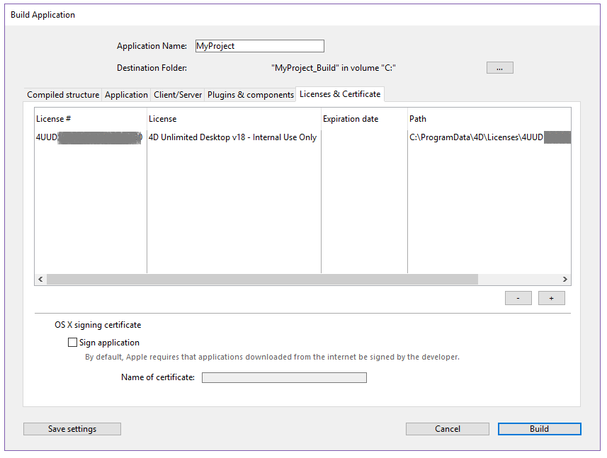

4D Developer inclui um gerador de aplicação final para criar um pacote de projeto (versão final). Esse gerador simplifica o processo de finalização e desenvolvimento de aplicativos compilados 4D. Trata automaticamente as funcionalidades específicas de diferentes sistemas operacionais e facilita a implementação de aplicações cliente-servidor.

O construtor de aplicações permite-lhe:

* Construir uma base de dados compilada, sem código interpretado,
* Construir uma aplicação autônoma, de duplo clique, *i.e.*, fundida com 4D Volume Desktop, o motor de banco de dados 4D,
* Gerar diferentes aplicações a partir do mesmo banco de dados compilado mediante um projeto XML,
* Criar aplicações cliente-servidor homogêneas,
* Construir aplicações cliente-servidor com atualização automática de partes do cliente e do servidor.
* Salve seus parâmetros de geração para uso futuro (botão *Salvar parâmetros*).

## Visão geral do aplicativo gerador de aplicações

A cria de um pacote de projetos pode ser efetuada utilizando:

* ou o comando [BUILD APPLICATION](https://doc.4d.com/4Dv17R6/4D/17-R6/BUILD-APPLICATION.301-4311300.en.html),
* ou a [Janela do criador de aplicações](#application-builder).

Para exibir o diálogo Build Application , selecione **Design** > **Build Application...** na barra de menu.


A caixa de diálogo Criar aplicação inclui várias páginas que podem ser acedidas através de separadores:


A geração só pode ser efetuada após a compilação do banco de dados. Se você selecionar esse comando sem ter compilado o banco de dados anteriormente ou se o código compilado não corresponder ao código interpretado, será exibida uma caixa de diálogo de aviso indicando que o banco de dados deve ser (re)compilado.

### Parâmetros do gerador de aplicações

Cada parâmetro do aplicativo de compilação é armazenado como uma chave XML no arquivo de projeto do aplicativo denominado arquivo XML "buildApp.4DSettings", localizado na pasta Settings do banco de dados.

Os parâmetros padrão são utilizados na primeira vez que a caixa de diálogo Criar aplicação é utilizada. O conteúdo do ficheiro é atualizado, se necessário, quando se clica em **Criar** ou **Salvar os parâmetros**. Pode definir vários outros ficheiros de parâmetros XML para o mesmo projeto e utilizá-los utilizando o comando [BUILD APPLICATION](https://doc.4d.com/4Dv17R6/4D/17-R6/BUILD-APPLICATION.301-4311300.en.html).

As chaves XML oferecem opções adicionais além daquelas exibidas na caixa de diálogo Criar aplicativo. A descrição dessas chaves é detalhada no manual [4D XML Keys BuildApplication](https://doc.4d.com/4Dv17R6/4D/17-R6/4D-XML-Keys-BuildApplication.100-4465602.en.html).

### Arquivo histórico

Quando uma aplicação é construída, 4D gera um arquivo de registro na pasta **Logs** . O arquivo de registro armazena as seguintes informações para cada compilação:

* O início e o fim da construção de objetivos,
* O nome e o caminho de acesso completo dos ficheiros gerados,
* A data e a hora da geração,
* Todos os erros produzidos.

## Nome da aplicação e pasta de destino


Digite o nome do aplicativo em **Application Name**.

Especifique a pasta para o aplicativo criado em **Destination Folder (Pasta de destino)**. Se a pasta especificada ainda não existir, o 4D criará uma pasta *Build* para você.

## Página de estrutura compilada

Essa guia permite que você crie um arquivo de estrutura compilado padrão ou um componente compilado:


### Construir a estrutura compilada

Constrói uma base de dados contendo apenas código compilado.

Esse recurso cria um arquivo *.4dz* em uma pasta *Compiled Database* . Se nomeou a sua aplicação como "MyProject", 4D irá criar:

`\&#060;destination\&#062;/Compiled Database/\&#060;database name&#062;/\MyProject.4dz`

> Um arquivo .4dz é essencialmente uma versão compactada da pasta do projeto. Os arquivos .4dz podem ser usados pelo 4D Server, 4D Volume license (aplicativos mesclados) e 4D Developer. O tamanho compacto e otimizado dos arquivos .4dz torna os pacotes de projeto fáceis de implantar.

#### Incluir pastas relacionadas

Quando você marcar esta opção, quaisquer pastas relacionadas ao banco de dados são copiadas para a pasta de compilação como pastas *Components* e *Recursos*. Para obter mais informações sobre estas pastas, consulte [Arquitetura do Banco de Dados](https://livedoc.4d.com/4D-Design-Reference-18/Managing-4D-databases/Description-of-4D-files.300-4575698.en.html#100374).

### Gerar um componente

Constrói um componente compilado a partir da estrutura.

Um componente é um projeto padrão 4D onde foram desenvolvidas funcionalidades específicas. Uma vez que o componente foi configurado e instalado em outro banco de dados 4D (o banco de dados de host), as suas funcionalidades são acessíveis a partir do banco de dados de host. Para obter mais informações sobre componentes, consulte a documentação de desenvolvimento e instalação de componentes 4D.

Se você nomeou seu aplicativo, *MyComponent*, 4D irá criar uma pasta de componentes contendo a pasta *MyComponent.4dbase*:

`\&#060;destino&#062;/Components/name.4dbase/\&#060;name&#062;.4DZ`

A pasta *MyComponent.4dbase* contém:

* ficheiro *MyComponent.4DZ*
* Uma pasta *Resources* - quaisquer Recursos associados são automaticamente copiados para esta pasta. Quaisquer outros componentes e/ou pastas de plug-ins não são copiados (um componente não pode utilizar plug-ins ou outros componentes).

## Página Aplicação

Essa guia permite que você crie uma versão autônoma e de usuário único do seu aplicativo:


### Criar uma aplicação autónoma

Marcar a opção **Build stand-alone Application** e clicar em **Build** criará um aplicativo autônomo (clicável duas vezes) diretamente do seu projeto de banco de dados.

Os seguintes elementos são necessários para a construção:

* 4D Volume Desktop (o motor de base de dados 4D),
* uma [licença apropriada](#licenses)

No Windows, esta funcionalidade cria um ficheiro executável (.exe). Em macOS, trata da criação de pacotes de software.

O princípio consiste em fundir um ficheiro de estrutura compilado com 4D Volume Desktop. A funcionalidade fornecida pelo ficheiro 4D Volume Desktop está ligada à oferta do produto a que se subscreveu. Para mais informações sobre este ponto, consulte a documentação de vendas e a [4D Store](http://www.4d.com/).

Você pode definir um arquivo de dados padrão ou permitir que os usuários criem e usem seu próprio arquivo de dados (consulte o gerenciamento [de arquivos de dados na seção de aplicativos finais](https://doc.4d.com/4Dv17R6/4D/17-R6/Data-file-management-in-final-applications.300-4354729.en.html)).

É possível automatizar a atualização de aplicativos de usuário único mesclados através de uma sequência de comandos de idioma (veja [Atualização automática de aplicativos de servidor ou de usuário único](https://doc.4d.com/4Dv17R6/4D/17-R6/Automatic-updating-of-server-or-single-user-applications.300-4354721.en.html).

#### Localização do 4D Volume Desktop

Para construir uma aplicação independente, você deve primeiro designar a pasta que contém o arquivo da área de trabalho do volume 4D:

* *Windows* - a pasta contém o 4D Volume Desktop.4DE, 4D Volume Desktop.RSR, bem como vários arquivos e pastas necessários para sua operação. Esses itens devem ser colocados no mesmo nível da pasta selecionada.
* *macOS* - 4D Volume Desktop é fornecido na forma de um pacote de software estruturado que contém vários arquivos genéricos e pastas.

Para selecionar a pasta Desktop de volume 4D, clique no botão **[...]**. Uma caixa de diálogo aparece permitindo que você designe a pasta 4D Volume Desktop (Windows) ou pacote (macOS).

Depois que a pasta for selecionada, o nome completo do caminho será exibido e, se realmente conter 4D Volume Desktop, a opção para a construção de uma aplicação executável é ativada.

> O número da versão do 4D Volume Desktop deve corresponder ao número da versão do 4D Developer Edition. Por exemplo, se você usar o 4D Developer v18, deverá selecionar um 4D Volume Desktop v18.

#### Modo de ligação de dados

Esta opção permite escolher o modo de ligação entre o aplicativo mesclado e o arquivo de dados local. Estão disponíveis dois modos de ligação de dados:

* **Por nome da aplicação** (por defeito) - A aplicação 4D abre automaticamente o ficheiro de dados mais recentemente aberto correspondente ao ficheiro de estrutura. Isto permite-lhe mover o pacote de aplicações livremente no disco. Esta opção deve ser geralmente utilizada para aplicações fundidas, a menos que seja especificamente necessário duplicar a aplicação.

* **Por caminho do aplicativo** - O aplicativo 4D mesclado analisará o arquivo *lastDataPath.xml* do aplicativo e tentará abrir o arquivo de dados com um atributo "executablePath" que corresponda ao caminho completo do aplicativo. Se tal entrada for encontrada, o arquivo de dados correspondente (definido através do seu atributo "dataFilePath") será aberto. Caso contrário, o último arquivo de dados aberto será aberto (modo padrão).

Para obter mais informações sobre o modo de ligação de dados, consulte [Último arquivo de dados aberto](#last-data-file-opened).

#### Arquivos gerados

Quando você clicar no botão **Construa** , A 4D cria automaticamente uma pasta **Aplicação Final** na pasta de Destino **** especificada. Dentro da pasta de Aplicação Final está uma subpasta com o nome do aplicativo especificado nele.

Se você tiver especificado "MyProject" como o nome do aplicativo, encontrará os seguintes arquivos nessa subpasta (também conhecida como MyProject):

* *Windows*
  * MyProject.exe - Seu executável e um MyProject.rsr (os recursos da aplicação)
  * Pasta 4D Extensions, pasta Resources, várias bibliotecas (DLL), pasta Native Components, pasta SASL Plugins - Arquivos necessários para a operação do aplicativo
  * Uma pasta Database - Inclui uma pasta Resources e um arquivo MyProject.4DZ. Eles formam a estrutura compilada do banco de dados, bem como a pasta Recursos do banco de dados. **Observação**: Essa pasta também contém a pasta *Default Data* , se ela tiver sido definida (consulte [Gerenciamento de arquivos de dados em aplicativos finais](#data-file-management-in-final-applicatons).
  * (Opcional) Pasta Components e/ou pasta Plugins - Contém todos os componentes e/ou arquivos de plug-in incluídos no banco de dados. Para obter mais informações sobre isso, consulte os plugins [e componentes](#plugins-and-components).
  * Pasta de licenças - Um arquivo XML com números de licença integrados ao aplicativo. Para obter mais informações sobre isso, consulte a seção [Licenses & Certificate](#licenses-and-certificate) .
  * Itens adicionais adicionados à pasta da Área de Trabalho de Volume 4D, se houver (veja [Personalizando a pasta de Volume 4D para Desktop](#customizing-4d-volume-desktop-folder)).

 Todos estes itens devem ser mantidos na mesma pasta para que o executável possa operar.

* *macOS*
  * Um pacote de software chamado MyProject.app que contém seu aplicativo e todos os itens necessários para sua operação, incluindo os plug-ins, componentes e licenças. Para obter mais informações sobre a integração de plug-ins e componentes, consulte a seção [Plugins e componentes](#plugins-and-components) . Para obter mais informações sobre a integração de licenças, consulte a seção [Licenses & Certificate](#licenses-and-certificate) . **Nota**: No macOS, o comando [Application file](https://doc.4d.com/4Dv17R6/4D/17-R6/Application-file.301-4311297.en.html) do idioma 4D retorna o caminho do arquivo ApplicationName (localizado na pasta Contents:macOS do pacote do software) e não o do arquivo .comp (Pasta Contents:Resources do pacote de software).

#### Personalização da pasta 4D Volume Desktop

Ao criar um aplicativo autônomo, o 4D copia o conteúdo da pasta 4D Volume Desktop para a pasta Destination > *Final Application* . Então, você será capaz de personalizar o conteúdo da pasta original de volume da área de trabalho 4D de acordo com suas necessidades. Pode, por exemplo:

* Instalar uma versão 4D Volume Desktop correspondente a um idioma específico;
* Adicionar uma pasta personalizada *PlugIns*;
* Construir um pacote de projeto
> No macOS, o 4D Volume Desktop é fornecido na forma de um pacote de software. Para modificá-lo, primeiro é preciso exibir seu conteúdo (**Control+clique** no ícone).

#### Localização dos arquivos da Web

Se o seu aplicativo autônomo for usado como um servidor Web, os arquivos e pastas exigidos pelo servidor devem ser instalados em locais específicos. Estes itens são os seguintes:

* *arquivos cert.pem* e *key.pem* (opcional): Esses arquivos são usados para conexões SSL e por comandos de criptografia de dados,
* pasta raiz Web padrão.

Os elementos devem ser instalados:

* **no Windows**: na *Aplicação Final\MyProject\Database*.
* **no macOS**: ao lado do pacote de software *MyProject.app*.

## Página cliente/servidor

Nessa guia, você pode criar aplicativos cliente-servidor personalizados que sejam homogêneos, multiplataforma e com uma opção de atualização automática.


### O que é uma aplicação Cliente/Servidor?

Uma aplicação cliente/servidor provém da combinação de três itens:

* Um banco de dados 4D compilado,
* A aplicação 4D Server,
* A aplicação 4D Volume Desktop (macOS e/ou Windows).

Uma vez criado, um aplicativo cliente/servidor é composto de duas partes personalizadas: a parte do servidor (exclusiva) e a parte do cliente (a ser instalada em cada máquina cliente).

Além disso, o aplicativo cliente/servidor é personalizado e fácil de usar:

* Para iniciar a parte do servidor, o usuário simplesmente clica duas vezes no aplicativo do servidor. Não é necessário selecionar a base de dados.
* Para iniciar a parte do cliente, o usuário simplesmente clica duas vezes no aplicativo cliente, que se conecta diretamente ao aplicativo do servidor. Não é necessário escolher um banco de dados em uma caixa de diálogo de conexão. O cliente direciona o servidor usando seu nome, quando o cliente e o servidor estão na mesma sub-rede, ou usando seu endereço IP, que é definido usando a chave `IPAddress` XML no arquivo buildapp.4DSettings. Se a conexão falhar, mecanismos alternativos específicos do [podem ser implementados](#management-of-client-connections). You can "force" the display of the standard connection dialog box by holding down the **Option** (macOS) or **Alt** (Windows) key while launching the client application. Only the client portion can connect to the corresponding server portion. If a user tries to connect to the server portion using a standard 4D application, an error message is returned and connection is impossible.
* A client/server application can be set so that the client portion [can be updated automatically over the network](#copy-of-client-applications-in-the-server-application).
* It is also possible to automate the update of the server part through the use of a sequence of language commands ([SET UPDATE FOLDER](https://doc.4d.com/4Dv17R6/4D/17-R6/SET-UPDATE-FOLDER.301-4311308.en.html) and [RESTART 4D](https://doc.4d.com/4Dv17R6/4D/17-R6/RESTART-4D.301-4311311.en.html)).

### Criar aplicação servidor

Check this option to generate the server part of your application during the building phase. You must designate the location on your disk of the 4D Server application to be used. You must designate the location on your disk of the 4D Server application to be used.

#### Localização do 4D Server

Click on the **[...]** button and use the *Browse for folder* dialog box to locate the 4D Server application. No macOS, deve selecionar o pacote 4D Server diretamente.

#### Versão atual

Utilizado para indicar o número da versão atual da aplicação gerada. Pode então aceitar ou rejeitar ligações de aplicações cliente conforme o seu número de versão. The interval of compatibility for client and server applications is set using specific [XML keys](#build-application-settings)).

#### Modo de ligação de dados

This option lets you choose the linking mode between the merged application and the local data file. Estão disponíveis dois modos de ligação de dados:

* **Por nome da aplicação** (por defeito) - A aplicação 4D abre automaticamente o ficheiro de dados mais recentemente aberto correspondente ao ficheiro de estrutura. Isto permite-lhe mover o pacote de aplicações livremente no disco. Esta opção deve ser geralmente utilizada para aplicações fundidas, a menos que seja especificamente necessário duplicar a aplicação.

* **By application path** - The merged 4D application will parse the application's *lastDataPath.xml* file and try to open the data file with an "executablePath" attribute that matches the application's full path. If such an entry is found, its corresponding data file (defined through its "dataFilePath" attribute) is opened. If such an entry is found, its corresponding data file (defined through its "dataFilePath" attribute) is opened.

For more information about the data linking mode, refer to the [Last data file opened](#last-data-file-opened) section.

### Criar a aplicação cliente

Checking this option generates the client part of your application during the building phase.

#### 4D Volume Desktop

You must designate the location on your disk of the 4D Volume Desktop application to be used. This 4D Volume Desktop must correspond to the current platform (which will also be the platform of the client application). If you want to build a client application for a “concurrent” platform, you must carry out an additional build operation using a 4D application running on that platform. This is only necessary for the initial version of the client application since subsequent updates can be handled directly on the same platform using the automatic update mechanism. For more information about this point, see [Customizing 4D Server and/or 4D Client folders](#customizing-4d-server-and-or-4d-client-folders).

> The 4D Volume Desktop version number must match the 4D Developer Edition version number. For example, if you use 4D Developer v18, you must select a 4D Volume Desktop v18.

If you want the client application to connect to the server using a specific address (other than the server name published on the sub-network), you must use the `IPAddress` XML key in the buildapp.4DSettings file. For more information about this file, refer to the description of the `BUILD APPLICATION` command. You can also implement specific mechanisms in the event of a connection failure. You can also implement specific mechanisms in the event of a connection failure.

#### Cópia de aplicações clientes na aplicação do servidor

The options of this area to set up the mechanism for updating the client parts of your client/server applications using the network each time a new version of the application is generated.

* **Allow automatic update of Windows client application** - Check these options so that your Windows client/server application can take advantage of the automatic update mechanism for clients via the network.
* **Allow automatic update of Macintosh client application** - Check these options so that your Macintosh client/server application can take advantage of the automatic update mechanism for clients via the network.

* **Allow automatic update of Macintosh client application** - If you want to create a cross-platform client application, you must designate the location on your disk of the 4D Volume Desktop application that corresponds to the “concurrent” platform of the build platform.

 For example, if you build your application in Windows, you must use the **[...]** button to designate the 4D Volume Desktop macOS application (provided as a package).

#### Mostrar notificação de atualização

The client application update notification is carried out automatically following the server application update.

It works as follows: when a new version of the client/server application is built using the application builder, the new client portion is copied as a compressed file in the **Upgrade4DClient** subfolder of the **ApplicationName** Server folder (in macOS, these folders are included in the server package). If you have followed the process for generating a cross-platform client application, a .*4darchive* update file is available for each platform:

To trigger client application update notifications, simply replace the old version of the server application with the new one and then execute it. O resto do processo é automático.

Do lado do cliente, quando a aplicação cliente "antiga" tenta conectar-se à aplicação servidor atualizada, se mostra uma caixa de diálogo na máquina cliente, indicando que há uma nova versão disponível. O utilizador pode tanto actualizar a sua versão como cancelar a caixa de diálogo.

* Se o utilizador clicar em **OK**, a nova versão é descarregada para a máquina cliente através da rede. Uma vez terminado o download, a antiga aplicação cliente é fechada e a nova versão é lançada e liga-se ao servidor. Once the download is complete, the old client application is closed and the new version is launched and connects to the server.
* If the user clicks **Cancel**, the update is cancelled; if the old version of the client application is not in the range of versions accepted by the server (please refer to the following paragraph), the application is closed and connection is impossible. Caso contrário (por defeito), a ligação é estabelecida.

#### Forçar atualizações automáticas

Em alguns casos, poderá querer impedir que as aplicações cliente possam cancelar a transferência da atualização. Por exemplo, se usou uma nova versão da aplicação fonte 4D Server, a nova versão da aplicação cliente deve absolutamente ser instalada em cada máquina cliente.

Para forçar a atualização, basta excluir o número da versão atual das aplicações cliente (X-1 e anteriores) no intervalo de números de versão compatível com a aplicação do servidor. In this case, the update mechanism will not allow non-updated client applications to connect. In this case, the update mechanism will not allow non-updated client applications to connect.

The [current version number](build-server-application) is set on the Client/Server page of the Build Application dialog box. The intervals of authorized numbers are set in the application project using specific [XML keys](#build-application-settings).

#### Erro de actualização

If 4D cannot carry out the update of the client application, the client machine displays the following error message: “The update of the client application failed. A aplicação vai agora desistir."

Existem muitas causas possíveis para este erro. When you get this message, it is advisable to check the following parameters first off:

* **Pathnames** - Check the validity of the pathnames set in the application project via the Application builder dialog box or via XML keys (for example *ClientMacFolderToWin*). Em particular, verifique os caminhos para as versões do 4D Volume Desktop.
* **Read/write privileges** - On the client machine, check that the current user has write access rights for the client application update.

### Ficheiros gerados

Once a client/server application is built, you will find a new folder in the destination folder named **Client Server executable**. This folder contains two subfolders, `\&#060;ApplicationName&#062;Client` and `\&#060;ApplicationName&#062;Server`.
> Estas pastas não são geradas se ocorrer um erro. In this case, open the [log file](#log-file) in order to find out the cause of the error.

The `\&#060;ApplicationName&#062;Client` folder contains the client portion of the application corresponding to the execution platform of the application builder. The `\&#060;ApplicationName&#062;Client` folder contains the client portion of the application corresponding to the execution platform of the application builder. The `\&#060;ApplicationName&#062;Server` folder contains the server portion of the application.

O conteúdo dessas pastas varia dependendo da plataforma atual:

* *Windows* - Each folder contains the application executable file, named `\&#060;ApplicationName&#062;Client.exe`for the client part and `\&#060;ApplicationName&#062;Server.exe` for the server part as well as the corresponding .rsr files. The folders also contain various files and folders necessary for the applications to work and customized items that may be in the original 4D Volume Desktop and 4D Server folders.
* *macOS* - Each folder contains only the application package, named `\&#060;ApplicationName&#062; Client` for the client part and `\&#060;ApplicationName&#062; Server` for the server part. Each package contains all the necessary items for the application to work. No macOS, inicie um pacote fazendo duplo clique no mesmo.

 > > The macOS packages built contain the same items as the Windows subfolders. You can display their contents (**Control+click** on the icon) in order to be able to modify them.

If you checked the “Allow automatic update of client application” option, an additional subfolder called *Upgrade4DClient* is added in the `\&#060;ApplicationName&#062;Server` folder/package. This subfolder contains the client application in macOS and/or Windows format as a compressed file. Este ficheiro é utilizado durante a atualização automática das aplicações clientes.

#### Personalização da pasta 4D Volume Desktop

When building a double-clickable application, 4D copies the contents of the 4D Volume Desktop folder into the Final Application subfolder of the destination folder. You are then able to customize the contents of the original 4D Volume Desktop folder according to your needs. Pode, por exemplo:

* Install a 4D Volume Desktop version corresponding to a specific language;
* Adicionar uma pasta personalizada PlugIns;
* Personalize o conteúdo da pasta Resources.

#### Localização de ficheiros Web

If the server and/or client part of your double-clickable application is used as a Web server, the files and folders required by the server must be installed in specific locations. Estes itens são os seguintes:

* *arquivos cert.pem* e *key.pem* (opcional): Esses arquivos são usados para conexões SSL e por comandos de criptografia de dados,
* Pasta raiz Web por defeito (WebFolder).

Os elementos devem ser instalados:

* **em Windows**
  * **Server application** - in the `Client Server executable\ \&#060;ApplicationName&#062;Server\Server Database` subfolder.
  * **Client application** - in the `Client Server executable\ \&#060;ApplicationName&#062;Client` subfolder.

* **no macOS**
  * **Server application** - next to the `\&#060;ApplicationName&#062;Server` software package.
  * **Client application** - next to the `\&#060;ApplicationName&#062;Client` software package.

## Página Plugins e componentes

On this tab, you set each [plug-in](Concepts/plug-ins.md) and each [component](Concepts/components.md) that you will use in your stand-alone or client/server application.

A página lista os elementos carregados pela aplicação 4D atual:


* **Active** column - Indicates that the items will be integrated into the application package built. Todos os itens são selecionados por padrão. To exclude a plug-in or a component, deselect the check box next to it.

* **Plugins and components** column - Displays the name of the plug-in/component.

* **ID** column - Displays the plug-in/component's identification number (if any).

* **Type** column - Indicates the type of item: plug-in or component.

If you want to integrate other plug-ins or components into the executable application, you just need to place them in a **PlugIns** or **Components** folder next to the 4D Volume Desktop application or next to the 4D Server application. The mechanism for copying the contents of the source application folder (see [Customizing the 4D Volume Desktop folder](#customizing-4d-volume-desktop-folder)) can be used to integrate any type of file into the executable application.

If there is a conflict between two different versions of the same plug-in (one loaded by 4D and the other located in the source application folder), priority goes to the plug-in installed in the 4D Volume Desktop/4D Server folder. However, if there are two instances of the same component, the application will not open.
> The use of plug-ins and/or components in a deployment version requires the necessary license numbers.

## Página Licenças e certificados

A página Licences & Certificate pode ser utilizada para:

* designate the license number(s) that you want to integrate into your single-user stand-alone application
* assinar a aplicação através de um certificado no macOS.



### Licenças

This tab displays the list of available deployment licenses that you can integrate into your application. Por defeito, a lista está vazia. You must explicitly add your *4D Developer Professional* license as well as each *4D Desktop Volume* license to be used in the application built. You can add another 4D Developer Professional number and its associated licenses other than the one currently being used.

To remove or add a license, use the **[+]** and **[-]** buttons at the bottom of the window.

When you click on the \[+] button, an open file dialog box appears displaying by default the contents of the *Licenses* folder of your machine. For more information about the location of this folder, refer to the [Get 4D folder](https://doc.4d.com/4Dv17R6/4D/17-R6/Get-4D-folder.301-4311294.en.html) command.

You must designate the files that contain your Developer license as well as those containing your deployment licenses. These files were generated or updated when the *4D Developer Professional* license and the *4D Desktop Volume* licenses were purchased.

Once you have selected a file, the list will indicate the characteristics of the license that it contains.

* **Licença #** - Número de licença do produto
* **Licença** - Nome do produto
* **Data de expiração** - Data de expiração da licença (se houver)
* **Caminho** - Localização em disco

Se uma licença não for válida, será avisado por uma mensagem.

Pode designar o número de ficheiros válidos que desejar. When building an executable application, 4D will use the most appropriate license available.
> Dedicated "R" licenses are required to build applications based upon "R-release" versions (license numbers for "R" products start with "R-4DDP").

After the application is built, a new deployment license file is automatically included in the Licenses folder next to the executable application (Windows) or in the package (macOS).

### Certificação de aplicativos OS X

The application builder can sign merged 4D applications under macOS (single-user applications, 4D Server and client parts under macOS). Signing an application authorizes it to be executed using the Gatekeeper functionality of macOS when the "Mac App Store and identified Developers" option is selected (see "About Gatekeeper" below).

* Check the **Sign application** option to include certification in the application builder procedure for OS X. 4D will check the availability of elements required for certification when the build occurs:


This option is displayed under both Windows and macOS, but it is only taken into account for macOS versions.

* **Name of certificate** - Enter the name of your developer certificate validated by Apple in this entry area. The certificate name is usually the name of the certificate in the Keychain Access utility (part in red in the following example):


To obtain a developer certificate from Apple, Inc., you can use the commands of the Keychain Access menu or go here: [http://developer.apple.com/library/mac/#documentation/Security/Conceptual/CodeSigningGuide/Procedures/Procedures.html](http://developer.apple.com/library/mac/#documentation/Security/Conceptual/CodeSigningGuide/Procedures/Procedures.html).
> This certificate requires the presence of the Apple codesign utility, which is provided by default and usually located in the “/usr/bin/” folder. If an error occurs, make sure that this utility is present on your disk.

#### Sobre Gatekeeper

Gatekeeper is a security feature of OS X that controls the execution of applications downloaded from the Internet. If a downloaded application does not come from the Apple Store or is not signed, it is rejected and cannot be launched.

The **Sign application** option of the 4D application builder lets you generate applications that are compatible with this option by default.

#### Sobre a notarização

Application notarization is highly recommended by Apple as of macOS 10.14.5 (Mojave) and 10.15 (Catalina), since non-notarized applications deployed via the internet are blocked by default.

In 4D v18, the [built-in signing features](#os-x-signing-certificate) have been updated to meet all of Apple's requirements to allow using the Apple notary service. The notarization itself must be conducted by the developer and is independent from 4D (note also that it requires installing Xcode). The notarization itself must be conducted by the developer and is independent from 4D (note also that it requires installing Xcode).

For more information on the notarization concept, please refer to [this page on the Apple developer website](https://developer.apple.com/documentation/xcode/notarizing_your_app_before_distribution/customizing_the_notarization_workflow).

## Personalizar ícones de uma aplicação

4D associates a default icon with stand-alone, server, and client applications, however you can customize the icon for each application.

* **macOs** - When building a double-clickable application, 4D handles the customizing of the icon. In order to do this, you must create an icon file (icns type), prior to building the application file, and place it next to the project folder.
> Apple, Inc. provides a specific tool for building *icns* icon files (for more information, please refer to [Apple documentation](https://developer.apple.com/library/archive/documentation/GraphicsAnimation/Conceptual/HighResolutionOSX/Optimizing/Optimizing.html#//apple_ref/doc/uid/TP40012302-CH7-SW2)).

 Your icon file must have the same name as the project file and include the *.icns* extension. 4D automatically takes this file into account when building the double-clickable application (the *.icns* file is renamed *ApplicationName.icns* and copied into the Resources folder; the *CFBundleFileIcon* entry of the *info.plist* file is updated).

* **Windows** - When building a double-clickable application, 4D handles the customizing of its icon. In order to do this, you must create an icon file (*.ico* extension), prior to building the application file, and place it next to the project folder.

 Your icon file must have the same name as the project file and include the *.ico* extension. 4D automatically takes this file into account when building the double-clickable application.

You can also set specific [XML keys](https://doc.4d.com/4Dv17R6/4D/17-R6/4D-XML-Keys-BuildApplication.100-4465602.en.html) in the buildApp.4DSettings file to designate each icon to use. Estão disponíveis as seguintes chaves:

* RuntimeVLIconWinPath
* RuntimeVLIconMacPath
* ServerIconWinPath
* ServerIconMacPath
* ClientMacIconForMacPath
* ClientWinIconForMacPath
* ClientMacIconForWinPath
* ClientWinIconForWinPath

## Gestão do(s) ficheiro(s) de dados

### Abertura do ficheiro de dados

When a user launches a merged application or an update (single-user or client/server applications), 4D tries to select a valid data file. A aplicação examina sucessivamente vários locais.

A sequência para o lançamento de uma aplicação fusionada a seguinte:

1. 4D tries to open the last data file opened, [as described below](#last-data-file-opened) (not applicable during initial launch).
2. If not found, 4D tries to open the data file in a default data folder next to the .4DZ file in read-only mode.
3. If not found, 4D tries to open the standard default data file (same name and same location as the .4DZ file).
4. Se não for encontrado, 4D mostra uma caixa de diálogo padrão "Abrir ficheiro de dados".

### Último ficheiro de dados aberto

#### Caminho do último ficheiro de dados

Any standalone or server applications built with 4D stores the path of the last data file opened in the application's user preferences folder.

The location of the application's user preferences folder corresponds to the path returned by the following statement:

```4d
userPrefs:=Get 4D folder(Pasta 4D activa)
```

The data file path is stored in a dedicated file, named *lastDataPath.xml*.

Thanks to this architecture, when you provide an update of your application, the local user data file (last data file used) is opened automatically at first launch.

Este mecanismo é geralmente adequado para implantações padrão. However, for specific needs, for example if you duplicate your merged applications, you might want to change the way that the data file is linked to the application (described below).

#### Configuração do modo de ligação de dados

With your compiled applications, 4D automatically uses the last data file opened. By default, the path of the data file is stored in the application's user preferences folder and is linked to the **application name**.

This may be unsuitable if you want to duplicate a merged application intended to use different data files. Duplicated applications actually share the application's user preferences folder and thus, always use the same data file -- even if the data file is renamed, because the last file used for the application is opened.

4D therefore lets you link the data file path to the application path. In this case, the data file will be linked using a specific path and will not just be the last file opened. In this case, the data file will be linked using a specific path and will not just be the last file opened.

This mode allows you to duplicate your merged applications without breaking the link to the data file. However, with this option, if the application package is moved on the disk, the user will be prompted for a data file, since the application path will no longer match the "executablePath" attribute (after a user has selected a data file, the *lastDataPath.xml* file is updated accordingly).

*Duplicação quando os dados são vinculados pelo nome da aplicação:* 

*Duplicação quando os dados estiverem ligados por caminho da aplicação:* 

You can select the data linking mode during the build application process. Pode:

* Use the [Application page](#application) or [Client/Server page](#client-server) of the Build Application dialog box.
* Use the **LastDataPathLookup** XML key (single-user application or server application).

### Definição de uma pasta de dados por defeito

4D permite definir um ficheiro de dados padrão na fase de construção da aplicação. When the application is launched for the first time, if no local data file is found (see [opening sequence described above](#opening-the-data-file)), the default data file is automatically opened silently in read-only mode by 4D. When the application is launched for the first time, if no local data file is found (see [opening sequence described above](#opening-the-data-file)), the default data file is automatically opened silently in read-only mode by 4D.

Mais especificamente, são abrangidos os seguintes casos:

* Avoiding the display of the 4D "Open Data File" dialog box when launching a new or updated merged application. You can detect, for example at startup, that the default data file has been opened and thus execute your own code and/or dialogs to create or select a local data file.
* Allowing the distribution of merged applications with read-only data (for demo applications, for instance).

Para definir e utilizar um ficheiro de dados padrão:

* You provide a default data file (named "Default.4DD") and store it in a default folder (named "Default Data") inside the database project folder. This file must be provided along with all other necessary files, depending on the database configuration: index (.4DIndx), external Blobs, journal, etc. É sua responsabilidade fornecer um ficheiro de dados padrão válido. Note however that since a default data file is opened in read-only mode, it is recommended to uncheck the "Use Log File" option in the original structure file before creating the data file.
* Quando a aplicação é criada, a pasta de dados predefinida é integrada na aplicação fundida. Todos os ficheiros dentro desta pasta de dados predefinida também são incorporados.

O gráfico seguinte ilustra esta funcionalidade:


When the default data file is detected at first launch, it is silently opened in read-only mode, thus allowing you to execute any custom operations that do not modify the data file itself.

## Gestão da(s) ligação(ões) cliente

The management of connections by client applications covers the mechanisms by which a merged client application connects to the target server, once it is in its production environment.

### Cenário de ligação

The connection procedure for merged client applications supports cases where the dedicated server is not available. O cenário de inicialização de um aplicação cliente 4D é o seguinte:

* The client application tries to connect to the server using the discovery service (based upon the server name, broadcasted on the same subnet).  
  OR  
  If valid connection information is stored in the "EnginedServer.4DLink" file within the client application, the client application tries to connect to the specified server address.
* If this fails, the client application tries to connect to the server using information stored in the application's user preferences folder ("lastServer.xml" file, see last step).
* En cas d'échec, l'application cliente affiche une boîte de dialogue d'erreur de connexion.
  * If the user clicks on the **Select...** button (when allowed by the 4D developer at the build step, see below), the standard "Server connection" dialog box is displayed.
  * If the user clicks on the **Quit** button, the client application quits.
* If the connection is successful, the client application saves this connection information in the application's user preferences folder for future use.

### Armazenar o último caminho do servidor

The last used and validated server path is automatically saved in a file named "lastServer.xml" in the application's user preferences folder. Esta pasta está armazenada na seguinte localização:

```4d
userPrefs:=Get 4D folder(Pasta 4D activa)
```

This mechanism addresses the case where the primary targeted server is temporary unavailable for some reason (maintenance mode for example). When this case occurs for the first time, the server selection dialog box is displayed (if allowed, see below) and the user can manually select an alternate server, whose path is then saved if the connection is successful. Any subsequent unavailability would be handled automatically through the "lastServer.xml" path information.

> * When client applications cannot permanently benefit from the discovery service, for example because of the network configuration, it is recommended that the developer provide a host name at build time using the [IPAddress](https://doc.4d.com/4Dv17R6/4D/17-R6/IPAddress.300-4465710.en.html) key in the "BuildApp.4DSettings" file. O mecanismo aborda os casos de indisponibilidade temporária.  
> * Pressing the **Alt/Option** key at startup to display the server selection dialog box is still supported in all cases.

### Disponibilidade da caixa de diálogo de seleção do servidor em caso de erro

You can choose whether or not to display the standard server selection dialog box on merged client applications when the server cannot be reached. The configuration depends on the value of the [ServerSelectionAllowed](https://doc.4d.com/4Dv17R6/4D/17-R6/ServerSelectionAllowed.300-4465714.en.html) XML key on the machine where the application was built:

* **Display of an error message with no access possible to the server selection dialog box**. Operação por defeito. The application can only quit.  
  `ServerSelectionAllowed`: **False** or key omitted 

* **Display of an error message with access to the server selection dialog box possible**. The user can access the server selection window by clicking on the **Select...** button. `ServerSelectionAllowed`: **True**  
