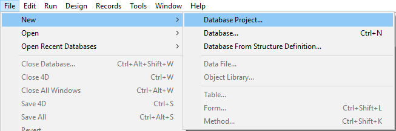

## Requisitos

Os novos projetos 4D só podem ser criados desde **4D Developer** (ver [Desenvolver um projeto](developing.md)).

**Nota:** Servidor 4D pode abrir arquivos .4DProject em modo apenas leitura, mas apenas para propósitos de teste. Para lançamento, projetos 4D são oferecidos como arquivos .4dz (arquivos compactados zipados). Para saber mais, consulte [Construir um pacote de projetos](building.md).

> Pode criar bancos de dados projeto exportando os bancos binários existentes. Ver "Exportar desde um banco de dados 4D" em [doc.4d.com](https://doc.4d.com).

## Criar arquivos de projeto

Para criar um novo projeto de banco de dados:

1. Lance uma aplicação 4D Developer.
2. Select **New > Database Project...** from the **File** menu:  OR Select **Database Project...** from the **New** toolbar button:  A standard **Save** dialog box appears so that you can choose the name and location of the 4D database project main folder.
1. Enter the name of your project folder and click **Save**. This name will be used:
 - como o nome da pasta principal de projeto (chamada "MyFirstProject" no exemplo da seção [Arquitetura de um Projeto 4D](Project/architecture.md)),
 - as the name of the .4DProject file at the first level of the "Project" folder. You can choose any name allowed by your operating system. *Atenção:* se seu banco projeto estiver destinado a funcionar em outros sistemas ou a ser guardada através de uma ferramenta de controle de código fonte, deve levar em consideração suas recomendações específicas de denominação.

Quando validar a caixa de diálogo, 4D fecha o banco de dados atual (se houver) e cria uma pasta "Project" no local indicado e coloca nela todos os arquivos necessários para o funcioanamento correto do banco de dados projeto. Para saber mais, consulte [Arquitetura de um projeto 4D](Project/architecture.md).

A seguir se mostra a janela da aplicação 4D com o Explorador em primeiro plano. A seguir, pode, por exemplo, criar formulários de projeto ou mostrar o editor de estruturas e adicionar tabelas, campos, etc
