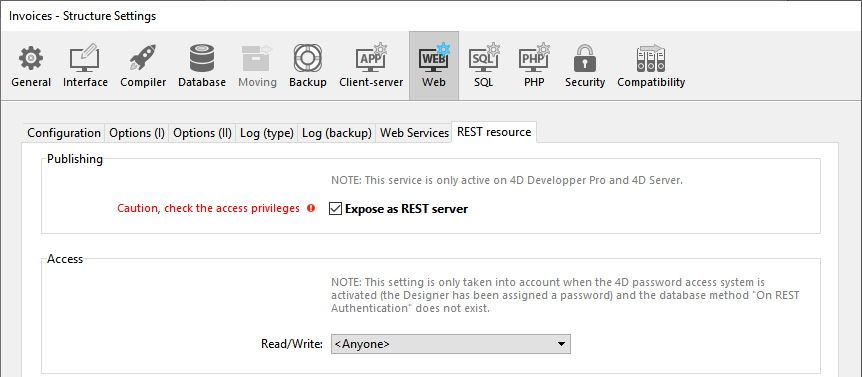

Utilizando petições HTTP padrão, o servidor 4D REST permite às aplicações externas acessar diretamente aos dados de seu banco, *ou seja, *recuperar informação sobre as classes de dados de seu projeto, manipular dados, entrar em sua aplicação web, e muito mais.

Para iniciar usando as funcionalidades REST, precisa iniciar e configurar o servidor 4D REST.

> - Em 4D Server, abrir uma sessão REST exige que uma licença cliente 4D free esteja disponível.<br/>
> - On 4D single-user, you can open up to three REST sessions for testing purposes. You need to manage the [session cookie](authUsers.md#session-cookie) to use the same session for your requesting application.

## Iniciar o servidor REST

Por razões de segurança, o padrão de 4D é não responder a petições REST. Se quiser iniciar o servidor REST, precisa marcar a opção **Expose as REST server** na página "Web/REST resource"  das configurações de banco de dados para que as petições  REST sejam processadas..



> Serviços REST usam o servidor 4D HTTP, por isso precisa ter certeza que o servidor 4D Web Server foi iniciado.

A mensagem de aviso "Atenção, verifique os privilégios de acesso" é exibida quando checar essa opção para chamar atenção para o fato que os serviços REST foram ativados, como padrão acessar os objetos de banco de dados é grátis desde que os acessos REST não tenham sido configurados.

## Configuração de acesso REST

Como padrão, acessos REST são abertos a todos os usuários que são obviamente não configurados para razões de segurança e também para controlar uso de licenças de cliente.

Pode configurar os acessos REST de uma das maneiras abaixo:

- Atribuir um grupo de usuários **Read/Write** para serviços REST na página "Web/REST das Configurações de banco de dados;
- escrever um método de database `On REST Authentication` para interceptar e manejar qualquer petição inicial REST.

> Não pode usar as duas funcionalidades ao mesmo tempo. Quando um método de banco de dados `On REST Authentication` for definido, 4D delega controle de petições REST totalmente para ele: qualquer configuração feita usando o menu "Read/Write" na página Web/REST resource das configurações de banco de dados será ignorada.

### Utilização dos parâmetros de la base

O menu **Read/Write** na página "Web/REST resource" das configurações de banco de dados especifica um grupo de usuários 4D que está autorizado a estabelecer o link com o banco de dados 4D usando pesquisas REST.

Como padrão, o menu mostra `<Anyone>`, o que significa que os acessos REST estão abertos a todos os usuários. Quando tiver especificado um grupo, só contas de usuários 4D que pertençam ao grupo podem ser usadas [acesso a 4D através de petições REST](authUsers.md). Se uma conta for usada que não pertença a esse grupo, 4D retorna um erro de autenticação para o emissor da petição.

> Para essa configuração funcionar, o método de database `On REST Authentication` não deve ser definido. Se existir, 4D ignora os parâmetros de aceso definidos nas propriedades do banco de dados.

### Método base On REST Authentication

O método database `On REST Authentication` lhe oferece uma forma personalizada de controlar a abertura de sessões REST em 4D. Esse método de banco de dados é chamado automaticamente quando uma nova sessão for aberta através da petição REST. Quando receber uma [solicitação para abrir uma sessão REST](authUsers.md), os identificadores de conexão são oferecidos no cabeçalho da solicitação. O método database `On REST Authentication` é chamado para poder avaliar estes identificadores. Pode utilizar a lista de usuários do banco 4D ou pode utilizar sua própria tabela de identificadores. Para obter mais informação, consulte a [documentación](https://doc.4d.com/4Dv18/4D/18/On-REST-Authentication-database-method.301-4505004.en.html) do método database`On REST Authentication`.

## Expor tabelas e campos

Quando serviços REST estiverem ativados no banco de dados 4D, como padrão uma sessão REST pode acessar todas as tabelas e campos da datastore, e assim usar seus dados. Por exemplo, se seu banco de dados conter uma tabela [Employee], é possível escrever:

```
http://127.0.0.1:8044/rest/Employee/?$filter="salary>10000"

```

Esta petição devolverá todos os empregados cujo campo de salario seja superior a 10000.

> As tabelas ou campos 4D que tenham o atributo "Invisível" também são expostas em REST por padrão.

Se quiser personalizar os objetos de datastore acessíveis através de REST, deve desativar a exposição para cada tabela ou campo que queira esconder. Quando uma petição REST tentar acessar um recurso não autorizado, 4D devolve um erro.

### Expor as tabelas

Como padrão, todas as tabelas são expostas em REST.

Por razões de segurança, pode querer expor apenas algumas tabelas em sua datastore para as chamadas REST. Por exemplo, se criar uma tabela [Users] que armazene os nomes de usuário e as senhas, seria melhor não deixá-la exposta.

Para remover a exposição REST para uma tabela:

1. Visualizar o inspetor de Tabelas no editor de Estrutura e selecionar a tabela que quiser modfiicar.

2. Uncheck the **Expose as REST resource** option:  Do this for each table whose exposure needs to be modified.

### Expor campos

Como padrão, todos os campos 4D database são expostos em REST.

Pode querer expor certos campos de suas tabelas para REST. Por exemplo, é possível que não queira expor o campo [Employees]Salary.

Para eliminar a exposição REST de um campo:

1. Exibar o inspetor de Campo no editor de Estruturas e selecione o campo a modificar.

2. Desmarque a opção **Expor como recurso REST** para o campo.  Repeat this for each field whose exposure needs to be modified.

> Para que um campo seja accessível a través de REST, a tabela pai também deve ser. Se a tabela pai não estiver exposta, nenhum dos campos estará, independente de seu estado.
