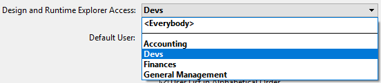

Se mais que uma pessoa usar um banco de dados, o que é o caso em arquitetura cliente-servidor e interfaces web, é preciso controlar o acesso ou oferecer funcionalidades diferentes de acordo com o tipo de usuário conectado. É essencial para segurança de dados sensíveis. Pode oferecer essa segurança através de senhas de usuários e grupos de acesso com graus diferentes de acesso às informações do banco de dados ou às operações do banco.

> Para uma visão geral das funções de segurança de 4D, consulte o [Guia de segurança de 4D](https://blog.4d.com/4d-security-guide/).

## Atribuir grupos de acesso

O sistema de senhas de acesso é baseado em usuários e grupos. Pode criar usuários e atribuir senhas, colocar usuários em grupos, e dar a cada grupo direitos a partes apropriadas do banco de dados.

Grupos podem então atribuir privilégios de acesso a partes específicar ou à funcionalidades do banco de dados (acesso ao modo Design, servidor HTTP, servidor SQL, etc) ou a qualquer parte personalizada.

O exemplo abaixo mostra direitos de acesso ao explorador de Execução e ao Design sendo atribuidos ao grupo "Devs":

## Ativar controles de acesso

Se inicia o sistema de controle de senhas de acesso 4D em cliente-servidor **atribuindo uma senha ao Designer**.

Até que dê ao Designer uma senha, todos os acessos ao banco de dados são feitos com os direitos de acesso de Designer, mesmo que tenha estabelecido usuários e grupos (quando o banco abrir, nenhuma ID é exigida). Qualquer parte do banco pode ser aberta.

Quando uma senha for estabelecida para o Designer, todos os privilégios de acesso têm efeito. Para se conectar ao banco de dados, usuários remotos precisam entrar a senha.

Para desativar o sistema de acesso a senhas, precisa remover a senha Designer.

## Usuários e grupos em arquitetura de projeto

Em bancos de dados projeto (arquivos .4DProject ou .4dz) usuários 4D e grupos podem ser configurados em ambientes monousuário e cliente servidor. Entretanto, controles de acesso são efetivos apenas em bancos de dados 4D Server. A tabela abaixo lista as principais funcionalidades de usuários e grupos e sua disponibilidade:

|                                                            | 4D Developer (monousuário)           | 4D Server |
| ---------------------------------------------------------- | ------------------------------------ | --------- |
| Adicionar/editar usuários e grupos                         | sim                                  | sim       |
| Atribuir acesso de usuário/grupo a servidores              | sim                                  | sim       |
| Identificação de usuário                                   | não (todos os usuários são Designer) | sim       |
| Controle de acesso quando o Designer for atribuído a senha | não (todos os acessos são Designer)  | sim       |

## Editor de toolbox

Os editores para usuários e grupos estão na barra de ferramentas de 4D. Esses editores podem ser usados para criar grupos ou usuários, atribuir senhas a usuários, colocar usuários em grupos, etc.

> O editor de usuários e grupos pode ser exibido em execução com ajuda do comando [EDIT ACCESS](https://doc.4d.com/4Dv18/4D/18/EDIT-ACCESS.301-4504687.en.html).

## Directory.json file

Os usuários, grupos, assim como seus direitos de acesso são armazenados em um arquivo específico do banco de dados chamado **directory.json**.

Este arquivo pode ser armazenado nos locais abaixo:

- na pasta de configurações de usuário, ou seja, na pasta "Settings" no mesmo nível que a pasta "Project". Essas configurações são usadas como padrão para o banco de dados.
- na pasta de configurações de dados, ou seja na pasta "Settings" na pasta "Data". Se um arquivo directory.json estiver presente nesse local, tem prioridade sobre o arquivo na pasta Settings do banco usuário. Essa funcionalidade permite que se defina usuários locais/personalizados e configurações de Grupos. A configuração personalizada não será afetada por atualizações no banco de dados.

> Se gerenciamento de grupos e usuários não estiver ativo, directory.json não é criado.
