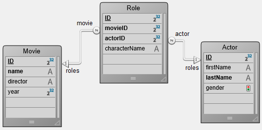

Uma [DataClass](ORDA/dsMapping.md#dataclass) oferece uma interface de objeto a uma tabela do banco de dados. Todas as classes de dados de uma aplicação 4D estão disponíveis como uma propriedade de `ds` [datastore](ORDA/dsMapping.md#datastore).

### Resumo

|                                                                                                                                                                                                          |
| -------------------------------------------------------------------------------------------------------------------------------------------------------------------------------------------------------- |
| [<!-- INCLUDE DataClassClass.attributeName.Syntax -->](#attributename)&nbsp;&nbsp;&nbsp;&nbsp;<!-- INCLUDE DataClassClass.attributeName.Summary --> |
| [<!-- INCLUDE #DataClassClass.all().Syntax -->](#all)&nbsp;&nbsp;&nbsp;&nbsp;<!-- INCLUDE #DataClassClass.all().Summary -->|
| [<!-- INCLUDE #DataClassClass.clearRemoteCache().Syntax -->](#clearremotecache)&nbsp;&nbsp;&nbsp;&nbsp;<!-- INCLUDE #DataClassClass.clearRemoteCache().Summary -->|
| [<!-- INCLUDE #DataClassClass.fromCollection().Syntax -->](#fromcollection)&nbsp;&nbsp;&nbsp;&nbsp;<!-- INCLUDE #DataClassClass.fromCollection().Summary --> |
| [<!-- INCLUDE #DataClassClass.get().Syntax -->](#get)&nbsp;&nbsp;&nbsp;&nbsp;<!-- INCLUDE #DataClassClass.get().Summary --> |
| [<!-- INCLUDE #DataClassClass.getCount().Syntax -->](#getcount)&nbsp;&nbsp;&nbsp;&nbsp;<!-- INCLUDE #DataClassClass.getCount().Summary --> |
| [<!-- INCLUDE #DataClassClass.getDataStore().Syntax -->](#getdatastore)&nbsp;&nbsp;&nbsp;&nbsp;<!-- INCLUDE #DataClassClass.getDataStore().Summary --> |
| [<!-- INCLUDE #DataClassClass.getInfo().Syntax -->](#getinfo)&nbsp;&nbsp;&nbsp;&nbsp;<!-- INCLUDE #DataClassClass.getInfo().Summary --> |
| [<!-- INCLUDE #DataClassClass.getRemoteCache().Syntax -->](#getremotecache)&nbsp;&nbsp;&nbsp;&nbsp;<!-- INCLUDE #DataClassClass.getRemoteCache().Summary --> |
| [<!-- INCLUDE #DataClassClass.new().Syntax -->](#new)&nbsp;&nbsp;&nbsp;&nbsp;<!-- INCLUDE #DataClassClass.new().Summary --> |
| [<!-- INCLUDE #DataClassClass.newSelection().Syntax -->](#newselection)&nbsp;&nbsp;&nbsp;&nbsp;<!-- INCLUDE #DataClassClass.newSelection().Summary --> |
| [<!-- INCLUDE #DataClassClass.query().Syntax -->](#query)&nbsp;&nbsp;&nbsp;&nbsp;<!-- INCLUDE #DataClassClass.query().Summary --> |
| [<!-- INCLUDE #DataClassClass.setRemoteCacheSettings().Syntax -->](#setremotecachesettings)&nbsp;&nbsp;&nbsp;&nbsp;<!-- INCLUDE #DataClassClass.setRemoteCacheSettings().Summary --> |

<!-- REF DataClassClass.attributeName.Desc -->
## .*attributeName*

<details><summary>Histórico</summary>

| Versão | Mudanças   |
| ------ | ---------- |
| v17    | Adicionado |

</details>

<!-- REF DataClassClass.attributeName.Syntax -->

***.attributeName*** : DataClassAttribute<!-- END REF -->

#### Descrção

The attributes of dataclasses are <!-- REF DataClassClass.attributeName.Summary -->objects that are available directly as properties<!-- END REF --> of these classes.

Os objetos retornados são do tipo class [`DataClassAttribute`](DataClassAttributeClass.md). Esses objetos têm propriedades que podem ser lidas para obter informação sobre seus atributos dataclass.
> Os objetos do atributo Dataclass podem ser modificados, mas a estrutura subjacente do banco de dados não será alterada.

#### Exemplo 1

```4d
$salary:=ds. Employee.salary //returns the salary attribute in the Employee dataclass
$compCity:=ds. Company["city"] //returns the city attribute in the Company dataclass
```

#### Exemplo 2

Considerando a seguinte estrutura do banco de dados:


```4d
var $firstnameAtt;$employerAtt;$employeesAtt : Object

 $firstnameAtt:=ds. Employee.firstname
  //{name:firstname,kind:storage,fieldType:0,type:string,fieldNumber:2,indexed:true,
  //keyWordIndexed:false,autoFilled:false,mandatory:false,unique:false}

 $employerAtt:=ds. Employee.employer
  //{name:employer,kind:relatedEntity,relatedDataClass:Company,
  //fieldType:38,type:Company,inverseName:employees}
  //38=Is object

 $employeesAtt:=ds. Company.employees
  //{name:employees,kind:relatedEntities,relatedDataClass:Employee,
  //fieldType:42,type:EmployeeSelection,inverseName:employer}
  //42=Is collection
```

#### Exemplo 3

Considerando as propriedades de tabela abaixo:


```4d
 var $sequenceNumberAtt : Object
 $sequenceNumberAtt=ds. Employee.sequenceNumber
  //{name:sequenceNumber,kind:storage,fieldType:0,type:string,fieldNumber:13,
  //indexed:true,keyWordIndexed:false,autoFilled:true,mandatory:false,unique:true}
```

<!-- END REF -->

<!-- REF DataClassClass.all().Desc -->
## .all()

<details><summary>Histórico</summary>

| Versão | Mudanças                                |
| ------ | --------------------------------------- |
| v17 R5 | Compatibilidade do parâmetro *settings* |
| v17    | Adicionado                              |

</details>

<!-- REF #DataClassClass.all().Syntax -->

**.all** ( { *settings* : Object } ) : 4D. EntitySelection<!-- END REF -->

<!-- REF #DataClassClass.all().Params -->
| Parameter  | Tipo                |    | Descrção                                                                       |
| ---------- | ------------------- |:--:| ------------------------------------------------------------------------------ |
| settings   | Objeto              | -> | Build option: context                                                          |
| Resultados | 4D. EntitySelection | <- | References on all entities related to the Dataclass|<!-- END REF -->

|

#### Descrção

The `.all()` function <!-- REF #DataClassClass.all().Summary -->queries the datastore to find all the entities related to the dataclass and returns them as an entity selection<!-- END REF -->.

As entidades são devolvidas na ordem padrão, que é inicialmente a ordem na qual foram criadas. Note no entanto que, se as entidades foram apagas e outras adicionadas, a ordem padrão não reflete mais sua ordem de criação.

Se nenhuma entidade correspondente for encontrada, uma seleção de entidade vazia é retornada.

Se aplica carregamento diferido/lazy loading.

**settings**

No  parâmetro *querySettings* é possível passar um objeto que conteha opções adicionais. As propriedades abaixo são compatíveis:

| Propriedade | Tipo | Descrção                                                                                                                                                                                                                                                                                                                   |
| ----------- | ---- | -------------------------------------------------------------------------------------------------------------------------------------------------------------------------------------------------------------------------------------------------------------------------------------------------------------------------- |
| context     | Text | Etiqueta para o contexto de otimização aplicado a seleção de entidades. Este contexto será utilizado pelo código que maneja a seleção de entidades para que possa se beneficiar da otimização. Essa funcionalidade foi criada para processamento cliente/servidor de ORDA [](ORDA/entities.md#client-server-optimization). |

> To know the total number of entities in a dataclass, it is recommended to use the [`getCount()`](#getcount) function which is more optimized than the `ds.myClass.all().length` expression.

#### Exemplo

```4d
 var $allEmp : cs. EmployeeSelection
 $allEmp:=ds. Employee.all()
```

<!-- REF #DataClassClass.clearRemoteCache().Desc -->
## .clearRemoteCache()

<details><summary>Histórico</summary>

| Versão | Mudanças   |
| ------ | ---------- |
| v19 R5 | Adicionado |

</details>

<!-- REF #DataClassClass.clearRemoteCache().Syntax -->

**.clearRemoteCache()**<!-- END REF -->

<!-- REF #DataStoreClass.clearRemoteCache().Params -->
| Parameter | Tipo |  | Descrção                                                   |
| --------- | ---- |::| ---------------------------------------------------------- |
|           |      |  | Does not require any parameters|<!-- END REF -->

|

#### Descrção

The `.clearRemoteCache()` function <!-- REF #DataClassClass.clearRemoteCache().Summary -->empties the ORDA cache of a dataclass<!-- END REF -->.

> This function does not reset the `timeout` and `maxEntries` values.

#### Exemplo

```4d
var $ds : 4D. DataStoreImplementation
var $persons : cs. PersonsSelection
var $p : cs. PersonsEntity
var $cache : Object
var $info : Collection
var $text : Text

$ds:=Open datastore(New object("hostname"; "www.myserver.com"); "myDS")

$persons:=$ds. Persons.all()
$text:="" For each ($p; $persons)
    $text:=$p.firstname+" lives in "+$p.address.city+" / " End for each

$cache:=$ds. Persons.getRemoteCache()

$ds. Persons.clearRemoteCache()
// Cache of the Persons dataclass = {timeout:30;maxEntries:30000;stamp:255;entries:[]}
```

<!-- END REF -->

<!-- REF DataClassClass.fromCollection().Desc -->
## .fromCollection()

<details><summary>Histórico</summary>

| Versão | Mudanças                                |
| ------ | --------------------------------------- |
| v17 R5 | Compatibilidade do parâmetro *settings* |
| v17    | Adicionado                              |

</details>

<!-- REF #DataClassClass.fromCollection().Syntax -->

**.fromCollection**( *objectCol* : Collection { ; *settings* : Object } ) : 4D. EntitySelection<!-- END REF -->

<!-- REF #DataClassClass.fromCollection().Params -->
| Parameter  | Tipo                |    | Descrção                                                               |
| ---------- | ------------------- |:--:| ---------------------------------------------------------------------- |
| objectCol  | Collection          | -> | Coleção de objetos a mapear com entidades                              |
| settings   | Objeto              | -> | Build option: context                                                  |
| Resultados | 4D. EntitySelection | <- | Entity selection filled from the collection|<!-- END REF -->

|

#### Descrção

The `.fromCollection()` function <!-- REF #DataClassClass.fromCollection().Summary -->updates or creates entities in the dataclass according to the *objectCol* collection of objects, and returns the corresponding entity selection<!-- END REF -->.

No parâmetro *objectCol*, passa uma coleção de objetos para criar novas entidades ou atualizar as existentes da classe de dados. Os nomes das propriedades devem ser os mesmos que os dos atributos da classe de dados. Se um nome de propriedade não existir na dataclass, é ignorado. Se um valor de atributo não for definido na coleção, seu valor será null.

O mapeamento entre os objetos da coleção e as entidades se realiza sobre os **nomes de atributos** e **tipos coincidentes**. Se uma propriedade de um objeto tiver o mesmo nome que um atributo de entidade mas seus tipos não corresponderem, o atributo da entidade não é preenchido.

**Criar ou atualizar modos**

Para cada objeto de *objectCol*:

* Se o objeto conter uma propriedade booleana "\__NEW" estabelecida em false (ou não conter uma propriedade booleana "\__NEW"), a entidade se atualiza ou se cria com os valores correspondentes das propriedades do objeto. Nenhuma comprovação é realizada com respeito à chave primária:
  * Se a chave primária for dada e existir, a entidade é atualizada. Nesse caso, a chave primária pode ser dada como etá ou com uma propriedade "\_\_KEY"  (preenchida com o valor da chave primária).
  * Se a chave primária for dada (como é) e não existir, a entidade é criada
  * Se a chave primária não for dada, a entidade é criada e o valor da chave primária é assignado com respeito às regras padrão de database.
* Se o objeto conter uma propriedade boolean "\_\_NEW" estabelecida como **true**, a entidade é criada com os valores correspondente dos atributos de objeto. Uma comprovação é realizada com relação à chave primária:
  * Se a chave primária for dada (como está) e existir, um erro é enviado.
  * Se a chave primária for dada (como é) e não existir, a entidade é criada
  * Se a chave primária não for dada, a entidade é criada e o valor da chave primária é assignado com respeito às regras padrão de database.
> The nested objects featuring related entities must contain a "\_\_KEY" property (filled with the primary key value of the related entity) or the primary key attribute of the related entity itself. The use of a \_\_KEY property allows independence from the primary key attribute name.

**Entidades relacionadas**

Os objetos de *objectCol* podem conter um ou mais objetos aninhados que apresentam uma ou mais entidades relacionadas, o que pode ser útil para criar ou atualizar links entre entidades.

Os objetos aninhados que apresentam entidades relacionadas devem conter uma propriedade "\_\_KEY" (preenchido com o valor da chave primária da entidade relacionada) ou o atributo de chave primária da própria entidade relacionada. O uso de uma propriedade \_\_KEY permite a independência do nome do atributo da chave primària.
> O conteúdo das entidades relacionadas não pode ser criado / atualizado através deste mecanismo.

**Stamp**

Se um atributo \_\_STAMP for dado, se realiza uma comprovação com o selo no armazén de dados e se pode devolver um erro ("O selo dado não coincide com o atual para o registro# XX da tabela XXXX"). Para saber mais, consulte [Entity locking](ORDA/entities.md#entity-locking).

**settings**

No  parâmetro *querySettings* é possível passar um objeto que conteha opções adicionais. As propriedades abaixo são compatíveis:

| Propriedade | Tipo | Descrção                                                                                                                                                                                                                                                                                                                   |
| ----------- | ---- | -------------------------------------------------------------------------------------------------------------------------------------------------------------------------------------------------------------------------------------------------------------------------------------------------------------------------- |
| context     | Text | Etiqueta para o contexto de otimização aplicado a seleção de entidades. Este contexto será utilizado pelo código que maneja a seleção de entidades para que possa se beneficiar da otimização. Essa funcionalidade foi criada para processamento cliente/servidor de ORDA [](ORDA/entities.md#client-server-optimization). |

#### Exemplo 1

Queremos atualizar uma entidade existente. A propriedade \_\_NEW não for dada, a chave primária do empregado é dada e existe:

```4d
 var $empsCollection : Collection
 var $emp : Object
 var $employees : cs. EmployeeSelection

 $empsCollection:=New collection
 $emp:=New object
 $emp.ID:=668 //Existing PK in Employee table
 $emp.firstName:="Arthur"
 $emp.lastName:="Martin"
 $emp.employer:=New object("ID";121) //Existing PK in the related dataClass Company
  // For this employee, we can change the Company by using another existing PK in the related dataClass Company
 $empsCollection.push($emp)
 $employees:=ds. Employee.fromCollection($empsCollection)
```

#### Exemplo 2

Queremos atualizar uma entidade existente. A propriedade \_\_NEW não é dada, a chave primária do empregado com o atributo \_\_KEY e existir:

```4d
 var $empsCollection : Collection
 var $emp : Object
 var $employees : cs. EmployeeSelection

 $empsCollection:=New collection
 $emp:=New object
 $emp.__KEY:=1720 //Existing PK in Employee table
 $emp.firstName:="John"
 $emp.lastName:="Boorman"
 $emp.employer:=New object("ID";121) //Existing PK in the related dataClass Company
  // For this employee, we can change the Company by using another existing PK in the related dataClass Company
 $empsCollection.push($emp)
 $employees:=ds. Employee.fromCollection($empsCollection)
```

#### Exemplo 3

Se quiser simplesmente criar uma nova entidade da coleção::

```4d
 var $empsCollection : Collection
 var $emp : Object
 var $employees : cs. EmployeeSelection

 $empsCollection:=New collection
 $emp:=New object
 $emp.firstName:="Victor"
 $emp.lastName:="Hugo"
 $empsCollection.push($emp)
 $employees:=ds. Employee.fromCollection($empsCollection)
```

#### Exemplo 4

Queremos criar uma entidade. A propriedade \_\_NEW é True, a chave primária de empregado não é dada:

```4d
 var $empsCollection : Collection
 var $emp : Object
 var $employees : cs. EmployeeSelection

 $empsCollection:=New collection
 $emp:=New object
 $emp.firstName:="Mary"
 $emp.lastName:="Smith"
 $emp.employer:=New object("__KEY";121) //Existing PK in the related dataClass Company
 $emp.__NEW:=True
 $empsCollection.push($emp)
 $employees:=ds. Employee.fromCollection($empsCollection)


```

#### Exemplo 5

Queremos criar uma entidade. Se a propriedade \_\_NEW é omitida, a chave primária do empregado é dada e não existir:

```4d
 var $empsCollection : Collection
 var $emp : Object
 var $employees : cs. EmployeeSelection

 $empsCollection:=New collection
 $emp:=New object
 $emp.ID:=10000 //Unexisting primary key
 $emp.firstName:="Françoise"
 $emp.lastName:="Sagan"
 $empsCollection.push($emp)
 $employees:=ds. Employee.fromCollection($empsCollection)
```

#### Exemplo 6

Neste exemplo, a primeira entidade se criará e salvará mas a segunda falhará já que ambas utilizam a mesma chave primaria:

```4d
 var $empsCollection : Collection
 var $emp; $emp2 : Object
 var $employees : cs. EmployeeSelection

 $empsCollection:=New collection
 $emp:=New object
 $emp.ID:=10001 // Unexisting primary key
 $emp.firstName:="Simone"
 $emp.lastName:="Martin"
 $emp.__NEW:=True
 $empsCollection.push($emp)

 $emp2:=New object
 $emp2.ID:=10001 // Same primary key, already existing
 $emp2.firstName:="Marc"
 $emp2.lastName:="Smith"
 $emp2.__NEW:=True
 $empsCollection.push($emp2)
 $employees:=ds. Employee.fromCollection($empsCollection)
  //first entity is created
  //duplicated key error for the second entity
```

#### Veja também

[**.toCollection()**](EntitySelectionClass.md#tocollection)

<!-- END REF -->

<!-- REF DataClassClass.get().Desc -->
## .get()

<details><summary>Histórico</summary>

| Versão | Mudanças   |
| ------ | ---------- |
| v17    | Adicionado |

</details>

<!-- REF #DataClassClass.get().Syntax -->

**.get**( *primaryKey* : Integer { ; *settings* : Object } ) : 4D. Entity<br/>**.get**( *primaryKey* : Text { ; *settings* : Object } ) : 4D.<!-- END REF -->

<!-- REF #DataClassClass.get().Params -->
| Parameter  | Tipo            |    | Descrção                                                              |
| ---------- | --------------- |:--:| --------------------------------------------------------------------- |
| primaryKey | Integer OR Text | -> | Valor da chave primária da entidade a recuperar                       |
| settings   | Objeto          | -> | Build option: context                                                 |
| Resultados | 4D. Entity      | <- | Entity matching the designated primary key|<!-- END REF -->

|

#### Descrção

The `.get()` function <!-- REF #DataClassClass.get().Summary -->queries the dataclass to retrieve the entity matching the *primaryKey* parameter<!-- END REF -->.

Em *primaryKey*, passe o valor da chave primária da entidade a recuperar Em *primaryKey*, passe o valor da chave primária da entidade a recuperar O tipo valor deve coresponder com o tipo de chave primária estabelecido na datastore (Inteiro ou texto). Também pode se assegurar que o valor de chave primária seja sempre retornado como Texto ao usar a função [`.getKey()`](EntityClass.md#getkey) com o parâmetro`dk key as string`.

Se nenhuma entidade for encontrada com  *primaryKey*, uma entidade**Null** é retornada.

É aplicado o lazy loading/carregamento diferido, ou seja os dados relacionados são carregados do disco só quando pedidos.

**settings**

No  parâmetro *querySettings* é possível passar um objeto que conteha opções adicionais. As propriedades abaixo são compatíveis:

| Propriedade | Tipo | Descrção                                                                                                                                                                                                                                                                                                                |
| ----------- | ---- | ----------------------------------------------------------------------------------------------------------------------------------------------------------------------------------------------------------------------------------------------------------------------------------------------------------------------- |
| context     | Text | Etiqueta para o contexto de otimização automático aplicados à entidade. Esse contexto será usado pelo código subsequente que carrega a entidade para que se possa beneficiar da otimização. Essa funcionalidade foi criada para processamento cliente/servidor de ORDA [](ORDA/entities.md#client-server-optimization). |

#### Exemplo 1

```4d
 var $entity : cs. EmployeeEntity  
 var $entity2 : cs. InvoiceEntity
 $entity:=ds. Employee.get(167) // return the entity whose primary key value is 167
 $entity2:=ds. Invoice.get("DGGX20030") // return the entity whose primary key value is "DGGX20030"
```

#### Exemplo 2

Este exemplo ilustra o uso da propriedade *context* :

```4d
 var $e1; $e2; $e3; $e4 : cs. EmployeeEntity
 var $settings; $settings2 : Object

 $settings:=New object("context";"detail")
 $settings2:=New object("context";"summary")

 $e1:=ds. Employee.get(1;$settings)
 completeAllData($e1) // In completeAllData method, an optimization is triggered and associated to context "detail"

 $e2:=ds. Employee.get(2;$settings)
 completeAllData($e2) // In completeAllData method, the optimization associated to context "detail" is applied

 $e3:=ds. Employee.get(3;$settings2)
 completeSummary($e3) //In completeSummary method, an optimization is triggered and associated to context "summary"

 $e4:=ds. Employee.get(4;$settings2)
 completeSummary($e4) //In completeSummary method, the optimization associated to context "summary" is applied
```

<!-- END REF -->

<!-- REF DataClassClass.getCount.Desc -->
## .getCount()

<details><summary>Histórico</summary>

| Versão | Mudanças   |
| ------ | ---------- |
| v19 R5 | Adicionado |

</details>

<!-- REF #DataClassClass.getCount().Syntax -->

**.getCount()** : Integer <!-- END REF -->

<!-- REF #DataClassClass.getCount().Params -->
| Parameter | Tipo    |    | Descrção                                                       |
| --------- | ------- | -- | -------------------------------------------------------------- |
| result    | Integer | <- | Number of entities in the dataclass|<!-- END REF -->

|

#### Descrção

The `.getCount()` function <!-- REF #DataClassClass.getCount().Summary --> returns the number of entities in a dataclass<!-- END REF -->.

If this function is used within a transaction, entities created during the transaction will be taken into account.

#### Exemplo

```4d
var $ds : 4D. DataStoreImplementation
var $number : Integer

$ds:=Open datastore(New object("hostname"; "www.myserver.com"); "myDS")

$number:=$ds. Persons.getCount()
```

<!-- END REF -->

<!-- REF DataClassClass.getDataStore().Desc -->
## .getDataStore()

<details><summary>Histórico</summary>

| Versão | Mudanças   |
| ------ | ---------- |
| v17 R5 | Adicionado |

</details>

<!-- REF #DataClassClass.getDataStore().Syntax -->

|<!-- END REF -->

<!-- REF #DataClassClass.getDataStore().Params -->
| Parameter  | Tipo          |    | Descrção                                              |
| ---------- | ------------- |:--:| ----------------------------------------------------- |
| Resultados | cs. DataStore | <- | Datastore of the dataclass|<!-- END REF -->

|

#### Descrção

The `.getDataStore()` function <!-- REF #DataClassClass.getDataStore().Summary -->returns the datastore for the specified dataclass<!-- END REF -->.

A datastore pode ser:

* a datastore principal, retornada pelo comando `ds`.
* uma datastore remota, aberta com o comando `Open datastore`.

#### Exemplo

O método de projeto ***SearchDuplicate*** procura por valores duplicados em qualquer dataclass.

```4d
 var $pet : cs. CatsEntity
 $pet:=ds. Cats.all().first() //get an entity
 SearchDuplicate($pet;"Dogs")
```

```4d
  // Pesquisa SearchDuplicate
  // SearchDuplicate(entity_to_search;dataclass_name)

 #DECLARE ($pet : Object ; $dataClassName : Text)
 var $dataStore; $duplicates : Object  

 $dataStore:=$pet.getDataClass().getDataStore()
 $duplicates:=$dataStore[$dataClassName].query("name=:1";$pet.name)
```

<!-- END REF -->

<!-- REF DataClassClass.getInfo().Desc -->
## .getInfo()

<details><summary>Histórico</summary>

| Versão | Mudanças               |
| ------ | ---------------------- |
| v19 R3 | Added exposed property |
| v17 R5 | Adicionado             |

</details>

<!-- REF #DataClassClass.getInfo().Syntax -->

**.getInfo()** : Objeto <!-- END REF -->

<!-- REF #DataClassClass.getInfo().Params -->
| Parameter  | Tipo   |    | Descrção                                                |
| ---------- | ------ | -- | ------------------------------------------------------- |
| Resultados | Objeto | <- | Information on the dataclass|<!-- END REF -->

|

#### Descrção

The `.getInfo()` function <!-- REF #DataClassClass.getInfo().Summary -->returns an object providing information about the dataclass<!-- END REF -->. Esta função é útil para configurar o código genérico.

**Objeto devolvido**

| Propriedade | Tipo     | Descrção                                  |
| ----------- | -------- | ----------------------------------------- |
| exposed     | Booleano | True if the dataclass is exposed in REST  |
| name        | Text     | Nome da dataclass                         |
| primaryKey  | Text     | Nome da chave primária da classe de dados |
| tableNumber | Integer  | Número daa tabela 4D interna              |

#### Exemplo 1

```4d
 #DECLARE ($entity : Object)  
 var $status : Object

 computeEmployeeNumber($entity) //faz uma ação na entidade

 $status:=$entity.save()
 if($status.success)
    ALERT("Record updated in table "+$entity.getDataClass().getInfo().name)
 End if
```

#### Exemplo 2

```4d
 var $settings : Object
 var $es : cs. ClientsSelection

 $settings:=New object
 $settings.parameters:=New object("receivedIds";getIds())
 $settings.attributes:=New object("pk";ds. Clients.getInfo().primaryKey)
 $es:=ds. Clients.query(":pk in :receivedIds";$settings)
```

#### Exemplo 3

```4d
 var $pk : Text
 var $dataClassAttribute : Object

 $pk:=ds. Employee.getInfo().primaryKey
 $dataClassAttribute:=ds. Employee[$pk] // If needed the attribute matching the primary key is accessible
```

#### Veja também

[DataClassAttribute.exposed](DataClassAttributeClass.md#exposed)

<!-- END REF -->

<!-- REF DataClassClass.getRemoteCache().Desc -->
## .getRemoteCache()

<details><summary>Histórico</summary>

| Versão | Mudanças   |
| ------ | ---------- |
| v19 R5 | Adicionado |

</details>

<!-- REF #DataClassClass.getRemoteCache().Syntax -->

**.getRemoteCache**() : Object <!-- END REF -->

<!-- REF #DataClassClass.getRemoteCache().Params -->
| Parameter | Tipo   |    | Descrção                                                                                       |
| --------- | ------ | -- | ---------------------------------------------------------------------------------------------- |
| result    | Objeto | <- | Object describing the contents of the ORDA cache for the dataclass.|<!-- END REF -->

|

> **Advanced mode:** This function is intended for developers who need to customize ORDA default features for specific configurations. In most cases, you will not need to use it.

#### Descrção

The `.getRemoteCache()` function <!-- REF #DataClassClass.getRemoteCache().Summary -->returns an object that holds the contents of the ORDA cache for a dataclass.<!-- END REF -->.

Calling this function from a 4D single-user application returns `Null`.

The returned object has the following properties:

| Propriedade | Tipo       | Descrção                                                                  |
| ----------- | ---------- | ------------------------------------------------------------------------- |
| maxEntries  | Integer    | Maximum number of entries collection.                                     |
| stamp       | Integer    | Stamp of the cache.                                                       |
| timeout     | Integer    | Time remaining before the new entries in the cache are marked as expired. |
| entries     | Collection | Contains an entry object for each entity in the cache.                    |

Each entry object in the `entries` collection has the following properties:

| Propriedade | Tipo     | Descrção                          |
| ----------- | -------- | --------------------------------- |
| data        | Objeto   | Object holding data on the entry. |
| expired     | Booleano | True if the entry has expired.    |
| key         | Text     | Primary key of the entity.        |

The `data` object in each entry contains the following properties:
| Propriedade            | Tipo    | Descrção                                                                                                                     |
| ---------------------- | ------- | ---------------------------------------------------------------------------------------------------------------------------- |
| __KEY                  | String  | Primary key of the entity                                                                                                    |
| __STAMP                | Longint | Timestamp of the entity in the database                                                                                      |
| __TIMESTAMP            | String  | Stamp of the entity in the database (format is YYYY-MM-DDTHH:MM:SS:ms:Z)                                                     |
| dataClassAttributeName | Variant | If there is data in the cache for a dataclass attribute, it is returned in a property with the same type as in the database. |

Data concerning related entities is stored in the cache of the data object.

#### Exemplo

In the following example, `$ds. Persons.all()` loads the first entity with all its attributes. Then, the request optimization is triggered, so only `firstname` and `address.city` are loaded.

Note that `address.city` is loaded in the cache of the `Persons` dataclass.

Only the first entity of the `Address` dataclass is stored in the cache. It is loaded during the first iteration of the loop.

```4d
var $ds : 4D. DataStoreImplementation
var $persons : cs. PersonsSelection
var $p : cs. PersonsEntity
var $cachePersons; $cacheAddress : Object
var $text : Text

$ds:=Open datastore(New object("hostname"; "www.myserver.com"); "myDS")

$persons:=$ds. Persons.all()

$text:="" For each ($p; $persons)
    $text:=$p.firstname+" lives in "+$p.address.city+" / " End for each

$cachePersons:=$ds. Persons.getRemoteCache()
$cacheAddress:=$ds. Adress.getRemoteCache()
```

#### Veja também

[.setRemoteCacheSettings()](#setremotecachesettings)<br/>[.clearRemoteCache()](#clearremotecache)

<!-- REF DataClassClass.new().Desc -->
## .new()

<details><summary>Histórico</summary>

| Versão | Mudanças   |
| ------ | ---------- |
| v17    | Adicionado |

</details>

<!-- REF #DataClassClass.new().Syntax -->

**.new()** : 4D. Entity <!-- END REF -->

<!-- REF #DataClassClass.new().Params -->
| Parameter  | Tipo       |    | Descrção                                                     |
| ---------- | ---------- | -- | ------------------------------------------------------------ |
| Resultados | 4D. Entity | <- | New entity matching the Dataclass|<!-- END REF -->

|

#### Descrção

The `.new()` function <!-- REF #DataClassClass.new().Summary -->creates in memory and returns a new blank entity related to the Dataclass<!-- END REF -->.

O objeto entidade se cria em memória e não se guarda no banco de dados até que se chama a função [`.save( )`](EntityClass.md#save). Se a entidade for apagada antes de ser salva, não se pode recuperar.

**4D Server**: eám cliente-servidor, se a chave primaria da tabela correspondente se autoincrementa, se calculará quando a entidade se guarde no servidor.

All attributes of the entity are initialized with the **null** value.

> Attributes can be initialized with default values if the **Map NULL values to blank values** option is selected at the 4D database structure level.

#### Exemplo

Este exemplo cria uma nova entidade na classe de dados "Log" e registra a informação no atributo "info":

```4d
 var $entity : cs. LogEntity
 $entity:=ds. Log.new() //create a reference
 $entity.info:="New entry" //store some information
 $entity.save() //save the entity
```

<!-- END REF -->

<!-- REF DataClassClass.newSelection().Desc -->
## .newSelection()

<details><summary>Histórico</summary>

| Versão | Mudanças   |
| ------ | ---------- |
| v17    | Adicionado |

</details>

<!-- REF #DataClassClass.newSelection().Syntax -->

**.newSelection**( { *keepOrder* : Integer } ) : 4D. EntitySelection <!-- END REF -->

<!-- REF #DataClassClass.newSelection().Params -->
| Parameter  | Tipo                |    | Descrção                                                                                                                                             |
| ---------- | ------------------- | -- | ---------------------------------------------------------------------------------------------------------------------------------------------------- |
| keepOrder  | Integer             | -> | `dk keep ordered`: cria uma seleção de entidades ordenada,<br/>`dk non ordered`: cria uma seleção de entidade não ordenada (padrão se omitido) |
| Resultados | 4D. EntitySelection | <- | Nova seleção de entidades em branco relacionadas com a classe de dados|<!-- END REF -->

|

#### Descrção

The `.newSelection()` function <!-- REF #DataClassClass.newSelection().Summary -->creates a new, blank, non-shareable entity selection, related to the dataclass, in memory<!-- END REF -->.

> Para mais informação sobre as seleçõees de entidades não compartilháveis, consulte [esta seção](ORDA/entities.md#shareable-or-non-shareable-entity-selections).

Se quiser uma seleção de entidades ordenada, passe o seletor `dk keep ordered` no parâmetro *keepOrder*. Como padrão se omitir este parâmetro ou se passar o seletor `dk non ordered`, o método cria uma seleção de entidades não ordenada. As seleções de entidades desordenadas são mais rápidas mas não se pode confiar nas posições das entidades. Para mas informação, consulte [Seleções de entidades ordenadas e desordenadas](ORDA/dsMapping.md#ordered-or-unordered-entity-selection).

Quando for criada, a seleção de entidades não contém nenhuma entidade (`mySelection.length` devolve 0). Este método lhe permite criar seleções de entidades gradualmente fazendo chamadas posteriores à função [`add()`](EntitySelectionClass.md#add).

#### Exemplo

```4d
 var $USelection; $OSelection : cs. EmployeeSelection
 $USelection:=ds. Employee.newSelection() //create an unordered empty entity selection
 $OSelection:=ds. Employee.newSelection(dk keep ordered) //create an ordered empty entity selection
```

<!-- END REF -->

<!-- REF DataClassClass.query().Desc -->
## .query()

<details><summary>Histórico</summary>

| Versão | Mudanças                               |
| ------ | -------------------------------------- |
| v17 R6 | Soporte dos Parâmetros Formula         |
| v17 R5 | Suporte dos marcadores para os valores |
| v17    | Adicionado                             |

</details>

<!-- REF #DataClassClass.query().Syntax -->

**.query**( *queryString* : Text { ; *...value* : any } { ; *querySettings* : Object } ) : 4D. EntitySelection <br/>**.query**( *formula* : Object { ; *querySettings* : Object } ) : 4D. EntitySelection <!-- END REF -->

<!-- REF #DataClassClass.query().Params -->
| Parameter     | Tipo                |    | Descrção                                                                                                                                                       |
| ------------- | ------------------- | -- | -------------------------------------------------------------------------------------------------------------------------------------------------------------- |
| queryString   | Text                | -> | Criterios de pesquisa como string                                                                                                                              |
| formula       | Objeto              | -> | Criterios de pesquisa como objeto fórmula                                                                                                                      |
| value         | any                 | -> | Valores a usar para placeholders indexados                                                                                                                     |
| querySettings | Objeto              | -> | Opções de pesquisa: parâmetros, atributos, args, allowFormulas, contexto, queryPath,queryPlan                                                                  |
| Resultados    | 4D. EntitySelection | <- | Nova seleção de entidade feita de entidades de dataclass realizano o critério de pesquia especificado em *queryString* or *formula*|<!-- END REF -->

|

#### Descrção

The `.query()` function <!-- REF #DataClassClass.query().Summary -->searches for entities that meet the search criteria specified in *queryString* or *formula* and (optionally) *value*(s)<!-- END REF -->, for all the entities in the dataclass, and returns a new object of type `EntitySelection` containing all the entities that are found. Se aplica carregamento diferido/lazy loading.

Se não houver entidades correspondentes encontradas, uma `EntitySelection` vazia é retornada.

**parâmetro queryString**

O parâmetro *queryString* usa a sintaxe abaixo:

```4d
attributePath|formula comparator value   
 {logicalOperator attributePath|formula comparator value}   
 {order by attributePath {desc | asc}}
```

onde:

* **Named placeholders for attribute paths** used in the *queryString* or *formula*. Attributes are expressed as property / value pairs, where property is the placeholder name inserted for an attribute path in the *queryString* or *formula* (":placeholder"), and value can be a string or a collection of strings. Each value is a path that can designate either a scalar or a related attribute of the dataclass or a property in an object field of the dataclass
> *Não pode usar diretamente atributos cujo nome contenha caracteres especiais como ".", "\[ ]", or "=", ">", "#"..., porque serão avaliados incorretamente na string da query. Se precisar de uma query com esses atributos, deve considerar o uso de placeholders que permitem uma gama estendida de caracteres em rotas de atributo (ver* **Using placeholders** *below).*

* **formula**: uma fórmula válida passada como `Text` ou `Object`. A fórmula será avaliada para cada entidade processada e deve retornar um valor booleano. Dentro da fórmula, a entidade está disponível através do objeto `This`.

  * **Text**: A string de fórmula deve ser precidida da declaração `eval( )`,para que o parser da pesquisa avalie a expressão corretamente. Por exemplo: *"eval(length(This.lastname) >=30)"*
  * **Object**: o objeto [formula](FunctionClass.md) é passado como um **placeholder** (ver abaixo). A fórmula deve ter sido criada usando  [`Formula`](FunctionClass.md#formula) ou o comando[`Formula from string`](FunctionClass.md#formula-from-string) command.
> * > * Keep in mind that 4D formulas only support `&` and `|` symbols as logical operators.
> * Se a fórmula não for o único critério de pesquisa, o otimizador de motor debusca poderia processar outros critérios previamente (por exemplo atributos indexados) e assim, a fórmula poderia ser avaliada apenas para um subconjunto de entidades.

 Fórmulas nas consultas podem receber parâmetros através de $1. Este ponto é detalhado no parágrafo **Parâmetro fórmula** mais abaixo.
> * Também pode passar diretamente um objeto parâmetro `formula` ao invés do parâmetro `queryString` (recomendado quando as fórmulas sejam mais complexas). Ver o parágrafo **Parâmetro fórmula** mais abaixo.
> * For security reasons, formula calls within `query()` functions can be disallowed. Veja a descrição do parâmetro `querySettings`.

* **comparator**: symbol que compara *attributePath* e *valor*. Os simbolos abaixo são compatíveis:

 | Comparação                               | Símbolos    | Comentário                                                                                                                     |
 | ---------------------------------------- | ----------- | ------------------------------------------------------------------------------------------------------------------------------ |
 | Igual a                                  | =, ==       | Retorna os dados coincidentes, admite o coringa (@), não diferencia entre maiúsculas e minúsculas nem diacríticas.             |
 |                                          | ===, IS     | Retorna os dados coincidentes, considera @ como caractere padrão, não diferencia entre maiúsculas e minúsculas nem diacríticas |
 | Diferente de                             | #, !=       | Suporta o coringa (@)                                                                                                          |
 |                                          | !==, IS NOT | Considera  @ como um caractere normal                                                                                          |
 | Menor que                                | <           |                                                                                                                                |
 | Maior que                                | >           |                                                                                                                                |
 | Menor que ou igual a                     | <=          |                                                                                                                                |
 | Maior ou igual a                         | >=          |                                                                                                                                |
 | Incluído em                              | IN          | Retorna dados iguais a ao menos um dos valores de uma coleção ou de um conjunto de valores, admite o coringa (@)               |
 | Não se aplica à condição de uma sentença | NOT         | Parentesis são obrigatórios quando usar NOT antes de uma instrução que contenha vários operadores                              |
 | Contém palavra chave                     | %           | As palavras chaves podem ser usadas em atributos de string ou imagem                                                           |

* **value**: o valor a comparar ao valor atual da propriedade de cada entidade na seleção de entidade ou elemento na coleção. Pode ser um **marcador** (ver **Uso de marcadores** mais adiante) ou qualquer expressão que coincida com a propriedad de tipo de dados. Quando usar um valor constante, as regras abaixo devem ser respeitadas:
  * A constante de tipo **texto** pode ser passada com ou sem aspas simples (ver **Uso de aspas** mais abaixo). Para pesquisar uma stirng dentro de uma string (uma pesquisa "contém") use o símbolo coringa (@) em valor para isolar a string a ser pesquisada como mostrado neste exemplo: "@Smith@". As palavras chaves abaixo são proibidas para constantes de texto: true, false.
  * Valores constantes de tipo **booleano** : **true** ou **false** (diferencia maiuscula de minúscula).
  * Valores constantes de tipo **numérico**: os decimais se separam com um '.' (ponto).
  * **date** type constants: "YYYY-MM-DD" format
  * **null** constante: usando a palavra chave "null" encontra as propriedades **null** e **undefined**.
  * in case of a query with an IN comparator, *value* must be a collection, or values matching the type of the attribute path between \[ ] separated by commas (for strings, `"` characters must be escaped with `\`).
  * **logicalOperator**: utilizado para unir condições múltiplas na pesquisa (opcional). Pode usaar um dos operadores lógicos abaixo (ou o nome ou o símbolo podem ser usados):

 | Conjunção | Símbolos                |
 | --------- | ----------------------- |
 | AND       | &, &&, and              |
 | OU        | &#124;,&#124;&#124;, or |

* **order by attributePath**: pode incluir uma declaração order by *attributePath* na pesquisa para que os dados resultantes sejam ordenados de acordo com esta declaração. Pode utilizar várias instruções de ordenação, separadas por vírgulas (por exemplo, ordenação por *attributePath1* desc, *attributePath2* asc). Como padrão, a ordem é ascendente. Passe 'desc'' para definir uma ordem descendente e 'asc' para definir uma ordem ascendente.
> > If you use this statement, the returned entity selection is ordered (for more information, please refer to [Ordered vs Unordered entity selections](ORDA/dsMapping.md#ordered-or-unordered-entity-selection)).

**Usar aspas**

Quando usar aspas com pesquisas, deve usar aspas simples '  '  dentro das pesquisas e aspas duplas "   "  para cercar a consulta inteira, senão um erro é retornado. Por exemplo:

```4d
"employee.name = 'smith' AND employee.firstname = 'john'"
```
> Aspas siples (') não são permitidas nos valores pesquisados, já que quebrariam a string de pesquisa. Por exemplo, "comp.name = 'John's pizza' " gerará um erro. Se precisar pesquisar valores com aspas simples, pode considerar o uso de placeholders (ver abaixo).

**Usando parêntesis**

Pode usar parêntesis na pesquisa para dar prioridade ao cálculo Por exemplo, pode organizar uma pesquisa da seguinte maneira: Por exemplo, pode organizar uma pesquisa da seguinte maneira:

```4d
"(employee.age >= 30 OR employee.age <= 65) AND (employee.salary <= 10000 OR employee.status = 'Manager')"
```

**Uso de placeholders**

4D lhe permite utilizar placeholders, marcadores de posição, para os argumentos *attributePath*, *formula* e *value* dentro do parâmetro *queryString*. Um placeholder é um parâmetro que é inserido em strings de pesquisa e que pode ser substituído por outro valor quando a string for realizada. O valor dos placeholders é avaliado uma vez ao inicio da pesquisa - não é avaliado para cada elemento.

Dois tipos de marcadores podem ser usados: **placeholders indexados ** e **placeholders nomeados**:

|           | Marcadores de posição indexados                                                                                                                                                                                 | Placeholders nomeados                                                                                                                                                     |
| --------- | --------------------------------------------------------------------------------------------------------------------------------------------------------------------------------------------------------------- | ------------------------------------------------------------------------------------------------------------------------------------------------------------------------- |
| Definição | Parameters are inserted as `:paramIndex` (for example :1, :2...) in *queryString* and their corresponding values are provided by the sequence of *value* parameter(s). You can use up to 128 *value* parameters | Parameters are inserted as `:paramName` (for example :myparam) and their values are provided in the attributes and/or parameters objects in the *querySettings* parameter |
| Exemplo   | `$r:=class.query(":1=:2";"city";"Chicago")`                                                                                                                                                                     | `$o.attributes:=New object("att";"city")`<br/> `$o.parameters:=New object("name";"Chicago")`<br/> `$r:=class.query(":att=:name";$o)`                          |

Pode misturar os tipos de argumentos em *queryString*. Um *queryString* pode conter, para os parâmetros *attributePath*, *formula* e *value* :

* valores diretos (sem marcadores),
* marcadores indexados ou com nome.

Using placeholders in queries **is recommended** for the following reasons:

1. Evita a inserção de código malicioso: se user diretamente variáveis preenchidas com uma string de pesquisa, um usuário poderia modificar as condições de pesquisa entrando argumentos adicionais. Por exemplo, imagine uma string de pesquisa como:

 ```4d
  $vquery:="status = 'public' & name = "+myname //user enters their name
  $result:=$col.query($vquery)
 ```

 Esta pesquisa parece segura já que se filtram os dados não públicos. Entretanto, se o usuário introduzr na área *myname* algo como *"smith OR status='private'*, a string de pesquisa se modificaría na etapa da interpretação e poderia devolver dados privados.

 Quando usar marcadores de posição, não é possível anular as condições de segurança:

 ```4d
  $result:=$col.query("status='public' & name=:1";myname)
 ```

 Neste caso, se o usuário introduz *smith OR status='private'* na área *myname*, não se interpretará na string de pesquisa, só será passada como um valor. Procurando por  "smith OR status = 'private' vai falhar

2. Evita ter que se preocupar por questões de formato ou caracteres, especialmente quando se manejam os parâmetros *attributePath* o *value* que podem conter não alfanuméricos como ".", "['...

3. Permite o uso de variáveis ou expressões nos argumentos de pesquisa. Exemplos:

 ```4d
  $result:=$col.query("address.city = :1 & name =:2";$city;$myVar+"@")
 $result2:=$col.query("company.name = :1";"John's Pizzas")
 ```

**Pesquisa de valores null**

Quando pesquisar por valores null não pode usar a sintaxe de placeholder porque o motor de pesquisa vai consider null como um valor de comparação inesperado. Por exemplo se executar esta pesquisa:

```4d
$vSingles:=ds. Person.query("spouse = :1";Null) // will NOT work
```

Você não vai conseguir o resultado esperado porque o valor null será avaliado por 4D como um erro resultante da avaliação de parâmetro (por exemplo, um atributo de outra pesquisa) Para este tipo de pesquisa, deve usar a sintaxe de pesquisa direta: Para este tipo de pesquisa, deve usar a sintaxe de pesquisa direta:

```4d
 $vSingles:=ds. Person.query("spouse = null") //correct syntax
```

**Linkar os argumentos de pesquisa com os atributos de coleção**

:::info

This feature is only available in queries on dataclasses and [entity selections](EntitySelectionClass.md#query). It cannot be used in queries on [collections](CollectionClass.md#query).

:::

When searching within dataclass object attributes containing collections using multiple query arguments joined by the AND operator, you may want to make sure that only entities containing elements that match all arguments are returned, and not entities where arguments can be found in different elements. Para fazer isso, é necessário vincular os argumentos de pesquisa para elementos de coleção, para que apenas elementos únicos contendo argumentos linkados são encontrados.

Por exemplo, com as duas entidades abaixo:

```
Entity 1:
ds. People.name: "martin"
ds. People.places:
    { "locations" : [ {
                "kind":"home",
                "city":"paris"
            } ] } Entity 2:
ds. People.name: "smith"
ds. People.places:
    { "locations" : [ {
                "kind":"home",
                "city":"lyon"
            } , {
                "kind":"office",
                "city":"paris"
            } ] }
```

Se quiser encontrar pessoas com um tipo de local "home" na cidade "paris". Se escrever

```4d
ds. People.query("places.locations[].kind= :1 and places.locations[].city= :2";"home";"paris")
```

... a pesquisa devolverá "martin" **e** "smith" porque "smith" tem um elemento "locations" cujo "tipo" é "home" e um elemento "locations" cuja "cidade" é "paris", mesmo que sejam elementos diferentes.

Se quiser obter apenas entidades onde os argumentos correspondentes estão no mesmo elemento coleção, precisa  **linkar os argumentos**. Para linkar argumentos de pesquisa:

* Adicionar uma letra entre os \[] na primeira rota a linkar e repita a mesma letra em todos os argumentos linkados. Por exemplo: `locations[a].city and locations[a].kind`. Pode usar qualquer letra do alfabeto latino (não diferencia maiúsculas e minúsculas).
* Para adicionar critérios linkados na mesma pesquisa, use outra letra. Pode criar até 26 combinações de critérios em uma única pesquisa.

Com as entidades acima, se escreve:

```4d
ds. People.query("places.locations[a].kind= :1 and places.locations[a].city= :2";"home";"paris")
```

... pesquisa só devolverá "martin" porque tem um elemento "locations" cujo "kind" é "home" e cujo "city" for "paris". A pesquisa não devolverá 'smith' porque os valores 'home' e 'paris' não estão no mesmo elemento de coleção.

**Queries in many-to-many relations**

ORDA offers a special syntax to facilitate queries in many-to-many relations. In this context, you may need to search for different values with an `AND` operator BUT in the same attribute. For example, take a look at the following structure:



Imagine that you want to search all movies in which *both* actor A and actor B have a role. If you write a simple query using an `AND` operator, it will not work:

```4d
// invalid code
$es:=ds. Movie.query("roles.actor.lastName = :1 AND roles.actor.lastName = :2";"Hanks";"Ryan")  
// $es is empty
```

Basically, the issue is related to the internal logic of the query: you cannot search for an attribute whose value would be both "A" and "B".

To make it possible to perform such queries, ORDA allows a special syntax: you just need to add a *class index* between **{}** in all additional relation attributes used in the string:

```4d
"relationAttribute.attribute = :1 AND relationAttribute{x}.attribute = :2 [AND relationAttribute{y}.attribute...]"
```

**{x}** tells ORDA to create another reference for the relation attribute. It will then perform all the necessary bitmap operations internally. Note that **x** can be any number **except 0**: {1}, or {2}, or {1540}... ORDA only needs a unique reference in the query for each class index.

In our example, it would be:

```4d
// valid code
$es:=ds. Movie.query("roles.actor.lastName = :1 AND roles.actor{2}.lastName = :2";"Hanks";"Ryan")  
// $es contains movies (You've Got Mail, Sleepless in Seattle, Joe Versus the Volcano)
```

**parâmetro de fórmula**

Como alternativa à inserção de fórmulas dentro do parâmetro *queryString* (ver acima), pode passar diretamente um objeto fórmula como critério de pesquisa booleano. A utilizaçã de um objeto fórmula para as pesquisas é **recomendada** já que se beneficia da tokenização, e o código é mais fácil de pesquisar/ler.

A fórmula deve ter sido criada usando  [`Formula`](FunctionClass.md#formula) ou o comando[`Formula from string`](FunctionClass.md#formula-from-string) command. Nesse modo:

* *fórmula* se avalia para cada entidade e deve devolver true ou false. Durante a execução da pesquisa, se o resultado da fórmula não for booleano, é considerado como False.
* dentro da *fórmula*, a entidade está disponível através do objeto `This`.
* if the `Formula` object is **null**, the error 1626 ("Expecting a text or formula") is generated, that you call intercept using a method installed with `ON ERR CALL`.
> For security reasons, formula calls within `query()` functions can be disallowed. Veja a descrição do parâmetro *querySettings*.

**Passar parâmetros a fórmulas**

Todo parâmetro *formula* chamado pela função `query()` pode receber parâmetros:

* Parâmeters devem ser passados através da propriedade  **args**  (objeto) do parâmetro *querySettings*.
* A fórmula recebe este objeto **args** como um parâmetro **$1**.

Este pequeno código mostra os principios de como são passados os parâmetros aos métodos:

```4d
 $settings:=New object("args";New object("exclude";"-")) //args object to pass parameters
 $es:=ds. Students.query("eval(checkName($1.exclude))";$settings) //args is received in $1
```

No exemplo 3 são oferecidos mais exemplos.

**4D Server**: em cliente/servidor, as fórmulas são executadas no servidor. Neste contexto, só se envia às fórmulas o objeto `querySettings.args`.

**parâmetro querySettings**

No parâmetro opcional*settings* pode passar um objeto contendo as opções abaixo. As propriedades abaixo são compatíveis:

| Propriedade   | Tipo     | Descrção                                                                                                                                                                                                                                                                                                                                                                                                                                                                                                                                                                                                                                                                      |
| ------------- | -------- | ----------------------------------------------------------------------------------------------------------------------------------------------------------------------------------------------------------------------------------------------------------------------------------------------------------------------------------------------------------------------------------------------------------------------------------------------------------------------------------------------------------------------------------------------------------------------------------------------------------------------------------------------------------------------------- |
| parameters    | Objeto   | **Marcadores nomeados para os valores** utilizados em *queryString* ou *fórmula*. Os valores se expressam como pares propriedade / valor, onde propriedade é o nome do marcador de posição inserido para um valor em *queryString* ou *formula* (":placeholder") e valor é o valor a comparar. Pode combinar marcadores de posição indexados (valores passados diretamente em parâmetros de valor) e valores de marcadores de posição com nome na mesma pesquisa.                                                                                                                                                                                                             |
| attributes    | Objeto   | **attributePath**: path of attribute on which you want to execute the query. Os atributos se expressam como pares propriedade/ valor, onde propriedade é o nome do marcador de posição inserido para uma rota de atributo em *queryString* ou *formula* (":placeholder") e valor pode ser uma string ou uma coleção de strings. Cada valor e uma rota que pode designar um escalar ou um atributo relacionado da dataclass ou uma propriedade num campo de objeto da dataclass<table><tr><th>Tipo</th><th>Descrção</th></tr><tr><td>String</td><td>attributePath expressado com a notação de pontos, por exemplo: "name" ou "user.address.zipCode"</td></tr><tr><td>Coleção de strings</td><td>Cada string da coleção representa um nível de attributePath, por exemplo: \["name"] ou \["user","address","zipCode"]. Usar uma coleção permite pesquisar atributos com nomes que não se ajustem à notação de pontos, por exemplo \["4Dv17.1","en/fr"]</td></tr></table>Pode combinar marcadores de posição indexados (valores passados diretamente nos parâmetros *value*) e os valores de marcadores de posição com nome na mesma pesquisa. |
| args          | Objeto   | Parámetro(s) a passar para as fórmulas, se houver. O objeto **args** será recebido em $1 dentro das fórmulas e, portanto, seus valores estarão disponíveis através de *$1.property* (ver exemplo 3).                                                                                                                                                                                                                                                                                                                                                                                                                                                                          |
| allowFormulas | Booleano | True para permitir as chamadas de fórmulas na pesquisa (padrão). Passe falso para desautorizar a execução de fórmulas. Se for estabelecido como false y `query()` receber uma fórmula, se envia um erro (1278 - Fórmula não permitida neste método membro).                                                                                                                                                                                                                                                                                                                                                                                                                   |
| context       | Text     | Etiqueta para o contexto de otimização automático aplicados à seleção de entidade. Este contexto será utilizado pelo código que maneja a seleção de entidades para que possa se beneficiar da otimização. Esta função está projetada para o processamento cliente/servidor; para saber mais, consulte **Otimização cliente/servidor**.                                                                                                                                                                                                                                                                                                                                        |
| queryPlan     | Booleano | Na entity selection resultante, devolve ou não a descrição detalhada da pesquisa logo antes de ser executada, ou seja, a pesquisa planificada. A propriedade devolvida é um objeto que inclui cada pesquisa e subpesquisa prevista (no caso de uma pesquisa complexa). Esta opção é útil durante a fase de desenvolvimento de uma aplicação. Geralmente é usada em conjunto com queryPath. Como padrão é omitido: false. **Note**: This property is supported only by the `entitySelection.query()` and `dataClass.query()` functions.                                                                                                                                        |
| queryPath     | Booleano | Na entity selection resultante, devolve ou não a descrição detalhada da pesquisa tal qual for realizada. A propriedade retornada é um objeto que contém a rota atual usada para a pesquisa (geralmente idêntica àquela do queryPlan, mas deve diferenciar se o motor consegue otimizar a pesquisa), assim como o tempo de processamento e o número de registros encontrado. Esta opção é útil durante a fase de desenvolvimento de uma aplicação. Como padrão é omitido: false. **Note**: This property is supported only by the `entitySelection.query()` and `dataClass.query()` functions.                                                                                 |

**Sobre queryPlan e queryPath**

A informação registrada em `queryPlan`/`queryPath` inclui o tipo de pesquisa (indexada e sequencial) e cada subconsulta necessária junto com os operadores de conjunção. As rotas de acesso das petições também contém o número de entidades encontradas e o tempo necessário para executar cada critério de pesquisa. As rotas de acesso das petições também contém o número de entidades encontradas e o tempo necessário para executar cada critério de pesquisa. Geralmente a descrição do plano de pesquisa e sua rota são idênticas mas podem ser diferentes porque 4D pode implementar otimizações dinâmicas quando uma pesquisa for executada para melhorar a performance. Por exemplo, o motor 4D pode converter dinamicamente uma consulta indexada em uma consulta sequencial se estimar que seja mais rápido. Esse caso particular pode acontecer quando o número de entidades sendo pesquisada é baixo.

Por exemplo se executar esta pesquisa:

```4d
 $sel:=ds. Employee.query("salary < :1 and employer.name = :2 or employer.revenues > :3";\  
 50000;"Lima West Kilo";10000000;New object("queryPath";True;"queryPlan";True))
```

queryPlan:

```4d
{Or:[{And:[{item:[index : Employee.salary ] < 50000},  
 {item:Join on Table : Company  :  Employee.employerID = Company.ID,  
 subquery:[{item:[index : Company.name ] = Lima West Kilo}]}]},  
 {item:Join on Table : Company  :  Employee.employerID = Company.ID,  
 subquery:[{item:[index : Company.revenues ] > 10000000}]}]}
```

queryPath:

```4d
{steps:[{description:OR,time:63,recordsfounds:1388132,  
 steps:[{description:AND,time:32,recordsfounds:131,  
 steps:[{description:[index : Employee.salary ] < 50000,time:16,recordsfounds:728260},{description:Join on Table : Company  :  Employee.employerID = Company.ID,time:0,recordsfounds:131,  
 steps:[{steps:[{description:[index : Company.name ] = Lima West Kilo,time:0,recordsfounds:1}]}]}]},{description:Join on Table : Company  :  Employee.employerID = Company.ID,time:31,recordsfounds:1388132,  
 steps:[{steps:[{description:[index : Company.revenues ] > 10000000,time:0,recordsfounds:933}]}]}]}]}
```

#### Exemplo 1

Esta seção oferece vários exemplos de pesquisas.

Consultas em uma string:

```4d
$entitySelection:=ds. Customer.query("firstName = 'S@'")
```

Pesquisa com uma instrução NOT:

```4d
$entitySelection:=ds. Employee.query("not(firstName=Kim)")
```

Pesquisas com datas:

```4d
$entitySelection:=ds. Employee.query("birthDate > :1";"1970-01-01")
$entitySelection:=ds. Employee.query("birthDate <= :1";Current date-10950)
```

Pesquisa com marcadores de posição indexados para os valores:

```4d
$entitySelection:=ds. Customer.query("(firstName = :1 or firstName = :2) and (lastName = :3 or lastName = :4)";"D@";"R@";"S@";"K@")
```

Pesquisa com marcadores de posição indexados para valores em u ma dataclass relacionada:

```4d
$entitySelection:=ds. Employee.query("lastName = :1 and manager.lastName = :2";"M@";"S@")
```

Pesquisa com marcador de posição indexado que inclui uma instrução de ordem descendente:

```4d
$entitySelection:=ds. Student.query("nationality = :1 order by campus.name desc, lastname";"French")
```

Pesquisa com marcadores de posição com nome para os valores:

```4d
var $querySettings : Object
var $managedCustomers : cs. CustomerSelection
$querySettings:=New object
$querySettings.parameters:=New object("userId";1234;"extraInfo";New object("name";"Smith"))
$managedCustomers:=ds. Customer.query("salesperson.userId = :userId and name = :extraInfo.name";$querySettings)
```

Pesquisa que usa marcadores de posição nomeados e indexados para valores:

```4d
var $querySettings : Object
var $managedCustomers : cs. CustomerSelection
$querySettings.parameters:=New object("userId";1234)
$managedCustomers:=ds. Customer.query("salesperson.userId = :userId and name=:1";"Smith";$querySettings)
```

Pesquisa com objetos queryPlan e queryPath:

```4d
$entitySelection:=ds. Employee.query("(firstName = :1 or firstName = :2) and (lastName = :3 or lastName = :4)";"D@";"R@";"S@";"K@";New object("queryPlan";True;"queryPath";True))

  //you can then get these properties in the resulting entity selection
var $queryPlan; $queryPath : Object
$queryPlan:=$entitySelection.queryPlan
$queryPath:=$entitySelection.queryPath
```

Pesquisa com uma rota de atributo de tipo Collection:

```4d
$entitySelection:=ds. Employee.query("extraInfo.hobbies[].name = :1";"horsebackriding")
```

Pesquisa com uma rota de atributos de tipo Collection e atributos vinculados:

```4d
$entitySelection:=ds. Employee.query("extraInfo.hobbies[a].name = :1 and extraInfo.hobbies[a].level=:2";"horsebackriding";2)
```

Pesquisa com uma rota de atributos de tipo Collection e múltiplos atributos vinculados:

```4d
$entitySelection:=ds. Employee.query("extraInfo.hobbies[a].name = :1 and
 extraInfo.hobbies[a].level = :2 and extraInfo.hobbies[b].name = :3 and
 extraInfo.hobbies[b].level = :4";"horsebackriding";2;"Tennis";5)
```

Pesquisa com uma rota de atributo de tipo Objeto

```4d
$entitySelection:=ds. Employee.query("extra.eyeColor = :1";"blue")
```

Pesquisa com uma instrução IN:

```4d
$entitySelection:=ds. Employee.query("firstName in :1";New collection("Kim";"Dixie"))
```

Pesquisa com instrução NOT (IN):

```4d
$entitySelection:=ds. Employee.query("not (firstName in :1)";New collection("John";"Jane"))
```

Pesquisa com marcadores de posição indexados para os atributos:

```4d
var $es : cs. EmployeeSelection
$es:=ds. Employee.query(":1 = 1234 and :2 = 'Smith'";"salesperson.userId";"name")
  //salesperson is a related entity
```

Pesquisa com marcadores de posição indexados para os atributos e marcadores de posição com nome para os valores:

```4d
var $es : cs. EmployeeSelection
var $querySettings : Object
$querySettings:=New object
$querySettings.parameters:=New object("customerName";"Smith")
$es:=ds. Customer.query(":1 = 1234 and :2 = :customerName";"salesperson.userId";"name";$querySettings)
  //salesperson is a related entity
```

Pesquisa com marcadores de posição indexados para os atributos e os valores:

```4d
var $es : cs. EmployeeSelection
$es:=ds. Clients.query(":1 = 1234 and :2 = :3";"salesperson.userId";"name";"Smith")
  //salesperson is a related entity
```

#### Exemplo 2

Esta seção ilustra pesquisas com marcadores de posição com  nomes para os atributos.

Dada uma dataclass Employee com 2 entidades:

Entidade 1:

```4d
name: "Marie"
number: 46
softwares:{
"Word 10.2": "Installed",
"Excel 11.3": "To be upgraded",
"Powerpoint 12.4": "Not installed"
}
```

Entidade 2:

```4d
name: "Sophie"
number: 47
softwares:{
"Word 10.2": "Not installed",
"Excel 11.3": "To be upgraded",
"Powerpoint 12.4": "Not installed"
}
```

Pesquisa com marcadores de posição com nome para os atributos:

```4d
 var $querySettings : Object
 var $es : cs. EmployeeSelection
 $querySettings:=New object
 $querySettings.attributes:=New object("attName";"name";"attWord";New collection("softwares";"Word 10.2"))
 $es:=ds. Employee.query(":attName = 'Marie' and :attWord = 'Installed'";$querySettings)
  //$es.length=1 (Employee Marie)
```

Pesquisa com marcadores de posição com nome para os atributos e os valores:

```4d
 var $querySettings : Object
 var $es : cs. EmployeeSelection
 var $name : Text
 $querySettings:=New object
  //Named placeholders for values
  //The user is asked for a name
 $name:=Request("Please enter the name to search:")
 If(OK=1)
    $querySettings.parameters:=New object("givenName";$name)
  //Named placeholders for attribute paths
    $querySettings.attributes:=New object("attName";"name")
    $es:=ds. Employee.query(":attName= :givenName";$querySettings)
 End if
```

#### Exemplo 3

Estes exemplos ilustram as distintas formas de utilizar fórmulas com ou sem parâmetros em suas pesquisas.

A fórmula se da como texto com `eval()` no parâmetro *queryString*:

```4d
 var $es : cs. StudentsSelection
 $es:=ds. Students.query("eval(length(This.lastname) >=30) and nationality='French'")
```

A fórmula se dá como um objeto `Formula` através de um marcador de posição:

```4d
 var $es : cs. StudentsSelection
 var $formula : Object
 $formula:=Formula(Length(This.lastname)>=30)
 $es:=ds. Students.query(":1 and nationality='French'";$formula)
```

Só se da como criterio um objeto `Formula`:

```4d
 var $es : cs. StudentsSelection
 var $formula : Object
 $formula:=Formula(Length(This.lastname)>=30)
 $es:=ds. Students.query($formula)
```

Podem ser aplicadas várias fórmulas:

```4d
 var $formula1; $1; $formula2 ;$0 : Object
 $formula1:=$1
 $formula2:=Formula(Length(This.firstname)>=30)
 $0:=ds. Students.query(":1 and :2 and nationality='French'";$formula1;$formula2)
```

Uma fórmula texto em *queryString* recebe um parámetro:

```4d
 var $es : cs. StudentsSelection
 var $settings : Object
 $settings:=New object()
 $settings.args:=New object("filter";"-")
 $es:=ds. Students.query("eval(checkName($1.filter)) and nationality=:1";"French";$settings)
```

```4d
  //checkName method
 #DECLARE($exclude : Text) -> $result : Boolean
 $result:=(Position($exclude;This.lastname)=0)
```

Utilizando o mesmo método ***checkName***, um objeto `Formula` como marcador de posição recebe um parámetro:

```4d
 var $es : cs. StudentsSelection
 var $settings; $formula : Object
 $formula:=Formula(checkName($1.filter))
 $settings:=New object()
 $settings.args:=New object("filter";"-")
 $es:=ds. Students.query(":1 and nationality=:2";$formula;"French";$settings)
 $settings.args.filter:="*" // change the parameters without updating the $formula object
 $es:=ds. Students.query(":1 and nationality=:2";$formula;"French";$settings)
```

Queremos desautorizar as fórmulas, por exemplo, quando el usuario introduz sua consulta:

```4d
 var $es : cs. StudentsSelection
 var $settings : Object
 var $queryString : Text
 $queryString:=Request("Enter your query:")
 if(OK=1)
    $settings:=New object("allowFormulas";False)
    $es:=ds. Students.query($queryString;$settings) //An error is raised if $queryString contains a formula
 End if
```

#### Veja também

[`.query()`](EntitySelectionClass.md#query) para seleções de entidades
<!-- END REF -->

<!-- REF DataClassClass.setRemoteCacheSettings().Desc -->
## .setRemoteCacheSettings()

<details><summary>Histórico</summary>

| Versão | Mudanças   |
| ------ | ---------- |
| v19 R5 | Adicionado |

</details>

<!-- REF #DataClassClass.setRemoteCacheSettings().Syntax -->

**.setRemoteCacheSettings**(*settings* : Object) <!-- END REF -->

<!-- REF #DataClassClass.setRemoteCacheSettings().Params -->
| Parameter | Tipo   |    | Descrção                                                                                                      |
| --------- | ------ | -- | ------------------------------------------------------------------------------------------------------------- |
| settings  | Objeto | -> | Object that sets the timeout and maximum size of the ORDA cache for the dataclass.|<!-- END REF -->

|

> **Advanced mode:** This function is intended for developers who need to customize ORDA default features for specific configurations. In most cases, you will not need to use it.

#### Descrção

The `.setRemoteCacheSettings()` function <!-- REF #DataClassClass.setRemoteCacheSettings().Summary -->sets the timeout and maximum size of the ORDA cache for a dataclass.<!-- END REF -->.

In the *settings* parameter, pass an object with the following properties:

| Propriedade | Tipo    | Descrção                    |
| ----------- | ------- | --------------------------- |
| timeout     | Integer | Timeout in seconds.         |
| maxEntries  | Integer | Maximum number of entities. |

`timeout` sets the timeout of the ORDA cache for the dataclass (default is 30 seconds). Once the timeout has passed, the entities of the dataclass in the cache are considered as expired. This means that:

* the data is still there
* the next time the data is needed, it will be asked to the server
* 4D automatically removes expired data when the maximum number of entities is reached

Setting a `timeout` property sets a new timeout for the entities already present in the cache. It is useful when working with data that does not change very frequently, and thus when new requests to the server are not necessary.

`maxEntries` sets the max number of entities in the ORDA cache. Default is 30 000.

The minimum number of entries is 300, so the value of `maxEntries` must be equal to or higher than 300. Otherwise it is ignored and the maximum number of entries is set to 300.

If no valid properties are passed as `timeout` and `maxEntries`, the cache remains unchanged, with its default or previously set values.

When an entity is saved, it is updated in the cache and expires once the timeout is reached.

#### Exemplo

```4d
var $ds : 4D. DataStoreImplementation

$ds:=Open datastore(New object("hostname"; "www.myserver.com"); "myDS")

$ds. Buildings.setRemoteCacheSettings(New object("timeout"; 60; "maxEntries"; 350))
```

#### Veja também

[.clearRemoteCache()](#clearremotecache)<br/>[.getRemoteCache()](#clearremotecache)
