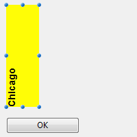

## Allow font/color picker

When this property is enabled, the [OPEN FONT PICKER](https://doc.4d.com/4Dv18/4D/18/OPEN-FONT-PICKER.301-4505612.en.html) and [OPEN COLOR PICKER](https://doc.4d.com/4Dv18/4D/18/OPEN-COLOR-PICKER.301-4505611.en.html) commands can be called to display the system font and color picker windows. Using these windows, the users can change the font or color of a form object that has the focus directly by clicking. When this property is disabled (default), the open picker commands have no effect.

#### JSON Grammar

| Propriedade          | Tipo de dados | Possible Values       |
| -------------------- | ------------- | --------------------- |
| allowFontColorPicker | boolean       | false (default), true |

#### Objects Supported

[Entrada](input_overview.md)

---

## Negrito

Sets the selected text to appear darker and heavier.

You can set this property using the [**OBJECT SET FONT STYLE**](https://doc.4d.com/4Dv17R5/4D/17-R5/OBJECT-SET-FONT-STYLE.301-4128244.en.html) command.
> This is normal text.<br/> **This is bold text.**

#### JSON Grammar

| Propriedade | Tipo de dados | Possible Values  |
| ----------- | ------------- | ---------------- |
| fontWeight  | text          | "normal", "bold" |

#### Objects Supported

[Button](button_overview.md) - [Check Box](checkbox_overview.md) - [Combo Box](comboBox_overview.md) - [Drop-down List](dropdownList_Overview.md) - [Group Box](groupBox.md) - [Hierarchical List](list_overview.md#overview) - [Input](input_overview.md) - [List Box](listbox_overview.md#overview) - [List Box Column](listbox_overview.md#list-box-columns) - [List Box Footer](listbox_overview.md#list-box-footers) - [List Box Header](listbox_overview.md#list-box-headers) - [Radio Button](radio_overview.md) - [Text Area](text.md)

---

## Itálico

Sets the selected text to slant slightly to the right.

You can also set this property via the [**OBJECT SET FONT STYLE**](https://doc.4d.com/4Dv17R5/4D/17-R5/OBJECT-SET-FONT-STYLE.301-4128244.en.html) command.
> This is normal text.<br/> *This is text in italics.*

#### JSON Grammar

| Nome      | Tipo de dados | Possible Values    |
| --------- | ------------- | ------------------ |
| fontStyle | string        | "normal", "italic" |

#### Objects Supported

[Button](button_overview.md) - [Check Box](checkbox_overview.md) - [Combo Box](comboBox_overview.md) - [Drop-down List](dropdownList_Overview.md) - [Group Box](groupBox.md) - [Hierarchical List](list_overview.md#overview) - [Input](input_overview.md) - [List Box](listbox_overview.md#overview) - [List Box Column](listbox_overview.md#list-box-columns) - [List Box Footer](listbox_overview.md#list-box-footers) - [List Box Header](listbox_overview.md#list-box-headers) - [Radio Button](radio_overview.md) - [Text Area](text.md)

---

## Sublinhado

Sets the text to have a line running beneath it.

#### JSON Grammar

| Nome           | Tipo de dados | Possible Values       |
| -------------- | ------------- | --------------------- |
| textDecoration | string        | "normal", "underline" |

#### Objects Supported

[Button](button_overview.md) - [Check Box](checkbox_overview.md) - [Combo Box](comboBox_overview.md) - [Drop-down List](dropdownList_Overview.md) - [Group Box](groupBox.md) - [Hierarchical List](list_overview.md#overview) - [Input](input_overview.md) - [List Box](listbox_overview.md#overview) - [List Box Column](listbox_overview.md#list-box-columns) - [List Box Footer](listbox_overview.md#list-box-footers) - [List Box Header](listbox_overview.md#list-box-headers) - [Radio Button](radio_overview.md) - [Text Area](text.md)

---

## Fonte

This property allows you to specify either the **font theme** or the **font family** used in the object.
> **Font theme** and **font family** properties are mutually exclusive. A font theme takes hold of font attributes, including size. A font family allows you to define font name, font size and font color.

### Font Theme

The font theme property designates an automatic style name. Automatic styles determine the font family, font size and font color to be used for the object dynamically according to system parameters. These parameters depend on:

- the platform,
- the system language,
- and the type of form object.

With the font theme, you are guaranteed that titles are always displayed in accordance with the current interface standards of the system. However, their size may vary from one machine to another.

Three font themes are available:

- **normal**: automatic style, applied by default to any new object created in the Form editor.
- **main** and **additional** font themes are only supported by [text areas](text.md) and [inputs](input_overview.md). These themes are primarily intended for designing dialog boxes. They refer to font styles used, respectively, for main text and additional information in your interface windows. Here are typical dialog boxes (macOS and Windows) using these font themes:


> Font themes manage the font as well as its size and color. You can apply custom style properties (Bold, Italic or Underline) without altering its functioning.

#### JSON Grammar

| Nome      | Tipo de dados | Possible Values                |
| --------- | ------------- | ------------------------------ |
| fontTheme | string        | "normal", "main", "additional" |

#### Objects Supported

[Button](button_overview.md) - [Check Box](checkbox_overview.md) - [Combo Box](comboBox_overview.md) - [Drop-down List](dropdownList_Overview.md) - [Group Box](groupBox.md) - [Hierarchical List](list_overview.md#overview) - [Input](input_overview.md) - [List Box](listbox_overview.md#overview) - [List Box Column](listbox_overview.md#list-box-columns) - [List Box Footer](listbox_overview.md#list-box-footers) - [List Box Header](listbox_overview.md#list-box-headers) - [Radio Button](radio_overview.md) - [Text Area](text.md)

### Font Family

There are two types of font family names:

- *family-name:* The name of a font-family, like "times", "courier", "arial", etc.
- *generic-family:* The name of a generic-family, like "serif", "sans-serif", "cursive", "fantasy", "monospace".

You can set this using the [**OBJECT SET FONT**](https://doc.4d.com/4Dv17R5/4D/17-R5/OBJECT-SET-FONT.301-4054834.en.html) command.

#### JSON Grammar

| Nome       | Tipo de dados | Possible Values      |
| ---------- | ------------- | -------------------- |
| fontFamily | string        | CSS font family name |
> 4D recommends using only [web safe](https://www.w3schools.com/cssref/css_websafe_fonts.asp) fonts.

#### Objects Supported

[Button](button_overview.md) - [Check Box](checkbox_overview.md) - [Combo Box](comboBox_overview.md) - [Drop-down List](dropdownList_Overview.md) - [Group Box](groupBox.md) - [Hierarchical List](list_overview.md#overview) - [Input](input_overview.md) - [List Box](listbox_overview.md#overview) - [List Box Column](listbox_overview.md#list-box-columns) - [List Box Footer](listbox_overview.md#list-box-footers) - [List Box Header](listbox_overview.md#list-box-headers) - [Radio Button](radio_overview.md) - [Text Area](text.md)

---

## Tamanho fonte

Allows defining the object's font size in points.

#### JSON Grammar

| Nome     | Tipo de dados | Possible Values                       |
| -------- | ------------- | ------------------------------------- |
| fontSize | integer       | Font size in points. Minimum value: 0 |

#### Objects Supported

[Button](button_overview.md) - [Check Box](checkbox_overview.md) - [Combo Box](comboBox_overview.md) - [Drop-down List](dropdownList_Overview.md) - [Group Box](groupBox.md) - [Hierarchical List](list_overview.md#overview) - [Input](input_overview.md) - [List Box](listbox_overview.md#overview) - [List Box Column](listbox_overview.md#list-box-columns) - [List Box Footer](listbox_overview.md#list-box-footers) - [List Box Header](listbox_overview.md#list-box-headers) - [Radio Button](radio_overview.md) - [Text Area](text.md)

---

## Cor fonte

Designates the font color.

> This property also sets the color of object's [border](#border-line-style-dotted-line-type) (if any) when "plain" or "dotted" style is used.

The color can be specified by:

- a color name - like "red"
- a HEX value - like "#ff0000"
- an RGB value - like "rgb(255,0,0)"

You can also set this property using the [**OBJECT SET RGB COLORS**](https://doc.4d.com/4Dv18/4D/18/OBJECT-SET-RGB-COLORS.301-4505456.en.html) command.

#### JSON Grammar

| Nome   | Tipo de dados | Possible Values                           |
| ------ | ------------- | ----------------------------------------- |
| stroke | string        | any css value, "transparent", "automatic" |

#### Objects Supported

[Button](button_overview.md) - [Check Box](checkbox_overview.md) - [Combo Box](comboBox_overview.md) - [Drop-down List](dropdownList_Overview.md) - [Group Box](groupBox.md) - [Hierarchical List](list_overview.md#overview) - [Input](input_overview.md) - [List Box](listbox_overview.md#overview) - [List Box Column](listbox_overview.md#list-box-columns) - [List Box Footer](listbox_overview.md#list-box-footers) - [List Box Header](listbox_overview.md#list-box-headers) - [Progress Indicators](progressIndicator.md) - [Ruler](ruler.md) - [Radio Button](radio_overview.md) - [Text Area](text.md)

---

## Expressão cor fonte

`Selection and collection/entity selection type list boxes`

Used to apply a custom font color to each row of the list box. You must use RGB color values. For more information about this, refer to the description of the [OBJECT SET RGB COLORS](https://doc.4d.com/4Dv17R6/4D/17-R6/OBJECT-SET-RGB-COLORS.301-4311385.en.html) command in the 4D Language Reference manual.

You must enter an expression or a variable (array type variables cannot be used). The expression or variable will be evaluated for each row displayed. You can use the constants of the [SET RGB COLORS](https://doc.4d.com/4Dv17R6/4D/17-R6/SET-RGB-COLORS.302-4310385.en.html) theme.

You can also set this property using the `LISTBOX SET PROPERTY` command with `lk font color expression` constant.
> This property can also be set using a [Meta Info Expression](properties_Text.md#meta-info-expression).

The following example uses a variable name: enter *CompanyColor* for the **Font Color Expression** and, in the form method, write the following code:

```4d
CompanyColor:=Choose([Companies]ID;Background color;Light shadow color; Foreground color;Dark shadow color)
```

#### JSON Grammar

| Nome            | Tipo de dados | Possible Values       |
| --------------- | ------------- | --------------------- |
| rowStrokeSource | string        | Font color expression |

#### Objects Supported

[List Box](listbox_overview.md#overview)

---

## Expressão estilo

`Selection and collection/entity selection type list boxes`

Used to apply a custom character style to each row of the list box or each cell of the column.

You must enter an expression or a variable (array type variables cannot be used). The expression or variable will be evaluated for each row displayed (if applied to the list box) or each cell displayed (if applied to a column). You can use the constants of the [Font Styles](https://doc.4d.com/4Dv17R6/4D/17-R6/Font-Styles.302-4310343.en.html) theme.

Exemplo:

```4d
Choose([Companies]ID;Bold;Plain;Italic;Underline)
```

You can also set this property using the `LISTBOX SET PROPERTY` command with `lk font style expression` constant.
> This property can also be set using a [Meta Info Expression](properties_Text.md#meta-info-expression).

#### JSON Grammar

| Nome           | Tipo de dados | Possible Values                                 |
| -------------- | ------------- | ----------------------------------------------- |
| rowStyleSource | string        | Style expression to evaluate for each row/cell. |

#### Objects Supported

[List Box](listbox_overview.md) - [List Box Column](listbox_overview.md#list-box-columns)

---

## Alihamento horizontal

Horizontal location of text within the area that contains it.

#### JSON Grammar

| Nome      | Tipo de dados | Possible Values                                   |
| --------- | ------------- | ------------------------------------------------- |
| textAlign | string        | "automatic", "right", "center", "justify", "left" |

#### Objects Supported

[Group Box](groupBox.md) - [List Box](listbox_overview.md#overview) - [List Box Column](listbox_overview.md#list-box-columns) - [List Box Header](listbox_overview.md#list-box-headers) - [List Box Footer](listbox_overview.md#list-box-footers) - [Text Area](text.md)

---

## Alinhamento vertical

Vertical location of text within the area that contains it.

The **Default** option (`automatic` JSON value) sets the alignment according to the type of data found in each column:

- `bottom` for all data (except pictures) and
- `top` for picture type data.

This property can also be handled by the [OBJECT Get vertical alignment](https://doc.4d.com/4Dv18/4D/18/OBJECT-Get-vertical-alignment.301-4505442.en.html) and [OBJECT SET VERTICAL ALIGNMENT](https://doc.4d.com/4Dv18/4D/18/OBJECT-SET-VERTICAL-ALIGNMENT.301-4505430.en.html) commands.

#### JSON Grammar

| Nome          | Tipo de dados | Possible Values                        |
| ------------- | ------------- | -------------------------------------- |
| verticalAlign | string        | "automatic", "top", "middle", "bottom" |

#### Objects Supported

[List Box](listbox_overview.md) - [List Box Column](listbox_overview.md#list-box-columns) - [List Box Footer](listbox_overview.md#list-box-footers) - [List Box Header](listbox_overview.md#list-box-headers)

---

## Meta Info Expression

`Collection or entity selection type list boxes`

Specifies an expression or a variable which will be evaluated for each row displayed. It allows defining a whole set of row text attributes. You must pass an **object variable** or an **expression that returns an object**. As propriedades abaixo são compatíveis:

| Nome da propriedade         | Tipo    | Descrção                                                                                                                                                                                                                                                                                                                                                                                                               |
| --------------------------- | ------- | ---------------------------------------------------------------------------------------------------------------------------------------------------------------------------------------------------------------------------------------------------------------------------------------------------------------------------------------------------------------------------------------------------------------------- |
| stroke                      | string  | Background color. Any CSS color (ex: "#F00FFF"), "automatic", "transparent"                                                                                                                                                                                                                                                                                                                                            |
| fill                        | string  | Cor de fundo. Any CSS color (ex: "#FF00FF"), "automatic", "transparent"                                                                                                                                                                                                                                                                                                                                                |
| fontStyle                   | string  | "normal","italic"                                                                                                                                                                                                                                                                                                                                                                                                      |
| fontWeight                  | string  | "normal","bold"                                                                                                                                                                                                                                                                                                                                                                                                        |
| textDecoration              | string  | "normal","underline"                                                                                                                                                                                                                                                                                                                                                                                                   |
| unselectable                | boolean | Designates the corresponding row as not being selectable (*i.e.*, highlighting is not possible). Enterable areas are no longer enterable if this option is enabled unless the "Single-Click Edit" option is also enabled. Controls such as checkboxes and lists remain functional. This setting is ignored if the list box selection mode is "None". This setting is ignored if the list box selection mode is "None". |
| disabled                    | boolean | Disables the corresponding row. Enterable areas are no longer enterable if this option is enabled. Text and controls (checkboxes, lists, etc.) appear dimmed or grayed out. This setting is ignored if the list box selection mode is "None".                                                                                                                                                                          |
| `cell.\<columnName>` | object  | Allows applying the property to a single column. Pass in `\<columnName>` the object name of the list box column. **Note**: "unselectable" and "disabled" properties can only be defined at row level. They are ignored if passed in the "cell" object                                                                                                                                                           |

> Style settings made with this property are ignored if other style settings are already defined through expressions (*i.e.*, [Style Expression](#style-expression), [Font Color Expression](#font-color-expression), [Background Color Expression](#background-color-expression)).

**Exemplo**

No método de projeto *Color*, entre o código abaixo:

```4d
//Color method
//Sets font color for certain rows and the background color for a specific column: C_OBJECT($0)
Form.meta:=New object If(This.ID>5) //ID is an attribute of collection objects/entities
  Form.meta.stroke:="purple"
  Form.meta.cell:=New object("Column2";New object("fill";"black"))
Else
  Form.meta.stroke:="orange" End if
$0:=Form.meta
```

**Melhores práticas:** Por razões de otimização, é recomendado nesse caso criar o objeto `meta.cell` uma vez no método formulário:

```4d
  //método de formulário
 Case of
    :(Form event code=On Load)
       Form.colStyle:=New object("Column2";New object("fill";"black"))
 End case
```

O método *Color* iria conter :

```4d
  //Método Color 
 ...
 If(This.ID>5)
    Form.meta.stroke:="purple"
    Form.meta.cell:=Form.colStyle //reusa o mesmo objeto para melhor performance
 ...
```
> Veja também o comando [This](https://doc.4d.com/4Dv18/4D/18/This.301-4504875.en.html).

#### JSON Grammar

| Nome       | Tipo de dados | Possible Values                                  |
| ---------- | ------------- | ------------------------------------------------ |
| metaSource | string        | Object expression to evaluate for each row/cell. |

#### Objects Supported

[List Box](listbox_overview.md)

---

## Multistyle

Esta propriedade ativa a possibilidade de usar estilos específicos na área selecionada. When this option is checked, 4D interprets any `<SPAN> HTML` tags found in the area.

By default, this option is not enabled.

#### JSON Grammar

| Nome       | Tipo de dados | Possible Values |
| ---------- | ------------- | --------------- |
| styledText | boolean       | true, false     |

#### Objects Supported

[List Box Column](listbox_overview.md#list-box-columns) - [Input](input_overview.md)

---

## Orientation

Modifica a orientação (rotação) de uma área texto. Áreas texto pode ser rodadas por incrementos de 90°. Cada valor de orientação é aplicado enquanto mantém o mesmo ponto inferior esquerdo para o objeto:

| Orientation value | Resultados                                     |
| ----------------- | ---------------------------------------------- |
| 0 (default)       |  |
| 90                |  |
| 180               |  |
| 270               |  |

Além de [áreas de texto estáticas](text.md), [input](input_overview.md) os objetos de texto podem ser girados quando forem não-[digitáveis](properties_Entry.md#enterable). Quando uma propriedade rotação for aplicada a um objeto input, a propriedade digitável é removida (se houver). Esse objeto é então excluído da ordem de entrada.

#### JSON Grammar

| Nome      | Tipo de dados | Possible Values |
| --------- | ------------- | --------------- |
| textAngle | number        | 0, 90, 180, 270 |

#### Objects Supported

[Input](input_overview.md) (não-digitável) - [Área Texto](text.md)

---

## Array cores de Fonte

`Array type list boxes`

Permite estabelecer uma cor de fonte personalizada para cada linha do list box ou cada célula da coluna.

O nome do array LongInt deve ser usado. Each element of this array corresponds to a row of the list box (if applied to the list box) or to a cell of the column (if applied to a column), so the array must be the same size as the array associated with the column. You can use the constants of the [SET RGB COLORS](https://doc.4d.com/4Dv17R6/4D/17-R6/SET-RGB-COLORS.302-4310385.en.html) theme. If you want the cell to inherit the background color defined at the higher level, pass the value -255 to the corresponding array element.

#### JSON Grammar

| Nome            | Tipo de dados | Possible Values             |
| --------------- | ------------- | --------------------------- |
| rowStrokeSource | string        | The name of a longint array |

#### Objects Supported

[List Box](listbox_overview.md) - [List Box Column](listbox_overview.md#list-box-columns)

---

## Array estilo linha

`Array type list boxes`

Permite estabelecer um estilo de fonte personalizado para cada linha do list box ou cada célula da coluna.

O nome do array LongInt deve ser usado. Each element of this array corresponds to a row of the list box (if applied to the list box) or to a cell of the column (if applied to a column), so the array must be the same size as the array associated with the column. Para preencher esse array (usando um método) use as constantes do tema [Estillos de Fonte](https://doc.4d.com/4Dv17R6/4D/17-R6/Font-Styles.302-4310343.en.html). Pode acionar constantes juntas para combinar estilos. Se quiser que a célula herde o estilo definido no nível mais alto, passe o valor -255 para o elemento array correspondente.

#### JSON Grammar

| Nome           | Tipo de dados | Possible Values              |
| -------------- | ------------- | ---------------------------- |
| rowStyleSource | string        | The name of a longint array. |

#### Objects Supported

[List Box](listbox_overview.md#overview) - [List Box Column](listbox_overview.md#list-box-columns)

---

## Store with default style tags

Essa propriedade só está disponível para a área input [Multiestilo](#multi-style). Quando essa propriedade for ativada, a área armazena as tags de estilo com o texto, mesmo se nenhuma modificação for feita. Nesse caso, as tags correspondem ao estilo padrão. Quando essa propriedade for desativada, só as tags de estilo modificadas são armazenadas.

Por exemplo, aqui está um texto que inclui uma modificação de estilo:


Quando a propriedade for desativada, a área só armazena a modificação. Os conteúdos armazenados são entretanto:

```
Que <SPAN STYLE="font-size:13.5pt">lindo</SPAN> dia!
```

Quando a propriedade for ativada, a área armazena todas as informações de formatação. A primeira tag genérica descreve o estilo padrão quando cada variação no sujeito for um par de tags aninhadas. Os conteúdos armazenados na área são portanto:

```
<SPAN STYLE="font-family:'Arial';font-size:9pt;text-align:left;font-weight:normal;font-style:normal;text-decoration:none;color:#000000;background-color:#FFFFFF">Que <SPAN STYLE="font-size:13.5pt">lindo</SPAN> dia!</SPAN>
```

#### JSON Grammar

| Nome              | Tipo de dados | Possible Values        |
| ----------------- | ------------- | ---------------------- |
| storeDefaultStyle | boolean       | true, false (default). |

#### Objects Supported

[Entrada](input_overview.md)
