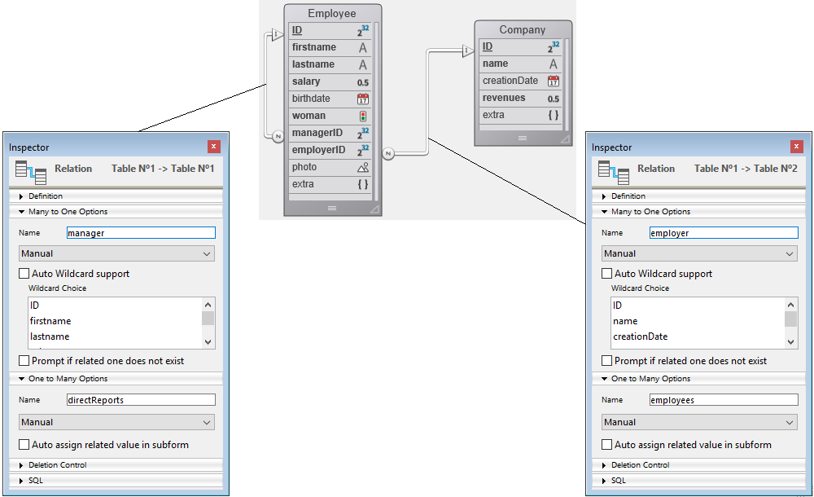

Os atributos Dataclass estão disponíveis como propriedades de suas respectivas classes. Por exemplo:

```4d
 nameAttribute:=ds. Company.name //reference to class attribute
 revenuesAttribute:=ds. Company["revenues"] //alternate way
```

Este código assigna a *nameAttribute* e *revenuesAttribute* referências aos atributos name e revenues da classe Company. Essa sintaxe NAO devolve valores mantidos dentro do atributo, mas sim devolve referências aos próprios atributos. Para manejar os valores, é necessário passar por [**Entidades**](EntityClass.md).

Os objetos `DataClassAttribute` têm propriedades que pode ler para obter informação sobre os atributos de sua classe de dados.

> Os objetos do atributo Dataclass podem ser modificados, mas a estrutura subjacente do banco de dados não será alterada.

### Resumo

|                                                                                                                                                                                                    |
| -------------------------------------------------------------------------------------------------------------------------------------------------------------------------------------------------- |
| [<!-- INCLUDE DataClassAttributeClass.autoFilled.Syntax -->](#autofilled)&nbsp;&nbsp;&nbsp;&nbsp;<!-- INCLUDE DataClassAttributeClass.autoFilled.Summary -->|
| [<!-- INCLUDE DataClassAttributeClass.fieldNumber.Syntax -->](#fieldnumber)&nbsp;&nbsp;&nbsp;&nbsp;<!-- INCLUDE DataClassAttributeClass.fieldNumber.Summary --> |
| [<!-- INCLUDE DataClassAttributeClass.fieldType.Syntax -->](#fieldtype)&nbsp;&nbsp;&nbsp;&nbsp;<!-- INCLUDE DataClassAttributeClass.fieldType.Summary --> |
| [<!-- INCLUDE DataClassAttributeClass.indexed.Syntax -->](#indexed)&nbsp;&nbsp;&nbsp;&nbsp;<!-- INCLUDE DataClassAttributeClass.indexed.Summary --> |
| [<!-- INCLUDE DataClassAttributeClass.inverseName.Syntax -->](#inversename)&nbsp;&nbsp;&nbsp;&nbsp;<!-- INCLUDE DataClassAttributeClass.inverseName.Summary --> |
| [<!-- INCLUDE DataClassAttributeClass.keywordIndexed.Syntax -->](#keywordindexed)&nbsp;&nbsp;&nbsp;&nbsp;<!-- INCLUDE DataClassAttributeClass.keywordIndexed.Summary --> |
| [<!-- INCLUDE DataClassAttributeClass.kind.Syntax -->](#kind)&nbsp;&nbsp;&nbsp;&nbsp;<!-- INCLUDE DataClassAttributeClass.kind.Summary --> |
| [<!-- INCLUDE DataClassAttributeClass.mandatory.Syntax -->](#mandatory)&nbsp;&nbsp;&nbsp;&nbsp;<!-- INCLUDE DataClassAttributeClass.mandatory.Summary --> |
| [<!-- INCLUDE DataClassAttributeClass.name.Syntax -->](#name)&nbsp;&nbsp;&nbsp;&nbsp;<!-- INCLUDE DataClassAttributeClass.name.Summary --> |
| [<!-- INCLUDE DataClassAttributeClass.relatedDataClass.Syntax -->](#relateddataclass)&nbsp;&nbsp;&nbsp;&nbsp;<!-- INCLUDE DataClassAttributeClass.relatedDataClass.Summary --> |
| [<!-- INCLUDE DataClassAttributeClass.type.Syntax -->](#type)&nbsp;&nbsp;&nbsp;&nbsp;<!-- INCLUDE DataClassAttributeClass.type.Summary --> |
| [<!-- INCLUDE DataClassAttributeClass.unique.Syntax -->](#unique)&nbsp;&nbsp;&nbsp;&nbsp;<!-- INCLUDE DataClassAttributeClass.unique.Summary --> |

<!-- REF DataClassAttributeClass.autoFilled.Desc -->
## .autoFilled

<details><summary>Histórico</summary>

| Versão | Mudanças   |
| ------ | ---------- |
| v17 R5 | Adicionado |

</details>

<!-- REF DataClassAttributeClass.autoFilled.Syntax -->

**.autoFilled** : Boolean<!-- END REF -->

#### Descrção

The `.autoFilled` property <!-- REF DataClassAttributeClass.autoFilled.Summary -->contains True if the attribute value is automatically filled by 4D<!-- END REF -->. Esta propriedade corresponde às seguintes propriedades de campo 4D:

* "Auto incremento", para campos de tipo numérico
* "Auto UUID", para campos UUID (tipo alfa).

Esta propriedade não é devolvida se `.kind` = "relatedEntity" ou "relatedEntities".
> For generic programming, you can use **Bool**(dataClassAttribute.mandatory) to get a valid value (false) even if `.mandatory` is not returned.

<!-- END REF -->

<!-- REF DataClassAttributeClass.fieldNumber.Desc -->
## .fieldNumber

<details><summary>Histórico</summary>

| Versão | Mudanças   |
| ------ | ---------- |
| v17 R5 | Adicionado |

</details>

<!-- REF DataClassAttributeClass.fieldNumber.Syntax -->

**.size** : Integer<!-- END REF -->

#### Descrção

The `.fieldNumber` property <!-- REF DataClassAttributeClass.fieldNumber.Summary -->contains the internal 4D field number of the attribute<!-- END REF -->.

Esta propriedade não é devolvida se `.kind` = "relatedEntity" ou "relatedEntities".
> Para a programação genérica, se pode utilizar **Num**(dataClassAttribute.fieldNumber) para obter um valor válido (0) mesmo que não se devolva `.fieldNumber`.

<!-- END REF -->

<!-- REF DataClassAttributeClass.fieldType.Desc -->
## .fieldType

<details><summary>Histórico</summary>

| Versão | Mudanças   |
| ------ | ---------- |
| v17 R5 | Adicionado |

</details>

<!-- REF DataClassAttributeClass.fieldType.Syntax -->

**.fieldType** : Integer<!-- END REF -->

#### Descrção

The `.fieldType` property <!-- REF DataClassAttributeClass.fieldType.Summary -->contains the 4D database type of the attribute<!-- END REF -->. .

**Valores possíveis:**

| dataClassAttribute.kind | fieldType                       | Comentário           |
| ----------------------- | ------------------------------- | -------------------- |
| storage                 | Tipo de campo 4D correspondente | Ver o comando `Type` |
| relatedEntity           | 38 (Is object)                  |                      |
| relatedEntities         | 42 (Is collection)              |                      |

<!-- END REF -->

<!-- REF DataClassAttributeClass.indexed.Desc -->
## .indexed

<details><summary>Histórico</summary>

| Versão | Mudanças   |
| ------ | ---------- |
| v17 R5 | Adicionado |

</details>

<!-- REF DataClassAttributeClass.indexed.Syntax -->

**.indexed** : Boolean<!-- END REF -->

#### Descrção

The `.indexed` property <!-- REF DataClassAttributeClass.indexed.Summary -->contains **True** if there is a B-tree or a Cluster B-tree index on the attribute<!-- END REF -->.

Esta propriedade não é devolvida se `.kind` = "relatedEntity" ou "relatedEntities".
> Para programação genérica é possível usar **Bool**(dataClassAttribute.indexed) para obter um valor válido (false) mesmo se `.indexed` não for retornado.

<!-- END REF -->

<!-- REF DataClassAttributeClass.inverseName.Desc -->
## .inverseName

<details><summary>Histórico</summary>

| Versão | Mudanças   |
| ------ | ---------- |
| v17 R5 | Adicionado |

</details>

<!-- REF DataClassAttributeClass.inverseName.Syntax -->

**.inverseName** : Text<!-- END REF -->

#### Descrção

The `.inverseName` property <!-- REF DataClassAttributeClass.inverseName.Summary -->returns the name of the attribute which is at the other side of the relation<!-- END REF -->.

Esta propriedade não se devolve si `.kind` = "storage". Deve ser do tipo "relatedEntity" ou "relatedEntities".
> Para programação genérica é possível usar **String**(dataClassAttribute.inverseName) para obter um valor válido ("") mesmo se `.inverseName` não for retornado.  

<!-- END REF -->

<!-- REF DataClassAttributeClass.keywordIndexed.Desc -->
## .keywordIndexed

<details><summary>Histórico</summary>

| Versão | Mudanças   |
| ------ | ---------- |
| v17 R5 | Adicionado |

</details>

<!-- REF DataClassAttributeClass.keywordIndexed.Syntax -->

**.keywordIndexed** : Boolean<!-- END REF -->

#### Descrção

The `.keywordIndexed` property <!-- REF DataClassAttributeClass.keywordIndexed.Summary -->contains **True** if there is a keyword index on the attribute<!-- END REF -->.

Esta propriedade não é retornada se [`.kind`](#kind) = "relatedEntity" ou "relatedEntities".
> Para a programação gene´rica pode usar **Bool**(dataClassAttribute.keywordIndexed) para obter um valor válido (false) mesmo se `.keywordIndexed` não for retornado.

<!-- END REF -->

<!-- REF DataClassAttributeClass.kind.Desc -->
## .kind

<details><summary>Histórico</summary>

| Versão | Mudanças   |
| ------ | ---------- |
| v17 R5 | Adicionado |

</details>

<!-- REF DataClassAttributeClass.kind.Syntax -->

**.kind** : Text<!-- END REF -->

#### Descrção

The `.kind` property <!-- REF DataClassAttributeClass.kind.Summary -->returns the category of the attribute<!-- END REF -->. O valor retornado pode ser um dos abaixo:

* Atributo "storage": storage (ou escalar) ou seja, atributo que armazena um valor, não uma referência a outro atributo
* "relatedEntity": N -> 1 atributo de relação (referência a uma entidade)
* "relatedEntities": 1 -> N atributo de relação (referência a uma seleção de entidades)

#### Exemplo

Dada a seguinte tabela e relação:


```4d
 var $attKind : Text
 $attKind:=ds. Employee.lastname.kind //$attKind="storage"
 $attKind:=ds. Employee.manager.kind //$attKind="relatedEntity"
 $attKind:=ds. Employee.directReports.kind //$attKind="relatedEntities"
```

<!-- END REF -->

<!-- REF DataClassAttributeClass.mandatory.Desc -->
## .mandatory

<details><summary>Histórico</summary>

| Versão | Mudanças   |
| ------ | ---------- |
| v17 R5 | Adicionado |

</details>

<!-- REF DataClassAttributeClass.mandatory.Syntax -->

**.mandatory** : Boolean<!-- END REF -->

#### Descrção

The `.mandatory` property <!-- REF DataClassAttributeClass.mandatory.Summary -->contains True if Null value input is rejected for the attribute<!-- END REF -->.

Esta propriedade não é retornada se [`.kind`](#kind) = "relatedEntity" ou "relatedEntities".
> **.size** : Integer
> **Aviso**: Essas propriedade corresponde à propriedade de campo "Reject NULL value input" ao nível do banco de dados 4D. Não tem relação com a propriedade existente "Mandatory"/obrigatório que é uma opção de controle de entrada de dados para uma tabela.

<!-- END REF -->

<!-- REF DataClassAttributeClass.name.Desc -->
## .name

<details><summary>Histórico</summary>

| Versão | Mudanças   |
| ------ | ---------- |
| v17 R5 | Adicionado |

</details>

<!-- REF DataClassAttributeClass.name.Syntax -->

**.name** : Text<!-- END REF -->

#### Descrção

The `.name` property <!-- REF DataClassAttributeClass.name.Summary -->The `.name` property<!-- END REF -->.

#### Exemplo

```4d
 var $attName : Text
 $attName:=ds. Employee.lastname.name //$attName="lastname"
```

<!-- END REF -->

<!-- REF DataClassAttributeClass.relatedDataClass.Desc -->
## .relatedDataClass

<details><summary>Histórico</summary>

| Versão | Mudanças   |
| ------ | ---------- |
| v17 R5 | Adicionado |

</details>

<!-- REF DataClassAttributeClass.relatedDataClass.Syntax -->

**.relatedDataClass** : Text<!-- END REF -->

#### Descrção
> Esta propriedade só está disponível com atributos da propriedade "relatedEntity" ou "relatedEntities" [`.kind`](#kind).

The `.relatedDataClass` property <!-- REF DataClassAttributeClass.relatedDataClass.Summary -->returns the name of the dataclass related to the attribute<!-- END REF -->.

#### Exemplo

Dada a seguinte tabela e relação:



```4d
 var $relClass1; $relClassN : Text
 $relClass1:=ds. Employee.employer.relatedDataClass //$relClass1="Company"
 $relClassN:=ds. Employee.directReports.relatedDataClass //$relClassN="Employee"
```

<!-- END REF -->

<!-- REF DataClassAttributeClass.type.Desc -->
## .type

<details><summary>Histórico</summary>

| Versão | Mudanças   |
| ------ | ---------- |
| v17 R5 | Adicionado |

</details>

<!-- REF DataClassAttributeClass.type.Syntax -->

**.type** : Text<!-- END REF -->

#### Descrção

The `.type` property <!-- REF DataClassAttributeClass.type.Summary -->contains the conceptual value type of the attribute<!-- END REF -->, useful for generic programming.

O tipo de valor conceitual depende do atributo [`.kind`](#kind).

**Valores possíveis:**

| dataClassAttribute.kind | type                                                     | Comentário                                                                                                                          |
| ----------------------- | -------------------------------------------------------- | ----------------------------------------------------------------------------------------------------------------------------------- |
| storage                 | "number", "date", "object", "bool", "image", ou "string" | "number" se devolve para qualquer tipo numérico, incluindo a duração. "string" se devolve para os tipos de campo uuid, alfa e texto |
| relatedEntity           | related dataClass name                                   | Ex: "Companies"                                                                                                                     |
| relatedEntities         | related dataClass name + "Selection" suffix              | Ex: "EmployeeSelection"                                                                                                             |

<!-- END REF -->

<!-- REF DataClassAttributeClass.unique.Desc -->
## .unique

<details><summary>Histórico</summary>

| Versão | Mudanças   |
| ------ | ---------- |
| v17 R5 | Adicionado |

</details>

<!-- REF DataClassAttributeClass.unique.Syntax -->

**.unique** : Boolean<!-- END REF -->

#### Descrção

The `.unique` property <!-- REF DataClassAttributeClass.unique.Summary -->contains True if the attribute value must be unique<!-- END REF -->. Essa propriedade corresponde a propriedade de campo 4D "Unique".

Esta propriedade não é retornada se [`.kind`](#kind) = "relatedEntity" ou "relatedEntities".
> Para programação genérica pode usar **Bool**(dataClassAttribute.unique) pra obter um valor válido (false) mesmo se `.unique` não for retornado.

<!-- END REF -->
