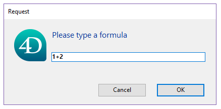

### Acerca dos objectos Function

Um objeto `4D.Function` contém um pedaço de código que pode ser executado de um objeto, seja usando o operador `()` ou usando as funções [`apply()`](#apply) e [`call()`](#call). 4D propõe três tipos de objetos `Function`:

- **funções nativas**, ou seja, funções integradas, built-in, de várias classes 4D tais como `collection.sort()` ou `file.copyTo()`.
- **funções usuário**, ciradas em [classes](Concepts/classes.md) usuário usanod a [palavra chave Function](Concepts/classes.md#function).
- **funções fórmula**, ou seja funções que podem executar qualquer fórmula 4D.


### Objetos Formula

Os comandos [Formula](#formula) e [Formula from string](#formula-from-string) permitem criar objetos [`4D. Function`](#about-4dfunction-objects) para executar expressões ou códigos 4D expressos como texto.

Objetos formulário podem ser encapsulados em propriedades objeto:

```4d
 var $f : 4D. Function
 $f:=New object
 $f.message:=Formula(ALERT("Hello world"))
```

Essa propriedade é uma "função objeto" ou seja uma função que é restrita a seu objeto pai. Para executar uma função armazenada em uma propriedade objeto, use o operador **()** depois do nome propriedade, tal como:

```4d
 $f.message() //exibe "Hello world"
```

Também se admite a sintaxe com parênteses:

```4d
 $f["message"]() //exibe "Hello world"
```

Note que mesmo se não tiver parênteses (ver abaixo), uma função objeto a ser executada deve ser chamda com () parênteses. Chamar só a propriedade de objeto devolverá uma nova referência à fórmula (e não a executará):

```4d
 $o:=$f.message //devolve o objeto fórmula em $o
```

Também pode executar uma função usando as funções [`apply()`](#apply) e [`call()`](#call):

```4d
 $f.message.apply() //exibe "Hello world"
```

#### Utilização de parâmetros

Pode passar parâmetros para suas fórmulas usando o parâmetro sequencial [ syntax](Concepts/parameters.md#sequential-parameters) baseado em $1, $2...$n. For example, you can write: Por exemplo, pode escrever: Por exemplo, pode escrever:

```4d
 var $f : Object
 $f:=New object
 $f.message:=Formula(ALERT("Hello "+$1))
 $f.message("John") //exibe "Hello John"
```

Ou usando a função[.call()](#call):

```4d
 var $f : Object
 $f:=Formula($1+" "+$2)
 $text:=$f.call(Null;"Hello";"World") //retorna "Hello World"
 $text:=$f.call(Null;"Welcome to";String(Year of(Current date))) //retorna "Welcome to 2019" (por exemplo)
```

#### Parâmetros a um único método

Para mais conveniência, quando a fórmula é feita de um único método de projeto, parâmetros podem ser omitidos na inicialização do objeto fórmula. Pode ser passado quando a fórmula for chamada. Por exemplo:

```4d
 var $f : 4D. Function

 $f:=Formula(myMethod)
  //Não é necessário escrever Formula(myMethod($1;$2))
 $text:=$f.call(Null;"Hello";"World") //retorna "Hello World"
 $text:=$f.call() //retorna "How are you?"

  //myMethod
 #DECLARE ($param1 : Text; $param2 : Text)->$return : Text
 If(Count parameters=2)
    $return:=$param1+" "+$param2
 Else
    $return:="How are you?"
 End if
```

Parâmetros são recebidos dentro do método, na ordem que são especificados na chamada.


### Resumo


|                                                                                                                                                     |
| --------------------------------------------------------------------------------------------------------------------------------------------------- |
| [<!-- INCLUDE #FunctionClass.apply().Syntax -->](#apply)&nbsp;&nbsp;&nbsp;&nbsp;<!-- INCLUDE #FunctionClass.apply().Summary -->|
| [<!-- INCLUDE #FunctionClass.call().Syntax -->](#call)&nbsp;&nbsp;&nbsp;&nbsp;<!-- INCLUDE #FunctionClass.call().Summary --> |
| [<!-- INCLUDE #FunctionClass.source.Syntax -->](#source)&nbsp;&nbsp;&nbsp;&nbsp;<!-- INCLUDE #FunctionClass.source.Summary --> |


## Formula

<details><summary>Histórico</summary>

| Release | Mudanças                           |
| ------- | ---------------------------------- |
| 17 R6   | Renomeado (New formula -> Formula) |
| 17 R3   | Adicionado                         |

</details>

<!-- REF #_command_.Formula.Syntax -->**Formula** ( *formulaExp* : Expression ) : 4D. Function<!-- END REF -->


<!-- REF #_command_.Formula.Params -->
| Parâmetro  | Tipo         |    | Descrição                                                       |
| ---------- | ------------ |:--:| --------------------------------------------------------------- |
| formulaExp | Expression   | -> | Fórmula a ser retornada como objeto                             |
| Resultados | 4D. Function | <- | Função nativa encapsulando a fórmula|<!-- END REF -->


|


#### Descrição

O comando `Formula` <!-- REF #_command_.Formula.Summary -->cria um objecto `4D Função` com base na expressão *formulaExp*<!-- END REF -->. *formulaExp* pode ser tão simples quanto um único valor ou tão complexo quanto um método projeto com parâmetros.

Ter uma fórmula como se fosse um objeto permite que seja passada como um parâmetro (atributo calculado) para comandos ou métodos, ou para ser executado a partir de vários componentes, sem precisar declará-los como "partilhados por componentes e database host". Quando chamado, o objeto fórmula é avaliado sem o contexto do banco de dados ou componente que o criou.

A fórmula retornada pode ser chamada com:

*   métodos[`.call()`](#call) ou [`.apply()`](#apply), ou
*   sintaxe notação objeto (ver [formula object](#formula-object)).

```4d
 var $f : 4D. Function
 $f:=Formula(1+2)
 $o:=New object("myFormula";$f)

  //três formas diferentes de chamar a fórmula
 $f.call($o) //retorna 3
 $f.apply($o) //retorna 3
 $o.myFormula() //retorna 3
```

Pode passar [parametros](#passing-parameters) para a `Formula`, como visto em [exemplo 4](#example-4).

Pode especificar o objeto no qual a fórmula é executada, como visto em [exemplo 5](#example-5). As propriedades do objeto podem ser acessadas via o comando `This`.

Se *formulaExp* usar variáveis locais, seus valores são copiados e armazenados no objeto fórmula retornados quando forem criados. Quando executados, a fórmula usa esses valores copiados ao invés do valor atual da variável local. Note que usar arrays como variáveis locais não são compatíveis.

Os objetos criados por `Formula` podem ser salvos, por exemplo, em um campo de database ou em um documento blob.


#### Exemplo 1

Uma fórmula simples:

```4d
 var $f : 4D. Function
 $f:=Formula(1+2)

 var $o : Object
 $o:=New object("f";$f)

 $result:=$o.f() // devoluções 3
```

#### Exemplo 2

Uma fórmula usando um método projeto com parâmetros:

```4d


 $value:=10
 $o:=New object("f";Formula($value))
 $value:=20

 $result:=$o.f() // retorna 10
```


#### Exemplo 3

Uma fórmula usando variáveis locais:

```4d
 $o:=New object("f";Formula($1+$2))
 $result:=$o.f(10;20) //retorna 30
```


#### Exemplo

Uma fórmula simples usando parâmetros:

```4d
 $o:=New object("f";Formula(myMethod))
 $result:=$o.f("param1";"param2") // equivalent to $result:=myMethod("param1";"param2")
```


#### Exemplo 2

Usar `This`:

```4d
 $o:=New object("fullName";Formula(This.firstName+" "+This.lastName))
 $o.firstName:="John"
 $o.lastName:="Smith"
 $result:=$o.fullName() //retorna "John Smith"
```

#### Exemplo 6

Chamar uma fórmula usando notação de objeto:

```4d
 var $feta; $robot : Object
 var $calc : 4D. Function
 $robot:=New object("name";"Robot";"price";543;"quantity";2)
 $feta:=New object("name";"Feta";"price";12.5;"quantity";5)

 $calc:=Formula(This.total:=This.price*This.quantity)

  //estabelece a fórmula às propriedades objeto
 $feta.calc:=$calc
 $robot.calc:=$calc

  //chame a fórmula
 $feta.calc() // $feta={name:Feta,price:12.5,quantity:5,total:62.5,calc:"[object Formula]"}
 $robot.calc() // $robot={name:Robot,price:543,quantity:2,total:1086,calc:"[object Formula]"}
```


## Formula from string

<details><summary>Histórico</summary>

| Release | Mudanças                                                 |
| ------- | -------------------------------------------------------- |
| 17 R6   | Renomeado New formula from string -> Formula from string |
| 17 R3   | Adicionado                                               |

</details>

<!-- REF #_command_.Formula from string.Syntax -->**Formula from string**( *formulaString* : Text ) : 4D. Function<!-- END REF -->


<!-- REF #_command_.Formula from string.Params -->
| Parâmetro     | Tipo         |    | Descrição                                                       |
| ------------- | ------------ |:--:| --------------------------------------------------------------- |
| formulaString | Text         | -> | Fórmula texto a ser retornada como objeto                       |
| Resultados    | 4D. Function | <- | Objeto nativo encapsulando a fórmula|<!-- END REF -->


|


#### Descrição

O comando `Formula from string` <!-- REF #_command_.Formula from string.Summary -->cria um objecto 4D. Function baseado na *formulaString*<!-- END REF -->.  *formulaString* pode ser tão simples quanto um único valor ou tão complexo quanto um método projeto com parâmetros.

Esse comando é similar a [`Formula`](#formula), exceto que maneja uma fórmula baseada em texto. Na maioria dos casos, é recomendado usar o comando `Formula`. Só se deve usar`Formula from string` quando a fórmula original for expressa como texto (por exemplo armazenada externamente em um arquivo JSON). Nesse contexto, usar sintaxe com tokens é aconselhado.
> Como conteúdos de variáveis locais não podem ser acessados por nome em modo compilado, não podem ser usados em *formulaString*. Tentar acessar uma variável local com `Formula from string` vai causar um erro (-10737).


#### Exemplo

O código abaixo cria um diálogo aceitando uma fórmula em formato texto:

```4d
 var $textFormula : Text
 var $f : 4D. Function
 $textFormula:=Request("Please type a formula")
 If(ok=1)
    $f:=Formula from string($textFormula)
    ALERT("Result = "+String($f.call()))
 End if
```




...e executa a fórmula:


<!-- REF FunctionClass.apply().Desc -->
## .apply()

<details><summary>Histórico</summary>

| Release | Mudanças   |
| ------- | ---------- |
| 17 R3   | Adicionado |

</details>

<!-- REF #FunctionClass.apply().Syntax -->**.apply**() : any<br/>**.apply**( *thisObj* : Object { ; *formulaParams* : Collection } ) : any<!-- END REF -->


<!-- REF #FunctionClass.apply().Params -->
| Parâmetro     | Tipo       |    | Descrição                                                                       |
| ------------- | ---------- |:--:| ------------------------------------------------------------------------------- |
| thisObj       | Object     | -> | Objeto a ser retornado pelo comando This na fórmula                             |
| formulaParams | Collection | -> | Coleção de valores a serem passados como $1...$n quando `formula` for executado |
| Resultados    | any        | <- | Valores de execução de fórmula|<!-- END REF -->


|


#### Descrição

A função `.apply()` <!-- REF #FunctionClass.apply().Summary -->executa a `fórmula` objecto a que é aplicado e devolve o valor resultante<!-- END REF -->. O objeto fórmula pode ser criado usando os comandos `Formula` or `Formula from string`.


No parâmetro *thisObj* pode passar uma referência ao objeto a ser usada como `This` dentro da fórmula.

Também pode passar uma coleção a ser usada como parâmetros $1...$n na fórmula usando o parâmetro opcional *formulaParams*.

Note que `.apply()` é similar a [`.call()`](#call) exceto que parâmetros são passados como coleção. Isso pode ser útil para passar resultados calculados.


#### Exemplo 1

```4d
 var $f : 4D. Function
 $f:=Formula($1+$2+$3)

 $c:=New collection(10;20;30)
 $result:=$f.apply(Null;$c) // retorna 60
```


#### Exemplo 2

```4d
 var $calc : 4D. Function
 var $feta; $robot : Object
 $robot:=New object("name";"Robot";"price";543;"quantity";2)
 $feta:=New object("name";"Feta";"price";12.5;"quantity";5)

 $calc:=Formula(This.total:=This.price*This.quantity)

 $calc.apply($feta) // $feta={name:Feta,price:12.5,quantity:5,total:62.5}
 $calc.apply($robot) // $robot={name:Robot,price:543,quantity:2,total:1086}
```

<!-- END REF -->


<!-- REF FunctionClass.call().Desc -->
## .call()

<details><summary>Histórico</summary>

| Release | Mudanças   |
| ------- | ---------- |
| 17 R3   | Adicionado |

</details>

<!-- REF #FunctionClass.call().Syntax -->**.call**() : any<br/>**.call**( *thisObj* : Object { ; ...*params* : any } ) : any<!-- END REF -->


<!-- REF #FunctionClass.call().Params -->
| Parâmetro  | Tipo   |    | Descrição                                                            |
| ---------- | ------ | -- | -------------------------------------------------------------------- |
| thisObj    | Object | -> | Objeto a ser retornado pelo comando This na fórmula                  |
| params     | any    | -> | Valores a serem passados como $1...$n quando a fórmula for executada |
| Resultados | any    | <- | Valores de execução de fórmula|<!-- END REF -->


|


#### Descrição

A função `.call()` <!-- REF #FunctionClass.call().Summary -->executa a `fórmula` objecto a que é aplicado e devolve o valor resultante<!-- END REF -->. O objeto fórmula pode ser criado usando os comandos `Formula` or `Formula from string`.

No parâmetro *thisObj* pode passar uma referência ao objeto a ser usada como `This` dentro da fórmula.

Pode passar valores a serem usados como parâmetros *$1...$n* na fórmula usando os parâmetros opcionais *params*.

Note que `.call()` é similar a [`.apply()`](#apply) exceto que parâmetros são passados diretamente.

#### Exemplo 1

```4d
 var $f : 4D. Function
 $f:=Formula(Uppercase($1))
 $result:=$f.call(Null;"hello") // retorna "HELLO"
```

#### Exemplo 2

```4d
 $o:=New object("value";50)
 $f:=Formula(This.value*2)
 $result:=$f.call($o) // devolve 100
```

<!-- END REF -->


<!-- REF FunctionClass.source.Desc -->
## .source

<details><summary>Histórico</summary>

| Release | Mudanças   |
| ------- | ---------- |
| 18 R2   | Adicionado |

</details>

<!-- REF #FunctionClass.source.Syntax -->**.source** : Text <!-- END REF -->


#### Descrição

A propriedade `.source` <!-- REF #FunctionClass.source.Summary -->contém a expressão de origem da `fórmula` como texto<!-- END REF -->.

Essa propriedade é **apenas leitura**.

#### Exemplo

```4d
 var $of : 4D. Function
 var $tf : Text
 $of:=Formula(String(Current time;HH MM AM PM))
 $tf:=$of.source //"String(Current time;HH MM AM PM)"
```


<!-- END REF -->
