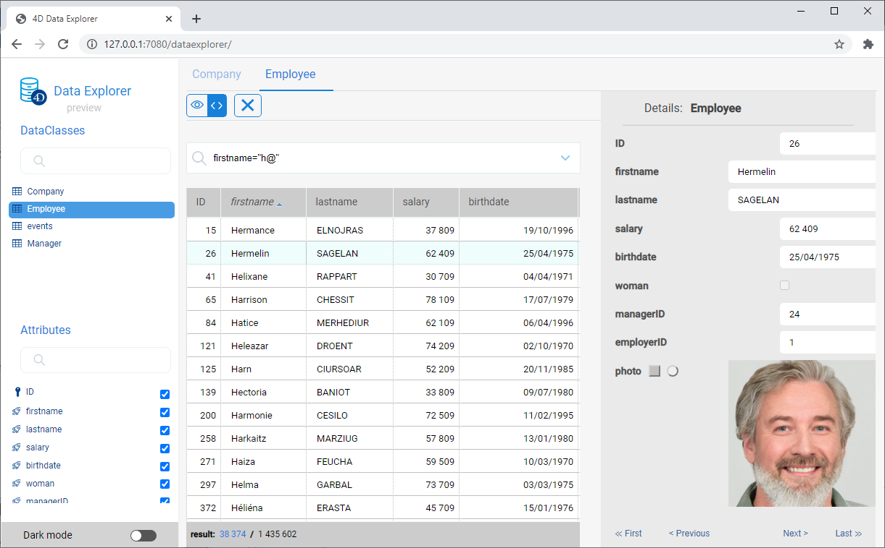
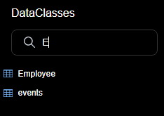

> **Pré-visualizar**: o Explorador de dados Web é fornecido como um recurso de pré-visualização. Não é recomendado usar este recurso em propósito de produção; a implementação final pode ser um pouco diferente.

O Data Explorer oferece uma interface web para ver e pesquisar dados em sua datastore de projeto. Ao usar esta ferramente, pode navegar facilmente entre todas suas entidades e pesquisar, ordenar ou filtrar valores de atributos. Ajuda a controlar dados e rapidamente identificar problemas em qualquer etapa do processo de desenvolvimento.



## Configuração

O Data Explorer depende do componente web server [`WebAdmin`](webAdmin.md) para a configuração e preferências de autentificação.

- **configuration**: a configuração de Data Explorer reutiliza as configurações [`WebAdmin` de web server](webAdmin.md#webadmin-settings),
- **authentication**: acesso ao Data Explorer é oferecido quando  [a sessão de usuário for autenticada](webAdmin.md#authentication-and-session) e tem o privilégio "WebAdmin". Quando o Data Explorer for acessado através do item de menu**Data Explorer** (ver abaixo), uma autenticação automática é oferecida.

> O acesso ao Data Explorer pode ser desativado usando a função [`.setAdminProtection()`](API/DataStoreClass.md#setadminprotection).

## Abrindo o Data Explorer

A página do Gerenciador de Dados está disponível automaticamente quando o servidor Web [ `WebAdmin` for iniciado](webAdmin.md#starting-the-webadmin-web-server).

Para ligar à página Web do Explorador de dados:

- se você usar uma aplicação 4D com interface, selecione **Gerenciador de Dados...** comando de:
  - o menu **Registros** (em 4D monousuário)
  - o menu **Window** (no 4D Server)

- mesmo se usar uma aplicação 4D headless, pode abrir seu navegador web e digitar o endereço abaixo:

 `IPaddress:HTTPPort/dataexplorer` or `IPaddress:HTTPSPort/dataexplorer`

 Neste contexto será pedido que digite a [chave de acesso](webAdmin.md#access-key) para abrir uma sessão `WebAdmin` no servidor:


> [Os valores HTTPPort](webAdmin.md#http-port) e [HTTPSPort](webAdmin.md#https-port) são configurados nas definições `WebAdmin` .

## Utilização do Data Explorer

Para além de uma visão abrangente e personalizável dos seus dados, o Explorador de Dados permite-lhe consultar e ordenar os seus dados.

### Requisitos

O Data Explorer suporta os seguintes navegadores web:

- Chrome
- Safari
- Edge
- FireFox

A resolução mínima para utilizar o Data Explorer é de 1280x720. A resolução recomendada é 1920x1080.

### Básicos

O Data Explorer proporciona um acesso global ao modelo de dados ORDA em relação às regras de mapeamento ORDA [](ORDA/dsMapping.md#general-rules).

Pode mudar para o modo escuro **** mostrar o tema usando o selector no fundo da página:


A página contém várias áreas:

- Do lado esquerdo encontra-se a área **Dataclasses** e **Attributes area**, permitindo-lhe seleccionar os dataclasses e atributos a exibir. Os atributos são ordenados de acordo com a ordem de criação da estrutura subjacente. A chave primária e os atributos indexados têm um ícone específico. É possível filtrar a lista de nomes de dataclass propostos e nomes de atributos utilizando as respectivas áreas de pesquisa. 

- A parte central contém a área de pesquisa **** e a grade de dados **** (lista de entidades da classe de dados seleccionada). Cada coluna da grade representa um atributo de datastore.
  - Como padrão, todas as entidades são exibidas. É possível filtrar as entidades apresentadas utilizando a área de pesquisa. Estão disponíveis dois modos de consulta: [Consulta sobre atributos](#query-on-attributes) (seleccionado por defeito), e a consulta avançada [com expressão](#advanced-query-with-expression). Selecciona o modo de consulta clicando no botão correspondente (o botão **X** permite reiniciar a área de consulta e assim parar a filtragem): 

  - O nome da classe de dados seleccionada é adicionado como um separador por cima da grelha de dados. Utilizando estas abas, é possível alternar entre os valores já selecionados. Pode remover um dataclass referenciado clicando no ícone "remover" à direita do nome do dataclass.
  - É possível reduzir o número de colunas desmarcando os atributos do lado esquerdo. Também pode mudar as colunas da grade de dados utilizando arrastar e soltar. Pode clicar no cabeçalho de uma coluna  para [ordenar entidades](#ordering-entities) de acordo com seus valores (quando for possível).
  - Se uma operação exigir muito tempo, é mostrada uma barra de progresso. Pode deter a operação executando a qualquer momento clicando no botão vermelho:


- No lado direito está a área **Detalhes**: ela exibe os valores de atributo da entidade selecionada atualmente. Todos os tipos de atributo são exibidos, incluindo imagens e objetos (expressos em json). Pode navegar entre as entidades da dataclass cliando nos links **First** / **Previous** / **Next** / **Last** na parte inferior da área.

### Atualização de conteúdos

Quando o modelo ou dados ORDA é modificado no lado da base de dados (tabela adicionada, registo editado ou apagado, etc.), basta atualizar a página do Data Explorer no browser (usando a tecla F5, por exemplo).

### Ordenar entidades

É possível reordenar a lista de entidades apresentada de acordo com os valores dos atributos. Todos os tipos de atributos podem ser utilizados para uma espécie, exceto imagem e objeto.

- Clique no cabeçalho de uma coluna para encomendar entidades de acordo com os valores dos atributos correspondentes. Como padrão, a ordem é ascendente. Clicar duas vezes para uma ordem decrescente. Uma coluna utilizada para classificar entidades é exibida com um pequeno ícone e o seu nome está em *itálico*.


- É possível ordenar atributos em vários níveis. Por exemplo, é possível classificar os empregados por cidade e depois por salário. Para fazer isso, mantenha apertada a tecla **Shift** e clique sequencialmente no cabeçalho de cada coluna para incluir na ordem.

### Consulta sobre atributos

Neste modo, é possível filtrar entidades introduzindo valores a encontrar (ou a excluir) nas áreas acima da lista de atributos. Pode filtrar um ou vários atributos. A lista de entidades é automaticamente atualizada quando se digita.


Se introduzir vários atributos, é automaticamente aplicado um AND. Por exemplo, o filtro a seguir exibe entidades com *primeiro nome* atributo começando com "flo" e *salário* valor do atributo > 50000:


O botão **X** permite remover os atributos introduzidos e assim parar a filtragem.

Estão disponíveis diferentes operadores e opções de consulta, dependendo do tipo de dados do atributo.

> Não é possível filtrar em imagens ou atributos de objectos.

#### Operadores de números

Com atributos numéricos, de data e hora, o operador "=" é seleccionado por defeito. Contudo, pode selecionar outro operador da lista de operadores (clicar no ícone "=" para exibir a lista):


#### Datas

Com atributos de data, pode introduzir a data a utilizar através de um widget de escolha de data (clique na área de data para exibir o calendário):


#### Booleanos

Ao clicar numa área de atributos booleanos, pode filtrar em **valores verdadeiros**/**valores falsos** ou também em **null**/**e não null**:


- **nulo** indica que o valor do atributo não foi definido
- **não nulo** indica que o valor do atributo está definido (portanto verdadeiro ou falso).

#### Text

Os filtros de texto não são diacríticos (a = A).

O filtro é do tipo "começa com". Por exemplo, a entrada "Jim" mostrará os valores "Jim" e "Jimmy".

Também pode usar o caractere coringa (@) para substituir um ou mais caracteres iniciais. Por exemplo:

| Um filtro com | Resultados                                                |
| ------------- | --------------------------------------------------------- |
| Bel           | Todos os valores que começam com "Bel                     |
| @do           | Todos os valores contendo "do"                            |
| Bel@do        | Todos os valores que começam com "Bel" e que contêm "do". |

Se quiser criar consultas mais específicas, tais como "é exatamente", poderá ter de utilizar a funcionalidade de consultas avançadas.

### Consultas avançadas com expressão

Ao seleccionar esta opção, é exibida uma área de consulta acima da lista de entidades, permitindo-lhe introduzir qualquer expressão a utilizar para filtrar o conteúdo:


Pode introduzir consultas avançadas que não estão disponíveis como consultas de atributos. Por exemplo, se quiser encontrar entidades com *primeiro nome* atributo contendo "Jim" mas não "Jimmy", pode escrever:

```
firstname=="Jim"
```

Pode utilizar qualquer expressão de consulta ORDA como [documentada com a consulta `()` função](API/DataClassClass.md#query), com as seguintes limitações ou diferenças:

- Para segurança, não é possível executar fórmulas usando `eval()`.
- Os marcadores de lugar não podem ser utilizados; é necessário escrever uma consulta *queryString* com valores.
- Os valores das strings contendo caracteres espaciais devem ser incorporados entre aspas duplas ("").

Por exemplo, com o Dataclass Employee, pode escrever:

```
firstname = "Marie Sophie" E manager.lastname = "@th"
```

Pode clicar no ícone `v` para visualizar tanto [`queryPlan`](API/DataClassClass.md#queryplan) como [`queryPath`](API/DataClassClass.md#querypath). Na área, pode pairar sobre os blocos de subconsulta para ter informações detalhadas por subconsulta:


Clique com o botão direito do mouse na área de consulta para exibir as consultas válidas anteriores:


